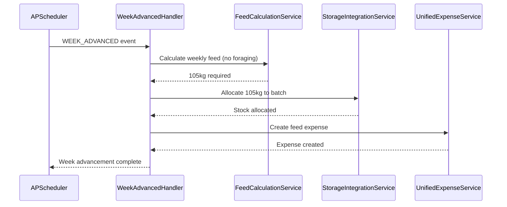
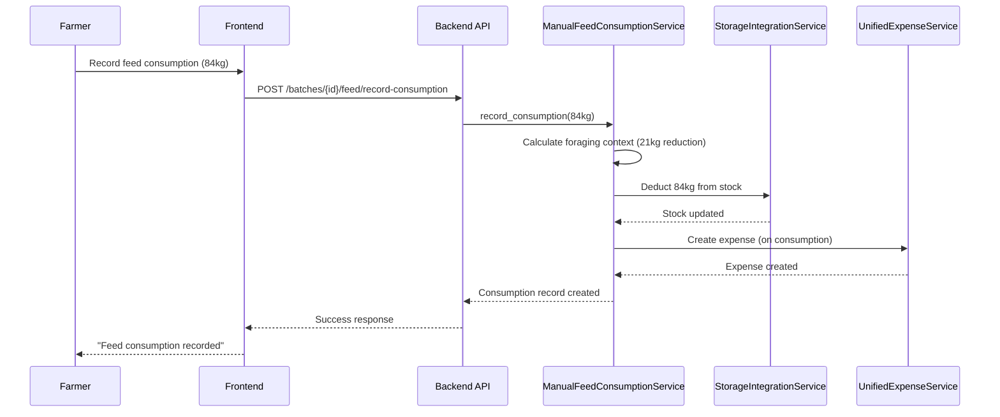

# Alternative Feeding Architecture - Production-Grade Specification (Semi-Intensive Systems)

# Alternative Feeding Architecture - Production-Grade Specification

## Overview

The Alternative Feeding Architecture enables **semi-intensive and free-range production systems** for ducks and turkeys, allowing farmers to reduce feed costs through natural foraging while maintaining optimal growth rates. This specification defines the complete architecture for alternative feeding patterns, foraging modifiers, feed reduction calculations, and integration with the dual feed pattern system.

**References:**
- spec:bceeaefd-5139-4801-8c12-de8a8b6faf8a/35142770-c1b0-4df2-85e2-5a839616334a (Backend Architecture)
- spec:bceeaefd-5139-4801-8c12-de8a8b6faf8a/fb99cad1-d468-4a18-bd81-d987f1ae6f63 (Feed Calculator System)
- spec:bceeaefd-5139-4801-8c12-de8a8b6faf8a/dfa10566-d896-41f4-805f-953f7b47d5f3 (Species-Specific Batch Management)
- file:docs/priest new/specs/Alternative_Feeding_Architecture_&_Patterns_-_Complete_Specification.md

**Core Philosophy:**
- **Backend Intelligence:** System calculates foraging reductions automatically
- **Frontend Simplicity:** Farmer just toggles alternative feeding on/off
- **Configuration-Driven:** Foraging modifiers defined in species.json
- **Species-Specific:** Only ducks (Week 6+) and turkeys (Week 8+) support alternative feeding

---

## Production Systems Overview

| System | Species Support | Feed Pattern | Foraging | Housing | Cost |
|--------|----------------|--------------|----------|---------|------|
| **Intensive** | All 4 species | Automatic | None | Confined | High |
| **Semi-Intensive** | Ducks, Turkeys only | Flexible | 15-25% (ducks), 12-22% (turkeys) | Partial confinement | Medium |
| **Free-Range** | Ducks, Turkeys only | Flexible | 20-30% (ducks), 18-28% (turkeys) | Open range | Low |

**Key Differences:**
- **Intensive:** 100% commercial feed, automatic stock allocation, confined housing
- **Semi-Intensive:** 75-85% commercial feed + 15-25% foraging, manual stock allocation, partial confinement with outdoor access
- **Free-Range:** 70-80% commercial feed + 20-30% foraging, manual stock allocation, open range with shelter

---

## Alternative Feeding Availability

### Species-Specific Rules

**Broilers:**
- ❌ **NOT SUPPORTED** - Intensive only
- **Reason:** Fast growth rate (8 weeks), cannot afford feed reduction
- **Production System:** Intensive only

**Layers:**
- ❌ **NOT SUPPORTED** - Intensive only
- **Reason:** Egg production requires precise nutrition, cannot risk deficiencies
- **Production System:** Intensive only

**Ducks:**
- ✅ **SUPPORTED** - Semi-Intensive and Free-Range
- **Start Week:** Week 6 (after starter phase complete)
- **Foraging Reduction:** 15-25% (semi-intensive), 20-30% (free-range)
- **Foraging Sources:** Grass, insects, snails, aquatic plants, kitchen scraps
- **Production Systems:** Intensive, Semi-Intensive, Free-Range

**Turkeys:**
- ✅ **SUPPORTED** - Semi-Intensive and Free-Range
- **Start Week:** Week 8 (after grower phase begins)
- **Foraging Reduction:** 12-22% (semi-intensive), 18-28% (free-range)
- **Foraging Sources:** Grass, insects, seeds, grains, kitchen scraps
- **Production Systems:** Intensive, Semi-Intensive, Free-Range

---

## Dual Feed Pattern Integration

### Automatic Pattern (Intensive)

**Characteristics:**
- 100% commercial feed
- Automatic stock allocation
- Automatic expense creation
- Weekly feed calculation on WEEK_ADVANCED event
- No foraging reduction

**Feed Consumption Calculation:**
```
weekly_feed = daily_intake × 7 × current_population
```

**Stock Allocation:**
- Automatic on WEEK_ADVANCED event
- FIFO with quality preference
- Creates expense immediately

---

### Flexible Pattern (Semi-Intensive / Free-Range)

**Characteristics:**
- 70-88% commercial feed + 12-30% foraging
- Manual stock allocation
- Manual expense creation (on consumption)
- Farmer records feed consumption when it happens
- Foraging reduction applied

**Feed Consumption Calculation:**
```
base_weekly_feed = daily_intake × 7 × current_population
foraging_reduction = base_weekly_feed × foraging_modifier
actual_weekly_feed = base_weekly_feed - foraging_reduction
```

**Stock Allocation:**
- Manual recording by farmer
- Creates expense on consumption (not in advance)
- Farmer decides when to allocate stock

---

## Foraging Modifiers

### Duck Foraging Modifiers

**Semi-Intensive (Week 6+):**
- **Minimum:** 15% feed reduction
- **Maximum:** 25% feed reduction
- **Recommended:** 20% feed reduction
- **Foraging Sources:** Grass (40%), Insects (30%), Snails (20%), Aquatic plants (10%)

**Free-Range (Week 6+):**
- **Minimum:** 20% feed reduction
- **Maximum:** 30% feed reduction
- **Recommended:** 25% feed reduction
- **Foraging Sources:** Grass (35%), Insects (25%), Snails (20%), Aquatic plants (15%), Kitchen scraps (5%)

**Monitoring:**
- Watch for weight loss (weigh weekly)
- Adjust foraging modifier if growth slows
- Ensure adequate foraging area (10-15 sq ft per duck for semi-intensive, 20-30 sq ft for free-range)

---

### Turkey Foraging Modifiers

**Semi-Intensive (Week 8+):**
- **Minimum:** 12% feed reduction
- **Maximum:** 22% feed reduction
- **Recommended:** 17% feed reduction
- **Foraging Sources:** Grass (45%), Insects (25%), Seeds (20%), Grains (10%)

**Free-Range (Week 8+):**
- **Minimum:** 18% feed reduction
- **Maximum:** 28% feed reduction
- **Recommended:** 23% feed reduction
- **Foraging Sources:** Grass (40%), Insects (20%), Seeds (20%), Grains (15%), Kitchen scraps (5%)

**Monitoring:**
- Watch for weight loss (weigh weekly)
- Adjust foraging modifier if growth slows
- Ensure adequate foraging area (15-20 sq ft per turkey for semi-intensive, 30-40 sq ft for free-range)

---

## Alternative Feeding Toggle Workflow

### Batch Creation (Production System Selection)

**Step 1: Species Selection**
- Farmer selects species (Broiler, Layer, Duck, Turkey)

**Step 2: Production System Selection**
- **If Broiler or Layer:** Only "Intensive" option available
- **If Duck or Turkey:** Three options available:
  - Intensive (100% commercial feed, automatic)
  - Semi-Intensive (75-85% commercial feed + foraging, flexible)
  - Free-Range (70-80% commercial feed + foraging, flexible)

**Step 3: Alternative Feeding Configuration**
- **If Intensive selected:** `alternative_feeding_enabled = False`, `production_system = "intensive"`
- **If Semi-Intensive selected:** `alternative_feeding_enabled = True`, `production_system = "semi_intensive"`
- **If Free-Range selected:** `alternative_feeding_enabled = True`, `production_system = "free_range"`

---

### Post-Creation Toggle (Batch Details Page)

**Availability:**
- Only for ducks (Week 6+) and turkeys (Week 8+)
- Only for semi-intensive and free-range batches
- Disabled for intensive batches (cannot switch to alternative feeding)

**Toggle Workflow:**
1. Farmer clicks "Enable Alternative Feeding" toggle
2. System checks:
   - Species is duck or turkey ✓
   - Current week ≥ 6 (ducks) or ≥ 8 (turkeys) ✓
   - Production system is semi-intensive or free-range ✓
3. Confirmation modal appears:
   - "This will reduce feed consumption by 15-25% (ducks) or 12-22% (turkeys)"
   - "You'll need to manually record feed consumption"
   - "Ensure adequate foraging area is available"
4. On confirm:
   - `alternative_feeding_enabled = True`
   - Feed pattern switches to Flexible
   - Automatic feed calculation stops
   - Manual feed recording enabled

---

## Feed Reduction Calculations

### Calculation Formula

```python
def calculate_weekly_feed_with_foraging(
    batch: Batch,
    base_daily_intake: float
) -> dict:
    """Calculate weekly feed with foraging reduction."""
    
    # Base calculation (no foraging)
    base_weekly_feed = base_daily_intake * 7 * batch.current_population
    
    # Check if alternative feeding is enabled
    if not batch.alternative_feeding_enabled:
        return {
            "base_weekly_feed": base_weekly_feed,
            "foraging_reduction": 0,
            "actual_weekly_feed": base_weekly_feed,
            "foraging_percentage": 0
        }
    
    # Get foraging modifier from species config
    foraging_modifier = get_foraging_modifier(
        species=batch.species.name,
        production_system=batch.production_system,
        current_week=batch.current_week
    )
    
    # Calculate foraging reduction
    foraging_reduction = base_weekly_feed * foraging_modifier
    actual_weekly_feed = base_weekly_feed - foraging_reduction
    
    return {
        "base_weekly_feed": base_weekly_feed,
        "foraging_reduction": foraging_reduction,
        "actual_weekly_feed": actual_weekly_feed,
        "foraging_percentage": foraging_modifier * 100
    }
```

### Example Calculation

**Duck Batch (Week 7, Semi-Intensive):**
- Population: 100 ducks
- Daily intake: 150g per duck
- Foraging modifier: 20% (semi-intensive)

**Calculation:**
```
base_weekly_feed = 150g × 7 days × 100 ducks = 105,000g = 105kg
foraging_reduction = 105kg × 0.20 = 21kg
actual_weekly_feed = 105kg - 21kg = 84kg
```

**Result:** Farmer needs to provide 84kg of commercial feed (saves 21kg through foraging)

---

## Wireframes

### 1. Production System Selection (Batch Creation Step 1)

```wireframe
<!DOCTYPE html>
<html>
<head>
<style>
* { margin: 0; padding: 0; box-sizing: border-box; }
body { font-family: 'Manrope', sans-serif; background: #f9fafb; padding: 24px; }
.wizard-container { max-width: 800px; margin: 0 auto; background: white; border-radius: 12px; padding: 32px; box-shadow: 0 1px 3px rgba(0,0,0,0.1); }
.wizard-header { margin-bottom: 32px; }
.wizard-title { font-size: 24px; font-weight: 600; color: #111827; margin-bottom: 8px; }
.wizard-subtitle { font-size: 14px; color: #6b7280; }
.step-indicator { display: flex; gap: 8px; margin-bottom: 32px; }
.step { flex: 1; height: 4px; background: #e5e7eb; border-radius: 2px; }
.step.active { background: #16a34a; }
.section-title { font-size: 16px; font-weight: 600; color: #111827; margin-bottom: 16px; }
.card-grid { display: grid; grid-template-columns: repeat(2, 1fr); gap: 16px; margin-bottom: 24px; }
.production-card { border: 2px solid #e5e7eb; border-radius: 12px; padding: 20px; cursor: pointer; transition: all 0.2s; }
.production-card:hover { border-color: #16a34a; background: #f0fdf4; }
.production-card.selected { border-color: #16a34a; background: #f0fdf4; }
.production-card.disabled { opacity: 0.5; cursor: not-allowed; border-color: #e5e7eb; background: #f9fafb; }
.card-header { display: flex; align-items: center; gap: 12px; margin-bottom: 12px; }
.card-icon { width: 40px; height: 40px; background: #16a34a; border-radius: 8px; display: flex; align-items: center; justify-content: center; color: white; font-size: 20px; }
.card-title { font-size: 16px; font-weight: 600; color: #111827; }
.card-description { font-size: 14px; color: #6b7280; margin-bottom: 12px; line-height: 1.5; }
.card-features { display: flex; flex-direction: column; gap: 8px; }
.feature { display: flex; align-items: center; gap: 8px; font-size: 13px; color: #374151; }
.feature-icon { color: #16a34a; }
.info-box { background: #eff6ff; border: 1px solid #bfdbfe; border-radius: 8px; padding: 16px; margin-bottom: 24px; }
.info-title { font-size: 14px; font-weight: 600; color: #1e40af; margin-bottom: 8px; }
.info-text { font-size: 13px; color: #1e40af; line-height: 1.5; }
.button-group { display: flex; gap: 12px; justify-content: flex-end; }
.button { padding: 10px 20px; border-radius: 8px; font-size: 14px; font-weight: 500; cursor: pointer; border: none; }
.button-secondary { background: #f3f4f6; color: #374151; }
.button-primary { background: #16a34a; color: white; }
.button-primary:disabled { opacity: 0.5; cursor: not-allowed; }
</style>
</head>
<body>
<div class="wizard-container">
  <div class="wizard-header">
    <div class="wizard-title">Create New Batch - Step 1</div>
    <div class="wizard-subtitle">Select species and production system</div>
  </div>
  
  <div class="step-indicator">
    <div class="step active"></div>
    <div class="step"></div>
    <div class="step"></div>
  </div>
  
  <div class="section-title">Species: Duck (Selected)</div>
  
  <div class="section-title" style="margin-top: 24px;">Production System</div>
  
  <div class="card-grid">
    <div class="production-card" data-element-id="intensive-card">
      <div class="card-header">
        <div class="card-icon">🏭</div>
        <div class="card-title">Intensive</div>
      </div>
      <div class="card-description">
        Confined housing with 100% commercial feed. Automatic feed calculation and stock allocation.
      </div>
      <div class="card-features">
        <div class="feature"><span class="feature-icon">✓</span> Automatic feed calculation</div>
        <div class="feature"><span class="feature-icon">✓</span> Automatic stock allocation</div>
        <div class="feature"><span class="feature-icon">✓</span> Highest growth rate</div>
        <div class="feature"><span class="feature-icon">✓</span> Predictable costs</div>
      </div>
    </div>
    
    <div class="production-card selected" data-element-id="semi-intensive-card">
      <div class="card-header">
        <div class="card-icon">🌾</div>
        <div class="card-title">Semi-Intensive</div>
      </div>
      <div class="card-description">
        Partial confinement with outdoor access. 75-85% commercial feed + 15-25% foraging.
      </div>
      <div class="card-features">
        <div class="feature"><span class="feature-icon">✓</span> Manual feed recording</div>
        <div class="feature"><span class="feature-icon">✓</span> 15-25% feed cost savings</div>
        <div class="feature"><span class="feature-icon">✓</span> Alternative feeding Week 6+</div>
        <div class="feature"><span class="feature-icon">✓</span> Outdoor access required</div>
      </div>
    </div>
    
    <div class="production-card" data-element-id="free-range-card">
      <div class="card-header">
        <div class="card-icon">🌳</div>
        <div class="card-title">Free-Range</div>
      </div>
      <div class="card-description">
        Open range with shelter. 70-80% commercial feed + 20-30% foraging.
      </div>
      <div class="card-features">
        <div class="feature"><span class="feature-icon">✓</span> Manual feed recording</div>
        <div class="feature"><span class="feature-icon">✓</span> 20-30% feed cost savings</div>
        <div class="feature"><span class="feature-icon">✓</span> Alternative feeding Week 6+</div>
        <div class="feature"><span class="feature-icon">✓</span> Large outdoor area required</div>
      </div>
    </div>
  </div>
  
  <div class="info-box">
    <div class="info-title">ℹ️ Alternative Feeding for Ducks</div>
    <div class="info-text">
      Ducks can start alternative feeding from Week 6 onwards. The system will automatically reduce feed calculations based on your selected production system. You'll need to manually record feed consumption when using semi-intensive or free-range systems.
    </div>
  </div>
  
  <div class="button-group">
    <button class="button button-secondary" data-element-id="back-button">Back</button>
    <button class="button button-primary" data-element-id="next-button">Next: House & Details</button>
  </div>
</div>
</body>
</html>
```

---

### 2. Alternative Feeding Toggle (Batch Details Page)

```wireframe
<!DOCTYPE html>
<html>
<head>
<style>
* { margin: 0; padding: 0; box-sizing: border-box; }
body { font-family: 'Manrope', sans-serif; background: #f9fafb; padding: 24px; }
.page-container { max-width: 1200px; margin: 0 auto; }
.batch-header { background: white; border-radius: 12px; padding: 24px; margin-bottom: 24px; box-shadow: 0 1px 3px rgba(0,0,0,0.1); }
.batch-title { font-size: 24px; font-weight: 600; color: #111827; margin-bottom: 8px; }
.batch-meta { display: flex; gap: 16px; font-size: 14px; color: #6b7280; }
.tabs { display: flex; gap: 4px; border-bottom: 1px solid #e5e7eb; margin-bottom: 24px; }
.tab { padding: 12px 20px; font-size: 14px; font-weight: 500; color: #6b7280; cursor: pointer; border-bottom: 2px solid transparent; }
.tab.active { color: #16a34a; border-bottom-color: #16a34a; }
.tab-content { background: white; border-radius: 12px; padding: 24px; box-shadow: 0 1px 3px rgba(0,0,0,0.1); }
.section-title { font-size: 18px; font-weight: 600; color: #111827; margin-bottom: 16px; }
.settings-grid { display: grid; gap: 20px; }
.setting-row { display: flex; justify-content: space-between; align-items: center; padding: 16px; background: #f9fafb; border-radius: 8px; }
.setting-info { flex: 1; }
.setting-label { font-size: 14px; font-weight: 500; color: #111827; margin-bottom: 4px; }
.setting-description { font-size: 13px; color: #6b7280; line-height: 1.5; }
.toggle-switch { width: 48px; height: 24px; background: #16a34a; border-radius: 12px; position: relative; cursor: pointer; }
.toggle-switch.off { background: #d1d5db; }
.toggle-knob { width: 20px; height: 20px; background: white; border-radius: 50%; position: absolute; top: 2px; right: 2px; transition: all 0.2s; }
.toggle-switch.off .toggle-knob { right: 26px; }
.badge { display: inline-block; padding: 4px 12px; border-radius: 12px; font-size: 12px; font-weight: 500; }
.badge-success { background: #dcfce7; color: #166534; }
.badge-warning { background: #fef3c7; color: #92400e; }
.info-banner { background: #eff6ff; border: 1px solid #bfdbfe; border-radius: 8px; padding: 16px; margin-top: 20px; }
.info-banner-title { font-size: 14px; font-weight: 600; color: #1e40af; margin-bottom: 8px; }
.info-banner-text { font-size: 13px; color: #1e40af; line-height: 1.5; }
.stats-grid { display: grid; grid-template-columns: repeat(3, 1fr); gap: 16px; margin-top: 20px; }
.stat-card { background: white; border: 1px solid #e5e7eb; border-radius: 8px; padding: 16px; }
.stat-label { font-size: 12px; color: #6b7280; margin-bottom: 4px; }
.stat-value { font-size: 20px; font-weight: 600; color: #111827; }
.stat-unit { font-size: 14px; color: #6b7280; }
</style>
</head>
<body>
<div class="page-container">
  <div class="batch-header">
    <div class="batch-title">Duck Batch #12 - Pekin Ducks</div>
    <div class="batch-meta">
      <span>Week 7 of 10</span>
      <span>•</span>
      <span>Population: 100 birds</span>
      <span>•</span>
      <span>Semi-Intensive</span>
      <span>•</span>
      <span class="badge badge-success">Active</span>
    </div>
  </div>
  
  <div class="tabs">
    <div class="tab">Overview</div>
    <div class="tab">Feed</div>
    <div class="tab">Health</div>
    <div class="tab active">Performance</div>
    <div class="tab">Expenses</div>
  </div>
  
  <div class="tab-content">
    <div class="section-title">Production Settings</div>
    
    <div class="settings-grid">
      <div class="setting-row">
        <div class="setting-info">
          <div class="setting-label">
            Alternative Feeding
            <span class="badge badge-success" style="margin-left: 8px;">Enabled</span>
          </div>
          <div class="setting-description">
            Reduce feed consumption by 15-25% through natural foraging. Available from Week 6 onwards for semi-intensive and free-range ducks.
          </div>
        </div>
        <div class="toggle-switch" data-element-id="alternative-feeding-toggle">
          <div class="toggle-knob"></div>
        </div>
      </div>
      
      <div class="setting-row">
        <div class="setting-info">
          <div class="setting-label">Foraging Reduction</div>
          <div class="setting-description">
            Current foraging modifier: 20% (recommended for semi-intensive ducks). Adjust based on available foraging area and bird weight monitoring.
          </div>
        </div>
        <div style="font-size: 24px; font-weight: 600; color: #16a34a;">20%</div>
      </div>
    </div>
    
    <div class="info-banner">
      <div class="info-banner-title">📊 Feed Consumption Impact</div>
      <div class="info-banner-text">
        With alternative feeding enabled, your weekly feed requirement is reduced from 105kg to 84kg (21kg savings). Ensure adequate foraging area (10-15 sq ft per duck) and monitor bird weights weekly.
      </div>
    </div>
    
    <div class="stats-grid">
      <div class="stat-card">
        <div class="stat-label">Base Weekly Feed</div>
        <div class="stat-value">105 <span class="stat-unit">kg</span></div>
      </div>
      <div class="stat-card">
        <div class="stat-label">Foraging Reduction</div>
        <div class="stat-value">21 <span class="stat-unit">kg (20%)</span></div>
      </div>
      <div class="stat-card">
        <div class="stat-label">Actual Weekly Feed</div>
        <div class="stat-value">84 <span class="stat-unit">kg</span></div>
      </div>
    </div>
  </div>
</div>
</body>
</html>
```

---

### 3. Manual Feed Recording (Stock Management Page)

```wireframe
<!DOCTYPE html>
<html>
<head>
<style>
* { margin: 0; padding: 0; box-sizing: border-box; }
body { font-family: 'Manrope', sans-serif; background: rgba(0,0,0,0.5); padding: 24px; display: flex; align-items: center; justify-content: center; min-height: 100vh; }
.modal { background: white; border-radius: 12px; padding: 24px; max-width: 500px; width: 100%; box-shadow: 0 20px 25px -5px rgba(0,0,0,0.1); }
.modal-header { margin-bottom: 20px; }
.modal-title { font-size: 18px; font-weight: 600; color: #111827; margin-bottom: 4px; }
.modal-subtitle { font-size: 13px; color: #6b7280; }
.form-group { margin-bottom: 20px; }
.form-label { font-size: 14px; font-weight: 500; color: #374151; margin-bottom: 8px; display: block; }
.form-input { width: 100%; padding: 10px 12px; border: 1px solid #d1d5db; border-radius: 8px; font-size: 14px; }
.form-input:focus { outline: none; border-color: #16a34a; }
.form-select { width: 100%; padding: 10px 12px; border: 1px solid #d1d5db; border-radius: 8px; font-size: 14px; background: white; }
.batch-context { background: #f0fdf4; border: 1px solid #bbf7d0; border-radius: 8px; padding: 12px; margin-bottom: 20px; }
.context-row { display: flex; justify-content: space-between; font-size: 13px; margin-bottom: 4px; }
.context-label { color: #166534; font-weight: 500; }
.context-value { color: #166534; }
.info-box { background: #eff6ff; border: 1px solid #bfdbfe; border-radius: 8px; padding: 12px; margin-bottom: 20px; }
.info-text { font-size: 13px; color: #1e40af; line-height: 1.5; }
.button-group { display: flex; gap: 12px; justify-content: flex-end; }
.button { padding: 10px 20px; border-radius: 8px; font-size: 14px; font-weight: 500; cursor: pointer; border: none; }
.button-secondary { background: #f3f4f6; color: #374151; }
.button-primary { background: #16a34a; color: white; }
</style>
</head>
<body>
<div class="modal">
  <div class="modal-header">
    <div class="modal-title">Record Feed Consumption</div>
    <div class="modal-subtitle">Manual recording for semi-intensive batch</div>
  </div>
  
  <div class="batch-context">
    <div class="context-row">
      <span class="context-label">Batch:</span>
      <span class="context-value">Duck Batch #12 (Week 7)</span>
    </div>
    <div class="context-row">
      <span class="context-label">Population:</span>
      <span class="context-value">100 ducks</span>
    </div>
    <div class="context-row">
      <span class="context-label">Recommended Weekly Feed:</span>
      <span class="context-value">84 kg (with 20% foraging reduction)</span>
    </div>
  </div>
  
  <div class="form-group">
    <label class="form-label">Feed Type *</label>
    <select class="form-select" data-element-id="feed-type-select">
      <option>Select feed type...</option>
      <option>Grower Feed (Commercial)</option>
      <option>Custom Formulation #3</option>
      <option>Concentrate Mix</option>
    </select>
  </div>
  
  <div class="form-group">
    <label class="form-label">Quantity Consumed (kg) *</label>
    <input type="number" class="form-input" placeholder="e.g., 84" data-element-id="quantity-input" />
  </div>
  
  <div class="form-group">
    <label class="form-label">Consumption Date *</label>
    <input type="date" class="form-input" data-element-id="date-input" />
  </div>
  
  <div class="form-group">
    <label class="form-label">Notes (Optional)</label>
    <textarea class="form-input" rows="3" placeholder="e.g., Birds foraging well, reduced feed by 20%" data-element-id="notes-input"></textarea>
  </div>
  
  <div class="info-box">
    <div class="info-text">
      💡 <strong>What happens when you confirm:</strong><br>
      • Stock will be deducted from inventory<br>
      • Feed expense will be created automatically<br>
      • Batch feed history will be updated
    </div>
  </div>
  
  <div class="button-group">
    <button class="button button-secondary" data-element-id="cancel-button">Cancel</button>
    <button class="button button-primary" data-element-id="confirm-button">Record Consumption</button>
  </div>
</div>
</body>
</html>
```

---

## Backend Implementation

### Database Schema Updates

**Batch Model (Enhanced):**
```python
class Batch(Base):
    # ... existing fields ...
    
    # Alternative Feeding Fields
    alternative_feeding_enabled = Column(Boolean, default=False, nullable=False)
    # Whether alternative feeding is currently active
    
    foraging_modifier = Column(Float, nullable=True)
    # Current foraging reduction percentage (0.15-0.30)
    # Null if alternative_feeding_enabled = False
    
    foraging_area_sqft = Column(Float, nullable=True)
    # Available foraging area in square feet
    # Used to validate foraging capacity
```

**FeedConsumptionRecord Model (New):**
```python
class FeedConsumptionRecord(Base):
    __tablename__ = "feed_consumption_records"
    
    id = Column(Integer, primary_key=True)
    batch_id = Column(Integer, ForeignKey("batches.id"), nullable=False)
    feed_type = Column(String(100), nullable=False)
    quantity_kg = Column(Float, nullable=False)
    consumption_date = Column(Date, nullable=False)
    notes = Column(Text, nullable=True)
    
    # Foraging context
    base_weekly_feed = Column(Float, nullable=True)
    foraging_reduction = Column(Float, nullable=True)
    foraging_percentage = Column(Float, nullable=True)
    
    # Expense tracking
    expense_id = Column(Integer, ForeignKey("expenses.id"), nullable=True)
    
    created_at = Column(DateTime, default=datetime.utcnow)
```

---

### API Endpoints

**1. Enable Alternative Feeding**
```
POST /api/v1/batches/{batch_id}/alternative-feeding/enable

Request:
{
  "foraging_modifier": 0.20,  // 20% reduction
  "foraging_area_sqft": 1200  // 12 sq ft per duck × 100 ducks
}

Response:
{
  "success": true,
  "batch_id": 12,
  "alternative_feeding_enabled": true,
  "foraging_modifier": 0.20,
  "estimated_weekly_savings_kg": 21,
  "message": "Alternative feeding enabled. Weekly feed reduced from 105kg to 84kg."
}
```

**2. Disable Alternative Feeding**
```
POST /api/v1/batches/{batch_id}/alternative-feeding/disable

Response:
{
  "success": true,
  "batch_id": 12,
  "alternative_feeding_enabled": false,
  "message": "Alternative feeding disabled. Returning to full commercial feed."
}
```

**3. Record Manual Feed Consumption**
```
POST /api/v1/batches/{batch_id}/feed/record-consumption

Request:
{
  "feed_type": "Grower Feed (Commercial)",
  "quantity_kg": 84,
  "consumption_date": "2026-01-16",
  "notes": "Birds foraging well, reduced feed by 20%"
}

Response:
{
  "success": true,
  "consumption_record_id": 45,
  "expense_created": true,
  "expense_id": 123,
  "stock_updated": true,
  "message": "Feed consumption recorded successfully."
}
```

---

### Service Layer

**BatchLifecycleService (Enhanced):**
```python
async def calculate_weekly_feed_requirement(
    self,
    batch_id: int
) -> dict:
    """Calculate weekly feed requirement with foraging reduction."""
    batch = await self.batch_repo.get(batch_id)
    
    # Get base daily intake from species config
    base_daily_intake = self.config_service.get_daily_intake(
        species=batch.species.name,
        week=batch.current_week,
        phase=batch.lifecycle_phase
    )
    
    # Base calculation
    base_weekly_feed = base_daily_intake * 7 * batch.current_population
    
    # Apply foraging reduction if enabled
    if batch.alternative_feeding_enabled and batch.foraging_modifier:
        foraging_reduction = base_weekly_feed * batch.foraging_modifier
        actual_weekly_feed = base_weekly_feed - foraging_reduction
    else:
        foraging_reduction = 0
        actual_weekly_feed = base_weekly_feed
    
    return {
        "base_weekly_feed": base_weekly_feed,
        "foraging_reduction": foraging_reduction,
        "actual_weekly_feed": actual_weekly_feed,
        "foraging_percentage": (batch.foraging_modifier * 100) if batch.foraging_modifier else 0
    }
```

**ManualFeedConsumptionService (New):**
```python
class ManualFeedConsumptionService:
    """Handle manual feed consumption recording for Flexible pattern."""
    
    async def record_consumption(
        self,
        batch_id: int,
        feed_type: str,
        quantity_kg: float,
        consumption_date: date,
        notes: Optional[str] = None
    ) -> FeedConsumptionRecord:
        """Record manual feed consumption and create expense."""
        
        # Get batch context
        batch = await self.batch_repo.get(batch_id)
        
        # Calculate foraging context
        feed_calc = await self.batch_lifecycle_service.calculate_weekly_feed_requirement(batch_id)
        
        # Create consumption record
        record = FeedConsumptionRecord(
            batch_id=batch_id,
            feed_type=feed_type,
            quantity_kg=quantity_kg,
            consumption_date=consumption_date,
            notes=notes,
            base_weekly_feed=feed_calc["base_weekly_feed"],
            foraging_reduction=feed_calc["foraging_reduction"],
            foraging_percentage=feed_calc["foraging_percentage"]
        )
        
        # Create expense (on consumption, not in advance)
        expense = await self.unified_expense_service.create_feed_expense(
            batch_id=batch_id,
            amount=self._calculate_feed_cost(feed_type, quantity_kg),
            description=f"Feed consumption: {feed_type} ({quantity_kg}kg)",
            expense_date=consumption_date
        )
        
        record.expense_id = expense.id
        
        # Update stock
        await self.storage_integration_service.deduct_stock(
            feed_type=feed_type,
            quantity=quantity_kg,
            batch_id=batch_id
        )
        
        # Save record
        await self.feed_consumption_repo.create(record)
        
        # Publish event
        await self.event_bus.publish(BatchEvent(
            event_type=EventType.FEED_CONSUMED,
            batch_id=batch_id,
            payload={
                "quantity_kg": quantity_kg,
                "foraging_reduction": feed_calc["foraging_reduction"]
            }
        ))
        
        return record
```

---

### Event Flows

**Automatic Pattern (Intensive):**


**Flexible Pattern (Semi-Intensive with Alternative Feeding):**


---

## Configuration Updates

### species.json (Foraging Modifiers)

```json
{
  "duck": {
    "name": "Duck",
    "lifecycle_weeks": 10,
    "production_systems": ["intensive", "semi_intensive", "free_range"],
    "alternative_feeding": {
      "supported": true,
      "start_week": 6,
      "foraging_modifiers": {
        "semi_intensive": {
          "min": 0.15,
          "max": 0.25,
          "recommended": 0.20
        },
        "free_range": {
          "min": 0.20,
          "max": 0.30,
          "recommended": 0.25
        }
      },
      "foraging_sources": [
        "Grass (40%)",
        "Insects (30%)",
        "Snails (20%)",
        "Aquatic plants (10%)"
      ],
      "space_requirements": {
        "semi_intensive": "10-15 sq ft per duck",
        "free_range": "20-30 sq ft per duck"
      }
    }
  },
  "turkey": {
    "name": "Turkey",
    "lifecycle_weeks": 16,
    "production_systems": ["intensive", "semi_intensive", "free_range"],
    "alternative_feeding": {
      "supported": true,
      "start_week": 8,
      "foraging_modifiers": {
        "semi_intensive": {
          "min": 0.12,
          "max": 0.22,
          "recommended": 0.17
        },
        "free_range": {
          "min": 0.18,
          "max": 0.28,
          "recommended": 0.23
        }
      },
      "foraging_sources": [
        "Grass (45%)",
        "Insects (25%)",
        "Seeds (20%)",
        "Grains (10%)"
      ],
      "space_requirements": {
        "semi_intensive": "15-20 sq ft per turkey",
        "free_range": "30-40 sq ft per turkey"
      }
    }
  }
}
```

---

## Integration with Feed Calculator

### Batch Context Display

When farmer opens Feed Calculator for a semi-intensive/free-range batch with alternative feeding enabled:

**Display:**
```
📊 Batch Context: Duck Batch #12 (Week 7, Semi-Intensive)
Population: 100 ducks
Alternative Feeding: Enabled (20% foraging reduction)

Base Weekly Feed: 105 kg
Foraging Reduction: 21 kg (20%)
Actual Weekly Feed: 84 kg ← Use this for formulation
```

**Feed Planning:**
- Farmer plans for 84kg (not 105kg)
- System shows foraging reduction in results
- Expense created only when farmer records consumption

---

## Monitoring & Adjustments

### Weight Monitoring Protocol

**For Semi-Intensive/Free-Range Batches:**
1. **Weekly Weighing:** Weigh 10 random birds every week
2. **Compare to Expected Weight:** Check against species.json expected weights
3. **Adjust Foraging Modifier:**
   - If birds underweight (>10% below expected): Reduce foraging modifier by 5%
   - If birds on target: Maintain current modifier
   - If birds overweight: Can increase foraging modifier by 5%

**Example:**
- Week 7 ducks expected weight: 2,200-2,400g
- Actual average weight: 2,000g (9% below)
- **Action:** Reduce foraging modifier from 20% to 15%

---

### Foraging Area Validation

**Minimum Space Requirements:**

**Ducks:**
- Semi-Intensive: 10 sq ft per duck minimum
- Free-Range: 20 sq ft per duck minimum

**Turkeys:**
- Semi-Intensive: 15 sq ft per turkey minimum
- Free-Range: 30 sq ft per turkey minimum

**Validation:**
- System checks `foraging_area_sqft` field during alternative feeding enablement
- Blocks enablement if area insufficient
- Shows warning: "Insufficient foraging area. Need 1,000 sq ft for 100 ducks (semi-intensive), you have 800 sq ft."

---

## Acceptance Criteria

### Functional Requirements

**Production System Selection:**
- [ ] Broilers and layers show only "Intensive" option
- [ ] Ducks and turkeys show all three options (Intensive, Semi-Intensive, Free-Range)
- [ ] Production system selection determines feed pattern (Automatic vs Flexible)
- [ ] Alternative feeding availability shown for ducks/turkeys

**Alternative Feeding Toggle:**
- [ ] Toggle only available for ducks (Week 6+) and turkeys (Week 8+)
- [ ] Toggle only available for semi-intensive and free-range batches
- [ ] Confirmation modal shows foraging reduction impact
- [ ] Foraging area validation prevents enablement if insufficient space

**Feed Reduction Calculations:**
- [ ] Base weekly feed calculated correctly
- [ ] Foraging reduction applied based on species and production system
- [ ] Actual weekly feed = base - foraging reduction
- [ ] Feed Calculator shows reduced quantity for planning

**Manual Feed Recording:**
- [ ] Only available for Flexible pattern batches
- [ ] Batch context displayed (population, recommended feed, foraging reduction)
- [ ] Expense created on consumption (not in advance)
- [ ] Stock deducted on consumption

**Automatic Feed Calculation:**
- [ ] Only for Intensive pattern batches
- [ ] Weekly calculation on WEEK_ADVANCED event
- [ ] No foraging reduction applied
- [ ] Expense created immediately

### Performance Requirements

- [ ] Foraging modifier calculation < 100ms
- [ ] Alternative feeding toggle response < 500ms
- [ ] Manual feed recording < 1 second
- [ ] Batch context loading < 300ms

### UX Requirements

- [ ] Production system cards clearly show feed pattern (Automatic vs Flexible)
- [ ] Alternative feeding toggle shows impact (kg savings)
- [ ] Manual feed recording shows recommended quantity
- [ ] Foraging area validation provides clear error messages

---

## Integration Points

### With Batch Management System
- Production system selection during batch creation
- Alternative feeding toggle in batch details
- Foraging area validation

### With Feed Calculator System
- Batch context display with foraging reduction
- Feed planning uses actual weekly feed (not base)
- Results show foraging reduction impact

### With Stock Management System
- Manual feed recording interface
- Stock deduction on consumption
- Expense creation on consumption

### With Finance System
- Expense timing (immediate for Automatic, on-consumption for Flexible)
- Cost savings tracking (foraging reduction × feed cost)

### With Species-Specific Protocols
- Foraging modifiers from species.json
- Start week validation (Week 6 for ducks, Week 8 for turkeys)
- Space requirements validation

---

## Success Metrics

**Functional:**
- ✅ All 4 species show correct production system options
- ✅ Alternative feeding only available for ducks/turkeys at correct weeks
- ✅ Foraging reduction calculations accurate
- ✅ Manual feed recording creates expenses correctly
- ✅ Automatic feed calculation works for intensive batches

**Performance:**
- ✅ Foraging calculations < 100ms
- ✅ Toggle response < 500ms
- ✅ Manual recording < 1 second

**UX:**
- ✅ Clear distinction between Automatic and Flexible patterns
- ✅ Foraging impact clearly communicated
- ✅ Validation messages helpful and actionable

---

## Implementation Notes

### Configuration Files
- species.json updated with foraging modifiers ✅
- No new configuration files needed

### Database Migrations
- Add `alternative_feeding_enabled`, `foraging_modifier`, `foraging_area_sqft` to Batch model
- Create `feed_consumption_records` table

### Service Dependencies
- BatchLifecycleService (enhanced with foraging calculations)
- ManualFeedConsumptionService (new service)
- ConfigService (load foraging modifiers)
- UnifiedExpenseService (expense creation)
- StorageIntegrationService (stock deduction)

---

## Summary

The Alternative Feeding Architecture enables semi-intensive and free-range production systems for ducks and turkeys, providing:

✅ **Dual Feed Patterns:** Automatic (intensive) vs Flexible (semi-intensive/free-range)  
✅ **Foraging Modifiers:** Species-specific reductions (ducks 15-30%, turkeys 12-28%)  
✅ **Feed Reduction Calculations:** Automatic calculation with backend intelligence  
✅ **Manual Feed Recording:** Farmer records consumption when it happens  
✅ **Expense Timing:** Immediate (Automatic) vs On-Consumption (Flexible)  
✅ **Monitoring Protocols:** Weight monitoring, foraging area validation  
✅ **Configuration-Driven:** All modifiers in species.json  
✅ **West African Context:** Appropriate for local farming practices  

The specification is production-ready and fully integrated with all systems.