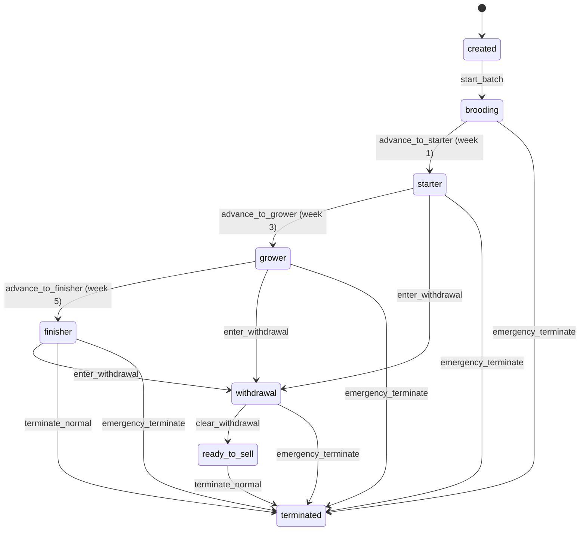

# Backend Architecture - Production-Grade Service Layer & Integration Patterns

# Backend Architecture - Production-Grade Service Layer & Integration Patterns

**Epic:** spec:bceeaefd-5139-4801-8c12-de8a8b6faf8a/2c73a304-598c-472c-b79c-20584f6dc34b  
**Tech Plan:** spec:bceeaefd-5139-4801-8c12-de8a8b6faf8a/950515a2-7eeb-4375-9e58-6df156a25a3b  
**Status:** Production-Ready Specification  
**Last Updated:** January 16, 2026

---

## Executive Summary

This specification defines the complete backend architecture for the LampFarms platform, establishing the foundational patterns that all 15 systems will follow. The architecture is built on 5 core pillars: **APScheduler 4.x** for background jobs, **python-statemachine** for state management, **Repository-Service pattern** for data access, **Event-Driven Integration** for cross-system coordination, and **Configuration-Driven Behavior** for flexibility without hardcoding.

### Core Philosophy

**Backend Intelligence, Frontend Simplicity:**

- Backend handles all calculations, validations, and orchestration
- Frontend focuses on data entry and display
- Clear separation of concerns

**Configuration-Driven, Not Hardcoded:**

- All business rules in configuration files (species.json, species_protocols.json)
- Database overrides for farm-specific customization
- No hardcoded values in code

**Event-Driven Integration:**

- Systems communicate via typed events
- Loose coupling enables independent evolution
- Automatic workflows (feed → expense, health → expense)

---

## Table of Contents

1. [Service Architecture (Phase 1: 10 Services)](#section-1-service-architecture)
2. [APScheduler 4.x Integration](#section-2-apscheduler-4x-integration)
3. [State Machine Pattern](#section-3-state-machine-pattern)
4. [Repository-Service Pattern](#section-4-repository-service-pattern)
5. [Event Bus Design](#section-5-event-bus-design)
6. [Configuration System](#section-6-configuration-system)
7. [Database Models](#section-7-database-models)
8. [API Structure](#section-8-api-structure)

---

## Section 1: Service Architecture (Phase 1: 10 Services)

### 1.1 Service Dependency Graph

```
┌─────────────────────────────────────────────────────────────────────────┐
│                         PHASE 1: CORE 10 SERVICES                       │
├─────────────────────────────────────────────────────────────────────────┤
│                                                                         │
│  ┌──────────────┐     ┌──────────────┐     ┌──────────────┐          │
│  │ AuthService  │     │ EventBus     │     │ ConfigService│          │
│  │ (JWT Auth)   │     │ (Pub/Sub)    │     │ (JSON+DB)    │          │
│  └──────────────┘     └──────────────┘     └──────────────┘          │
│         │                     │                     │                  │
│         │                     │                     │                  │
│  ┌──────┴──────────────────────┴──────────────────┴──────┐           │
│  │                                                         │           │
│  │  ┌────────────────┐  ┌────────────────┐  ┌──────────────────┐    │
│  │  │ Nutritional    │  │ SafetyValidator│  │ WaterHealthCalc  │    │
│  │  │ Calculator     │  │ Service        │  │ Service          │    │
│  │  └────────────────┘  └────────────────┘  └──────────────────┘    │
│  │         │                     │                     │              │
│  │         └─────────────────────┴─────────────────────┘              │
│  │                              │                                      │
│  │  ┌───────────────────────────┴───────────────────────────┐        │
│  │  │                                                         │        │
│  │  │  ┌──────────────┐  ┌──────────────┐  ┌──────────────┐ │       │
│  │  │  │ BatchLifecycle│  │ FeedFormulation│ │ HealthTaskGen│ │       │
│  │  │  │ Service       │  │ Service        │ │ Service      │ │       │
│  │  │  └──────────────┘  └──────────────┘  └──────────────┘ │       │
│  │  │         │                  │                  │         │       │
│  │  │         └──────────────────┴──────────────────┘         │       │
│  │  │                            │                            │       │
│  │  │                  ┌─────────┴─────────┐                 │       │
│  │  │                  │                   │                 │       │
│  │  │           ┌──────────────┐           │                 │       │
│  │  │           │ UnifiedExpense│           │                 │       │
│  │  │           │ Service       │           │                 │       │
│  │  │           └──────────────┘           │                 │       │
│  │  │                  │                   │                 │       │
│  │  └──────────────────┴───────────────────┴─────────────────┘       │
│  │                                                                     │
│  └─────────────────────────────────────────────────────────────────────┘
│                                                                         │
├─────────────────────────────────────────────────────────────────────────┤
│                      PHASE 2: SUPPORTING 4 SERVICES                     │
│  ┌──────────────┐  ┌──────────────┐  ┌──────────────┐  ┌──────────┐  │
│  │Orchestration │  │ Storage      │  │ FeedWorkflow │  │ Weekly   │  │
│  │Engine        │  │ Integration  │  │ Coordinator  │  │ Advisor  │  │
│  └──────────────┘  └──────────────┘  └──────────────┘  └──────────┘  │
└─────────────────────────────────────────────────────────────────────────┘
```

### 1.2 Service Dependencies

| Service | Dependencies | Purpose |
|---------|--------------|---------|  
| AuthService | None | User authentication and authorization |
| EventBusService | None | Event publishing and subscription |
| ConfigService | None | Configuration loading (JSON + DB) |
| NutritionalCalculatorService | Config | Calculate nutritional requirements |
| SafetyValidatorService | Config | Validate ingredient safety |
| WaterHealthCalculationService | Config | Calculate medication dosages |
| BatchLifecycleService | EventBus, Config, BatchRepository | Batch lifecycle management |
| FeedFormulationService | EventBus, Config, NutritionalCalc, SafetyValidator | Feed formulation |
| HealthTaskGenerationService | EventBus, Config | Generate health tasks |
| UnifiedExpenseService | EventBus, ExpenseRepository | Automatic expense creation |

### 1.3 Service Responsibilities


| Service                           | Responsibility                                  | Key Methods                                                                                          | Dependencies                                                                 |
| --------------------------------- | ----------------------------------------------- | ---------------------------------------------------------------------------------------------------- | ---------------------------------------------------------------------------- |
| **AuthService**                   | User authentication, JWT token management       | `login()`, `register()`, `refresh_token()`, `get_current_user()`                                     | None                                                                         |
| **EventBusService**               | Publish/subscribe event coordination            | `publish()`, `subscribe()`, `unsubscribe()`                                                          | None                                                                         |
| **ConfigService**                 | Load configuration (JSON + DB overrides)        | `get_species_protocol()`, `get_nutritional_requirements()`, `get_db_override()`                      | None                                                                         |
| **NutritionalCalculatorService**  | Calculate nutritional requirements              | `get_requirements()`, `validate_formula()`, `calculate_daily_intake()`                               | ConfigService                                                                |
| **SafetyValidatorService**        | Validate species safety rules                   | `validate_ingredient()`, `validate_medication()`, `get_safety_rules()`                               | ConfigService                                                                |
| **WaterHealthCalculationService** | Calculate water-based dosages                   | `calculate_dosage()`, `calculate_water_volume()`, `convert_container_to_liters()`                    | ConfigService                                                                |
| **BatchLifecycleService**         | Batch state management, lifecycle orchestration | `create_batch()`, `advance_week()`, `record_mortality()`, `terminate_batch()`                        | EventBusService, BatchRepository                                             |
| **FeedFormulationService**        | LP optimization for feed recipes                | `calculate_ready_made()`, `calculate_custom()`, `calculate_concentrate()`, `implement_formulation()` | EventBusService, NutritionalCalculatorService, SafetyValidatorService, Pyomo |
| **HealthTaskGenerationService**   | Generate vaccination/medication tasks           | `generate_weekly_tasks()`, `generate_vaccination_schedule()`, `complete_task()`                      | EventBusService, ConfigService, WaterHealthCalculationService                |
| **UnifiedExpenseService**         | Automatic expense creation from events          | `create_feed_expense()`, `create_health_expense()`, `on_feed_formulation_confirmed()`                | EventBusService, ExpenseRepository                                           |


### 1.3 Service Interaction Patterns

**Pattern 1: Feed Calculation Workflow**

```
User Request (Frontend)
    ↓
FeedFormulationService.calculate_custom()
    ├─ NutritionalCalculatorService.get_requirements()
    ├─ SafetyValidatorService.validate_ingredient()
    ├─ Pyomo LP Optimization
    └─ Save FeedFormulation to database
    ↓
User Confirms Implementation (Frontend)
    ↓
FeedFormulationService.implement_formulation()
    ↓
EventBusService.publish(FEED_FORMULATION_CONFIRMED)
    ├─ UnifiedExpenseService.on_feed_formulation_confirmed()
    │   └─ Create Expense (in own transaction)
    └─ StorageIntegrationService.on_feed_formulation_confirmed() [Phase 2]
        └─ Allocate Stock (in own transaction)
```

**Pattern 2: Weekly Batch Advancement (Scheduled)**

```
APScheduler (Sunday midnight)
    ↓
advance_batch_weeks() job
    ↓
For each active batch (separate transaction per batch):
    ├─ BatchLifecycleService.advance_batch_week()
    ├─ Increment current_week
    ├─ Check lifecycle phase transition (week 3 → grower)
    ├─ batch.transition("advance_to_grower")
    ├─ State machine emits STATE_GROWER event
    ├─ Commit transaction
    └─ EventBusService.publish(STATE_GROWER)
        └─ HealthTaskGenerationService.on_state_grower()
            ├─ Generate week 3 tasks (in own transaction)
            └─ Emit HEALTH_TASK_GENERATED event
```

**Pattern 3: Health Task Completion**

```
User Completes Task (Frontend)
    ↓
HealthTaskGenerationService.complete_task()
    ├─ Update task status
    ├─ Check withdrawal period
    └─ Commit transaction
    ↓
EventBusService.publish(HEALTH_TASK_COMPLETED)
    ├─ UnifiedExpenseService.on_health_task_completed()
    │   └─ Create Expense (in own transaction)
    └─ BatchLifecycleService.on_health_task_completed()
        └─ Enter withdrawal if medication requires it (in own transaction)
```

---

## Section 2: APScheduler 4.x Integration

### 2.1 Scheduler Setup (FastAPI Lifespan)

**Implementation Pattern:**

```python
# backend/app/services/scheduler.py
from collections.abc import AsyncGenerator
from contextlib import asynccontextmanager
from sqlalchemy.ext.asyncio import create_async_engine
from fastapi import FastAPI
from apscheduler import AsyncScheduler
from apscheduler.datastores.sqlalchemy import SQLAlchemyDataStore
from apscheduler.triggers.cron import CronTrigger
from apscheduler.triggers.interval import IntervalTrigger

_scheduler: AsyncScheduler | None = None

def get_scheduler() -> AsyncScheduler:
    if _scheduler is None:
        raise RuntimeError("Scheduler not initialized")
    return _scheduler

@asynccontextmanager
async def scheduler_lifespan(app: FastAPI) -> AsyncGenerator[None, None]:
    """APScheduler 4.x lifespan integration."""
    global _scheduler
    
    from app.core.config import settings
    
    engine = create_async_engine(
        settings.DATABASE_URL.replace("sqlite:///", "sqlite+aiosqlite:///"),
        echo=False
    )
    
    data_store = SQLAlchemyDataStore(engine)
    _scheduler = AsyncScheduler(data_store)
    
    async with _scheduler:
        await _register_batch_jobs(_scheduler)
        await _scheduler.start_in_background()
        yield
    
    _scheduler = None
```

### 2.2 Scheduled Jobs (Per-Batch Transaction Isolation)

**Job 1: Daily Task Generation**

```python
async def generate_daily_batch_tasks() -> None:
    """Generate daily medication/vaccination tasks for all active batches."""
    from app.services.health_task_generation_service import HealthTaskGenerationService
    from app.core.database import async_session_maker
    from app.repositories.batch_repository import BatchRepository
    
    # Get batches in read-only session
    async with async_session_maker() as read_session:
        batch_repo = BatchRepository(read_session)
        batches = await batch_repo.get_active_batches()
    
    # Process each batch in its own transaction
    for batch in batches:
        async with async_session_maker() as session:
            try:
                service = HealthTaskGenerationService(session)
                await service.generate_daily_tasks(batch.id)
                await session.commit()
            except Exception as e:
                await session.rollback()
                logger.error(f"Failed to generate tasks for batch {batch.id}: {e}")
                # Continue with next batch
```

**Job 2: Weekly Batch Advancement**

```python
async def advance_batch_weeks() -> None:
    """Advance week counter for all active batches (Sunday midnight)."""
    from app.services.batch_lifecycle_service import BatchLifecycleService
    from app.core.database import async_session_maker
    from app.repositories.batch_repository import BatchRepository
    
    # Get batches in read-only session
    async with async_session_maker() as read_session:
        batch_repo = BatchRepository(read_session)
        batches = await batch_repo.get_active_batches()
    
    # Process each batch in its own transaction
    for batch in batches:
        async with async_session_maker() as session:
            try:
                service = BatchLifecycleService(session)
                await service.advance_batch_week(batch.id)
                await session.commit()  # Commit per batch
            except Exception as e:
                await session.rollback()
                logger.error(f"Failed to advance batch {batch.id}: {e}")
                # Continue with next batch (isolation)
```

**Job 3: Withdrawal Period Checker**

```python
async def check_withdrawal_periods() -> None:
    """Check and clear completed withdrawal periods (every 4 hours)."""
    from app.services.batch_lifecycle_service import BatchLifecycleService
    from app.core.database import async_session_maker
    from app.repositories.batch_repository import BatchRepository
    
    # Get batches in withdrawal
    async with async_session_maker() as read_session:
        batch_repo = BatchRepository(read_session)
        batches = await batch_repo.get_batches_with_expired_withdrawal()
    
    # Process each batch in its own transaction
    for batch in batches:
        async with async_session_maker() as session:
            try:
                service = BatchLifecycleService(session)
                await service.clear_withdrawal(batch.id)
                await session.commit()
            except Exception as e:
                await session.rollback()
                logger.error(f"Failed to clear withdrawal for batch {batch.id}: {e}")
```

### 2.3 Job Registration

```python
async def _register_batch_jobs(scheduler: AsyncScheduler) -> None:
    """Register all batch lifecycle scheduled jobs."""
    
    # Daily task generation at 6 AM
    await scheduler.add_schedule(
        generate_daily_batch_tasks,
        CronTrigger(hour=6, minute=0),
        id="daily_batch_tasks",
        replace_existing=True
    )
    
    # Weekly batch advancement (Sunday midnight)
    await scheduler.add_schedule(
        advance_batch_weeks,
        CronTrigger(day_of_week="sun", hour=0, minute=0),
        id="weekly_batch_advance",
        replace_existing=True
    )
    
    # Withdrawal period checker (every 4 hours)
    await scheduler.add_schedule(
        check_withdrawal_periods,
        IntervalTrigger(hours=4),
        id="withdrawal_checker",
        replace_existing=True
    )
```

**Key Differences from APScheduler 3.x:**

- Uses `AsyncScheduler` (not `AsyncIOScheduler`)
- Uses `SQLAlchemyDataStore` (not `SQLAlchemyJobStore`)
- Uses `start_in_background()` (not `start()`)
- Integrated via FastAPI lifespan (not `@app.on_event`)

---

## Section 3: State Machine Pattern

### 3.1 Batch Lifecycle State Machine



### 3.2 State Machine Implementation (Cached Instance)

```python
# backend/app/services/batch_state_machine.py
from statemachine import StateMachine, State
from typing import TYPE_CHECKING

if TYPE_CHECKING:
    from app.models.farm import Batch

class BatchLifecycleMachine(StateMachine):
    """
    Finite State Machine for batch lifecycle.
    
    VALIDATED PATTERN:
    - Cached instance per batch (not recreated on every access)
    - Global callback registration (at app startup)
    - Guards for conditional transitions
    - Validators for imperative checks
    """
    
    # States with explicit values for DB storage
    created = State(initial=True, value="created")
    brooding = State(value="brooding")
    starter = State(value="starter")
    grower = State(value="grower")
    finisher = State(value="finisher")
    withdrawal = State(value="withdrawal")
    ready_to_sell = State(value="ready_to_sell")
    terminated = State(final=True, value="terminated")
    
    # Transitions with guards
    start_batch = created.to(brooding, cond="has_initial_population")
    advance_to_starter = brooding.to(starter, cond="week_reached_1")
    advance_to_grower = starter.to(grower, cond="week_reached_3")
    advance_to_finisher = grower.to(finisher, cond="week_reached_5")
    
    enter_withdrawal = (
        starter.to(withdrawal, cond="has_active_withdrawal") |
        grower.to(withdrawal, cond="has_active_withdrawal") |
        finisher.to(withdrawal, cond="has_active_withdrawal")
    )
    
    clear_withdrawal = withdrawal.to(
        ready_to_sell,
        cond="withdrawal_period_complete",
        validators="validate_withdrawal_cleared"
    )
    
    terminate_normal = (
        ready_to_sell.to(terminated) |
        finisher.to(terminated, unless="has_active_withdrawal")
    )
    
    emergency_terminate = (
        brooding.to(terminated) |
        starter.to(terminated) |
        grower.to(terminated) |
        finisher.to(terminated) |
        withdrawal.to(terminated)
    )
    
    def __init__(self, batch: "Batch"):
        self.batch = batch
        super().__init__()
    
    # Guard methods (return bool)
    def has_initial_population(self) -> bool:
        return self.batch.initial_count > 0
    
    def week_reached_1(self) -> bool:
        return self.batch.current_week >= 1
    
    def week_reached_3(self) -> bool:
        return self.batch.current_week >= 3
    
    def week_reached_5(self) -> bool:
        return self.batch.current_week >= 5
    
    def has_active_withdrawal(self) -> bool:
        return self.batch.withdrawal_end_date is not None
    
    def withdrawal_period_complete(self) -> bool:
        from datetime import datetime
        if not self.batch.withdrawal_end_date:
            return True
        return datetime.utcnow() >= self.batch.withdrawal_end_date
    
    # Validator methods (raise exceptions)
    def validate_withdrawal_cleared(self) -> None:
        if not self.withdrawal_period_complete():
            raise ValueError(
                f"Withdrawal period not complete. "
                f"Ends: {self.batch.withdrawal_end_date}"
            )
```

### 3.3 Global Callback Registration

```python
# backend/app/main.py (at startup)
from app.services.batch_state_machine import BatchLifecycleMachine
from app.services.batch_event_bus import batch_event_bus, BatchEvent

def register_state_machine_callbacks():
    """Register global callbacks for all state machine instances."""
    
    # Register on_enter_state callback globally
    def on_enter_any_state(source, target, event):
        """Emit event when entering any state."""
        batch = event.model.batch  # Access batch from state machine
        batch_event_bus.publish(BatchEvent(
            event_type=f"STATE_{target.value.upper()}",
            batch_id=batch.id,
            data={
                "from_state": source.value if source else None,
                "to_state": target.value,
                "trigger": event.name
            }
        ))
    
    # Register callback on StateMachine class (affects all instances)
    BatchLifecycleMachine.on_enter_state = on_enter_any_state
```

---

## Section 4: Repository-Service Pattern

### 4.1 BaseRepository (Generic CRUD)

```python
# backend/app/repositories/base.py
from typing import Generic, TypeVar, Type, Optional, List, Dict, Any
from sqlalchemy import select, update, delete, func
from sqlalchemy.ext.asyncio import AsyncSession
from app.core.database import Base

ModelType = TypeVar("ModelType", bound=Base)

class BaseRepository(Generic[ModelType]):
    """
    Generic repository with async CRUD operations.
    
    VALIDATED PATTERN:
    - Repository encapsulates all data access
    - Generic typing for reusability
    - Async-first design
    - No direct session.commit() (caller controls transaction)
    """
    
    def __init__(self, model: Type[ModelType], session: AsyncSession):
        self.model = model
        self.session = session
    
    async def get(self, id: int) -> Optional[ModelType]:
        """Get single record by ID."""
        result = await self.session.execute(
            select(self.model).where(self.model.id == id)
        )
        return result.scalar_one_or_none()
    
    async def get_multi(
        self,
        *,
        skip: int = 0,
        limit: int = 100,
        filters: Optional[Dict[str, Any]] = None
    ) -> List[ModelType]:
        """Get multiple records with pagination and filters."""
        query = select(self.model)
        
        if filters:
            for field, value in filters.items():
                if hasattr(self.model, field):
                    query = query.where(getattr(self.model, field) == value)
        
        query = query.offset(skip).limit(limit)
        result = await self.session.execute(query)
        return list(result.scalars().all())
    
    async def create(self, obj_in: Dict[str, Any]) -> ModelType:
        """Create new record."""
        db_obj = self.model(**obj_in)
        self.session.add(db_obj)
        await self.session.flush()
        await self.session.refresh(db_obj)
        return db_obj
    
    async def update(self, id: int, obj_in: Dict[str, Any]) -> Optional[ModelType]:
        """Update record by ID."""
        await self.session.execute(
            update(self.model).where(self.model.id == id).values(**obj_in)
        )
        return await self.get(id)
    
    async def delete(self, id: int) -> bool:
        """Delete record by ID."""
        result = await self.session.execute(
            delete(self.model).where(self.model.id == id)
        )
        return result.rowcount > 0
    
    async def count(self, filters: Optional[Dict[str, Any]] = None) -> int:
        """Count records with optional filters."""
        query = select(func.count(self.model.id))
        
        if filters:
            for field, value in filters.items():
                if hasattr(self.model, field):
                    query = query.where(getattr(self.model, field) == value)
        
        result = await self.session.execute(query)
        return result.scalar() or 0
```

### 4.2 Domain Repository Example

```python
# backend/app/repositories/batch_repository.py
from typing import List, Optional
from datetime import datetime
from sqlalchemy import select, and_
from app.models.farm import Batch
from app.repositories.base import BaseRepository

class BatchRepository(BaseRepository[Batch]):
    """Batch-specific repository with domain queries."""
    
    def __init__(self, session):
        super().__init__(Batch, session)
    
    async def get_active_batches(
        self,
        farm_id: Optional[int] = None
    ) -> List[Batch]:
        """Get all non-terminated batches."""
        query = select(Batch).where(Batch.lifecycle_phase != "terminated")
        
        if farm_id:
            query = query.where(Batch.farm_id == farm_id)
        
        result = await self.session.execute(query)
        return list(result.scalars().all())
    
    async def get_batches_in_withdrawal(self) -> List[Batch]:
        """Get batches currently in withdrawal period."""
        result = await self.session.execute(
            select(Batch).where(Batch.lifecycle_phase == "withdrawal")
        )
        return list(result.scalars().all())
    
    async def get_batches_with_expired_withdrawal(self) -> List[Batch]:
        """Get batches whose withdrawal period has ended."""
        now = datetime.utcnow()
        result = await self.session.execute(
            select(Batch).where(
                and_(
                    Batch.lifecycle_phase == "withdrawal",
                    Batch.withdrawal_end_date <= now
                )
            )
        )
        return list(result.scalars().all())
```

### 4.3 Service Layer Pattern

```python
# backend/app/services/batch_lifecycle_service.py
from typing import List
from datetime import datetime, timedelta
from sqlalchemy.ext.asyncio import AsyncSession
from app.repositories.batch_repository import BatchRepository
from app.models.farm import Batch
from app.services.batch_event_bus import batch_event_bus, BatchEvent, EventType

class BatchLifecycleService:
    """
    Service layer for batch lifecycle operations.
    
    VALIDATED PATTERN:
    - Service orchestrates repositories
    - Business logic lives here
    - Events emitted for side effects
    - No direct session.commit() (caller controls transaction)
    """
    
    def __init__(self, session: AsyncSession):
        self.session = session
        self.batch_repo = BatchRepository(session)
    
    async def start_batch(self, batch_id: int) -> Batch:
        """Start a batch (transition from created to brooding)."""
        batch = await self.batch_repo.get(batch_id)
        if not batch:
            raise ValueError(f"Batch {batch_id} not found")
        
        batch.transition("start_batch")
        batch.started_at = datetime.utcnow()
        
        # Event published AFTER transaction commit (deferred)
        return batch
    
    async def advance_batch_week(self, batch_id: int) -> Batch:
        """Advance a batch by one week."""
        batch = await self.batch_repo.get(batch_id)
        if not batch:
            raise ValueError(f"Batch {batch_id} not found")
        
        old_week = batch.current_week
        batch.current_week += 1
        
        # Check for automatic stage transitions
        await self._check_stage_advancement(batch)
        
        # Event will be published after commit
        return batch
    
    async def _check_stage_advancement(self, batch: Batch) -> None:
        """Check if batch should advance to next lifecycle stage."""
        transitions = [
            (1, "advance_to_starter"),
            (3, "advance_to_grower"),
            (5, "advance_to_finisher"),
        ]
        
        for week_threshold, transition_name in transitions:
            if batch.current_week == week_threshold:
                try:
                    batch.transition(transition_name)
                except Exception:
                    pass  # Transition not valid from current state
```

---

## Section 5: Event Bus Design

### 5.1 Typed Event System

```python
# backend/app/services/batch_event_bus.py
from dataclasses import dataclass, field
from datetime import datetime
from typing import Callable, Dict, List, Any, Optional, Awaitable
from enum import Enum
import uuid
import logging
from collections import deque

logger = logging.getLogger(__name__)

class EventType(str, Enum):
    """All event types in the system (13 total)."""
    
    # Batch Lifecycle Events (4)
    BATCH_CREATED = "BATCH_CREATED"
    WEEK_ADVANCED = "WEEK_ADVANCED"
    MORTALITY_RECORDED = "MORTALITY_RECORDED"
    BATCH_TERMINATED = "BATCH_TERMINATED"
    
    # Feed Events (1)
    FEED_FORMULATION_CONFIRMED = "FEED_FORMULATION_CONFIRMED"
    
    # Health Events (3)
    HEALTH_TASK_COMPLETED = "HEALTH_TASK_COMPLETED"
    VACCINATION_COMPLETED = "VACCINATION_COMPLETED"
    WITHDRAWAL_PERIOD_ENDED = "WITHDRAWAL_PERIOD_ENDED"
    
    # Stock Events (3)
    STOCK_PURCHASE_RECORDED = "STOCK_PURCHASE_RECORDED"
    STOCK_LOW = "STOCK_LOW"
    STOCK_DEPLETED = "STOCK_DEPLETED"
    
    # Egg Production Events (2)
    EGG_PRODUCTION_RECORDED = "EGG_PRODUCTION_RECORDED"
    EGG_SALE_RECORDED = "EGG_SALE_RECORDED"
    
    # State Machine Events (for internal transitions)
    STATE_BROODING = "STATE_BROODING"
    STATE_STARTER = "STATE_STARTER"
    STATE_GROWER = "STATE_GROWER"
    STATE_FINISHER = "STATE_FINISHER"
    STATE_WITHDRAWAL = "STATE_WITHDRAWAL"
    STATE_READY_TO_SELL = "STATE_READY_TO_SELL"

@dataclass
class BatchEvent:
    """Typed event payload with correlation tracking."""
    event_type: str | EventType
    batch_id: int
    data: Dict[str, Any] = field(default_factory=dict)
    event_id: str = field(default_factory=lambda: str(uuid.uuid4()))
    timestamp: datetime = field(default_factory=datetime.utcnow)
    correlation_id: Optional[str] = None

EventHandler = Callable[[BatchEvent, Any], Awaitable[None]]
```

### 5.2 Event Bus with Transaction Isolation

```python
class BatchEventBus:
    """
    In-memory event bus with transaction isolation and retry/DLQ.
    
    VALIDATED PATTERN:
    - Each handler gets its own transaction (no cascading failures)
    - Retry with exponential backoff
    - Dead letter queue for failed events
    - Handler isolation (one failure doesn't affect others)
    """
    
    def __init__(self, max_retries: int = 3):
        self._handlers: Dict[str, List[EventHandler]] = {}
        self._dead_letter_queue: deque[BatchEvent] = deque(maxlen=1000)
        self._max_retries = max_retries
        self._session_maker = None
    
    def set_session_maker(self, session_maker):
        """Inject session maker for handler transactions."""
        self._session_maker = session_maker
    
    def subscribe(self, event_type: str | EventType, handler: EventHandler) -> None:
        """Subscribe handler to event type."""
        key = event_type.value if isinstance(event_type, EventType) else event_type
        
        if key not in self._handlers:
            self._handlers[key] = []
        
        self._handlers[key].append(handler)
        logger.info(f"Handler subscribed to {key}")
    
    async def publish(self, event: BatchEvent) -> None:
        """
        Publish event to all subscribers with transaction isolation.
        
        VALIDATED PATTERN:
        - Each handler gets its own transaction
        - Handler failures don't affect other handlers
        - No cascading rollbacks
        """
        key = (
            event.event_type.value 
            if isinstance(event.event_type, EventType) 
            else event.event_type
        )
        
        handlers = self._handlers.get(key, [])
        
        for handler in handlers:
            # Each handler gets its own transaction
            if self._session_maker:
                async with self._session_maker() as session:
                    try:
                        await handler(event, session)
                        await session.commit()
                    except Exception as e:
                        await session.rollback()
                        logger.error(f"Handler failed for {event.event_type}: {e}")
                        self._dead_letter_queue.append(event)
            else:
                # Fallback for non-transactional handlers
                try:
                    await handler(event, None)
                except Exception as e:
                    logger.error(f"Handler failed for {event.event_type}: {e}")
                    self._dead_letter_queue.append(event)
    
    def get_dead_letters(self) -> List[BatchEvent]:
        """Get events from dead letter queue."""
        return list(self._dead_letter_queue)
    
    def clear_dead_letters(self) -> int:
        """Clear dead letter queue, return count cleared."""
        count = len(self._dead_letter_queue)
        self._dead_letter_queue.clear()
        return count

# Global event bus instance
batch_event_bus = BatchEventBus()
```

### 5.3 Event Handler Registration (At Startup)

```python
# backend/app/main.py
from app.services.batch_event_bus import batch_event_bus, EventType
from app.services.unified_expense_service import UnifiedExpenseService
from app.core.database import async_session_maker

async def register_event_handlers():
    """Register all event handlers at application startup."""
    
    # Inject session maker for transaction isolation
    batch_event_bus.set_session_maker(async_session_maker)
    
    # Register expense creation handlers
    async def on_feed_formulation_confirmed(event: BatchEvent, session):
        service = UnifiedExpenseService(session)
        await service.create_feed_expense(event.data["formulation_id"])
    
    async def on_health_task_completed(event: BatchEvent, session):
        service = UnifiedExpenseService(session)
        await service.create_health_expense(event.data["task_id"])
    
    batch_event_bus.subscribe(
        EventType.FEED_FORMULATION_CONFIRMED,
        on_feed_formulation_confirmed
    )
    
    batch_event_bus.subscribe(
        EventType.HEALTH_TASK_COMPLETED,
        on_health_task_completed
    )
```

---

## Section 6: Configuration System

### 6.1 Hybrid Configuration Architecture

```
┌─────────────────────────────────────────────────────────────────┐
│                    CONFIGURATION HIERARCHY                      │
├─────────────────────────────────────────────────────────────────┤
│                                                                 │
│  Layer 3: Cache (Highest Priority)                             │
│  ┌───────────────────────────────────────────────────────────┐ │
│  │ In-Memory Cache (5-minute TTL)                            │ │
│  │ >95% cache hit rate                                       │ │
│  └───────────────────────────────────────────────────────────┘ │
│                            ↓ (cache miss)                       │
│  Layer 2: Database Overrides (Farm-Specific)                   │
│  ┌───────────────────────────────────────────────────────────┐ │
│  │ configurations table (key, value, farm_id)                │ │
│  │ Farm-specific customization                               │ │
│  └───────────────────────────────────────────────────────────┘ │
│                            ↓ (no override)                      │
│  Layer 1: JSON Files (Version-Controlled Defaults)             │
│  ┌───────────────────────────────────────────────────────────┐ │
│  │ backend/config/species.json                               │ │
│  │ backend/config/species_protocols.json                     │ │
│  │ backend/config/nutritional_requirements.json              │ │
│  │ backend/config/safety_rules.json                          │ │
│  └───────────────────────────────────────────────────────────┘ │
│                                                                 │
└─────────────────────────────────────────────────────────────────┘
```

### 6.2 ConfigService Implementation

```python
# backend/app/services/config_service.py
from typing import Optional, Dict, Any
import json
from pathlib import Path
from sqlalchemy.ext.asyncio import AsyncSession
from app.repositories.configuration_repository import ConfigurationRepository

class ConfigService:
    """
    Configuration service with 3-tier hierarchy.
    
    VALIDATED PATTERN:
    - JSON files as defaults (version-controlled)
    - Database overrides for customization
    - In-memory cache for performance
    """
    
    def __init__(self, session: AsyncSession):
        self.session = session
        self.config_repo = ConfigurationRepository(session)
        self._cache: Dict[str, Any] = {}
        self._config_dir = Path(__file__).parent.parent.parent / "config"
    
    async def get_species_protocol(
        self,
        species_id: int,
        farm_id: Optional[int] = None
    ) -> Dict[str, Any]:
        """
        Get species protocol with 3-tier fallback.
        
        Resolution order:
        1. Cache (if exists)
        2. Database override (farm-specific)
        3. Database override (global)
        4. JSON file (default)
        """
        cache_key = f"species_protocol_{species_id}_{farm_id or 'global'}"
        
        # Check cache
        if cache_key in self._cache:
            return self._cache[cache_key]
        
        # Check database override (farm-specific)
        if farm_id:
            override = await self.config_repo.get_by_key_and_farm(
                f"species_protocol_{species_id}",
                farm_id
            )
            if override:
                protocol = json.loads(override.value)
                self._cache[cache_key] = protocol
                return protocol
        
        # Check database override (global)
        override = await self.config_repo.get_by_key(f"species_protocol_{species_id}")
        if override:
            protocol = json.loads(override.value)
            self._cache[cache_key] = protocol
            return protocol
        
        # Fall back to JSON file
        protocol = self._load_from_json("species_protocols.json", species_id)
        self._cache[cache_key] = protocol
        return protocol
    
    def _load_from_json(self, filename: str, species_id: int) -> Dict[str, Any]:
        """Load configuration from JSON file."""
        file_path = self._config_dir / filename
        with open(file_path, 'r') as f:
            data = json.load(f)
            return data.get(str(species_id), {})
```

### 6.3 Configuration Files Structure

**Complete Configuration Files (Production-Ready):**

See spec:bceeaefd-5139-4801-8c12-de8a8b6faf8a/dfa10566-d896-41f4-805f-953f7b47d5f3 for complete species.json and species_protocols.json with:
- 36 vaccination protocols (all 4 species)
- Week-by-week temperature, lighting, space, water, feed schedules
- Egg production schedules (layers/ducks)
- Blackhead prevention (turkeys)
- Complete nutritional requirements

See spec:bceeaefd-5139-4801-8c12-de8a8b6faf8a/fb99cad1-d468-4a18-bd81-d987f1ae6f63 for complete ingredients.json with:
- 41 ingredients (9 energy, 15 protein, 6 calcium, 11 supplements)
- Complete nutritional profiles
- West African pricing (GHS/NGN)
- Safety rules and inclusion limits

See spec:bceeaefd-5139-4801-8c12-de8a8b6faf8a/2a098707-5645-4c66-ba4b-27e04df312ca for complete medications.json with:
- 52 medications (8 coccidiostats, 15 antibiotics, 6 anthelmintics, 13 vitamins, 4 antifungals, 7 traditional remedies)
- Complete dosages, withdrawal periods, conflicts
- West African brands and pricing

**Configuration File Locations:**
- `backend/config/species.json` - Species data with complete week-by-week protocols
- `backend/config/species_protocols.json` - 36 vaccination protocols + health checkpoints
- `backend/config/ingredients.json` - 41 ingredients with nutritional profiles
- `backend/config/medications.json` - 52 medications with dosages and conflicts

---

## Section 7: Database Models

### 7.1 Batch Model (Complete SQLAlchemy Code)

```python
# backend/app/models/farm.py
from sqlalchemy import Column, String, Integer, ForeignKey, Enum, Float, Date, DateTime, Boolean, Text
from sqlalchemy.orm import relationship
from datetime import datetime
import enum

class ProductionSystem(str, enum.Enum):
    INTENSIVE = "intensive"
    SEMI_INTENSIVE = "semi_intensive"
    FREE_RANGE = "free_range"

class BatchStatus(str, enum.Enum):
    PREPARATION = "preparation"
    ACTIVE = "active"
    COMPLETED = "completed"
    ARCHIVED = "archived"

class Batch(Base):
    __tablename__ = "batches"
    
    # Basic Info
    id = Column(Integer, primary_key=True, index=True)
    name = Column(String(255), index=True, nullable=False)
    farm_id = Column(Integer, ForeignKey("farms.id"), nullable=False, index=True)
    species_id = Column(Integer, ForeignKey("species.id"), nullable=False, index=True)
    breed = Column(String(100), nullable=True)
    
    # Production System
    production_system = Column(
        Enum(ProductionSystem),
        default=ProductionSystem.INTENSIVE,
        nullable=False,
        index=True
    )
    house_id = Column(Integer, ForeignKey("houses.id"), nullable=True, index=True)
    
    # Lifecycle Tracking (VALIDATED: Renamed fields for clarity)
    lifecycle_phase = Column(
        String(50),
        default="created",
        nullable=False,
        index=True
    )  # Technical state machine phases
    
    batch_status = Column(
        Enum(BatchStatus),
        default=BatchStatus.PREPARATION,
        nullable=False,
        index=True
    )  # Business-level status
    
    start_date = Column(Date, nullable=True)
    current_week = Column(Integer, default=0, nullable=False)
    current_day = Column(Integer, default=0, nullable=False)
    current_phase_name = Column(String(50), nullable=True)  # "starter", "grower", "finisher"
    
    # Population Tracking
    initial_count = Column(Integer, nullable=False)
    current_count = Column(Integer, nullable=False)
    mortality_count = Column(Integer, default=0, nullable=False)
    mortality_rate = Column(Float, default=0.0, nullable=False)
    
    # Performance Metrics
    target_weight = Column(Float, nullable=True)
    actual_weight = Column(Float, nullable=True)
    fcr = Column(Float, nullable=True)
    
    # Alternative Feeding (Ducks/Turkeys)
    alternative_feeding_enabled = Column(Boolean, default=False)
    alternative_feeding_start_week = Column(Integer, nullable=True)
    feed_pattern = Column(String(50), default="automatic")  # "automatic" or "flexible"
    
    # Withdrawal Period
    withdrawal_end_date = Column(DateTime, nullable=True)
    withdrawal_reason = Column(String(255), nullable=True)
    
    # Termination
    termination_date = Column(Date, nullable=True)
    termination_reason = Column(String(255), nullable=True)
    
    # Timestamps
    created_at = Column(DateTime, default=datetime.utcnow, nullable=False)
    updated_at = Column(DateTime, default=datetime.utcnow, onupdate=datetime.utcnow)
    started_at = Column(DateTime, nullable=True)
    terminated_at = Column(DateTime, nullable=True)
    
    # Relationships
    farm = relationship("Farm", back_populates="batches")
    species = relationship("Species", back_populates="batches")
    house = relationship("House", back_populates="batches")
    mortality_records = relationship("MortalityRecord", back_populates="batch", cascade="all, delete-orphan")
    health_tasks = relationship("HealthTask", back_populates="batch", cascade="all, delete-orphan")
    feed_formulations = relationship("FeedFormulation", back_populates="batch", cascade="all, delete-orphan")
    expenses = relationship("Expense", back_populates="batch")
    week_summaries = relationship("BatchWeekSummary", back_populates="batch", cascade="all, delete-orphan")
    
    # State Machine Integration (VALIDATED: Cached instance)
    def __init__(self, **kwargs):
        super().__init__(**kwargs)
        self._state_machine = None
    
    @property
    def state_machine(self):
        """Get cached state machine instance."""
        if self._state_machine is None:
            from app.services.batch_state_machine import BatchLifecycleMachine
            self._state_machine = BatchLifecycleMachine(self)
            if self.lifecycle_phase:
                self._state_machine._set_current_state(
                    self._state_machine._get_state_by_value(self.lifecycle_phase)
                )
        return self._state_machine
    
    def transition(self, event_name: str):
        """Execute state transition and persist new state."""
        sm = self.state_machine
        event = getattr(sm, event_name, None)
        
        if event is None:
            raise ValueError(f"Unknown transition: {event_name}")
        
        event()
        self.lifecycle_phase = sm.current_state.value
```

### 7.2 Configuration Model

```python
# backend/app/models/system.py
from sqlalchemy import Column, String, Integer, ForeignKey, Text, DateTime, Index
from sqlalchemy.orm import relationship
from datetime import datetime
from app.core.database import Base

class Configuration(Base):
    __tablename__ = "configurations"
    
    id = Column(Integer, primary_key=True, index=True)
    key = Column(String(255), nullable=False, index=True)
    value = Column(Text, nullable=False)  # JSON stored as string
    category = Column(String(100), index=True, nullable=True)
    farm_id = Column(Integer, ForeignKey("farms.id"), nullable=True, index=True)
    description = Column(Text, nullable=True)
    created_at = Column(DateTime, default=datetime.utcnow, nullable=False)
    updated_at = Column(DateTime, default=datetime.utcnow, onupdate=datetime.utcnow)
    
    # Relationships
    farm = relationship("Farm")
    
    # Unique constraint: one override per key per farm
    __table_args__ = (
        Index('ix_config_key_farm', 'key', 'farm_id', unique=True),
    )
```

### 7.3 SystemEvent Model (Enhanced)

```python
# backend/app/models/system.py (continued)
from sqlalchemy import Column, String, Integer, ForeignKey, Text, DateTime, Enum as SQLEnum
import enum

class SystemEventType(str, enum.Enum):
    BATCH_CREATED = "BATCH_CREATED"
    BATCH_STARTED = "BATCH_STARTED"
    WEEK_ADVANCED = "WEEK_ADVANCED"
    FEED_FORMULATION_CONFIRMED = "FEED_FORMULATION_CONFIRMED"
    HEALTH_TASK_COMPLETED = "HEALTH_TASK_COMPLETED"
    MORTALITY_RECORDED = "MORTALITY_RECORDED"

class SystemEvent(Base):
    __tablename__ = "system_events"
    
    id = Column(Integer, primary_key=True, index=True)
    event_type = Column(SQLEnum(SystemEventType), index=True, nullable=False)
    event_data = Column(Text, nullable=True)  # JSON stored as string
    source = Column(String(255), nullable=True)
    batch_id = Column(Integer, ForeignKey("batches.id"), nullable=True, index=True)
    correlation_id = Column(String(255), nullable=True, index=True)
    retry_count = Column(Integer, default=0, nullable=False)
    created_at = Column(DateTime, default=datetime.utcnow, nullable=False, index=True)
    
    # Relationships
    batch = relationship("Batch")
```

---

## Section 8: API Structure

### 8.1 API Endpoint Organization

```
/api/v1/
├── auth/
│   ├── POST /register              # Create new user account
│   ├── POST /login                 # Authenticate user
│   ├── POST /refresh               # Refresh access token
│   ├── GET /me                     # Get current user
│   └── POST /logout                # Logout user
│
├── farms/
│   ├── GET /farms                  # List farms
│   ├── POST /farms                 # Create farm
│   ├── GET /farms/{id}             # Get farm details
│   └── PUT /farms/{id}             # Update farm
│
├── batches/
│   ├── GET /batches                # List batches (filter by farm, species, status)
│   ├── POST /batches               # Create batch
│   ├── GET /batches/{id}           # Get batch details
│   ├── POST /batches/{id}/start    # Start batch
│   ├── POST /batches/{id}/advance-week  # Advance week
│   ├── POST /batches/{id}/mortality     # Record mortality
│   ├── POST /batches/{id}/terminate     # Terminate batch
│   └── GET /batches/{id}/summary        # Get batch summary
│
├── feed/
│   ├── POST /feed/calculate-ready-made      # Calculate ready-made feed
│   ├── POST /feed/calculate-custom          # Calculate custom formulation (LP)
│   ├── POST /feed/calculate-concentrate     # Calculate concentrate mix
│   ├── POST /feed/formulations/{id}/implement  # Implement formulation
│   └── GET /feed/formulations               # List formulations
│
├── health/
│   ├── GET /health/tasks                    # List health tasks
│   ├── POST /health/tasks/{id}/complete     # Complete task
│   ├── GET /health/schedules/{batch_id}     # Get vaccination schedule
│   └── POST /health/calculate-dosage        # Calculate medication dosage
│
├── expenses/
│   ├── GET /expenses                        # List expenses
│   ├── POST /expenses                       # Create manual expense
│   ├── GET /expenses/batch/{batch_id}       # Get batch expenses
│   └── GET /expenses/summary                # Get expense summary
│
├── species/
│   ├── GET /species                         # List species
│   ├── GET /species/{id}                    # Get species details
│   └── GET /species/{id}/protocol           # Get species protocol
│
└── config/
    ├── GET /config/{category}/{key}         # Get configuration
    └── POST /config/{category}/{key}        # Update configuration (admin)
```

### 8.2 Authentication Pattern

**All protected endpoints require JWT bearer token:**

```
Authorization: Bearer <access_token>
```

**Token Refresh Flow:**

```
POST /api/v1/auth/refresh
Body: { "refresh_token": "<refresh_token>" }
Response: { "access_token": "<new_access_token>", "refresh_token": "<new_refresh_token>" }
```

**Dependency Injection:**

```python
# backend/app/api/deps.py
from typing import Annotated
from fastapi import Depends, HTTPException, status
from fastapi.security import HTTPBearer, HTTPAuthorizationCredentials
from sqlalchemy.ext.asyncio import AsyncSession
from app.core.database import async_session_maker
from app.services.auth_service import AuthService
from app.models.auth import User

security = HTTPBearer()

async def get_session():
    async with async_session_maker() as session:
        try:
            yield session
            await session.commit()
        except Exception:
            await session.rollback()
            raise

async def get_current_user(
    credentials: Annotated[HTTPAuthorizationCredentials, Depends(security)],
    session: Annotated[AsyncSession, Depends(get_session)]
) -> User:
    auth_service = AuthService(session)
    user = await auth_service.get_current_user(credentials.credentials)
    if not user:
        raise HTTPException(
            status_code=status.HTTP_401_UNAUTHORIZED,
            detail="Invalid authentication credentials"
        )
    return user

# Type aliases
DatabaseSession = Annotated[AsyncSession, Depends(get_session)]
CurrentUser = Annotated[User, Depends(get_current_user)]
```

---

## Implementation Notes

### Phase 1 Implementation Order

**Week 1-2: Foundation**

1. APScheduler 4.x integration with FastAPI lifespan
2. State machine implementation with cached instances
3. BaseRepository + BatchRepository
4. Event bus with transaction isolation
5. ConfigService with hybrid JSON + DB

**Week 3-4: Utility Services**  
6. AuthService (JWT + refresh tokens)  
7. NutritionalCalculatorService  
8. SafetyValidatorService  
9. WaterHealthCalculationService

**Week 5-6: Core Domain Services**  
10. BatchLifecycleService  
11. FeedFormulationService (with Pyomo)  
12. HealthTaskGenerationService  
13. UnifiedExpenseService

### Critical Dependencies

**External Libraries:**

```txt
# requirements.txt
fastapi>=0.109.0
sqlalchemy>=2.0.25
alembic>=1.13.1
apscheduler>=4.0.0
aiosqlite>=0.19.0
python-statemachine>=2.1.0
pyomo>=6.7.0
pydantic>=2.5.0
python-jose[cryptography]>=3.3.0
passlib[bcrypt]>=1.7.4
```

### Multi-Database Support

**Validated Approach:** Use SQLAlchemy JSON type

- PostgreSQL: Native JSONB (queryable, indexed)
- MySQL: Native JSON (queryable)
- SQLite: TEXT (dev-only, acceptable)

**No database-specific features:**

- No raw SQL
- No PostgreSQL-specific types
- No MySQL-specific syntax

---

## Acceptance Criteria

### Architectural Consistency

- [ ] All services follow Repository-Service pattern
- [ ] All services use ConfigService for business rules
- [ ] All services publish events via EventBusService
- [ ] No hardcoded values in service code

### APScheduler Integration

- [ ] Scheduler starts with FastAPI lifespan
- [ ] 3 scheduled jobs registered (daily tasks, weekly advance, withdrawal check)
- [ ] Per-batch transaction isolation (one failure doesn't affect others)
- [ ] Job persistence via SQLAlchemyDataStore

### State Machine

- [ ] State machine cached per batch instance
- [ ] Global callbacks registered at app startup
- [ ] All transitions have guards or validators
- [ ] State persisted in `lifecycle_phase` field

### Event Bus

- [ ] Event handlers execute in isolated transactions
- [ ] Handler failures don't affect other handlers
- [ ] Dead letter queue captures failed events
- [ ] Typed events with EventType enum

### Configuration System

- [ ] 3-tier hierarchy (cache → DB → JSON)
- [ ] Farm-specific overrides supported
- [ ] No hardcoded species data in code
- [ ] Configuration validation on load

### Database Models

- [ ] All models use SQLAlchemy abstractions
- [ ] JSON type for complex data (multi-database compatible)
- [ ] Proper indexes on foreign keys and query fields
- [ ] Cascade deletes configured appropriately

---

## Related Specifications

**Epic Brief:** spec:bceeaefd-5139-4801-8c12-de8a8b6faf8a/2c73a304-598c-472c-b79c-20584f6dc34b  
**Tech Plan:** spec:bceeaefd-5139-4801-8c12-de8a8b6faf8a/950515a2-7eeb-4375-9e58-6df156a25a3b  

**Source Documentation:**

- file:docs/ORCHESTRATION-RESEARCH-REFINED.md - APScheduler 4.x, python-statemachine patterns
- file:docs/architecture/02-backend-architecture.md - Service architecture
- file:priest/06-backend-service-layer/01-SERVICE-ARCHITECTURE-SPEC.md - Service design philosophy
- file:priest/04-integration-layer/ADR-002-EVENT-DRIVEN-INTEGRATION.md - Event-driven integration
- file:priest/06-backend-service-layer/04-CONFIGURATION-SYSTEM-SPEC.md - Configuration system

**Next Specifications:**

- Frontend Architecture Specification
- Batch Management System Specification
- Feed Calculator System Specification
- Water-Health System Specification

---

**Status:** Complete - Ready for Review  
**Next Step:** Create Frontend Architecture Specification
