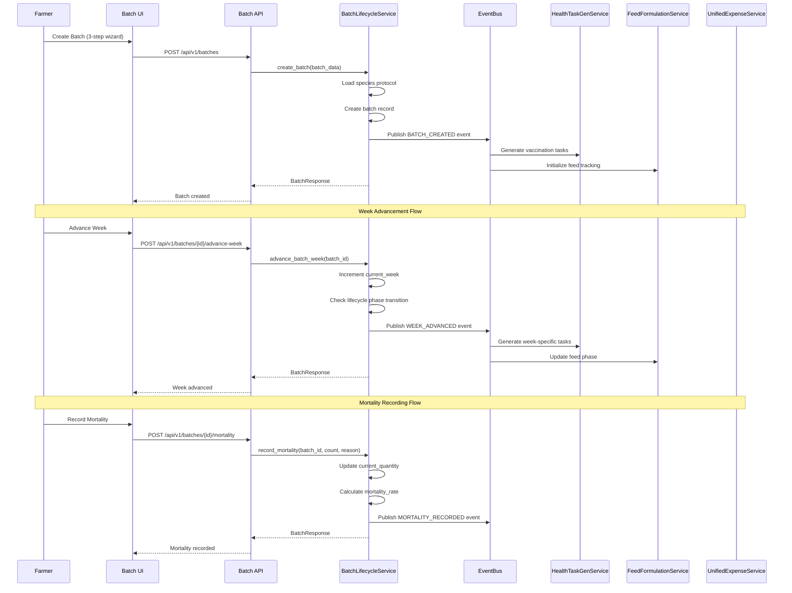

# Batch Management System - Production-Grade Specification (All 4 Species + Dual Feed Patterns)

# Batch Management System - Production-Grade Specification

**Epic:** epic:bceeaefd-5139-4801-8c12-de8a8b6faf8a  
**Status:** Production-Ready Specification  
**Last Updated:** January 2026  
**Architecture:** Validated Tech Plan (spec:bceeaefd-5139-4801-8c12-de8a8b6faf8a/950515a2-7eeb-4375-9e58-6df156a25a3b)

---

## Overview

The Batch Management System is the **core domain** of LampFarms, managing the complete lifecycle of poultry batches from creation to termination. It orchestrates all other systems (Feed, Water-Health, Finance, Stock) through event-driven integration patterns.

### Core Philosophy

**Backend Intelligence, Frontend Simplicity:**

- Backend handles all calculations, validations, and orchestration
- Frontend displays outputs and captures minimal user input
- Configuration-driven behavior (no hardcoded values)

**Farmer-Centric Design:**

- 3-step wizard for batch creation (species → house → review)
- Automatic protocol loading based on species selection
- Clear lifecycle phase indicators
- Quick actions for common tasks (mortality, week advancement)

**Dovetail Synergy Integration:**

- Batch creation triggers automatic health task generation
- Week advancement triggers feed transitions and health checkpoints
- Batch termination triggers withdrawal period checks
- All cross-system coordination via event bus

### Scope

**4 Poultry Species:**

1. **Broilers** - 8-week lifecycle, meat production, intensive only
2. **Layers** - 68-week lifecycle, egg production, intensive only
3. **Ducks** - 10-week lifecycle, meat/egg production, alternative feeding from Week 6
4. **Turkeys** - 16-week lifecycle, meat production, alternative feeding from Week 8

**2 Production Systems:**

1. **Intensive (Automatic Feed Pattern)** - Full confinement, automatic stock allocation, precise tracking
2. **Semi-Intensive (Flexible Feed Pattern)** - Partial foraging, manual stock allocation, reduced feed consumption

**Key Features:**

- 3-step batch creation wizard
- Batch dashboard with filters and quick actions
- Batch details page (5 tabs: Overview, Feed, Health, Performance, Expenses)
- Mortality recording popup
- Week advancement popup
- Batch termination popup
- Species-specific protocols (vaccination schedules, health checkpoints, feed transitions)
- Alternative feeding support (ducks Week 6+, turkeys Week 8+)

---

## System Architecture



---

## Section 1: Batch Creation Wizard (3 Steps)

### Step 1: Species & Production System Selection

**Purpose:** Select species and production system (determines all subsequent behavior)

**UI Flow:**

```
┌─────────────────────────────────────────────────────────────┐
│  Create New Batch - Step 1 of 3                            │
│  Species & Production System                                │
├─────────────────────────────────────────────────────────────┤
│                                                             │
│  Select Species *                                           │
│  ┌─────────────┐ ┌─────────────┐ ┌─────────────┐ ┌────────┐│
│  │  Broilers   │ │   Layers    │ │    Ducks    │ │Turkeys ││
│  │   🐔 8w     │ │   🐔 68w    │ │   🦆 10w    │ │🦃 16w  ││
│  │  Intensive  │ │  Intensive  │ │  Both       │ │ Both   ││
│  └─────────────┘ └─────────────┘ └─────────────┘ └────────┘│
│                                                             │
│  Select Production System *                                 │
│  ┌─────────────────────────────────────────────────────────┐│
│  │ ○ Intensive (Automatic Feed Pattern)                   ││
│  │   Full confinement, automatic stock allocation         ││
│  │                                                         ││
│  │ ○ Semi-Intensive (Flexible Feed Pattern)               ││
│  │   Partial foraging, manual stock allocation            ││
│  │   Available for: Ducks (Week 6+), Turkeys (Week 8+)    ││
│  └─────────────────────────────────────────────────────────┘│
│                                                             │
│  [Cancel]                                    [Next Step →] │
└─────────────────────────────────────────────────────────────┘
```

**Wireframe:**

```wireframe
<!DOCTYPE html>
<html>
<head>
<style>
* { margin: 0; padding: 0; box-sizing: border-box; }
body { font-family: 'Manrope', sans-serif; background: #f9fafb; padding: 24px; }
.wizard-container { max-width: 800px; margin: 0 auto; background: white; border-radius: 16px; box-shadow: 0 1px 3px rgba(0,0,0,0.1); }
.wizard-header { padding: 24px; border-bottom: 1px solid #e5e7eb; }
.wizard-title { font-size: 24px; font-weight: 600; color: #111827; margin-bottom: 4px; }
.wizard-subtitle { font-size: 14px; color: #6b7280; }
.wizard-body { padding: 32px; }
.form-group { margin-bottom: 32px; }
.form-label { display: block; font-size: 14px; font-weight: 500; color: #374151; margin-bottom: 12px; }
.species-grid { display: grid; grid-template-columns: repeat(4, 1fr); gap: 16px; }
.species-card { border: 2px solid #e5e7eb; border-radius: 12px; padding: 20px; text-align: center; cursor: pointer; transition: all 0.2s; }
.species-card:hover { border-color: #16a34a; background: #f0fdf4; }
.species-card.selected { border-color: #16a34a; background: #f0fdf4; }
.species-icon { font-size: 32px; margin-bottom: 8px; }
.species-name { font-size: 16px; font-weight: 600; color: #111827; margin-bottom: 4px; }
.species-duration { font-size: 12px; color: #6b7280; margin-bottom: 4px; }
.species-system { font-size: 11px; color: #9ca3af; }
.radio-group { display: flex; flex-direction: column; gap: 16px; }
.radio-option { border: 2px solid #e5e7eb; border-radius: 12px; padding: 16px; cursor: pointer; transition: all 0.2s; }
.radio-option:hover { border-color: #16a34a; background: #f0fdf4; }
.radio-option.selected { border-color: #16a34a; background: #f0fdf4; }
.radio-header { display: flex; align-items: center; gap: 12px; margin-bottom: 4px; }
.radio-circle { width: 20px; height: 20px; border: 2px solid #d1d5db; border-radius: 50%; display: flex; align-items: center; justify-content: center; }
.radio-option.selected .radio-circle { border-color: #16a34a; }
.radio-circle-inner { width: 10px; height: 10px; background: #16a34a; border-radius: 50%; display: none; }
.radio-option.selected .radio-circle-inner { display: block; }
.radio-title { font-size: 14px; font-weight: 600; color: #111827; }
.radio-description { font-size: 13px; color: #6b7280; margin-left: 32px; }
.wizard-footer { padding: 24px; border-top: 1px solid #e5e7eb; display: flex; justify-content: space-between; }
.btn { padding: 10px 20px; border-radius: 9999px; font-size: 14px; font-weight: 500; cursor: pointer; transition: all 0.2s; border: none; }
.btn-secondary { background: white; color: #374151; border: 1px solid #d1d5db; }
.btn-secondary:hover { background: #f9fafb; }
.btn-primary { background: #16a34a; color: white; }
.btn-primary:hover { background: #15803d; }
</style>
</head>
<body>
<div class="wizard-container">
  <div class="wizard-header">
    <div class="wizard-title">Create New Batch - Step 1 of 3</div>
    <div class="wizard-subtitle">Species & Production System</div>
  </div>
  <div class="wizard-body">
    <div class="form-group">
      <label class="form-label">Select Species *</label>
      <div class="species-grid">
        <div class="species-card selected" data-element-id="species-broilers">
          <div class="species-icon">🐔</div>
          <div class="species-name">Broilers</div>
          <div class="species-duration">8 weeks</div>
          <div class="species-system">Intensive</div>
        </div>
        <div class="species-card" data-element-id="species-layers">
          <div class="species-icon">🐔</div>
          <div class="species-name">Layers</div>
          <div class="species-duration">68 weeks</div>
          <div class="species-system">Intensive</div>
        </div>
        <div class="species-card" data-element-id="species-ducks">
          <div class="species-icon">🦆</div>
          <div class="species-name">Ducks</div>
          <div class="species-duration">10 weeks</div>
          <div class="species-system">Both</div>
        </div>
        <div class="species-card" data-element-id="species-turkeys">
          <div class="species-icon">🦃</div>
          <div class="species-name">Turkeys</div>
          <div class="species-duration">16 weeks</div>
          <div class="species-system">Both</div>
        </div>
      </div>
    </div>
    <div class="form-group">
      <label class="form-label">Select Production System *</label>
      <div class="radio-group">
        <div class="radio-option selected" data-element-id="production-intensive">
          <div class="radio-header">
            <div class="radio-circle"><div class="radio-circle-inner"></div></div>
            <div class="radio-title">Intensive (Automatic Feed Pattern)</div>
          </div>
          <div class="radio-description">Full confinement, automatic stock allocation</div>
        </div>
        <div class="radio-option" data-element-id="production-semi-intensive">
          <div class="radio-header">
            <div class="radio-circle"><div class="radio-circle-inner"></div></div>
            <div class="radio-title">Semi-Intensive (Flexible Feed Pattern)</div>
          </div>
          <div class="radio-description">Partial foraging, manual stock allocation<br>Available for: Ducks (Week 6+), Turkeys (Week 8+)</div>
        </div>
      </div>
    </div>
  </div>
  <div class="wizard-footer">
    <button class="btn btn-secondary" data-element-id="btn-cancel">Cancel</button>
    <button class="btn btn-primary" data-element-id="btn-next">Next Step →</button>
  </div>
</div>
</body>
</html>
```

**Business Logic:**

- **Species Selection:**
  - Broilers: Intensive only (semi-intensive disabled)
  - Layers: Intensive only (semi-intensive disabled)
  - Ducks: Both systems available
  - Turkeys: Both systems available
- **Production System Selection:**
  - **Intensive (Automatic):** All species, automatic stock allocation, precise tracking
  - **Semi-Intensive (Flexible):** Ducks/Turkeys only, manual stock allocation, alternative feeding enabled
- **Validation:**
  - Species required
  - Production system required
  - If Broilers/Layers selected, semi-intensive disabled

---

### Step 2: House Assignment & Batch Details

**Purpose:** Assign batch to house and enter batch details

**UI Flow:**

```
┌─────────────────────────────────────────────────────────────┐
│  Create New Batch - Step 2 of 3                            │
│  House Assignment & Batch Details                          │
├─────────────────────────────────────────────────────────────┤
│                                                             │
│  Batch Name *                                               │
│  ┌─────────────────────────────────────────────────────────┐│
│  │ Broilers Batch #12                                      ││
│  └─────────────────────────────────────────────────────────┘│
│                                                             │
│  Select House *                                             │
│  ┌─────────────┐ ┌─────────────┐ ┌─────────────┐          │
│  │  House A    │ │  House B    │ │  House C    │          │
│  │  Available  │ │  Occupied   │ │  Available  │          │
│  │  Capacity:  │ │  Batch #11  │ │  Capacity:  │          │
│  │  500 birds  │ │  450 birds  │ │  300 birds  │          │
│  └─────────────┘ └─────────────┘ └─────────────┘          │
│                                                             │
│  Initial Quantity *                                         │
│  ┌─────────────────────────────────────────────────────────┐│
│  │ 450                                                     ││
│  └─────────────────────────────────────────────────────────┘│
│                                                             │
│  Start Date *                                               │
│  ┌─────────────────────────────────────────────────────────┐│
│  │ 2026-01-16                                              ││
│  └─────────────────────────────────────────────────────────┘│
│                                                             │
│  Breed (Optional)                                           │
│  ┌─────────────────────────────────────────────────────────┐│
│  │ Cobb 500                                                ││
│  └─────────────────────────────────────────────────────────┘│
│                                                             │
│  [← Back]                                    [Next Step →] │
└─────────────────────────────────────────────────────────────┘
```

**Wireframe:**

```wireframe
<!DOCTYPE html>
<html>
<head>
<style>
* { margin: 0; padding: 0; box-sizing: border-box; }
body { font-family: 'Manrope', sans-serif; background: #f9fafb; padding: 24px; }
.wizard-container { max-width: 800px; margin: 0 auto; background: white; border-radius: 16px; box-shadow: 0 1px 3px rgba(0,0,0,0.1); }
.wizard-header { padding: 24px; border-bottom: 1px solid #e5e7eb; }
.wizard-title { font-size: 24px; font-weight: 600; color: #111827; margin-bottom: 4px; }
.wizard-subtitle { font-size: 14px; color: #6b7280; }
.wizard-body { padding: 32px; }
.form-group { margin-bottom: 24px; }
.form-label { display: block; font-size: 14px; font-weight: 500; color: #374151; margin-bottom: 8px; }
.form-input { width: 100%; padding: 10px 16px; border: 1px solid #d1d5db; border-radius: 9999px; font-size: 14px; color: #111827; }
.form-input:focus { outline: none; border-color: #16a34a; }
.house-grid { display: grid; grid-template-columns: repeat(3, 1fr); gap: 16px; }
.house-card { border: 2px solid #e5e7eb; border-radius: 12px; padding: 16px; text-align: center; cursor: pointer; transition: all 0.2s; }
.house-card:hover { border-color: #16a34a; background: #f0fdf4; }
.house-card.selected { border-color: #16a34a; background: #f0fdf4; }
.house-card.occupied { border-color: #fca5a5; background: #fef2f2; cursor: not-allowed; opacity: 0.6; }
.house-name { font-size: 16px; font-weight: 600; color: #111827; margin-bottom: 4px; }
.house-status { font-size: 12px; color: #6b7280; margin-bottom: 8px; }
.house-capacity { font-size: 11px; color: #9ca3af; }
.wizard-footer { padding: 24px; border-top: 1px solid #e5e7eb; display: flex; justify-content: space-between; }
.btn { padding: 10px 20px; border-radius: 9999px; font-size: 14px; font-weight: 500; cursor: pointer; transition: all 0.2s; border: none; }
.btn-secondary { background: white; color: #374151; border: 1px solid #d1d5db; }
.btn-secondary:hover { background: #f9fafb; }
.btn-primary { background: #16a34a; color: white; }
.btn-primary:hover { background: #15803d; }
</style>
</head>
<body>
<div class="wizard-container">
  <div class="wizard-header">
    <div class="wizard-title">Create New Batch - Step 2 of 3</div>
    <div class="wizard-subtitle">House Assignment & Batch Details</div>
  </div>
  <div class="wizard-body">
    <div class="form-group">
      <label class="form-label">Batch Name *</label>
      <input type="text" class="form-input" value="Broilers Batch #12" data-element-id="input-batch-name">
    </div>
    <div class="form-group">
      <label class="form-label">Select House *</label>
      <div class="house-grid">
        <div class="house-card selected" data-element-id="house-a">
          <div class="house-name">House A</div>
          <div class="house-status">Available</div>
          <div class="house-capacity">Capacity: 500 birds</div>
        </div>
        <div class="house-card occupied" data-element-id="house-b">
          <div class="house-name">House B</div>
          <div class="house-status">Occupied</div>
          <div class="house-capacity">Batch #11 - 450 birds</div>
        </div>
        <div class="house-card" data-element-id="house-c">
          <div class="house-name">House C</div>
          <div class="house-status">Available</div>
          <div class="house-capacity">Capacity: 300 birds</div>
        </div>
      </div>
    </div>
    <div class="form-group">
      <label class="form-label">Initial Quantity *</label>
      <input type="number" class="form-input" value="450" data-element-id="input-initial-quantity">
    </div>
    <div class="form-group">
      <label class="form-label">Start Date *</label>
      <input type="date" class="form-input" value="2026-01-16" data-element-id="input-start-date">
    </div>
    <div class="form-group">
      <label class="form-label">Breed (Optional)</label>
      <input type="text" class="form-input" placeholder="e.g., Cobb 500" data-element-id="input-breed">
    </div>
  </div>
  <div class="wizard-footer">
    <button class="btn btn-secondary" data-element-id="btn-back">← Back</button>
    <button class="btn btn-primary" data-element-id="btn-next">Next Step →</button>
  </div>
</div>
</body>
</html>
```

**Business Logic:**

- **House Selection:**
  - Show all houses with availability status
  - Occupied houses disabled (show current batch)
  - Validate initial quantity ≤ house capacity
- **Validation:**
  - Batch name required (auto-generated if empty: "{Species} Batch #{next_number}")
  - House required
  - Initial quantity required (> 0, ≤ house capacity)
  - Start date required (cannot be future date)
  - Breed optional

---

### Step 3: Review & Confirm

**Purpose:** Review all batch details and confirm creation

**UI Flow:**

```
┌─────────────────────────────────────────────────────────────┐
│  Create New Batch - Step 3 of 3                            │
│  Review & Confirm                                           │
├─────────────────────────────────────────────────────────────┤
│                                                             │
│  Batch Details                                              │
│  ┌─────────────────────────────────────────────────────────┐│
│  │ Batch Name:        Broilers Batch #12                  ││
│  │ Species:           Broilers (8 weeks)                   ││
│  │ Production System: Intensive (Automatic Feed Pattern)   ││
│  │ House:             House A (Capacity: 500 birds)        ││
│  │ Initial Quantity:  450 birds                            ││
│  │ Start Date:        January 16, 2026                     ││
│  │ Breed:             Cobb 500                             ││
│  └─────────────────────────────────────────────────────────┘│
│                                                             │
│  Automatic Setup                                            │
│  ┌─────────────────────────────────────────────────────────┐│
│  │ ✓ Vaccination schedule loaded (2 vaccines)             ││
│  │ ✓ Health checkpoints scheduled (4 checkpoints)         ││
│  │ ✓ Feed transitions planned (3 phases)                  ││
│  │ ✓ Lifecycle phases configured (3 phases)               ││
│  └─────────────────────────────────────────────────────────┘│
│                                                             │
│  Expected Timeline                                          │
│  ┌─────────────────────────────────────────────────────────┐│
│  │ Week 1-3:  Starter Phase (Broiler Starter feed)        ││
│  │ Week 2:    Gumboro vaccination                          ││
│  │ Week 4-5:  Grower Phase (Broiler Grower feed)          ││
│  │ Week 4:    Newcastle vaccination                        ││
│  │ Week 6-8:  Finisher Phase (Broiler Finisher feed)      ││
│  │ Week 8:    Target completion (2.0-2.5 kg)              ││
│  └─────────────────────────────────────────────────────────┘│
│                                                             │
│  [← Back]                              [Create Batch ✓]    │
└─────────────────────────────────────────────────────────────┘
```

**Wireframe:**

```wireframe
<!DOCTYPE html>
<html>
<head>
<style>
* { margin: 0; padding: 0; box-sizing: border-box; }
body { font-family: 'Manrope', sans-serif; background: #f9fafb; padding: 24px; }
.wizard-container { max-width: 800px; margin: 0 auto; background: white; border-radius: 16px; box-shadow: 0 1px 3px rgba(0,0,0,0.1); }
.wizard-header { padding: 24px; border-bottom: 1px solid #e5e7eb; }
.wizard-title { font-size: 24px; font-weight: 600; color: #111827; margin-bottom: 4px; }
.wizard-subtitle { font-size: 14px; color: #6b7280; }
.wizard-body { padding: 32px; }
.section { margin-bottom: 32px; }
.section-title { font-size: 16px; font-weight: 600; color: #111827; margin-bottom: 12px; }
.detail-card { border: 1px solid #e5e7eb; border-radius: 12px; padding: 20px; background: #f9fafb; }
.detail-row { display: flex; justify-content: space-between; padding: 8px 0; border-bottom: 1px solid #e5e7eb; }
.detail-row:last-child { border-bottom: none; }
.detail-label { font-size: 14px; color: #6b7280; }
.detail-value { font-size: 14px; font-weight: 500; color: #111827; }
.setup-list { list-style: none; }
.setup-item { display: flex; align-items: center; gap: 8px; padding: 8px 0; font-size: 14px; color: #374151; }
.setup-check { color: #16a34a; font-weight: 600; }
.timeline-list { list-style: none; }
.timeline-item { padding: 8px 0; font-size: 14px; color: #374151; border-left: 2px solid #16a34a; padding-left: 16px; margin-left: 8px; }
.wizard-footer { padding: 24px; border-top: 1px solid #e5e7eb; display: flex; justify-content: space-between; }
.btn { padding: 10px 20px; border-radius: 9999px; font-size: 14px; font-weight: 500; cursor: pointer; transition: all 0.2s; border: none; }
.btn-secondary { background: white; color: #374151; border: 1px solid #d1d5db; }
.btn-secondary:hover { background: #f9fafb; }
.btn-primary { background: #16a34a; color: white; }
.btn-primary:hover { background: #15803d; }
</style>
</head>
<body>
<div class="wizard-container">
  <div class="wizard-header">
    <div class="wizard-title">Create New Batch - Step 3 of 3</div>
    <div class="wizard-subtitle">Review & Confirm</div>
  </div>
  <div class="wizard-body">
    <div class="section">
      <div class="section-title">Batch Details</div>
      <div class="detail-card">
        <div class="detail-row">
          <span class="detail-label">Batch Name:</span>
          <span class="detail-value">Broilers Batch #12</span>
        </div>
        <div class="detail-row">
          <span class="detail-label">Species:</span>
          <span class="detail-value">Broilers (8 weeks)</span>
        </div>
        <div class="detail-row">
          <span class="detail-label">Production System:</span>
          <span class="detail-value">Intensive (Automatic Feed Pattern)</span>
        </div>
        <div class="detail-row">
          <span class="detail-label">House:</span>
          <span class="detail-value">House A (Capacity: 500 birds)</span>
        </div>
        <div class="detail-row">
          <span class="detail-label">Initial Quantity:</span>
          <span class="detail-value">450 birds</span>
        </div>
        <div class="detail-row">
          <span class="detail-label">Start Date:</span>
          <span class="detail-value">January 16, 2026</span>
        </div>
        <div class="detail-row">
          <span class="detail-label">Breed:</span>
          <span class="detail-value">Cobb 500</span>
        </div>
      </div>
    </div>
    <div class="section">
      <div class="section-title">Automatic Setup</div>
      <div class="detail-card">
        <ul class="setup-list">
          <li class="setup-item"><span class="setup-check">✓</span> Vaccination schedule loaded (2 vaccines)</li>
          <li class="setup-item"><span class="setup-check">✓</span> Health checkpoints scheduled (4 checkpoints)</li>
          <li class="setup-item"><span class="setup-check">✓</span> Feed transitions planned (3 phases)</li>
          <li class="setup-item"><span class="setup-check">✓</span> Lifecycle phases configured (3 phases)</li>
        </ul>
      </div>
    </div>
    <div class="section">
      <div class="section-title">Expected Timeline</div>
      <div class="detail-card">
        <ul class="timeline-list">
          <li class="timeline-item">Week 1-3: Starter Phase (Broiler Starter feed)</li>
          <li class="timeline-item">Week 2: Gumboro vaccination</li>
          <li class="timeline-item">Week 4-5: Grower Phase (Broiler Grower feed)</li>
          <li class="timeline-item">Week 4: Newcastle vaccination</li>
          <li class="timeline-item">Week 6-8: Finisher Phase (Broiler Finisher feed)</li>
          <li class="timeline-item">Week 8: Target completion (2.0-2.5 kg)</li>
        </ul>
      </div>
    </div>
  </div>
  <div class="wizard-footer">
    <button class="btn btn-secondary" data-element-id="btn-back">← Back</button>
    <button class="btn btn-primary" data-element-id="btn-create">Create Batch ✓</button>
  </div>
</div>
</body>
</html>
```

**Business Logic:**

- **Review Display:**
  - Show all entered batch details
  - Show automatic setup summary (vaccines, checkpoints, feed transitions)
  - Show expected timeline (species-specific)
- **Batch Creation:**
  - Create batch record in database
  - Load species protocol from backend/config/species_protocols.json
  - Generate vaccination tasks (based on species schedule)
  - Generate health checkpoint tasks
  - Set up feed transition reminders
  - Configure alternative feeding (if applicable)
  - Publish `BATCH_CREATED` event
  - Redirect to batch details page

---

## Section 2: Batch Dashboard

### Overview

The Batch Dashboard displays all batches with filters, quick stats, and quick actions.

**UI Layout:**

```
┌─────────────────────────────────────────────────────────────┐
│  Batches                                                    │
├─────────────────────────────────────────────────────────────┤
│  [+ Create Batch]                                           │
│                                                             │
│  Filters: [All Species ▼] [All Status ▼] [All Houses ▼]   │
│                                                             │
│  ┌─────────────────────────────────────────────────────────┐│
│  │ Broilers Batch #12          Week 3 | Active | House A  ││
│  │ 445 birds | Mortality: 1.1% | Starter Phase            ││
│  │ [View Details] [Record Mortality] [Advance Week]       ││
│  └─────────────────────────────────────────────────────────┘│
│                                                             │
│  ┌─────────────────────────────────────────────────────────┐│
│  │ Layers Batch #8             Week 24 | Active | House B ││
│  │ 298 birds | Mortality: 0.7% | Peak Production          ││
│  │ [View Details] [Record Mortality] [Advance Week]       ││
│  └─────────────────────────────────────────────────────────┘│
│                                                             │
│  ┌─────────────────────────────────────────────────────────┐│
│  │ Ducks Batch #5              Week 7 | Active | House C  ││
│  │ 187 birds | Mortality: 2.1% | Grower Phase             ││
│  │ Alternative Feeding: ON (15% reduction)                ││
│  │ [View Details] [Record Mortality] [Advance Week]       ││
│  └─────────────────────────────────────────────────────────┘│
└─────────────────────────────────────────────────────────────┘
```

**Wireframe:**

```wireframe
<!DOCTYPE html>
<html>
<head>
<style>
* { margin: 0; padding: 0; box-sizing: border-box; }
body { font-family: 'Manrope', sans-serif; background: #f9fafb; padding: 24px; }
.page-container { max-width: 1200px; margin: 0 auto; }
.page-header { display: flex; justify-content: space-between; align-items: center; margin-bottom: 24px; }
.page-title { font-size: 28px; font-weight: 600; color: #111827; }
.btn { padding: 10px 20px; border-radius: 9999px; font-size: 14px; font-weight: 500; cursor: pointer; transition: all 0.2s; border: none; }
.btn-primary { background: #16a34a; color: white; }
.btn-primary:hover { background: #15803d; }
.filters { display: flex; gap: 12px; margin-bottom: 24px; }
.filter-select { padding: 8px 16px; border: 1px solid #d1d5db; border-radius: 9999px; font-size: 14px; color: #374151; background: white; cursor: pointer; }
.batch-list { display: flex; flex-direction: column; gap: 16px; }
.batch-card { background: white; border: 1px solid #e5e7eb; border-radius: 16px; padding: 20px; }
.batch-header { display: flex; justify-content: space-between; align-items: center; margin-bottom: 12px; }
.batch-name { font-size: 18px; font-weight: 600; color: #111827; }
.batch-meta { font-size: 14px; color: #6b7280; }
.batch-stats { display: flex; gap: 16px; margin-bottom: 12px; font-size: 14px; color: #374151; }
.batch-stat { display: flex; align-items: center; gap: 4px; }
.batch-actions { display: flex; gap: 8px; }
.btn-secondary { background: white; color: #374151; border: 1px solid #d1d5db; padding: 8px 16px; border-radius: 9999px; font-size: 13px; }
.btn-secondary:hover { background: #f9fafb; }
.alternative-feeding { background: #fef3c7; color: #92400e; padding: 8px 12px; border-radius: 8px; font-size: 13px; margin-bottom: 12px; display: inline-block; }
</style>
</head>
<body>
<div class="page-container">
  <div class="page-header">
    <h1 class="page-title">Batches</h1>
    <button class="btn btn-primary" data-element-id="btn-create-batch">+ Create Batch</button>
  </div>
  <div class="filters">
    <select class="filter-select" data-element-id="filter-species">
      <option>All Species</option>
      <option>Broilers</option>
      <option>Layers</option>
      <option>Ducks</option>
      <option>Turkeys</option>
    </select>
    <select class="filter-select" data-element-id="filter-status">
      <option>All Status</option>
      <option>Active</option>
      <option>Completed</option>
      <option>Terminated</option>
    </select>
    <select class="filter-select" data-element-id="filter-house">
      <option>All Houses</option>
      <option>House A</option>
      <option>House B</option>
      <option>House C</option>
    </select>
  </div>
  <div class="batch-list">
    <div class="batch-card">
      <div class="batch-header">
        <div class="batch-name">Broilers Batch #12</div>
        <div class="batch-meta">Week 3 | Active | House A</div>
      </div>
      <div class="batch-stats">
        <div class="batch-stat">445 birds</div>
        <div class="batch-stat">Mortality: 1.1%</div>
        <div class="batch-stat">Starter Phase</div>
      </div>
      <div class="batch-actions">
        <button class="btn-secondary" data-element-id="btn-view-details">View Details</button>
        <button class="btn-secondary" data-element-id="btn-record-mortality">Record Mortality</button>
        <button class="btn-secondary" data-element-id="btn-advance-week">Advance Week</button>
      </div>
    </div>
    <div class="batch-card">
      <div class="batch-header">
        <div class="batch-name">Layers Batch #8</div>
        <div class="batch-meta">Week 24 | Active | House B</div>
      </div>
      <div class="batch-stats">
        <div class="batch-stat">298 birds</div>
        <div class="batch-stat">Mortality: 0.7%</div>
        <div class="batch-stat">Peak Production</div>
      </div>
      <div class="batch-actions">
        <button class="btn-secondary" data-element-id="btn-view-details">View Details</button>
        <button class="btn-secondary" data-element-id="btn-record-mortality">Record Mortality</button>
        <button class="btn-secondary" data-element-id="btn-advance-week">Advance Week</button>
      </div>
    </div>
    <div class="batch-card">
      <div class="batch-header">
        <div class="batch-name">Ducks Batch #5</div>
        <div class="batch-meta">Week 7 | Active | House C</div>
      </div>
      <div class="alternative-feeding">Alternative Feeding: ON (15% reduction)</div>
      <div class="batch-stats">
        <div class="batch-stat">187 birds</div>
        <div class="batch-stat">Mortality: 2.1%</div>
        <div class="batch-stat">Grower Phase</div>
      </div>
      <div class="batch-actions">
        <button class="btn-secondary" data-element-id="btn-view-details">View Details</button>
        <button class="btn-secondary" data-element-id="btn-record-mortality">Record Mortality</button>
        <button class="btn-secondary" data-element-id="btn-advance-week">Advance Week</button>
      </div>
    </div>
  </div>
</div>
</body>
</html>
```

**Business Logic:**

- **Filters:**
  - Species: All, Broilers, Layers, Ducks, Turkeys
  - Status: All, Active, Completed, Terminated
  - House: All, House A, House B, House C, etc.
- **Batch Card Display:**
  - Batch name, current week, status, house
  - Current quantity, mortality rate, lifecycle phase
  - Alternative feeding indicator (if enabled)
  - Quick actions: View Details, Record Mortality, Advance Week
- **Quick Actions:**
  - **View Details:** Navigate to batch details page
  - **Record Mortality:** Open mortality recording popup
  - **Advance Week:** Open week advancement popup

---

## Section 3: Batch Details Page (5 Tabs)

### Overview Tab

**Purpose:** Display batch overview, key stats, and recent activities

**UI Layout:**

```
┌─────────────────────────────────────────────────────────────┐
│  Broilers Batch #12                                         │
│  Week 3 | Active | House A | Starter Phase                 │
├─────────────────────────────────────────────────────────────┤
│  [Overview] [Feed] [Health] [Performance] [Expenses]       │
├─────────────────────────────────────────────────────────────┤
│                                                             │
│  Key Stats                                                  │
│  ┌──────────┐ ┌──────────┐ ┌──────────┐ ┌──────────┐      │
│  │ 445      │ │ 1.1%     │ │ 21 days  │ │ Week 3   │      │
│  │ Birds    │ │ Mortality│ │ Age      │ │ of 8     │      │
│  └──────────┘ └──────────┘ └──────────┘ └──────────┘      │
│                                                             │
│  Batch Details                                              │
│  ┌─────────────────────────────────────────────────────────┐│
│  │ Species:           Broilers                             ││
│  │ Production System: Intensive (Automatic Feed Pattern)   ││
│  │ House:             House A (Capacity: 500 birds)        ││
│  │ Start Date:        January 16, 2026                     ││
│  │ Breed:             Cobb 500                             ││
│  │ Lifecycle Phase:   Starter                              ││
│  │ Batch Status:      Active                               ││
│  └─────────────────────────────────────────────────────────┘│
│                                                             │
│  Recent Activities                                          │
│  ┌─────────────────────────────────────────────────────────┐│
│  │ • Week advanced to Week 3 (2 days ago)                 ││
│  │ • Mortality recorded: 5 birds (3 days ago)             ││
│  │ • Gumboro vaccination completed (5 days ago)           ││
│  │ • Batch created (21 days ago)                          ││
│  └─────────────────────────────────────────────────────────┘│
│                                                             │
│  Quick Actions                                              │
│  [Record Mortality] [Advance Week] [Terminate Batch]       │
└─────────────────────────────────────────────────────────────┘
```

**Wireframe:**

```wireframe
<!DOCTYPE html>
<html>
<head>
<style>
* { margin: 0; padding: 0; box-sizing: border-box; }
body { font-family: 'Manrope', sans-serif; background: #f9fafb; padding: 24px; }
.page-container { max-width: 1200px; margin: 0 auto; }
.page-header { background: white; border-radius: 16px; padding: 24px; margin-bottom: 24px; box-shadow: 0 1px 3px rgba(0,0,0,0.1); }
.batch-title { font-size: 28px; font-weight: 600; color: #111827; margin-bottom: 8px; }
.batch-meta { font-size: 14px; color: #6b7280; }
.tabs { display: flex; gap: 8px; border-bottom: 2px solid #e5e7eb; margin-bottom: 24px; }
.tab { padding: 12px 24px; font-size: 14px; font-weight: 500; color: #6b7280; cursor: pointer; border-bottom: 2px solid transparent; margin-bottom: -2px; }
.tab.active { color: #16a34a; border-bottom-color: #16a34a; }
.stats-grid { display: grid; grid-template-columns: repeat(4, 1fr); gap: 16px; margin-bottom: 32px; }
.stat-card { background: white; border: 1px solid #e5e7eb; border-radius: 12px; padding: 20px; text-align: center; }
.stat-value { font-size: 32px; font-weight: 600; color: #111827; margin-bottom: 4px; }
.stat-label { font-size: 14px; color: #6b7280; }
.section { background: white; border: 1px solid #e5e7eb; border-radius: 16px; padding: 24px; margin-bottom: 24px; }
.section-title { font-size: 18px; font-weight: 600; color: #111827; margin-bottom: 16px; }
.detail-row { display: flex; justify-content: space-between; padding: 12px 0; border-bottom: 1px solid #e5e7eb; }
.detail-row:last-child { border-bottom: none; }
.detail-label { font-size: 14px; color: #6b7280; }
.detail-value { font-size: 14px; font-weight: 500; color: #111827; }
.activity-list { list-style: none; }
.activity-item { padding: 12px 0; font-size: 14px; color: #374151; border-bottom: 1px solid #e5e7eb; }
.activity-item:last-child { border-bottom: none; }
.actions { display: flex; gap: 12px; }
.btn { padding: 10px 20px; border-radius: 9999px; font-size: 14px; font-weight: 500; cursor: pointer; transition: all 0.2s; border: none; }
.btn-secondary { background: white; color: #374151; border: 1px solid #d1d5db; }
.btn-secondary:hover { background: #f9fafb; }
.btn-danger { background: #dc2626; color: white; }
.btn-danger:hover { background: #b91c1c; }
</style>
</head>
<body>
<div class="page-container">
  <div class="page-header">
    <div class="batch-title">Broilers Batch #12</div>
    <div class="batch-meta">Week 3 | Active | House A | Starter Phase</div>
  </div>
  <div class="tabs">
    <div class="tab active" data-element-id="tab-overview">Overview</div>
    <div class="tab" data-element-id="tab-feed">Feed</div>
    <div class="tab" data-element-id="tab-health">Health</div>
    <div class="tab" data-element-id="tab-performance">Performance</div>
    <div class="tab" data-element-id="tab-expenses">Expenses</div>
  </div>
  <div class="stats-grid">
    <div class="stat-card">
      <div class="stat-value">445</div>
      <div class="stat-label">Birds</div>
    </div>
    <div class="stat-card">
      <div class="stat-value">1.1%</div>
      <div class="stat-label">Mortality</div>
    </div>
    <div class="stat-card">
      <div class="stat-value">21</div>
      <div class="stat-label">Days Age</div>
    </div>
    <div class="stat-card">
      <div class="stat-value">Week 3</div>
      <div class="stat-label">of 8</div>
    </div>
  </div>
  <div class="section">
    <div class="section-title">Batch Details</div>
    <div class="detail-row">
      <span class="detail-label">Species:</span>
      <span class="detail-value">Broilers</span>
    </div>
    <div class="detail-row">
      <span class="detail-label">Production System:</span>
      <span class="detail-value">Intensive (Automatic Feed Pattern)</span>
    </div>
    <div class="detail-row">
      <span class="detail-label">House:</span>
      <span class="detail-value">House A (Capacity: 500 birds)</span>
    </div>
    <div class="detail-row">
      <span class="detail-label">Start Date:</span>
      <span class="detail-value">January 16, 2026</span>
    </div>
    <div class="detail-row">
      <span class="detail-label">Breed:</span>
      <span class="detail-value">Cobb 500</span>
    </div>
    <div class="detail-row">
      <span class="detail-label">Lifecycle Phase:</span>
      <span class="detail-value">Starter</span>
    </div>
    <div class="detail-row">
      <span class="detail-label">Batch Status:</span>
      <span class="detail-value">Active</span>
    </div>
  </div>
  <div class="section">
    <div class="section-title">Recent Activities</div>
    <ul class="activity-list">
      <li class="activity-item">• Week advanced to Week 3 (2 days ago)</li>
      <li class="activity-item">• Mortality recorded: 5 birds (3 days ago)</li>
      <li class="activity-item">• Gumboro vaccination completed (5 days ago)</li>
      <li class="activity-item">• Batch created (21 days ago)</li>
    </ul>
  </div>
  <div class="actions">
    <button class="btn btn-secondary" data-element-id="btn-record-mortality">Record Mortality</button>
    <button class="btn btn-secondary" data-element-id="btn-advance-week">Advance Week</button>
    <button class="btn btn-danger" data-element-id="btn-terminate">Terminate Batch</button>
  </div>
</div>
</body>
</html>
```

---

## Section 4: Mortality Recording Popup

**Purpose:** Quick popup for recording bird losses

**Wireframe:**

```wireframe
<!DOCTYPE html>
<html>
<head>
<style>
* { margin: 0; padding: 0; box-sizing: border-box; }
body { font-family: 'Manrope', sans-serif; background: rgba(0,0,0,0.5); display: flex; align-items: center; justify-content: center; min-height: 100vh; padding: 24px; }
.popup { background: white; border-radius: 16px; max-width: 500px; width: 100%; box-shadow: 0 20px 25px -5px rgba(0,0,0,0.1); }
.popup-header { padding: 24px; border-bottom: 1px solid #e5e7eb; }
.popup-title { font-size: 20px; font-weight: 600; color: #111827; margin-bottom: 4px; }
.popup-subtitle { font-size: 14px; color: #6b7280; }
.popup-body { padding: 24px; }
.current-stats { background: #f9fafb; border: 1px solid #e5e7eb; border-radius: 12px; padding: 16px; margin-bottom: 24px; }
.stats-row { display: flex; justify-content: space-between; margin-bottom: 8px; }
.stats-row:last-child { margin-bottom: 0; }
.stat-label { font-size: 14px; color: #6b7280; }
.stat-value { font-size: 14px; font-weight: 600; color: #111827; }
.form-group { margin-bottom: 20px; }
.form-label { display: block; font-size: 14px; font-weight: 500; color: #374151; margin-bottom: 8px; }
.form-input { width: 100%; padding: 10px 16px; border: 1px solid #d1d5db; border-radius: 9999px; font-size: 14px; color: #111827; }
.form-input:focus { outline: none; border-color: #16a34a; }
.form-textarea { width: 100%; padding: 10px 16px; border: 1px solid #d1d5db; border-radius: 12px; font-size: 14px; color: #111827; min-height: 80px; resize: vertical; }
.form-textarea:focus { outline: none; border-color: #16a34a; }
.popup-footer { padding: 24px; border-top: 1px solid #e5e7eb; display: flex; justify-content: flex-end; gap: 12px; }
.btn { padding: 10px 20px; border-radius: 9999px; font-size: 14px; font-weight: 500; cursor: pointer; transition: all 0.2s; border: none; }
.btn-secondary { background: white; color: #374151; border: 1px solid #d1d5db; }
.btn-secondary:hover { background: #f9fafb; }
.btn-primary { background: #16a34a; color: white; }
.btn-primary:hover { background: #15803d; }
</style>
</head>
<body>
<div class="popup">
  <div class="popup-header">
    <div class="popup-title">Record Mortality</div>
    <div class="popup-subtitle">Broilers Batch #12 - Week 3</div>
  </div>
  <div class="popup-body">
    <div class="current-stats">
      <div class="stats-row">
        <span class="stat-label">Current Quantity:</span>
        <span class="stat-value">445 birds</span>
      </div>
      <div class="stats-row">
        <span class="stat-label">Total Mortality:</span>
        <span class="stat-value">5 birds (1.1%)</span>
      </div>
    </div>
    <div class="form-group">
      <label class="form-label">Number of Birds Lost *</label>
      <input type="number" class="form-input" placeholder="e.g., 3" data-element-id="input-mortality-count">
    </div>
    <div class="form-group">
      <label class="form-label">Reason *</label>
      <select class="form-input" data-element-id="select-mortality-reason">
        <option value="">Select reason...</option>
        <option value="disease">Disease</option>
        <option value="predator">Predator</option>
        <option value="heat_stress">Heat Stress</option>
        <option value="unknown">Unknown</option>
        <option value="other">Other</option>
      </select>
    </div>
    <div class="form-group">
      <label class="form-label">Notes (Optional)</label>
      <textarea class="form-textarea" placeholder="Additional details..." data-element-id="textarea-mortality-notes"></textarea>
    </div>
  </div>
  <div class="popup-footer">
    <button class="btn btn-secondary" data-element-id="btn-cancel">Cancel</button>
    <button class="btn btn-primary" data-element-id="btn-save">Save Mortality</button>
  </div>
</div>
</body>
</html>
```

**Business Logic:**

- **Validation:**
  - Mortality count required (> 0, ≤ current quantity)
  - Reason required
  - Notes optional
- **On Save:**
  - Update `current_quantity` (subtract mortality count)
  - Update `mortality_count` (add mortality count)
  - Calculate `mortality_rate` = (mortality_count / initial_quantity) * 100
  - Create mortality record in `mortality_records` table
  - Publish `MORTALITY_RECORDED` event
  - Close popup and refresh batch details

---

## Section 5: Week Advancement Popup

**Purpose:** Preview next week tasks and confirm week advancement

**Wireframe:**

```wireframe
<!DOCTYPE html>
<html>
<head>
<style>
* { margin: 0; padding: 0; box-sizing: border-box; }
body { font-family: 'Manrope', sans-serif; background: rgba(0,0,0,0.5); display: flex; align-items: center; justify-content: center; min-height: 100vh; padding: 24px; }
.popup { background: white; border-radius: 16px; max-width: 600px; width: 100%; box-shadow: 0 20px 25px -5px rgba(0,0,0,0.1); }
.popup-header { padding: 24px; border-bottom: 1px solid #e5e7eb; }
.popup-title { font-size: 20px; font-weight: 600; color: #111827; margin-bottom: 4px; }
.popup-subtitle { font-size: 14px; color: #6b7280; }
.popup-body { padding: 24px; max-height: 500px; overflow-y: auto; }
.section { margin-bottom: 24px; }
.section-title { font-size: 16px; font-weight: 600; color: #111827; margin-bottom: 12px; }
.info-card { background: #f0fdf4; border: 1px solid #bbf7d0; border-radius: 12px; padding: 16px; margin-bottom: 16px; }
.info-text { font-size: 14px; color: #166534; }
.task-list { list-style: none; }
.task-item { background: #f9fafb; border: 1px solid #e5e7eb; border-radius: 8px; padding: 12px; margin-bottom: 8px; }
.task-title { font-size: 14px; font-weight: 600; color: #111827; margin-bottom: 4px; }
.task-description { font-size: 13px; color: #6b7280; }
.warning-card { background: #fef3c7; border: 1px solid #fde68a; border-radius: 12px; padding: 16px; }
.warning-text { font-size: 14px; color: #92400e; }
.popup-footer { padding: 24px; border-top: 1px solid #e5e7eb; display: flex; justify-content: flex-end; gap: 12px; }
.btn { padding: 10px 20px; border-radius: 9999px; font-size: 14px; font-weight: 500; cursor: pointer; transition: all 0.2s; border: none; }
.btn-secondary { background: white; color: #374151; border: 1px solid #d1d5db; }
.btn-secondary:hover { background: #f9fafb; }
.btn-primary { background: #16a34a; color: white; }
.btn-primary:hover { background: #15803d; }
</style>
</head>
<body>
<div class="popup">
  <div class="popup-header">
    <div class="popup-title">Advance to Week 4</div>
    <div class="popup-subtitle">Broilers Batch #12 - Current Week 3</div>
  </div>
  <div class="popup-body">
    <div class="section">
      <div class="info-card">
        <div class="info-text">✓ Advancing to Week 4 will transition batch to Grower Phase</div>
      </div>
    </div>
    <div class="section">
      <div class="section-title">Upcoming Tasks (Week 4)</div>
      <ul class="task-list">
        <li class="task-item">
          <div class="task-title">Newcastle Vaccination</div>
          <div class="task-description">Water delivery - 1 day duration</div>
        </li>
        <li class="task-item">
          <div class="task-title">Feed Transition</div>
          <div class="task-description">Switch to Broiler Grower feed (20-22% protein)</div>
        </li>
        <li class="task-item">
          <div class="task-title">Growth Check</div>
          <div class="task-description">Weigh sample birds against targets</div>
        </li>
      </ul>
    </div>
    <div class="section">
      <div class="section-title">Feed Update</div>
      <div class="warning-card">
        <div class="warning-text">Feed consumption will increase to 0.09 kg per bird per day (Grower phase)</div>
      </div>
    </div>
  </div>
  <div class="popup-footer">
    <button class="btn btn-secondary" data-element-id="btn-cancel">Cancel</button>
    <button class="btn btn-primary" data-element-id="btn-confirm">Confirm Advancement</button>
  </div>
</div>
</body>
</html>
```

**Business Logic:**

- **Preview Display:**
  - Show lifecycle phase transition (if applicable)
  - Show upcoming tasks for next week (vaccination, health checkpoints)
  - Show feed transition (if applicable)
  - Show feed consumption rate change
- **On Confirm:**
  - Increment `current_week`
  - Check lifecycle phase transition (e.g., Week 3 → Week 4 = Starter → Grower)
  - Update `lifecycle_phase` if transition occurs
  - Publish `WEEK_ADVANCED` event
  - Event handlers generate week-specific tasks
  - Close popup and refresh batch details

---

## Section 6: Batch Termination Popup

**Purpose:** Finalize batch with sales data and termination reason

**Wireframe:**

```wireframe
<!DOCTYPE html>
<html>
<head>
<style>
* { margin: 0; padding: 0; box-sizing: border-box; }
body { font-family: 'Manrope', sans-serif; background: rgba(0,0,0,0.5); display: flex; align-items: center; justify-content: center; min-height: 100vh; padding: 24px; }
.popup { background: white; border-radius: 16px; max-width: 600px; width: 100%; box-shadow: 0 20px 25px -5px rgba(0,0,0,0.1); }
.popup-header { padding: 24px; border-bottom: 1px solid #e5e7eb; }
.popup-title { font-size: 20px; font-weight: 600; color: #111827; margin-bottom: 4px; }
.popup-subtitle { font-size: 14px; color: #6b7280; }
.popup-body { padding: 24px; max-height: 500px; overflow-y: auto; }
.warning-card { background: #fef2f2; border: 1px solid #fecaca; border-radius: 12px; padding: 16px; margin-bottom: 24px; }
.warning-text { font-size: 14px; color: #991b1b; font-weight: 500; }
.summary-card { background: #f9fafb; border: 1px solid #e5e7eb; border-radius: 12px; padding: 16px; margin-bottom: 24px; }
.summary-row { display: flex; justify-content: space-between; margin-bottom: 8px; }
.summary-row:last-child { margin-bottom: 0; }
.summary-label { font-size: 14px; color: #6b7280; }
.summary-value { font-size: 14px; font-weight: 600; color: #111827; }
.form-group { margin-bottom: 20px; }
.form-label { display: block; font-size: 14px; font-weight: 500; color: #374151; margin-bottom: 8px; }
.form-input { width: 100%; padding: 10px 16px; border: 1px solid #d1d5db; border-radius: 9999px; font-size: 14px; color: #111827; }
.form-input:focus { outline: none; border-color: #16a34a; }
.form-textarea { width: 100%; padding: 10px 16px; border: 1px solid #d1d5db; border-radius: 12px; font-size: 14px; color: #111827; min-height: 80px; resize: vertical; }
.form-textarea:focus { outline: none; border-color: #16a34a; }
.popup-footer { padding: 24px; border-top: 1px solid #e5e7eb; display: flex; justify-content: flex-end; gap: 12px; }
.btn { padding: 10px 20px; border-radius: 9999px; font-size: 14px; font-weight: 500; cursor: pointer; transition: all 0.2s; border: none; }
.btn-secondary { background: white; color: #374151; border: 1px solid #d1d5db; }
.btn-secondary:hover { background: #f9fafb; }
.btn-danger { background: #dc2626; color: white; }
.btn-danger:hover { background: #b91c1c; }
</style>
</head>
<body>
<div class="popup">
  <div class="popup-header">
    <div class="popup-title">Terminate Batch</div>
    <div class="popup-subtitle">Broilers Batch #12 - Week 8</div>
  </div>
  <div class="popup-body">
    <div class="warning-card">
      <div class="warning-text">⚠ This action cannot be undone. Batch will be marked as completed.</div>
    </div>
    <div class="summary-card">
      <div class="summary-row">
        <span class="summary-label">Final Quantity:</span>
        <span class="summary-value">438 birds</span>
      </div>
      <div class="summary-row">
        <span class="summary-label">Total Mortality:</span>
        <span class="summary-value">12 birds (2.7%)</span>
      </div>
      <div class="summary-row">
        <span class="summary-label">Duration:</span>
        <span class="summary-value">56 days (8 weeks)</span>
      </div>
    </div>
    <div class="form-group">
      <label class="form-label">Termination Reason *</label>
      <select class="form-input" data-element-id="select-termination-reason">
        <option value="">Select reason...</option>
        <option value="completed">Completed (Target weight reached)</option>
        <option value="sold">Sold (Market sale)</option>
        <option value="disease">Disease outbreak</option>
        <option value="other">Other</option>
      </select>
    </div>
    <div class="form-group">
      <label class="form-label">Average Weight (kg) *</label>
      <input type="number" step="0.1" class="form-input" placeholder="e.g., 2.3" data-element-id="input-average-weight">
    </div>
    <div class="form-group">
      <label class="form-label">Total Revenue (Optional)</label>
      <input type="number" step="0.01" class="form-input" placeholder="e.g., 350000" data-element-id="input-total-revenue">
    </div>
    <div class="form-group">
      <label class="form-label">Notes (Optional)</label>
      <textarea class="form-textarea" placeholder="Additional details..." data-element-id="textarea-termination-notes"></textarea>
    </div>
  </div>
  <div class="popup-footer">
    <button class="btn btn-secondary" data-element-id="btn-cancel">Cancel</button>
    <button class="btn btn-danger" data-element-id="btn-terminate">Terminate Batch</button>
  </div>
</div>
</body>
</html>
```

**Business Logic:**

- **Withdrawal Period Check:**
  - Query `withdrawal_periods` table for active medications
  - If any medication has withdrawal period not yet expired, show warning and block termination
  - Display withdrawal end dates
- **Validation:**
  - Termination reason required
  - Average weight required (> 0)
  - Total revenue optional
- **On Terminate:**
  - Update `batch_status` = "completed"
  - Update `lifecycle_phase` = "terminated"
  - Set `termination_date` = current date
  - Set `termination_reason`
  - Set `actual_weight` = average weight
  - Create revenue record (if total revenue provided)
  - Publish `BATCH_TERMINATED` event
  - Close popup and redirect to batch dashboard

---

## Section 7: Database Models (Complete SQLAlchemy Code)

### Batch Model (Enhanced)

```python
from sqlalchemy import Column, Integer, String, Float, Date, Boolean, Enum, ForeignKey, JSON
from sqlalchemy.orm import relationship
from app.models.base import Base
import enum

class ProductionSystem(str, enum.Enum):
    INTENSIVE = "intensive"
    SEMI_INTENSIVE = "semi_intensive"

class BatchStatus(str, enum.Enum):
    PREPARATION = "preparation"
    ACTIVE = "active"
    COMPLETED = "completed"
    ARCHIVED = "archived"

class LifecyclePhase(str, enum.Enum):
    CREATED = "created"
    BROODING = "brooding"
    STARTER = "starter"
    GROWER = "grower"
    FINISHER = "finisher"
    WITHDRAWAL = "withdrawal"
    READY_TO_SELL = "ready_to_sell"
    TERMINATED = "terminated"

class Batch(Base):
    """
    Enhanced Batch model with species-specific protocols and dual feed patterns.
    
    Lifecycle Phases (lifecycle_phase):
    - created: Batch created, not yet started
    - brooding: Week 1 (high temperature, critical care)
    - starter: Early growth phase (species-specific weeks)
    - grower: Mid growth phase (species-specific weeks)
    - finisher: Final growth phase (species-specific weeks)
    - withdrawal: Medication withdrawal period (if applicable)
    - ready_to_sell: Target weight reached, ready for market
    - terminated: Batch completed and closed
    
    Batch Status (batch_status):
    - preparation: Batch created, not yet active
    - active: Batch in progress
    - completed: Batch finished successfully
    - archived: Batch archived for historical records
    
    Production Systems:
    - intensive: Full confinement, automatic stock allocation (all species)
    - semi_intensive: Partial foraging, manual stock allocation (ducks/turkeys only)
    """
    __tablename__ = "batches"
    
    # Primary Key
    id = Column(Integer, primary_key=True, index=True)
    
    # Basic Information
    name = Column(String(200), nullable=False, index=True)
    farm_id = Column(Integer, ForeignKey("farms.id"), nullable=False, index=True)
    species_id = Column(Integer, ForeignKey("species.id"), nullable=False, index=True)
    breed = Column(String(100), nullable=True)  # Optional breed (e.g., "Cobb 500")
    
    # House Assignment
    house_id = Column(Integer, ForeignKey("houses.id"), nullable=False, index=True)
    
    # Production System (determines feed pattern)
    production_system = Column(
        Enum(ProductionSystem),
        default=ProductionSystem.INTENSIVE,
        nullable=False,
        index=True
    )
    
    # Quantity Tracking
    initial_quantity = Column(Integer, nullable=False)  # Starting bird count
    current_quantity = Column(Integer, nullable=False)  # Current bird count
    mortality_count = Column(Integer, default=0, nullable=False)  # Total mortality
    mortality_rate = Column(Float, default=0.0, nullable=False)  # Mortality percentage
    
    # Lifecycle Tracking
    start_date = Column(Date, nullable=False, index=True)
    current_week = Column(Integer, default=1, nullable=False, index=True)
    current_day = Column(Integer, default=1, nullable=False)
    
    # State Machine Fields (renamed for clarity)
    lifecycle_phase = Column(
        String(50),
        default="created",
        nullable=False,
        index=True
    )  # Technical state machine phases
    
    batch_status = Column(
        Enum(BatchStatus),
        default=BatchStatus.PREPARATION,
        nullable=False,
        index=True
    )  # Business-level status
    
    # Weight Tracking
    target_weight = Column(Float, nullable=True)  # Target market weight (kg)
    actual_weight = Column(Float, nullable=True)  # Actual average weight at termination (kg)
    
    # Alternative Feeding (Ducks/Turkeys only)
    alternative_feeding_enabled = Column(Boolean, default=False, nullable=False)
    alternative_feeding_start_week = Column(Integer, nullable=True)  # Week when alternative feeding starts
    
    # Termination
    termination_date = Column(Date, nullable=True)
    termination_reason = Column(String(200), nullable=True)
    
    # Timestamps
    created_at = Column(Date, nullable=False)
    updated_at = Column(Date, nullable=False)
    
    # Relationships
    farm = relationship("Farm", back_populates="batches")
    species = relationship("Species", back_populates="batches")
    house = relationship("House", back_populates="batches")
    mortality_records = relationship("MortalityRecord", back_populates="batch", cascade="all, delete-orphan")
    health_tasks = relationship("HealthTask", back_populates="batch", cascade="all, delete-orphan")
    feed_formulations = relationship("FeedFormulation", back_populates="batch", cascade="all, delete-orphan")
    expenses = relationship("Expense", back_populates="batch", cascade="all, delete-orphan")
    revenues = relationship("Revenue", back_populates="batch", cascade="all, delete-orphan")
    batch_week_summaries = relationship("BatchWeekSummary", back_populates="batch", cascade="all, delete-orphan")
    
    # State Machine Property (cached instance)
    def __init__(self, **kwargs):
        super().__init__(**kwargs)
        from app.services.batch_lifecycle_service import BatchLifecycleMachine
        self._state_machine = BatchLifecycleMachine(self)
        if self.lifecycle_phase:
            # Restore state from database
            state = self._state_machine._get_state_by_value(self.lifecycle_phase)
            self._state_machine._set_current_state(state)
    
    @property
    def state_machine(self):
        """
        Cached state machine instance.
        Callbacks registered globally at app startup.
        """
        if not hasattr(self, '_state_machine'):
            from app.services.batch_lifecycle_service import BatchLifecycleMachine
            self._state_machine = BatchLifecycleMachine(self)
            if self.lifecycle_phase:
                state = self._state_machine._get_state_by_value(self.lifecycle_phase)
                self._state_machine._set_current_state(state)
        return self._state_machine
    
    def transition(self, event_name: str):
        """
        Execute state machine transition.
        Updates lifecycle_phase after transition.
        """
        sm = self.state_machine
        event = getattr(sm, event_name)
        event()
        self.lifecycle_phase = sm.current_state.value
```

### House Model

```python
class House(Base):
    """
    Production unit for batch assignment.
    """
    __tablename__ = "houses"
    
    id = Column(Integer, primary_key=True, index=True)
    farm_id = Column(Integer, ForeignKey("farms.id"), nullable=False, index=True)
    name = Column(String(100), nullable=False)
    capacity = Column(Integer, nullable=False)  # Maximum bird capacity
    is_available = Column(Boolean, default=True, nullable=False)
    
    # Relationships
    farm = relationship("Farm", back_populates="houses")
    batches = relationship("Batch", back_populates="house")
```

### MortalityRecord Model

```python
class MortalityRecord(Base):
    """
    Detailed mortality tracking per batch.
    """
    __tablename__ = "mortality_records"
    
    id = Column(Integer, primary_key=True, index=True)
    batch_id = Column(Integer, ForeignKey("batches.id"), nullable=False, index=True)
    date = Column(Date, nullable=False, index=True)
    count = Column(Integer, nullable=False)  # Number of birds lost
    reason = Column(String(100), nullable=False)  # disease, predator, heat_stress, unknown, other
    notes = Column(String(500), nullable=True)
    
    # Relationships
    batch = relationship("Batch", back_populates="mortality_records")
```

### BatchWeekSummary Model

```python
class BatchWeekSummary(Base):
    """
    Weekly performance summaries for batch analytics.
    """
    __tablename__ = "batch_week_summaries"
    
    id = Column(Integer, primary_key=True, index=True)
    batch_id = Column(Integer, ForeignKey("batches.id"), nullable=False, index=True)
    week_number = Column(Integer, nullable=False)
    
    # Population
    start_quantity = Column(Integer, nullable=False)
    end_quantity = Column(Integer, nullable=False)
    mortality_count = Column(Integer, default=0, nullable=False)
    
    # Feed
    feed_consumed = Column(Float, nullable=True)  # kg
    feed_cost = Column(Float, nullable=True)
    
    # Health
    health_tasks_completed = Column(Integer, default=0, nullable=False)
    
    # Performance
    average_weight = Column(Float, nullable=True)  # kg
    
    # Timestamps
    created_at = Column(Date, nullable=False)
    
    # Relationships
    batch = relationship("Batch", back_populates="batch_week_summaries")
```

---

## Section 8: API Endpoints

### Batch CRUD Endpoints

**POST /api/v1/batches**

- Create new batch
- Request body: `BatchCreate` schema
- Response: `BatchResponse` schema
- Triggers: `BATCH_CREATED` event

**GET /api/v1/batches**

- List all batches with filters
- Query params: `species`, `status`, `house_id`, `production_system`
- Response: `List[BatchResponse]`

**GET /api/v1/batches/{batch_id}**

- Get batch details
- Response: `BatchResponse` schema

**PATCH /api/v1/batches/{batch_id}**

- Update batch details
- Request body: `BatchUpdate` schema
- Response: `BatchResponse` schema

**DELETE /api/v1/batches/{batch_id}**

- Delete batch (soft delete)
- Response: 204 No Content

### Batch Lifecycle Endpoints

**POST /api/v1/batches/{batch_id}/mortality**

- Record mortality
- Request body: `MortalityCreate` schema
- Response: `BatchResponse` schema
- Triggers: `MORTALITY_RECORDED` event

**POST /api/v1/batches/{batch_id}/advance-week**

- Advance batch to next week
- Response: `BatchResponse` schema
- Triggers: `WEEK_ADVANCED` event

**POST /api/v1/batches/{batch_id}/terminate**

- Terminate batch
- Request body: `BatchTerminate` schema
- Response: `BatchResponse` schema
- Triggers: `BATCH_TERMINATED` event

---

## Section 9: Event Integration (Dovetail Synergy)

### Event Types

```python
class EventType(str, enum.Enum):
    # Batch Events
    BATCH_CREATED = "batch.created"
    BATCH_UPDATED = "batch.updated"
    MORTALITY_RECORDED = "batch.mortality_recorded"
    WEEK_ADVANCED = "batch.week_advanced"
    BATCH_TERMINATED = "batch.terminated"
    
    # Lifecycle Phase Events
    STATE_BROODING = "batch.state.brooding"
    STATE_STARTER = "batch.state.starter"
    STATE_GROWER = "batch.state.grower"
    STATE_FINISHER = "batch.state.finisher"
    STATE_WITHDRAWAL = "batch.state.withdrawal"
    STATE_READY_TO_SELL = "batch.state.ready_to_sell"
    STATE_TERMINATED = "batch.state.terminated"
```

### Event Flows

**BATCH_CREATED Event:**

```
BatchLifecycleService.create_batch()
  → Publish BATCH_CREATED event
    → HealthTaskGenerationService.on_batch_created()
      → Generate vaccination tasks from species protocol
      → Generate health checkpoint tasks
    → FeedFormulationService.on_batch_created()
      → Initialize feed tracking
      → Set initial feed phase
```

**WEEK_ADVANCED Event:**

```
BatchLifecycleService.advance_batch_week()
  → Increment current_week
  → Check lifecycle phase transition
  → Publish WEEK_ADVANCED event
    → HealthTaskGenerationService.on_week_advanced()
      → Generate week-specific tasks
    → FeedFormulationService.on_week_advanced()
      → Update feed phase (if transition)
      → Adjust feed consumption rate
```

**MORTALITY_RECORDED Event:**

```
BatchLifecycleService.record_mortality()
  → Update current_quantity
  → Calculate mortality_rate
  → Publish MORTALITY_RECORDED event
    → (No handlers currently, reserved for future analytics)
```

**BATCH_TERMINATED Event:**

```
BatchLifecycleService.terminate_batch()
  → Update batch_status = "completed"
  → Update lifecycle_phase = "terminated"
  → Publish BATCH_TERMINATED event
    → UnifiedExpenseService.on_batch_terminated()
      → Finalize batch expenses
    → (Future: Analytics service for batch performance summary)
```

---

## Section 10: Species-Specific Protocols

### Configuration Files

**backend/config/species.json**

```json
{
  "broilers": {
    "name": "Broilers",
    "duration_weeks": 8,
    "production_systems": ["intensive"],
    "alternative_feeding_available": false,
    "target_weight_kg": 2.25,
    "lifecycle_phases": [
      {"phase": "starter", "start_week": 1, "end_week": 3},
      {"phase": "grower", "start_week": 4, "end_week": 5},
      {"phase": "finisher", "start_week": 6, "end_week": 8}
    ],
    "feed_consumption_rates": [
      {"phase": "starter", "kg_per_bird_per_day": 0.05},
      {"phase": "grower", "kg_per_bird_per_day": 0.09},
      {"phase": "finisher", "kg_per_bird_per_day": 0.15}
    ],
    "nutritional_requirements": {
      "protein_min": 18,
      "energy_min": 2800,
      "fiber_max": 6
    }
  },
  "layers": {
    "name": "Layers",
    "duration_weeks": 68,
    "production_systems": ["intensive"],
    "alternative_feeding_available": false,
    "egg_production_start_week": 17,
    "lifecycle_phases": [
      {"phase": "starter", "start_week": 1, "end_week": 6},
      {"phase": "grower", "start_week": 7, "end_week": 16},
      {"phase": "pre_lay", "start_week": 17, "end_week": 20},
      {"phase": "peak_production", "start_week": 21, "end_week": 40},
      {"phase": "declining_production", "start_week": 41, "end_week": 60},
      {"phase": "spent_hen", "start_week": 61, "end_week": 68}
    ],
    "feed_consumption_rates": [
      {"phase": "starter", "kg_per_bird_per_day": 0.06},
      {"phase": "grower", "kg_per_bird_per_day": 0.09},
      {"phase": "layer", "kg_per_bird_per_day": 0.12}
    ],
    "nutritional_requirements": {
      "protein_min": 16,
      "energy_min": 2650,
      "fiber_max": 7,
      "calcium_min": 3.5
    }
  },
  "ducks": {
    "name": "Ducks",
    "duration_weeks": 10,
    "production_systems": ["intensive", "semi_intensive"],
    "alternative_feeding_available": true,
    "alternative_feeding_start_week": 6,
    "target_weight_kg": 2.75,
    "lifecycle_phases": [
      {"phase": "starter", "start_week": 1, "end_week": 3},
      {"phase": "grower", "start_week": 4, "end_week": 7},
      {"phase": "finisher", "start_week": 8, "end_week": 10}
    ],
    "feed_consumption_rates": [
      {"phase": "starter", "kg_per_bird_per_day": 0.06},
      {"phase": "grower", "kg_per_bird_per_day": 0.11},
      {"phase": "finisher", "kg_per_bird_per_day": 0.16}
    ],
    "foraging_modifiers": [
      {"week_range": [6, 7], "reduction_percent": 15},
      {"week_range": [8, 10], "reduction_percent": 25}
    ],
    "nutritional_requirements": {
      "protein_min": 17,
      "energy_min": 2700,
      "fiber_max": 6,
      "niacin_tsp_per_gallon": 1.5
    },
    "special_requirements": {
      "water_multiplier": 2.5,
      "niacin_supplementation": "CRITICAL - prevents leg problems"
    }
  },
  "turkeys": {
    "name": "Turkeys",
    "duration_weeks": 16,
    "production_systems": ["intensive", "semi_intensive"],
    "alternative_feeding_available": true,
    "alternative_feeding_start_week": 8,
    "target_weight_kg": 10,
    "lifecycle_phases": [
      {"phase": "starter", "start_week": 1, "end_week": 4},
      {"phase": "grower", "start_week": 5, "end_week": 10},
      {"phase": "finisher", "start_week": 11, "end_week": 16}
    ],
    "feed_consumption_rates": [
      {"phase": "starter", "kg_per_bird_per_day": 0.04},
      {"phase": "grower", "kg_per_bird_per_day": 0.08},
      {"phase": "finisher", "kg_per_bird_per_day": 0.14}
    ],
    "foraging_modifiers": [
      {"week_range": [8, 12], "reduction_percent": 12},
      {"week_range": [13, 16], "reduction_percent": 22}
    ],
    "nutritional_requirements": {
      "protein_min": 19,
      "energy_min": 2850,
      "fiber_max": 5
    },
    "special_requirements": {
      "space_sq_ft_per_bird": 2.5,
      "brooding_temp_celsius": 36,
      "brooding_duration_weeks": 4
    }
  }
}
```

**backend/config/species_protocols.json**

```json
{
  "broilers": {
    "vaccination_schedule": [
      {
        "week": 2,
        "vaccine": "Gumboro",
        "method": "Water delivery",
        "duration_days": 1,
        "priority": "critical"
      },
      {
        "week": 4,
        "vaccine": "Newcastle",
        "method": "Water delivery",
        "duration_days": 1,
        "priority": "critical"
      }
    ],
    "health_checkpoints": [
      {
        "week": 1,
        "checkpoint": "Chick Quality Check",
        "description": "Check navels, activity, uniformity",
        "required": true
      },
      {
        "week": 3,
        "checkpoint": "Growth Check",
        "description": "Weigh sample birds against targets",
        "required": true
      },
      {
        "week": 5,
        "checkpoint": "Leg Health",
        "description": "Check for leg problems or gait issues",
        "required": false
      },
      {
        "week": 7,
        "checkpoint": "Pre-market Health",
        "description": "Withdrawal period verification",
        "required": true
      }
    ]
  },
  "layers": {
    "vaccination_schedule": [
      {
        "week": 2,
        "vaccine": "Marek",
        "method": "Injection",
        "duration_days": 1,
        "priority": "critical"
      },
      {
        "week": 6,
        "vaccine": "Newcastle",
        "method": "Water delivery",
        "duration_days": 1,
        "priority": "critical"
      },
      {
        "week": 16,
        "vaccine": "Infectious Bronchitis",
        "method": "Water delivery",
        "duration_days": 1,
        "priority": "critical"
      }
    ],
    "health_checkpoints": [
      {
        "week": 1,
        "checkpoint": "Arrival Check",
        "description": "Hydration and alertness",
        "required": true
      },
      {
        "week": 8,
        "checkpoint": "Uniformity Check",
        "description": "Body weight uniformity",
        "required": true
      },
      {
        "week": 16,
        "checkpoint": "Pre-lay Condition",
        "description": "Keel bone and fleshing",
        "required": true
      },
      {
        "week": 24,
        "checkpoint": "Peak Production",
        "description": "Identify non-layers",
        "required": false
      }
    ]
  },
  "ducks": {
    "vaccination_schedule": [
      {
        "week": 3,
        "vaccine": "Duck Viral Enteritis",
        "method": "Injection",
        "duration_days": 1,
        "priority": "critical"
      },
      {
        "week": 6,
        "vaccine": "Duck Plague",
        "method": "Water delivery",
        "duration_days": 1,
        "priority": "critical"
      }
    ],
    "health_checkpoints": [
      {
        "week": 1,
        "checkpoint": "Duckling Vitality",
        "description": "Activity and water finding",
        "required": true
      },
      {
        "week": 4,
        "checkpoint": "Feathering Check",
        "description": "Down replacement progress",
        "required": true
      },
      {
        "week": 10,
        "checkpoint": "Final Inspection",
        "description": "Market readiness",
        "required": true
      }
    ]
  },
  "turkeys": {
    "vaccination_schedule": [
      {
        "week": 3,
        "vaccine": "Newcastle",
        "method": "Water delivery",
        "duration_days": 1,
        "priority": "critical"
      },
      {
        "week": 6,
        "vaccine": "Fowl Pox",
        "method": "Wing web",
        "duration_days": 2,
        "priority": "critical"
      },
      {
        "week": 8,
        "vaccine": "Blackhead Prevention",
        "method": "Water delivery",
        "duration_days": 5,
        "priority": "critical"
      }
    ],
    "health_checkpoints": [
      {
        "week": 1,
        "checkpoint": "Poult Start",
        "description": "Crop fill check",
        "required": true
      },
      {
        "week": 4,
        "checkpoint": "Development Check",
        "description": "Skeletal growth",
        "required": true
      },
      {
        "week": 8,
        "checkpoint": "Range Readiness",
        "description": "Hardiness assessment",
        "required": true
      },
      {
        "week": 16,
        "checkpoint": "Finish Quality",
        "description": "Fleshing score",
        "required": true
      }
    ]
  }
}
```

---

## Section 11: Dual Feed Patterns (Automatic vs Flexible)

### Automatic Feed Pattern (Intensive)

**Characteristics:**

- Full confinement
- Automatic stock allocation on feed formulation
- Precise feed consumption tracking
- No foraging reduction
- Available for all species

**Implementation:**

```python
# When batch.production_system == "intensive"
# Feed formulation automatically allocates stock to batch
# Feed consumption = base_rate * current_quantity
# No foraging modifiers applied
```

### Flexible Feed Pattern (Semi-Intensive)

**Characteristics:**

- Partial foraging (ducks/turkeys only)
- Manual stock allocation
- Reduced feed consumption (foraging modifiers)
- Available from Week 6 (ducks) or Week 8 (turkeys)
- Farmer toggles alternative feeding in batch creation

**Implementation:**

```python
# When batch.production_system == "semi_intensive"
# AND batch.alternative_feeding_enabled == True
# AND current_week >= alternative_feeding_start_week

# Apply foraging modifier
if species == "ducks":
    if 6 <= current_week <= 7:
        feed_consumption *= 0.85  # 15% reduction
    elif 8 <= current_week <= 10:
        feed_consumption *= 0.75  # 25% reduction

elif species == "turkeys":
    if 8 <= current_week <= 12:
        feed_consumption *= 0.88  # 12% reduction
    elif 13 <= current_week <= 16:
        feed_consumption *= 0.78  # 22% reduction
```

**UI Indicator:**

- Show "Alternative Feeding: ON (X% reduction)" badge on batch cards
- Display foraging modifier in batch details
- Show reduced feed consumption in feed calculator

---

## Acceptance Criteria

### Functional Requirements

**Batch Creation:**

- [ ] 3-step wizard (species/production → house/details → review)
- [ ] Species selection loads appropriate protocol from configuration
- [ ] Production system selection (intensive/semi-intensive)
- [ ] Semi-intensive disabled for broilers/layers
- [ ] House selection shows availability status
- [ ] Validation: initial quantity ≤ house capacity
- [ ] Automatic protocol loading on batch creation
- [ ] Vaccination tasks auto-generated based on species schedule
- [ ] Health checkpoints auto-scheduled based on species
- [ ] Feed transitions auto-planned based on species phases

**Batch Dashboard:**

- [ ] List all batches with filters (species, status, house)
- [ ] Batch cards show key stats (quantity, mortality, phase)
- [ ] Alternative feeding indicator (if enabled)
- [ ] Quick actions: View Details, Record Mortality, Advance Week

**Batch Details:**

- [ ] 5 tabs: Overview, Feed, Health, Performance, Expenses
- [ ] Overview tab shows key stats, batch details, recent activities
- [ ] Quick actions: Record Mortality, Advance Week, Terminate Batch

**Mortality Recording:**

- [ ] Popup with current stats display
- [ ] Validation: count > 0, count ≤ current quantity
- [ ] Updates current_quantity, mortality_count, mortality_rate
- [ ] Creates mortality record in database
- [ ] Publishes MORTALITY_RECORDED event

**Week Advancement:**

- [ ] Popup previews next week tasks, feed transitions, lifecycle changes
- [ ] Increments current_week
- [ ] Checks lifecycle phase transition (e.g., Week 3 → Week 4 = Starter → Grower)
- [ ] Updates lifecycle_phase if transition occurs
- [ ] Publishes WEEK_ADVANCED event
- [ ] Event handlers generate week-specific tasks

**Batch Termination:**

- [ ] Popup shows final stats, withdrawal warnings
- [ ] Withdrawal period check (blocks termination if active medications)
- [ ] Validation: termination reason required, average weight required
- [ ] Updates batch_status = "completed", lifecycle_phase = "terminated"
- [ ] Creates revenue record (if provided)
- [ ] Publishes BATCH_TERMINATED event

**Species-Specific Protocols:**

- [ ] Broilers: 8-week, intensive only, 2 vaccines, 4 checkpoints
- [ ] Layers: 68-week, intensive only, 3 vaccines, 6 checkpoints, egg production Week 17+
- [ ] Ducks: 10-week, both systems, 2 vaccines, 3 checkpoints, alternative feeding Week 6+, niacin supplementation
- [ ] Turkeys: 16-week, both systems, 3 vaccines, 4 checkpoints, alternative feeding Week 8+, higher space/temp

**Dual Feed Patterns:**

- [ ] Intensive (Automatic): All species, automatic stock allocation, no foraging reduction
- [ ] Semi-Intensive (Flexible): Ducks/Turkeys only, manual stock allocation, foraging reduction applied
- [ ] Alternative feeding toggle in batch creation (ducks/turkeys only)
- [ ] Foraging modifiers applied based on species and week
- [ ] UI indicator shows alternative feeding status and reduction percentage

### Integration Requirements

**Event Bus:**

- [ ] BATCH_CREATED event triggers health task generation
- [ ] WEEK_ADVANCED event triggers week-specific tasks and feed phase updates
- [ ] MORTALITY_RECORDED event published (reserved for future analytics)
- [ ] BATCH_TERMINATED event triggers expense finalization

**Configuration System:**

- [ ] All species data loaded from backend/config/species.json
- [ ] All protocols loaded from backend/config/species_protocols.json
- [ ] No hardcoded species values in code
- [ ] Configuration validation on load
- [ ] Cache invalidation on configuration changes

**Database:**

- [ ] Batch model with all fields (lifecycle_phase, batch_status, production_system, alternative_feeding_enabled)
- [ ] House model with capacity and availability
- [ ] MortalityRecord model with date, count, reason, notes
- [ ] BatchWeekSummary model for weekly analytics
- [ ] All relationships configured correctly

### UI/UX Requirements

**Design System:**

- [ ] FarmVista design system (green #16a34a, Manrope font)
- [ ] Rounded-full inputs (matching welcome-page.tsx)
- [ ] Shadcn/UI components (Button, Card, Dialog, Select)
- [ ] Framer Motion animations (subtle transitions)
- [ ] Mobile-responsive layouts

**Accessibility:**

- [ ] All interactive elements have data-element-id attributes
- [ ] Form inputs have labels
- [ ] Error messages displayed clearly
- [ ] Loading states for async operations

---

## Related Specifications

- spec:bceeaefd-5139-4801-8c12-de8a8b6faf8a/35142770-c1b0-4df2-85e2-5a839616334a - Backend Architecture
- spec:bceeaefd-5139-4801-8c12-de8a8b6faf8a/9e3bb05f-9ca8-4cc6-9f97-a5d0eb53ae92 - Frontend Architecture
- spec:bceeaefd-5139-4801-8c12-de8a8b6faf8a/950515a2-7eeb-4375-9e58-6df156a25a3b - Tech Plan

---

**End of Batch Management System Specification**