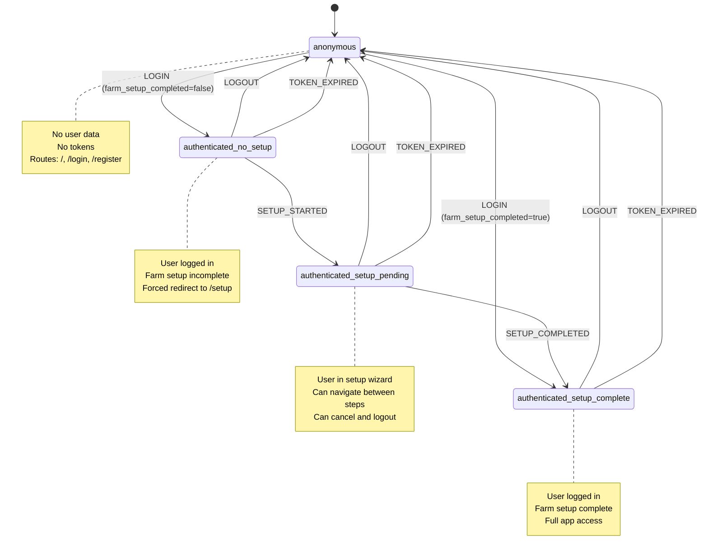
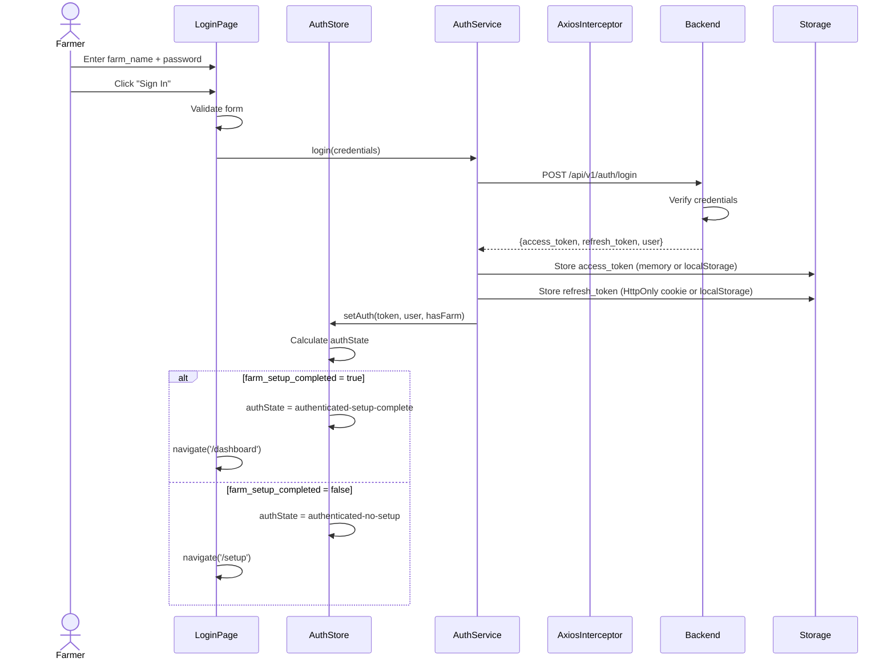
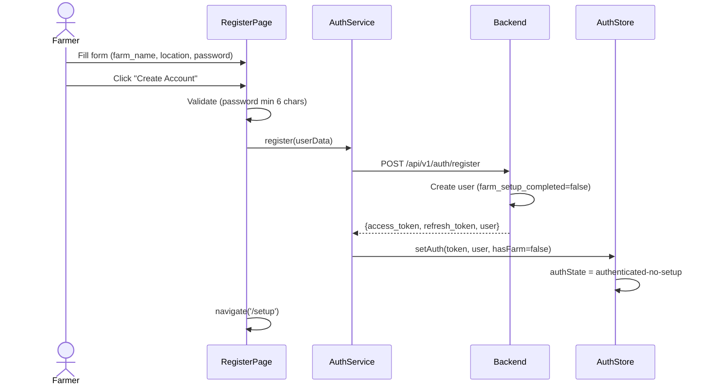
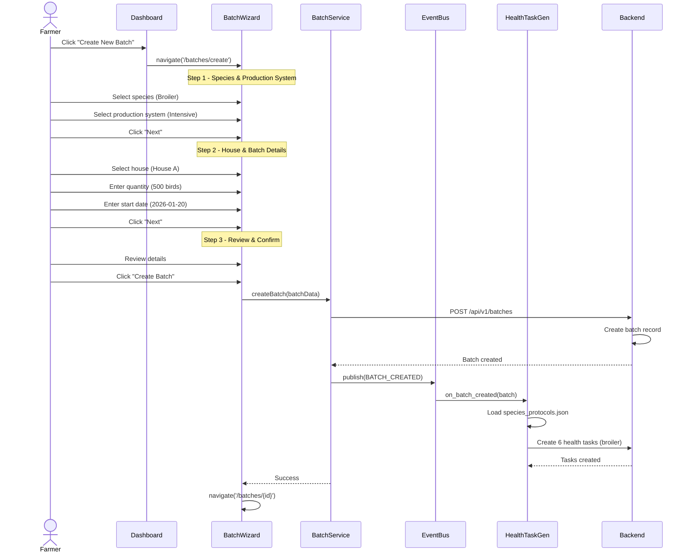
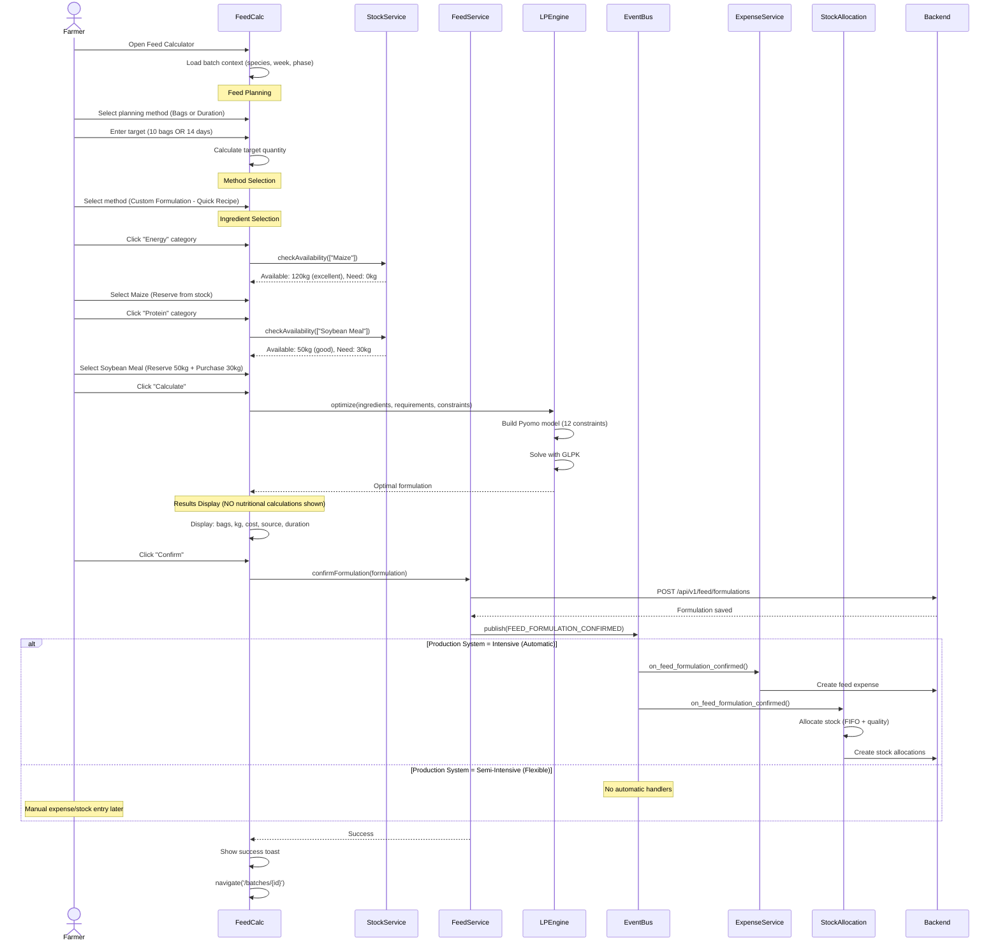
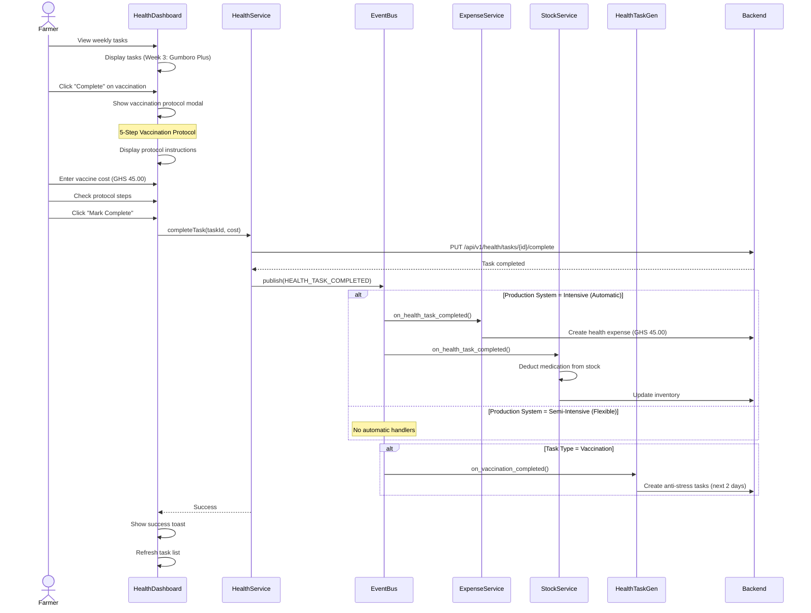
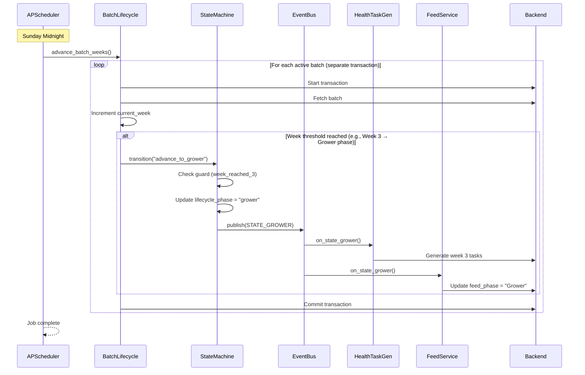
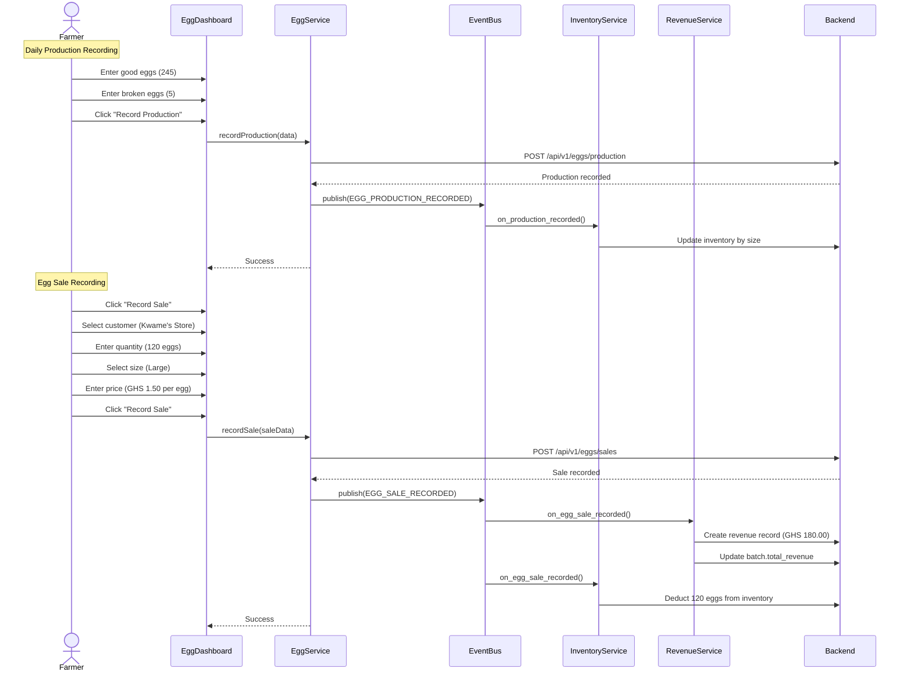
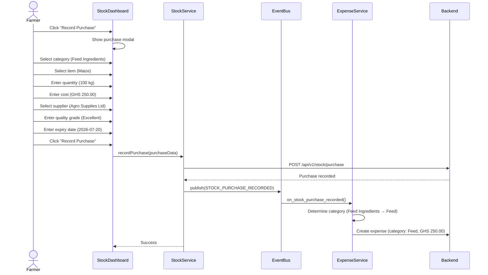
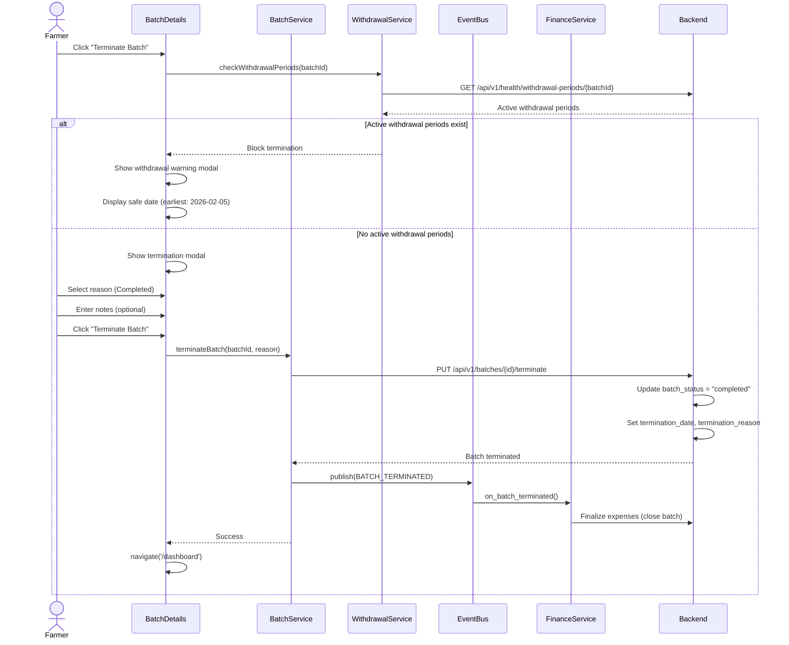

# Core Flows - All User Journeys & Integration Patterns (Complete Auth Orchestration)

# Core Flows - All User Journeys & Integration Patterns

**Document:** Complete user journeys and cross-system integration flows  
**Last Updated:** January 16, 2026  
**Status:** Production-Ready  
**Scope:** All 15 systems with complete auth orchestration and Dovetail Synergy patterns  
**References:** 
- Auth Research: file:priest/07-authentication-setup-visual-ux/
- Current Implementation: file:frontend/src/stores/auth-store.ts
- 2025/2026 Best Practices: JWT refresh, token rotation, HttpOnly cookies

---

## Table of Contents

1. [Authentication & Setup Orchestration](#authentication--setup-orchestration)
2. [Batch Creation Journey](#batch-creation-journey)
3. [Feed Formulation Journey](#feed-formulation-journey)
4. [Health Management Journey](#health-management-journey)
5. [Week Advancement Journey](#week-advancement-journey)
6. [Egg Production Journey](#egg-production-journey)
7. [Stock Purchase Journey](#stock-purchase-journey)
8. [Batch Termination Journey](#batch-termination-journey)
9. [Records & Analytics Journey](#records--analytics-journey)
10. [Event-Driven Integration Flows](#event-driven-integration-flows)

---

## Authentication & Setup Orchestration

### Auth State Machine (4 States)



**Implementation:** file:frontend/src/stores/auth-store.ts (Zustand with persist middleware)

**States:**
- `anonymous` - No user, no tokens, public routes only
- `authenticated-no-setup` - User logged in, farm_setup_completed=false, forced to /setup
- `authenticated-setup-pending` - User in setup wizard, can navigate between steps
- `authenticated-setup-complete` - User logged in, farm_setup_completed=true, full access

---

### Complete Login Flow (2025 Best Practices)



**2025/2026 Best Practices Applied:**

**Token Storage (Recommended):**
- **Access Token:** Memory storage (cleared on tab close) OR localStorage with short expiry (15 min)
- **Refresh Token:** HttpOnly cookie (XSS protection) OR localStorage with long expiry (7 days)
- **Why:** HttpOnly cookies prevent JavaScript access, protecting against XSS attacks

**Token Expiry:**
- **Access Token:** 15 minutes (short-lived to limit exposure)
- **Refresh Token:** 7 days (long-lived for seamless UX)

**Axios Interceptor (Automatic Refresh):**
```typescript
// Response interceptor catches 401 errors
api.interceptors.response.use(
  (response) => response,
  async (error) => {
    const originalRequest = error.config
    
    if (error.response?.status === 401 && !originalRequest._retry) {
      originalRequest._retry = true
      
      try {
        // Refresh token
        const { access_token } = await authService.refreshToken()
        
        // Update token in storage
        authService.setToken(access_token)
        
        // Retry original request with new token
        originalRequest.headers.Authorization = `Bearer ${access_token}`
        return api(originalRequest)
      } catch (refreshError) {
        // Refresh failed - logout
        authStore.logout()
        window.location.href = '/login'
        return Promise.reject(refreshError)
      }
    }
    
    return Promise.reject(error)
  }
)
```

**Security Features:**
- HTTPS only (enforced)
- Token rotation on refresh (new refresh_token issued)
- Clear tokens on logout
- Automatic token refresh before expiry (silent re-auth)

---

### Registration Flow with Auto-Login



**Key Points:**
- New users always have `farm_setup_completed=false`
- Auto-login after registration (no separate login step)
- Always redirect to `/setup` for new users
- Tokens stored immediately after registration

---

### Farm Setup Wizard Flow (3 Steps)

```
Step 1: Farm Details
┌─────────────────────────────────────────────────────────────┐
│ Farm Setup - Step 1 of 3: Farm Details                     │
│ ●●○○ ──────────────────────────────────────────────────── │
│                                                             │
│ Farm Name: [Kwame's Poultry Farm                        ]  │
│ Location: [Kumasi, Ashanti Region              ▼]          │
│                                                             │
│ Primary Species (Select all that apply):                   │
│ [✓] Broiler  [✓] Layer  [ ] Duck  [ ] Turkey              │
│                                                             │
│                                    [Next: Houses →]         │
└─────────────────────────────────────────────────────────────┘

Step 2: House Creation
┌─────────────────────────────────────────────────────────────┐
│ Farm Setup - Step 2 of 3: Houses                           │
│ ●●●○ ─────────────────────────────────────────────────── │
│                                                             │
│ Current Houses (2)                    [+ Add New House]     │
│                                                             │
│ ┌──────────────┐ ┌──────────────┐                         │
│ │ House A      │ │ House B      │                         │
│ │ Intensive    │ │ Extensive    │                         │
│ │ [Edit] [Del] │ │ [Edit] [Del] │                         │
│ └──────────────┘ └──────────────┘                         │
│                                                             │
│                    [← Back] [Next: Settings →]             │
└─────────────────────────────────────────────────────────────┘

Step 3: Equipment & Settings
┌─────────────────────────────────────────────────────────────┐
│ Farm Setup - Step 3 of 3: Equipment & Settings             │
│ ●●●● ──────────────────────────────────────────────────── │
│                                                             │
│ Equipment (Optional):                                       │
│ Feeders: [8] Drinkers: [6] Heaters: [2] Water Tanks: [3]  │
│                                                             │
│ Settings:                                                   │
│ Country: [Ghana ▼] Currency: [GHS ▼] Weight: [Kg ▼]       │
│ Temperature: [Celsius ▼] Volume: [Liters ▼]               │
│                                                             │
│ Setup Summary:                                              │
│ ✓ Farm: Kwame's Poultry Farm                               │
│ ✓ Species: Broiler, Layer (2 selected)                     │
│ ✓ Houses: 2 houses created                                 │
│ ✓ Equipment: 19 items configured                           │
│                                                             │
│                            [← Back] [Complete Setup]        │
└─────────────────────────────────────────────────────────────┘
```

**Setup Completion Event:**
```
User clicks "Complete Setup"
  → POST /api/v1/auth/complete-setup
  → Backend updates user.farm_setup_completed = true
  → AuthStore updates authState = authenticated-setup-complete
  → navigate('/dashboard')
  → Toast: "Farm setup completed successfully!"
```

---

### Route Guards (TanStack Router v7 Pattern)

**Public Routes (No Auth Required):**
- `/` - Welcome page
- `/login` - Login page
- `/register` - Registration page

**Setup Route (Auth Required, Setup NOT Required):**
- `/setup` - Farm setup wizard

**Protected Routes (Auth + Setup Required):**
- `/dashboard` - Main dashboard
- `/batches` - Batch list
- `/batches/create` - Batch creation wizard
- `/batches/:id` - Batch details
- `/feed` - Feed calculator
- `/health` - Water-health dashboard
- `/finance` - Finance dashboard
- `/stock` - Stock management
- `/eggs` - Egg production
- `/records` - Records & analytics
- `/settings` - Settings

**Route Guard Implementation (TanStack Router v7):**
```typescript
// _authenticated.tsx (Layout route for protected pages)
export const Route = createFileRoute('/_authenticated')({
  beforeLoad: async ({ context }) => {
    const { authState } = context.auth
    
    // Check authentication
    if (authState === 'anonymous') {
      throw redirect({ to: '/login' })
    }
    
    // Check setup completion
    if (authState === 'authenticated-no-setup' || authState === 'authenticated-setup-pending') {
      throw redirect({ to: '/setup' })
    }
    
    // Allow access
    return {}
  },
})
```

**Development Bypass:**
```typescript
// Development mode bypasses all auth checks
if (import.meta.env.DEV) {
  console.log('🚧 Development mode: bypassing auth checks')
  return {}
}
```

---

## Batch Creation Journey

### Complete 3-Step Wizard Flow



**ASCII Flow:**
```
Dashboard → Create Batch Button
  ↓
Step 1: Species & Production System Selection
  - Species: Broiler, Layer, Duck, Turkey
  - Production System: Intensive, Semi-Intensive
  - Alternative Feeding: Yes/No (ducks/turkeys only)
  ↓
Step 2: House Assignment & Batch Details
  - House: Select from available houses
  - Quantity: Number of birds
  - Start Date: Batch start date
  - Breed: Optional breed within species
  ↓
Step 3: Review & Confirm
  - Review all details
  - Confirm creation
  ↓
POST /api/v1/batches
  ↓
Event: BATCH_CREATED
  ↓
HealthTaskGenerationService.on_batch_created()
  - Load species_protocols.json
  - Generate vaccination schedule (6-12 protocols per species)
  - Create health tasks in database
  ↓
Navigate to Batch Details Page
  - Show batch overview
  - Show generated health tasks
  - Show empty feed/performance tabs
```

**Dual Feed Pattern Selection:**
- **Intensive (Automatic):** Auto-expense, auto-stock allocation
- **Semi-Intensive (Flexible):** Manual expense, manual stock allocation
- **Alternative Feeding:** Enabled for ducks (Week 6+) and turkeys (Week 8+) in semi-intensive only

---

## Feed Formulation Journey

### Complete Feed Calculator Flow (3 Methods)



**ASCII Flow:**
```
Feed Calculator Entry
  ↓
Feed Planning (FIRST STEP)
  - Planning Method: By Bags OR By Duration
  - Target: 10 bags (500kg) OR 14 days
  - Batch Context: Species, Week, Phase, Daily Intake
  - Calculate Target Quantity
  ↓
Method Selection
  - Ready-Made Feed (commercial feed purchase)
  - Custom Formulation (3 approaches: Quick Recipe, Flexible Mix, Free Mix)
  - Concentrate Mix (concentrate + grains with ratio)
  ↓
Ingredient Selection (Category-Based Popup)
  - Energy: Maize, Sorghum, Millet, etc. (12 ingredients)
  - Protein: Soybean Meal, Fish Meal, etc. (15 ingredients)
  - Calcium: Limestone, Oyster Shell, etc. (6 ingredients - SINGLE SELECTION)
  - Supplements: Salt, Lysine, Methionine, Toxin Binder, etc. (11 ingredients)
  - Stock vs New Purchase: Reserve from stock OR Purchase new
  ↓
LP Optimization (Quick Recipe Only)
  - Build Pyomo model with 12 constraints
  - Solve with GLPK (or CBC, Gurobi, CPLEX)
  - Safety preprocessing (block unsafe, auto-add compulsory)
  - Infeasibility analysis (farmer-friendly errors)
  ↓
Results Display (Backend Intelligence, Frontend Simplicity)
  - NO nutritional calculations shown to farmer
  - Display: Bags (kg), Percentage, Cost, Source (stock/new/auto)
  - Auto-added supplements section (toxin binder, lysine, methionine)
  - Duration estimate (covers X days for Y birds)
  - Cost privacy applied (●●●● for stock items)
  - "What happens when you confirm" section (dovetail preview)
  ↓
Confirm Formulation
  ↓
Event: FEED_FORMULATION_CONFIRMED
  ↓
Automatic Integration (Intensive Only)
  - UnifiedExpenseService: Auto-create feed expense
  - StorageIntegrationService: Auto-allocate stock (FIFO + quality)
  - Update batch.total_costs
  ↓
Frontend Updates
  - Expense appears in Finance dashboard
  - Stock levels update in Stock dashboard
  - Formulation appears in Batch Feed tab
```

**West African Context:**
- Aflatoxin management (toxin binder MANDATORY)
- Duck niacin enforcement (≥55mg/kg)
- Cassava processing validation (HQCP only)
- Container-based measurements (bags, gallons)

---

## Health Management Journey

### Weekly Task Completion Flow



**ASCII Flow:**
```
Water-Health Dashboard
  ↓
Weekly Task List (Grouped by Week)
  - Week 1, Day 7: Gumboro (IBD) - Pending
  - Week 2, Day 14: HB1 (Newcastle + IB) - Upcoming
  - Week 3, Day 21: Gumboro Plus - Upcoming
  ↓
Click "Complete" on Vaccination Task
  ↓
Vaccination Protocol Modal (5 Steps)
  1. Buy vaccine early morning with ice blocks
  2. Remove water 2-3 hours before
  3. Mix vaccine in half of daily water
  4. Ensure all birds drink within 1 hour
  5. Give anti-stress next 2 days
  ↓
Enter Vaccine Cost (Required)
  - Vaccine Cost (GHS): [45.00]
  ↓
Click "Mark Complete"
  ↓
Event: HEALTH_TASK_COMPLETED
  ↓
Automatic Integration (Intensive Only)
  - UnifiedExpenseService: Auto-create health expense (GHS 45.00)
  - StorageIntegrationService: Deduct medication from stock
  - Update batch.total_costs
  ↓
Auto-Schedule Anti-Stress (Vaccinations Only)
  - HealthTaskGenerationService: Create 2 anti-stress tasks (next 2 days)
  ↓
Frontend Updates
  - Task marked complete (green checkmark)
  - Expense appears in Finance dashboard
  - Stock levels update in Stock dashboard
  - Anti-stress tasks appear in task list
```

**West African Context:**
- Container-based dosing (10 container types)
- Medication conflict matrix (5 critical conflicts)
- Withdrawal period tracking (blocks batch termination)
- Traditional remedies (7 remedies for ducks/turkeys)
- Day-old chick arrival protocol (complete first-week guide)

---

## Week Advancement Journey

### Automated Weekly Progression (APScheduler 4.x)



**ASCII Flow:**
```
APScheduler Trigger (Sunday Midnight)
  ↓
advance_batch_weeks() Scheduled Job
  ↓
For Each Active Batch (Separate Transaction):
  ↓
  Start Transaction
    ↓
    Fetch batch from database
    ↓
    Increment batch.current_week
    ↓
    Check Lifecycle Phase Advancement
      - Week 1 → Brooding
      - Week 3 → Starter (broilers) OR Grower (layers)
      - Week 5 → Grower (broilers) OR continue (layers)
      - Week 7 → Finisher (broilers)
      - Week 8 → Withdrawal (broilers)
      - Week 17 → Pre-Lay (layers)
      - Week 21 → Peak Production (layers)
    ↓
    If Threshold Reached:
      ↓
      State Machine Transition
        - Guard: week_reached_X() returns True
        - Update: lifecycle_phase = "new_phase"
        - Callback: on_enter_state() emits event
      ↓
      Event: STATE_GROWER (or other phase)
        ↓
        HealthTaskGenerationService: Generate week-specific tasks
        FeedCalculatorService: Update feed_phase
    ↓
  Commit Transaction
  ↓
Next Batch (Continue Loop)
  ↓
All Batches Processed
  ↓
Job Complete
```

**Per-Batch Transaction Isolation:**
- Each batch has its own transaction
- One batch failure doesn't affect others
- Partial progress on failures (batches 1-36 succeed, batch 37 fails, continue with batch 38)

---

## Egg Production Journey

### Daily Production & Sales Flow



**ASCII Flow:**
```
Egg Production Dashboard (Layers/Ducks Only)
  ↓
Daily Production Recording
  - Good Eggs: [245]
  - Broken Eggs: [5]
  - Production Rate: 98% (auto-calculated)
  ↓
Event: EGG_PRODUCTION_RECORDED
  ↓
EggInventoryService.on_production_recorded()
  - Update inventory by size (Large/Medium/Small)
  - Calculate production rate
  - Update batch weekly summary
  ↓
Egg Sale Recording
  - Customer: [Kwame's Store ▼]
  - Quantity: [120 eggs]
  - Size: [Large ▼]
  - Price: [GHS 1.50 per egg]
  - Total: GHS 180.00 (auto-calculated)
  ↓
Event: EGG_SALE_RECORDED
  ↓
Automatic Integration
  - RevenueService: Create revenue record (GHS 180.00)
  - Update batch.total_revenue, profit, ROI
  - EggInventoryService: Deduct 120 eggs from inventory
  - Update customer purchase history
  ↓
Frontend Updates
  - Revenue appears in Finance dashboard (with cost privacy)
  - Inventory updated in Egg Production dashboard
  - Customer history updated
```

**Species-Specific:**
- **Layers:** Egg production Week 17-68, 280-320 eggs per bird
- **Ducks:** Egg production Week 20-68, 250-300 eggs per duck (layer ducks only)
- **Egg Sizes:** Large (60-65g), Medium (55-60g), Small (45-55g), Duck (70-90g)

---

## Stock Purchase Journey

### Purchase Recording with Category-Based Expense



**ASCII Flow:**
```
Stock Management Dashboard
  ↓
Click "Record Purchase"
  ↓
Purchase Modal (Category-Based)
  - Category: [Feed Ingredients ▼]
  - Item: [Maize ▼]
  - Quantity: [100 kg]
  - Cost: [GHS 250.00]
  - Supplier: [Agro Supplies Ltd ▼]
  - Quality Grade: [Excellent ▼] (Optional but Essential)
  - Expiry Date: [2026-07-20] (Optional but Essential)
  - Batch Number: [M-2026-01-001] (Optional)
  ↓
Click "Record Purchase"
  ↓
Event: STOCK_PURCHASE_RECORDED
  ↓
Category-Based Expense Creation
  - Feed Ingredients → Feed expense
  - Medications → Health expense
  - Vaccines → Health expense
  - Supplements → Feed expense
  - Equipment → Equipment expense
  ↓
Frontend Updates
  - Expense appears in Finance dashboard
  - Stock levels update in Stock dashboard
  - Supplier history updated
```

**Stock Allocation Strategy (FIFO + Quality Preference):**
1. Filter by quality (exclude poor/damaged/expired)
2. Sort by expiry date (oldest first within quality tier)
3. Prefer excellent > good > fair (within same expiry window)
4. Select from nearest storage location

**Quality Grades:**
- **Excellent:** Fresh stock, optimal quality
- **Good:** Normal stock, acceptable quality
- **Fair:** Older stock, approaching expiry (>7 days remaining)
- **Poor:** Near expiry (<7 days), use with caution
- **Damaged:** Physical damage, do not use

---

## Batch Termination Journey

### Withdrawal Period Check & Termination



**ASCII Flow:**
```
Batch Details Page
  ↓
Click "Terminate Batch" Button
  ↓
Check Withdrawal Periods
  ↓
If Active Withdrawal Periods:
  ↓
  Withdrawal Warning Modal
    - "Cannot terminate batch during withdrawal period"
    - "Medication: Oxytetracycline (7-day withdrawal)"
    - "Administered: 2026-01-29"
    - "Safe Date: 2026-02-05 (7 days remaining)"
    - [OK] button only
  ↓
  Termination Blocked
  ↓
Else No Active Withdrawal Periods:
  ↓
  Termination Modal
    - Reason: [Completed ▼] (Completed, Sold, Mortality, Other)
    - Notes: [Optional notes...]
    - [Cancel] [Terminate Batch]
  ↓
  Click "Terminate Batch"
    ↓
    Event: BATCH_TERMINATED
      ↓
      FinanceService.on_batch_terminated()
        - Finalize all expenses
        - Calculate final profit/ROI
        - Close batch financially
      ↓
    Navigate to Dashboard
      ↓
      Toast: "Batch terminated successfully"
```

**Withdrawal Period Enforcement:**
- Medications have withdrawal periods (3-14 days)
- Batch termination blocked if withdrawal active
- Safe date calculated and displayed
- Farmer must wait until safe date

---

## Records & Analytics Journey

### Batch Comparison & Historical Analysis

```
Records Dashboard (4 Tabs)
  ↓
Tab 1: Batch Overview
  - Active Batches (cards with quick stats)
  - Completed Batches (cards with final results)
  - Click batch card → View full details
  ↓
Tab 2: Performance History
  - Week-by-week progression charts
  - Feed efficiency trends
  - Health performance metrics
  - Mortality rates by batch
  ↓
Tab 3: Financial Records
  - Expense breakdown by category
  - Revenue by type
  - Profit/ROI analysis
  - Cost privacy applied (●●●●●)
  ↓
Tab 4: Batch Compare
  - Select up to 3 batches
  - Side-by-side comparison
  - Insights: Best performer, gaps, improvements
  - Recommendations: Apply best practices
  ↓
Export Reports
  - PDF: Complete batch report (with cost privacy)
  - CSV: Data export for analysis
```

**Batch Comparison Insights:**
- **Best Performer:** Batch with highest ROI
- **Gaps:** Areas where batches underperformed
- **Improvements:** Recommendations based on best practices
- **Apply Best Practices:** Copy settings from best performer

---

## Event-Driven Integration Flows

### All 13 Event Types with Complete Flows

#### 1. BATCH_CREATED Event

```
Batch Management (create batch)
  ↓
Event: BATCH_CREATED
  Payload: {
    batch_id: 10,
    species: "broiler",
    production_system: "intensive",
    quantity: 500,
    start_date: "2026-01-20"
  }
  ↓
Handlers (Transaction-Isolated):
  ↓
  HealthTaskGenerationService.on_batch_created()
    - Load species_protocols.json
    - Generate vaccination schedule (6 protocols for broilers)
    - Create health tasks in database
    - Commit transaction
  ↓
Frontend Updates:
  - Health tasks appear in Water-Health dashboard
  - Batch appears in Dashboard active batch tiles
```

#### 2. FEED_FORMULATION_CONFIRMED Event

```
Feed Calculator (confirm formulation)
  ↓
Event: FEED_FORMULATION_CONFIRMED
  Payload: {
    batch_id: 10,
    formulation_id: 25,
    total_cost: 945.00,
    ingredients: [...],
    production_system: "intensive"
  }
  ↓
Handlers (Automatic Pattern Only):
  ↓
  UnifiedExpenseService.on_feed_formulation_confirmed()
    - Create expense (category: Feed, amount: 945.00)
    - Update batch.total_costs
    - Commit transaction
  ↓
  StorageIntegrationService.on_feed_formulation_confirmed()
    - Allocate stock to batch (FIFO + quality)
    - Create stock allocations
    - Update inventory quantities
    - Commit transaction
  ↓
Frontend Updates:
  - Expense appears in Finance dashboard
  - Stock levels update in Stock dashboard
  - Formulation appears in Batch Feed tab
```

#### 3. HEALTH_TASK_COMPLETED Event

```
Water-Health (complete vaccination)
  ↓
Event: HEALTH_TASK_COMPLETED
  Payload: {
    task_id: 15,
    batch_id: 10,
    task_type: "vaccination",
    medication: "Gumboro Plus",
    cost: 45.00,
    production_system: "intensive"
  }
  ↓
Handlers (Automatic Pattern Only):
  ↓
  UnifiedExpenseService.on_health_task_completed()
    - Create expense (category: Health, amount: 45.00)
    - Update batch.total_costs
    - Commit transaction
  ↓
  StorageIntegrationService.on_health_task_completed()
    - Deduct medication from stock
    - Update inventory quantities
    - Check reorder levels
    - Commit transaction
  ↓
  HealthTaskGenerationService.on_vaccination_completed()
    - Create anti-stress tasks (next 2 days)
    - Commit transaction
  ↓
Frontend Updates:
  - Expense appears in Finance dashboard
  - Stock levels update in Stock dashboard
  - Anti-stress tasks appear in Water-Health dashboard
```

#### 4. WEEK_ADVANCED Event

```
APScheduler (Sunday midnight)
  ↓
Event: WEEK_ADVANCED
  Payload: {
    batch_id: 10,
    old_week: 2,
    new_week: 3,
    lifecycle_phase: "starter"
  }
  ↓
Handlers:
  ↓
  HealthTaskGenerationService.on_week_advanced()
    - Generate week-specific tasks (if any)
    - Commit transaction
  ↓
  FeedCalculatorService.on_week_advanced()
    - Update feed_phase if threshold reached
    - Commit transaction
  ↓
Frontend Updates:
  - Batch week updated in all views
  - New health tasks appear (if generated)
  - Feed phase updated (if changed)
```

#### 5. EGG_SALE_RECORDED Event

```
Egg Production (record sale)
  ↓
Event: EGG_SALE_RECORDED
  Payload: {
    sale_id: 8,
    batch_id: 10,
    quantity: 120,
    size: "large",
    price_per_egg: 1.50,
    total_amount: 180.00
  }
  ↓
Handlers:
  ↓
  RevenueService.on_egg_sale_recorded()
    - Create revenue record (type: Egg Sales, amount: 180.00)
    - Update batch.total_revenue
    - Update batch.profit and ROI
    - Commit transaction
  ↓
  EggInventoryService.on_egg_sale_recorded()
    - Deduct 120 eggs from inventory
    - Update customer purchase history
    - Commit transaction
  ↓
Frontend Updates:
  - Revenue appears in Finance dashboard (with cost privacy)
  - Inventory updated in Egg Production dashboard
  - Customer history updated
```

#### 6. STOCK_PURCHASE_RECORDED Event

```
Stock Management (record purchase)
  ↓
Event: STOCK_PURCHASE_RECORDED
  Payload: {
    item_id: 5,
    category: "feed_ingredients",
    quantity: 100,
    cost: 250.00
  }
  ↓
Handlers:
  ↓
  UnifiedExpenseService.on_stock_purchase_recorded()
    - Determine expense category:
      * Feed Ingredients → Feed expense
      * Medications → Health expense
      * Vaccines → Health expense
      * Supplements → Feed expense
      * Equipment → Equipment expense
    - Create expense record
    - Commit transaction
  ↓
Frontend Updates:
  - Expense appears in Finance dashboard
  - Stock levels update in Stock dashboard
```

#### 7-13. Other Events

**MORTALITY_RECORDED:** Reserved for analytics (no handlers yet)  
**BATCH_TERMINATED:** Finance finalization  
**VACCINATION_COMPLETED:** Anti-stress scheduling  
**STOCK_LOW:** Reorder alerts  
**STOCK_DEPLETED:** Block formulation/health tasks  
**WITHDRAWAL_PERIOD_ENDED:** Notification  
**EGG_PRODUCTION_RECORDED:** Inventory updates  

---

## Dual Feed Pattern Demonstration

### Automatic Pattern (Intensive) - Complete Integration

```
Broiler Batch (Intensive, 500 birds, Week 3)
  ↓
Feed Formulation
  - Method: Custom Formulation (Quick Recipe)
  - Ingredients: Maize (120kg), Soybean Meal (80kg), etc.
  - Total Cost: GHS 945.00
  ↓
Confirm Formulation
  ↓
Event: FEED_FORMULATION_CONFIRMED
  ↓
Automatic Handlers:
  ↓
  UnifiedExpenseService (Transaction 1)
    - Create expense: Feed, GHS 945.00
    - Update batch.total_costs += 945.00
    - Commit
  ↓
  StorageIntegrationService (Transaction 2)
    - Check availability: Maize (120kg available), Soybean Meal (50kg available, 30kg shortfall)
    - Allocate stock (FIFO + quality):
      * Maize: Reserve 120kg from stock (Batch #M-001, Excellent, Expiry: 2026-07-20)
      * Soybean Meal: Reserve 50kg from stock (Batch #S-002, Good, Expiry: 2026-06-15)
    - Create stock allocations
    - Update inventory quantities
    - Commit
  ↓
Farmer Sees:
  - Expense in Finance dashboard (GHS 945.00)
  - Stock levels updated (Maize: 120kg → 0kg, Soybean Meal: 50kg → 0kg)
  - Shopping list: "Purchase 30kg Soybean Meal"
  - Formulation in Batch Feed tab
```

### Flexible Pattern (Semi-Intensive) - Manual Integration

```
Duck Batch (Semi-Intensive, 100 birds, Week 6, Alternative Feeding Enabled)
  ↓
Feed Formulation
  - Method: Custom Formulation (Quick Recipe)
  - Ingredients: Maize (40kg), Soybean Meal (30kg), etc.
  - Foraging Reduction: 20% (Week 6+)
  - Total Cost: GHS 280.00
  ↓
Confirm Formulation
  ↓
Event: FEED_FORMULATION_CONFIRMED
  ↓
No Automatic Handlers (Flexible Pattern)
  ↓
Farmer Manually:
  ↓
  1. Record Expense (Finance Dashboard)
     - Category: Feed
     - Amount: GHS 280.00
     - Description: "Week 6 feed formulation"
  ↓
  2. Allocate Stock (Stock Dashboard)
     - Select batch: Duck Batch #5
     - Allocate: Maize 40kg, Soybean Meal 30kg
     - Confirm allocation
  ↓
Farmer Sees:
  - Expense in Finance dashboard (manually entered)
  - Stock levels updated (manually allocated)
  - Formulation in Batch Feed tab
```

**Pattern Comparison:**

| Aspect | Automatic (Intensive) | Flexible (Semi-Intensive) |
|--------|----------------------|---------------------------|
| **Expense Creation** | Automatic (event-driven) | Manual entry |
| **Stock Allocation** | Automatic (FIFO + quality) | Manual allocation |
| **Integration** | Full dovetail synergy | Manual coordination |
| **Farmer Burden** | Low (system handles it) | Higher (manual steps) |
| **Use Case** | Intensive broilers/layers | Semi-intensive ducks/turkeys with alternative feeding |

---

## Cost Privacy Throughout User Journeys

### Privacy Application Across All Systems

**Dashboard:**
- Weekly Expenses: ●●●●● (masked)
- Monthly Revenue: ●●●●● (masked)
- Active Batches: 3 (visible)
- Tasks Today: 5 (visible)
- Eye icon: Temporary reveal (30 seconds)

**Finance Dashboard:**
- All expenses: ●●●●● (masked)
- All revenue: ●●●●● (masked)
- Profit/ROI: ●●●●● (masked)
- Batch count: 3 (visible)
- Population: 1,500 birds (visible)

**Feed Calculator:**
- Stock item costs: ●●●●● (masked)
- New purchase costs: GHS 250.00 (visible - farmer needs to know purchase price)
- Total formulation cost: ●●●●● (masked)

**Stock Management:**
- Stock item costs: ●●●●● (masked)
- Purchase costs: GHS 250.00 (visible during purchase entry)

**Egg Production:**
- Revenue amounts: ●●●●● (masked)
- Production counts: 245 eggs (visible)
- Inventory: 1,200 eggs (visible)

**Records:**
- Financial tab: All data ●●●●● (masked)
- Performance tab: All data visible

**Settings:**
- Cost Privacy Toggle: ON/OFF
- Eye Icon Reveal: 30 seconds temporary reveal
- Export: Respects privacy (masks in PDF/CSV)

---

## West African Context in User Flows

### Container-Based Medication Dosing

```
Water-Health Dashboard → Complete Medication Task
  ↓
Medication Dosing Calculator
  - Medication: [Oxytetracycline ▼]
  - Population: 500 birds (auto-loaded from batch)
  - Container Type: [Bell Drinkers ▼]
    * Bell Drinkers (1.5L each)
    * Local Drinkers (2L each)
    * Jerry Cans (20L each)
    * Drums (200L each)
    * Buckets (10L each)
    * Gallons (3.785L each)
    * Custom (enter capacity)
  - Number of Containers: [10]
  - Total Water: 15L (auto-calculated)
  ↓
Dosage Calculation (Backend Intelligence)
  - Water consumption: 50ml/bird/day (Week 3 broiler)
  - Total daily water: 25L (500 birds × 50ml)
  - Medication dosage: 1g per liter
  - Total medication: 25g
  - Per container: 2.5g (25g ÷ 10 containers)
  ↓
Display Results (Farmer-Friendly)
  - "Add 2.5g Oxytetracycline to each bell drinker"
  - "Total: 25g for 500 birds"
  - "Duration: 3 days"
  - "Withdrawal: 7 days (Safe date: 2026-02-05)"
```

### Aflatoxin Management in Feed Formulation

```
Feed Calculator → Custom Formulation
  ↓
Ingredient Selection
  - Maize: 120kg (HIGH aflatoxin risk)
  - Groundnut Cake: 40kg (VERY HIGH aflatoxin risk)
  ↓
Safety Preprocessing (Automatic)
  ↓
  Aflatoxin Risk Detected
    ↓
    Auto-Add Toxin Binder
      - Mycotoxin Binder: 0.5kg (MANDATORY in West Africa)
      - Cost: GHS 15.00
      - Inclusion: 0.5% of total feed
    ↓
  Display Warning
    - "⚠️ High aflatoxin risk ingredients detected"
    - "✓ Toxin binder automatically added (0.5kg)"
    - "This is MANDATORY in West Africa for bird safety"
  ↓
Continue with Formulation
  - Toxin binder included in all calculations
  - Cost includes toxin binder
  - Cannot remove toxin binder (safety rule)
```

### Duck Niacin Enforcement

```
Feed Calculator → Custom Formulation (Duck Batch)
  ↓
LP Optimization
  ↓
Niacin Constraint Check
  - Required: ≥55mg/kg (MANDATORY for ducks)
  - Current: 42mg/kg (from ingredients)
  ↓
Niacin Deficiency Detected
  ↓
Auto-Add Niacin Supplement
    - Niacin (Vitamin B3): 0.013kg
    - Provides: 13mg/kg additional niacin
    - Total niacin: 55mg/kg (meets requirement)
    - Cost: GHS 2.50
  ↓
Display Info
  - "✓ Niacin supplement automatically added"
  - "Ducks require ≥55mg/kg niacin (leg weakness prevention)"
  - "Total niacin: 55mg/kg (SAFE)"
  ↓
Continue with Formulation
  - Niacin included in all calculations
  - Cannot remove niacin (safety rule for ducks)
```

---

## Integration Pattern Summary

### Dovetail Synergy in Action

**Pattern 1: Feed → Expense → Stock**
```
Feed Formulation → FEED_FORMULATION_CONFIRMED
  → UnifiedExpenseService (auto-expense)
  → StorageIntegrationService (auto-stock)
  → Frontend updates (expense + stock)
```

**Pattern 2: Health → Expense → Stock → Follow-up**
```
Health Task → HEALTH_TASK_COMPLETED
  → UnifiedExpenseService (auto-expense)
  → StorageIntegrationService (auto-stock)
  → HealthTaskGenerationService (anti-stress)
  → Frontend updates (expense + stock + tasks)
```

**Pattern 3: Batch → All Systems**
```
Batch Creation → BATCH_CREATED
  → HealthTaskGenerationService (vaccination schedule)
  → ConfigService (species configuration)
  → Frontend updates (tasks + batch)
```

**Pattern 4: Stock → Expense**
```
Stock Purchase → STOCK_PURCHASE_RECORDED
  → UnifiedExpenseService (category-based expense)
  → Frontend updates (expense + stock)
```

**Pattern 5: Egg → Revenue → Inventory**
```
Egg Sale → EGG_SALE_RECORDED
  → RevenueService (auto-revenue)
  → EggInventoryService (inventory deduction)
  → Frontend updates (revenue + inventory)
```

---

## Acceptance Criteria

### Authentication & Setup

- [ ] User can register with farm_name, location, password
- [ ] User can login with farm_name + password
- [ ] JWT tokens stored securely (HttpOnly cookies or localStorage)
- [ ] Automatic token refresh on 401 (Axios interceptor)
- [ ] Auth state machine works (4 states)
- [ ] Route guards enforce auth + setup requirements
- [ ] Setup wizard completes in 3 steps
- [ ] Setup completion updates farm_setup_completed = true
- [ ] Development mode bypasses auth checks

### Batch Creation

- [ ] 3-step wizard (species/production, house/details, review)
- [ ] BATCH_CREATED event emitted
- [ ] Health tasks auto-generated (6-12 protocols per species)
- [ ] Dual feed pattern configured per batch
- [ ] Alternative feeding enabled for ducks/turkeys (semi-intensive only)

### Feed Formulation

- [ ] Feed planning (bags or duration) comes FIRST
- [ ] Ingredient selection via category-based popup
- [ ] Stock availability checking (real-time)
- [ ] LP optimization with 12 constraints
- [ ] Results show practical info only (NO nutritional calculations)
- [ ] FEED_FORMULATION_CONFIRMED event emitted
- [ ] Automatic expense creation (Intensive only)
- [ ] Automatic stock allocation (Intensive only, FIFO + quality)

### Health Management

- [ ] Weekly task dashboard with color-coded urgency
- [ ] Vaccination protocol instructions (5 steps)
- [ ] Price entry required for vaccinations
- [ ] HEALTH_TASK_COMPLETED event emitted
- [ ] Automatic expense creation (Intensive only)
- [ ] Automatic stock deduction (Intensive only)
- [ ] Anti-stress auto-scheduling (vaccinations only)
- [ ] Withdrawal period tracking blocks termination

### Week Advancement

- [ ] APScheduler triggers Sunday midnight
- [ ] Per-batch transaction isolation
- [ ] State machine transitions on week thresholds
- [ ] WEEK_ADVANCED event emitted
- [ ] Week-specific tasks generated
- [ ] Feed phase updated

### Egg Production

- [ ] Daily production recording (layers/ducks only)
- [ ] EGG_PRODUCTION_RECORDED event updates inventory
- [ ] Egg sale recording with customer management
- [ ] EGG_SALE_RECORDED event creates revenue + deducts inventory
- [ ] Cost privacy applied to revenue

### Stock Management

- [ ] Purchase recording with category-based expense
- [ ] Quality grade and expiry date tracking
- [ ] FIFO + quality preference allocation
- [ ] Ingredient availability checking for Feed Calculator
- [ ] Reservation management (prevent double-allocation)
- [ ] Low stock alerts with reorder suggestions

### Batch Termination

- [ ] Withdrawal period check blocks termination
- [ ] Termination modal with reason selection
- [ ] BATCH_TERMINATED event finalizes expenses
- [ ] Navigate to dashboard after termination

### Records & Analytics

- [ ] 4-tab interface (Overview, Performance, Financial, Compare)
- [ ] Batch comparison (up to 3 batches)
- [ ] Insights and recommendations
- [ ] Export (PDF, CSV with cost privacy)

### Cost Privacy

- [ ] Financial data masked with ●●●●● when enabled
- [ ] Eye icon temporary reveal (30 seconds)
- [ ] Export respects privacy settings
- [ ] Applied to 6 systems (Dashboard, Finance, Feed, Stock, Egg, Records)

### West African Context

- [ ] Container-based dosing (10 container types)
- [ ] Aflatoxin management (toxin binder MANDATORY)
- [ ] Duck niacin enforcement (≥55mg/kg)
- [ ] Cassava processing validation (HQCP only)
- [ ] Traditional remedies (7 remedies for ducks/turkeys)
- [ ] Blackhead prevention (turkeys)
- [ ] Local brands and pricing (GHS/NGN)

---

## Related Specifications

- **Backend Architecture:** spec:bceeaefd-5139-4801-8c12-de8a8b6faf8a/35142770-c1b0-4df2-85e2-5a839616334a
- **Frontend Architecture:** spec:bceeaefd-5139-4801-8c12-de8a8b6faf8a/9e3bb05f-9ca8-4cc6-9f97-a5d0eb53ae92
- **Batch Management:** spec:bceeaefd-5139-4801-8c12-de8a8b6faf8a/c18bcbcb-e4da-43cc-b5cd-5e27c2e4ed1f
- **Feed Calculator:** spec:bceeaefd-5139-4801-8c12-de8a8b6faf8a/fb99cad1-d468-4a18-bd81-d987f1ae6f63
- **Water-Health:** spec:bceeaefd-5139-4801-8c12-de8a8b6faf8a/2a098707-5645-4c66-ba4b-27e04df312ca
- **Finance:** spec:bceeaefd-5139-4801-8c12-de8a8b6faf8a/9024827f-8dea-465d-800c-cdf5749dc498
- **Stock Management:** spec:bceeaefd-5139-4801-8c12-de8a8b6faf8a/e5714a4e-bc2c-494e-9725-b8797c41b5d2
- **Species-Specific:** spec:bceeaefd-5139-4801-8c12-de8a8b6faf8a/dfa10566-d896-41f4-805f-953f7b47d5f3
- **Egg Production:** spec:bceeaefd-5139-4801-8c12-de8a8b6faf8a/1e41ba59-5044-4636-a0dd-57ec571b7901
- **Records:** spec:bceeaefd-5139-4801-8c12-de8a8b6faf8a/d91a5a67-17b1-4b07-a2dc-4affaca2b7f0
- **Settings:** spec:bceeaefd-5139-4801-8c12-de8a8b6faf8a/e432a732-63cf-41ff-b091-d890b4bf8820
- **Alternative Feeding:** spec:bceeaefd-5139-4801-8c12-de8a8b6faf8a/f81d53af-2866-4a23-a455-293cb5b0b141
- **LP Engine:** spec:bceeaefd-5139-4801-8c12-de8a8b6faf8a/0e508c4e-aa39-4570-a115-87953e6952e1

---

**Status:** Production-Ready  
**Last Updated:** January 16, 2026  
**Purpose:** Complete user journey and integration flow documentation for all 15 systems with modern auth orchestration