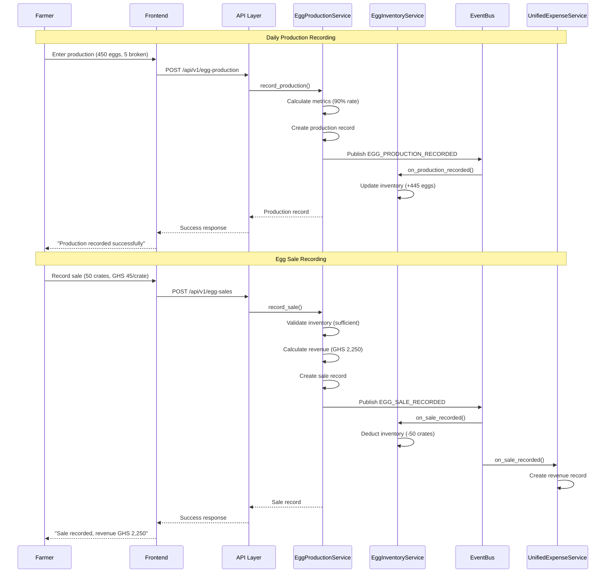

# Egg Production System - Production-Grade Specification (Layers & Ducks)

# Egg Production System - Production-Grade Specification (Layers & Ducks)

**Epic:** epic:bceeaefd-5139-4801-8c12-de8a8b6faf8a  
**Status:** Production-Ready Specification  
**Last Updated:** January 2026  
**Architecture:** Follows spec:bceeaefd-5139-4801-8c12-de8a8b6faf8a/35142770-c1b0-4df2-85e2-5a839616334a (Backend Architecture) and spec:bceeaefd-5139-4801-8c12-de8a8b6faf8a/9e3bb05f-9ca8-4cc6-9f97-a5d0eb53ae92 (Frontend Architecture)

---

## Overview

The Egg Production System provides comprehensive egg tracking, inventory management, and sales recording for Layer and Duck batches. It enables farmers to track daily production, manage egg inventory by size/quality, record sales with customer management, and automatically integrate with the Finance System for revenue tracking.

### Core Philosophy

**Backend Intelligence, Frontend Simplicity:**
- Backend handles all calculations (inventory updates, revenue calculations, production analytics, production rate calculations)
- Frontend collects data and displays clear outputs
- Automatic revenue creation on egg sales (Finance System integration)
- Real-time inventory tracking with automatic updates
- No complex calculations shown to farmer

**Farmer-Centric Design:**
- Simple daily production entry (total eggs, broken eggs)
- Flexible sales recording (crates or individual eggs)
- Customer management for repeat buyers
- Pricing management by size and quality
- Production trends and analytics

**Configuration-Driven Behavior:**
- Species-specific production patterns (layers vs ducks)
- Egg size classification rules (from species.json)
- Production rate calculations (from species protocols)
- Pricing defaults (from market prices configuration)

### Scope

**Species Coverage:**
- **Layers:** Complete egg production lifecycle (Week 17-68, 51 weeks of production)
- **Ducks:** Egg production for layer ducks (Week 20-68, 48 weeks of production)

**Key Features:**
1. Daily production entry with automatic inventory updates
2. Egg inventory management by size and quality (Large, Medium, Small, Duck)
3. Sales tracking with customer management and payment status
4. Pricing management by size/quality
5. Production analytics and trends (daily, weekly, monthly)
6. Automatic revenue integration with Finance System
7. Production rate calculations (eggs per bird per day)
8. Weekly production summaries
9. Low inventory alerts
10. Cost privacy integration (revenue hidden by default)

**Out of Scope:**
- Egg grading automation (manual grading by farmer)
- Hatchery management (fertilized eggs for breeding)
- Export/wholesale management (future enhancement)

---

## Section 1: Species-Specific Egg Production Protocols

### Layer Egg Production (68-week lifecycle)

**Production Schedule (from spec:bceeaefd-5139-4801-8c12-de8a8b6faf8a/dfa10566-d896-41f4-805f-953f7b47d5f3):**

| Phase | Weeks | Production Rate | Egg Weight | Calcium Requirement |
|-------|-------|----------------|------------|---------------------|
| **Pre-Lay** | 17-20 | 10-50% (ramp-up) | 45-50g | 2.5% (pre-lay boost) |
| **Peak Production** | 21-25 | 80-95% (peak) | 55-60g | 3.5-4.0% (laying) |
| **Sustained Peak** | 26-45 | 85-90% (sustained) | 60-65g | 3.5-4.0% (laying) |
| **Decline** | 46-60 | 75-85% (decline) | 60-65g | 3.5-4.0% (laying) |
| **Late Lay** | 61-68 | 60-75% (late lay) | 65-70g | 3.5-4.0% (laying) |

**Expected Production:**
- Total eggs per bird: 280-320 eggs over 51 weeks
- Peak production: 90-95% (450-475 eggs per day for 500 birds)
- Average production: 80-85% over full cycle

**Egg Size Classification:**
- **Large:** 60-70g (premium price)
- **Medium:** 50-60g (standard price)
- **Small:** 40-50g (reduced price)
- **Pullet:** <40g (first eggs, Week 17-19, not for sale)

---

### Duck Egg Production (10-week meat cycle OR 68-week layer cycle)

**Production Schedule:**

**Meat Ducks (10-week cycle):**
- No egg production (slaughtered before sexual maturity)

**Layer Ducks (68-week cycle):**

| Phase | Weeks | Production Rate | Egg Weight | Notes |
|-------|-------|----------------|------------|-------|
| **Pre-Lay** | 20-24 | 10-40% (ramp-up) | 65-75g | Later maturity than chickens |
| **Peak Production** | 25-35 | 85-95% (peak) | 75-85g | Higher than chickens |
| **Sustained Peak** | 36-55 | 80-90% (sustained) | 80-90g | Larger eggs |
| **Decline** | 56-68 | 70-80% (decline) | 85-95g | Very large eggs |

**Expected Production:**
- Total eggs per duck: 250-300 eggs over 48 weeks
- Peak production: 85-95% (425-475 eggs per day for 500 ducks)
- Average production: 80-85% over full cycle

**Egg Size Classification:**
- **Large:** 80-95g (premium price, larger than chicken eggs)
- **Medium:** 70-80g (standard price)
- **Small:** 60-70g (reduced price)

**Duck-Specific Notes:**
- Duck eggs are 30-40% larger than chicken eggs
- Higher market price (GHS 1.50-2.00 per egg vs GHS 0.80-1.20 for chicken)
- Preferred for baking (higher fat content)
- Longer shelf life (6 weeks vs 4 weeks for chicken)

---

## Section 2: Egg Production Dashboard

### Purpose
Single-page interface for daily production entry, inventory viewing, production trends, and quick sales recording.

### ASCII Flow Diagram
```
┌─────────────────────────────────────────────────────────────────────────┐
│                     EGG PRODUCTION DASHBOARD                            │
├─────────────────────────────────────────────────────────────────────────┤
│                                                                         │
│  ┌───────────────────────────────────────────────────────────────────┐  │
│  │  SUMMARY CARDS (4 cards)                                          │  │
│  │  ┌──────────┐ ┌──────────┐ ┌──────────┐ ┌──────────┐            │  │
│  │  │  Today   │ │This Week │ │Inventory │ │ Revenue  │            │  │
│  │  │ 450 eggs │ │3,150 eggs│ │ 25 crates│ │ ●●●●●    │            │  │
│  │  │   90%    │ │   89%    │ │ 750 eggs │ │ (hidden) │            │  │
│  │  └──────────┘ └──────────┘ └──────────┘ └──────────┘            │  │
│  └───────────────────────────────────────────────────────────────────┘  │
│                                                                         │
│  ┌───────────────────────────────────────────────────────────────────┐  │
│  │  RECORD PRODUCTION (Quick Entry Form)                             │  │
│  │  Batch: [Layer Batch #2 ▼]  Date: [Jan 13, 2026]                 │  │
│  │  Total Eggs: [___]  Broken: [___]  [Record Production]            │  │
│  └───────────────────────────────────────────────────────────────────┘  │
│                                                                         │
│  ┌───────────────────────────────────────────────────────────────────┐  │
│  │  PRODUCTION TREND CHART (Last 30 days)                            │  │
│  │  Line chart showing daily production with trend line              │  │
│  └───────────────────────────────────────────────────────────────────┘  │
│                                                                         │
│  ┌───────────────────────────────────────────────────────────────────┐  │
│  │  RECENT PRODUCTION (Last 7 days)                                  │  │
│  │  Date | Batch | Total | Broken | Rate | Actions                  │  │
│  │  ---------------------------------------------------------------- │  │
│  │  Jan 13 | Layer #2 | 450 | 5 | 90% | [View] [Edit]              │  │
│  │  Jan 12 | Layer #2 | 445 | 8 | 89% | [View] [Edit]              │  │
│  └───────────────────────────────────────────────────────────────────┘  │
│                                                                         │
│  ┌───────────────────────────────────────────────────────────────────┐  │
│  │  EGG INVENTORY (By Size/Quality)                                  │  │
│  │  Large: 15 crates (450 eggs) | Medium: 8 crates (240 eggs)       │  │
│  │  Small: 2 crates (60 eggs) | Duck: 5 crates (150 eggs)           │  │
│  │  [Record Sale] button                                             │  │
│  └───────────────────────────────────────────────────────────────────┘  │
│                                                                         │
└─────────────────────────────────────────────────────────────────────────┘
```

### Wireframe: Egg Production Dashboard (Desktop)

```wireframe
<!DOCTYPE html>
<html lang="en">
<head>
<meta charset="UTF-8">
<meta name="viewport" content="width=device-width, initial-scale=1.0">
<title>Egg Production Dashboard</title>
<style>
  * { margin: 0; padding: 0; box-sizing: border-box; }
  body { font-family: 'Manrope', -apple-system, BlinkMacSystemFont, 'Segoe UI', sans-serif; background: #f8f9fa; padding: 20px; }
  .container { max-width: 1400px; margin: 0 auto; }
  .header { margin-bottom: 24px; }
  .header h1 { font-size: 28px; font-weight: 600; color: #1a1a1a; margin-bottom: 8px; }
  .header p { font-size: 14px; color: #666; }
  
  /* Summary Cards */
  .summary-cards { display: grid; grid-template-columns: repeat(4, 1fr); gap: 16px; margin-bottom: 24px; }
  .summary-card { background: white; border: 1px solid #e5e7eb; border-radius: 12px; padding: 20px; }
  .summary-card-title { font-size: 13px; color: #666; font-weight: 500; margin-bottom: 12px; text-transform: uppercase; letter-spacing: 0.5px; }
  .summary-card-value { font-size: 32px; font-weight: 600; color: #1a1a1a; margin-bottom: 8px; }
  .summary-card-subtitle { font-size: 14px; color: #10b981; }
  .summary-card-subtitle.neutral { color: #666; }
  
  /* Production Entry Form */
  .production-form { background: white; border: 1px solid #e5e7eb; border-radius: 12px; padding: 24px; margin-bottom: 24px; }
  .production-form h3 { font-size: 18px; font-weight: 600; margin-bottom: 16px; color: #1a1a1a; }
  .form-grid { display: grid; grid-template-columns: 2fr 1.5fr 1fr 1fr auto; gap: 12px; align-items: end; }
  .field { display: flex; flex-direction: column; }
  .field-label { font-size: 13px; font-weight: 500; color: #374151; margin-bottom: 6px; }
  .field-input { padding: 10px 12px; border: 1px solid #d1d5db; border-radius: 8px; font-size: 14px; }
  .field-select { padding: 10px 12px; border: 1px solid #d1d5db; border-radius: 8px; font-size: 14px; background: white; cursor: pointer; }
  .btn-primary { background: #16a34a; color: white; border: none; padding: 12px 24px; border-radius: 8px; font-size: 14px; font-weight: 500; cursor: pointer; }
  .btn-primary:hover { background: #15803d; }
  
  /* Production Trend Chart */
  .chart-section { background: white; border: 1px solid #e5e7eb; border-radius: 12px; padding: 24px; margin-bottom: 24px; }
  .chart-section h3 { font-size: 18px; font-weight: 600; margin-bottom: 16px; color: #1a1a1a; }
  .chart-placeholder { height: 250px; background: #f9fafb; border: 1px dashed #d1d5db; border-radius: 8px; display: flex; align-items: center; justify-content: center; color: #9ca3af; font-size: 14px; }
  
  /* Recent Production Table */
  .recent-production { background: white; border: 1px solid #e5e7eb; border-radius: 12px; padding: 24px; margin-bottom: 24px; }
  .recent-production h3 { font-size: 18px; font-weight: 600; margin-bottom: 16px; color: #1a1a1a; }
  .production-table { width: 100%; border-collapse: collapse; }
  .production-table th { text-align: left; font-size: 13px; font-weight: 600; color: #666; padding: 12px; border-bottom: 2px solid #e5e7eb; text-transform: uppercase; letter-spacing: 0.5px; }
  .production-table td { padding: 12px; border-bottom: 1px solid #f3f4f6; font-size: 14px; color: #374151; }
  .production-table tr:hover { background: #f9fafb; }
  .btn-small { background: none; border: 1px solid #d1d5db; padding: 6px 12px; border-radius: 6px; font-size: 13px; cursor: pointer; color: #374151; margin-right: 8px; }
  .btn-small:hover { background: #f3f4f6; }
  .rate-badge { display: inline-block; padding: 4px 8px; border-radius: 4px; font-size: 12px; font-weight: 500; }
  .rate-excellent { background: #d1fae5; color: #065f46; }
  .rate-good { background: #fef3c7; color: #92400e; }
  .rate-poor { background: #fee2e2; color: #991b1b; }
  
  /* Inventory Section */
  .inventory-section { background: white; border: 1px solid #e5e7eb; border-radius: 12px; padding: 24px; }
  .inventory-section h3 { font-size: 18px; font-weight: 600; margin-bottom: 16px; color: #1a1a1a; }
  .inventory-grid { display: grid; grid-template-columns: repeat(4, 1fr); gap: 16px; margin-bottom: 20px; }
  .inventory-card { background: linear-gradient(135deg, #f0fdf4 0%, #dcfce7 100%); border: 1px solid #bbf7d0; border-radius: 8px; padding: 20px; text-align: center; }
  .inventory-size { font-size: 13px; color: #166534; font-weight: 500; margin-bottom: 8px; text-transform: uppercase; letter-spacing: 0.5px; }
  .inventory-quantity { font-size: 28px; font-weight: 600; color: #15803d; margin-bottom: 4px; }
  .inventory-eggs { font-size: 13px; color: #166534; }
  
  @media (max-width: 1024px) {
    .summary-cards { grid-template-columns: repeat(2, 1fr); }
    .inventory-grid { grid-template-columns: repeat(2, 1fr); }
  }
  
  @media (max-width: 768px) {
    .form-grid { grid-template-columns: 1fr; }
    .summary-cards { grid-template-columns: 1fr; }
    .inventory-grid { grid-template-columns: 1fr; }
  }
</style>
</head>
<body>
<div class="container">
  <div class="header">
    <h1>🥚 Egg Production</h1>
    <p>Layer Batch #2 • Week 20 of 68 • 500 birds • Peak Production Phase</p>
  </div>
  
  <!-- Summary Cards -->
  <div class="summary-cards">
    <div class="summary-card">
      <div class="summary-card-title">Today's Production</div>
      <div class="summary-card-value">450 eggs</div>
      <div class="summary-card-subtitle">90% production rate</div>
    </div>
    
    <div class="summary-card">
      <div class="summary-card-title">This Week</div>
      <div class="summary-card-value">3,150 eggs</div>
      <div class="summary-card-subtitle">+5% from last week</div>
    </div>
    
    <div class="summary-card">
      <div class="summary-card-title">Current Inventory</div>
      <div class="summary-card-value">25 crates</div>
      <div class="summary-card-subtitle neutral">750 eggs</div>
    </div>
    
    <div class="summary-card">
      <div class="summary-card-title">This Week Revenue</div>
      <div class="summary-card-value">●●●●●</div>
      <div class="summary-card-subtitle neutral">From 70 crates sold</div>
    </div>
  </div>
  
  <!-- Production Entry Form -->
  <div class="production-form">
    <h3>Record Production</h3>
    <div class="form-grid">
      <div class="field">
        <label class="field-label">Batch *</label>
        <select class="field-select" data-element-id="batch-select">
          <option value="">Select batch...</option>
          <option value="batch1" selected>Layer Batch #2 (Week 20 of 68)</option>
          <option value="batch2">Duck Batch #1 (Week 25 of 68)</option>
        </select>
      </div>
      
      <div class="field">
        <label class="field-label">Date *</label>
        <input type="date" class="field-input" data-element-id="production-date" value="2026-01-13">
      </div>
      
      <div class="field">
        <label class="field-label">Total Eggs *</label>
        <input type="number" class="field-input" data-element-id="total-eggs" placeholder="e.g., 450">
      </div>
      
      <div class="field">
        <label class="field-label">Broken</label>
        <input type="number" class="field-input" data-element-id="broken-eggs" placeholder="e.g., 5" value="0">
      </div>
      
      <button class="btn-primary" data-element-id="btn-record-production">Record Production</button>
    </div>
  </div>
  
  <!-- Production Trend Chart -->
  <div class="chart-section">
    <h3>Production Trend (Last 30 Days)</h3>
    <div class="chart-placeholder">Line chart: Daily production with trend line (Recharts)</div>
  </div>
  
  <!-- Recent Production -->
  <div class="recent-production">
    <h3>Recent Production (Last 7 Days)</h3>
    <table class="production-table">
      <thead>
        <tr>
          <th>Date</th>
          <th>Batch</th>
          <th>Total Eggs</th>
          <th>Broken</th>
          <th>Production Rate</th>
          <th>Actions</th>
        </tr>
      </thead>
      <tbody>
        <tr>
          <td>Jan 13, 2026</td>
          <td>Layer Batch #2</td>
          <td>450</td>
          <td>5 (1.1%)</td>
          <td><span class="rate-badge rate-excellent">90%</span></td>
          <td>
            <button class="btn-small" data-element-id="view-production-1">View</button>
            <button class="btn-small" data-element-id="edit-production-1">Edit</button>
          </td>
        </tr>
        <tr>
          <td>Jan 12, 2026</td>
          <td>Layer Batch #2</td>
          <td>445</td>
          <td>8 (1.8%)</td>
          <td><span class="rate-badge rate-excellent">89%</span></td>
          <td>
            <button class="btn-small" data-element-id="view-production-2">View</button>
            <button class="btn-small" data-element-id="edit-production-2">Edit</button>
          </td>
        </tr>
        <tr>
          <td>Jan 11, 2026</td>
          <td>Layer Batch #2</td>
          <td>448</td>
          <td>6 (1.3%)</td>
          <td><span class="rate-badge rate-excellent">90%</span></td>
          <td>
            <button class="btn-small" data-element-id="view-production-3">View</button>
            <button class="btn-small" data-element-id="edit-production-3">Edit</button>
          </td>
        </tr>
        <tr>
          <td>Jan 10, 2026</td>
          <td>Layer Batch #2</td>
          <td>442</td>
          <td>10 (2.2%)</td>
          <td><span class="rate-badge rate-good">88%</span></td>
          <td>
            <button class="btn-small" data-element-id="view-production-4">View</button>
            <button class="btn-small" data-element-id="edit-production-4">Edit</button>
          </td>
        </tr>
      </tbody>
    </table>
  </div>
  
  <!-- Inventory Section -->
  <div class="inventory-section">
    <h3>Egg Inventory</h3>
    <div class="inventory-grid">
      <div class="inventory-card">
        <div class="inventory-size">Large Eggs</div>
        <div class="inventory-quantity">15 crates</div>
        <div class="inventory-eggs">450 eggs (60-70g)</div>
      </div>
      
      <div class="inventory-card">
        <div class="inventory-size">Medium Eggs</div>
        <div class="inventory-quantity">8 crates</div>
        <div class="inventory-eggs">240 eggs (50-60g)</div>
      </div>
      
      <div class="inventory-card">
        <div class="inventory-size">Small Eggs</div>
        <div class="inventory-quantity">2 crates</div>
        <div class="inventory-eggs">60 eggs (40-50g)</div>
      </div>
      
      <div class="inventory-card">
        <div class="inventory-size">Duck Eggs</div>
        <div class="inventory-quantity">5 crates</div>
        <div class="inventory-eggs">150 eggs (80-95g)</div>
      </div>
    </div>
    
    <button class="btn-primary" data-element-id="btn-record-sale">Record Egg Sale</button>
  </div>
</div>
</body>
</html>
```

---

## Section 3: Record Egg Sale Modal

### Purpose
Record egg sales with automatic inventory deduction, revenue creation, and customer management.

### ASCII Flow Diagram
```
┌─────────────────────────────────────────────────────────────────┐
│                    RECORD EGG SALE MODAL                        │
├─────────────────────────────────────────────────────────────────┤
│                                                                 │
│  1. SELECT BATCH                                                │
│     [Layer Batch #2 ▼]                                          │
│                                                                 │
│  2. SELECT EGG SIZE/QUALITY                                     │
│     [Large Eggs (15 crates available) ▼]                        │
│                                                                 │
│  3. ENTER QUANTITY                                              │
│     Quantity: [50] Unit: [Crates ▼]                             │
│                                                                 │
│  4. ENTER PRICING                                               │
│     Price per Crate: [GHS 45.00]                                │
│                                                                 │
│  ┌─────────────────────────────────────────────────────────┐   │
│  │  CALCULATION (Auto-calculated)                          │   │
│  │  Quantity: 50 crates (1,500 eggs)                       │   │
│  │  Price per Crate: GHS 45.00                             │   │
│  │  Total Revenue: GHS 2,250.00                            │   │
│  └─────────────────────────────────────────────────────────┘   │
│                                                                 │
│  5. SALE DETAILS                                                │
│     Sale Date: [Jan 13, 2026]                                   │
│     Payment Method: [Cash ▼]                                    │
│     Payment Status: [Paid ▼]                                    │
│                                                                 │
│  6. CUSTOMER (Optional)                                         │
│     Customer Name: [Kwame's Store]                              │
│     Phone: [+233 24 123 4567]                                   │
│                                                                 │
│  7. NOTES (Optional)                                            │
│     [Additional notes...]                                       │
│                                                                 │
│  ┌─────────────────────────────────────────────────────────┐   │
│  │  WHAT HAPPENS WHEN YOU CONFIRM:                         │   │
│  │  ✓ Deduct 50 crates from Large Eggs inventory           │   │
│  │  ✓ Create revenue record (GHS 2,250.00)                 │   │
│  │  ✓ Update batch financials                              │   │
│  │  ✓ Save customer for future sales                       │   │
│  └─────────────────────────────────────────────────────────┘   │
│                                                                 │
│  [Cancel]  [Record Sale]                                        │
│                                                                 │
└─────────────────────────────────────────────────────────────────┘
```

### Wireframe: Record Egg Sale Modal

```wireframe
<!DOCTYPE html>
<html lang="en">
<head>
<meta charset="UTF-8">
<meta name="viewport" content="width=device-width, initial-scale=1.0">
<title>Record Egg Sale Modal</title>
<style>
  * { margin: 0; padding: 0; box-sizing: border-box; }
  body { font-family: 'Manrope', -apple-system, BlinkMacSystemFont, 'Segoe UI', sans-serif; background: rgba(0,0,0,0.5); display: flex; align-items: center; justify-content: center; min-height: 100vh; padding: 20px; }
  .modal { background: white; border-radius: 12px; max-width: 600px; width: 100%; max-height: 90vh; overflow-y: auto; }
  .modal-header { padding: 24px; border-bottom: 1px solid #e5e7eb; }
  .modal-header h2 { font-size: 20px; font-weight: 600; color: #1a1a1a; }
  .modal-body { padding: 24px; }
  .field { margin-bottom: 20px; }
  .field-label { display: block; font-size: 14px; font-weight: 500; color: #374151; margin-bottom: 8px; }
  .field-label .required { color: #dc2626; }
  .field-input { width: 100%; padding: 10px 12px; border: 1px solid #d1d5db; border-radius: 8px; font-size: 14px; }
  .field-select { width: 100%; padding: 10px 12px; border: 1px solid #d1d5db; border-radius: 8px; font-size: 14px; background: white; cursor: pointer; }
  .field-description { font-size: 13px; color: #6b7280; margin-top: 4px; }
  .grid-2 { display: grid; grid-template-columns: 1fr 1fr; gap: 16px; }
  .calculation-box { background: #f0fdf4; border: 1px solid #bbf7d0; border-radius: 8px; padding: 16px; margin-bottom: 20px; }
  .calculation-row { display: flex; justify-content: space-between; align-items: center; margin-bottom: 8px; font-size: 14px; color: #166534; }
  .calculation-row:last-child { margin-bottom: 0; padding-top: 8px; border-top: 1px solid #bbf7d0; font-weight: 600; font-size: 16px; color: #15803d; }
  .info-box { background: #eff6ff; border: 1px solid #bfdbfe; border-radius: 8px; padding: 16px; margin-bottom: 20px; }
  .info-box-title { font-size: 14px; font-weight: 600; color: #1e40af; margin-bottom: 8px; }
  .info-box-list { font-size: 13px; color: #1e40af; line-height: 1.6; }
  .info-box-list li { margin-bottom: 4px; }
  .modal-footer { padding: 20px 24px; border-top: 1px solid #e5e7eb; display: flex; gap: 12px; justify-content: flex-end; }
  .btn { padding: 10px 20px; border-radius: 8px; font-size: 14px; font-weight: 500; cursor: pointer; border: none; }
  .btn-secondary { background: white; border: 1px solid #d1d5db; color: #374151; }
  .btn-secondary:hover { background: #f3f4f6; }
  .btn-primary { background: #16a34a; color: white; }
  .btn-primary:hover { background: #15803d; }
  
  @media (max-width: 640px) {
    .grid-2 { grid-template-columns: 1fr; }
  }
</style>
</head>
<body>
<div class="modal">
  <div class="modal-header">
    <h2>Record Egg Sale</h2>
  </div>
  
  <div class="modal-body">
    <div class="field">
      <label class="field-label">Batch <span class="required">*</span></label>
      <select class="field-select" data-element-id="batch-select">
        <option value="">Select batch...</option>
        <option value="batch1" selected>Layer Batch #2 (Week 20 of 68)</option>
        <option value="batch2">Duck Batch #1 (Week 25 of 68)</option>
      </select>
    </div>
    
    <div class="field">
      <label class="field-label">Egg Size/Quality <span class="required">*</span></label>
      <select class="field-select" data-element-id="egg-size">
        <option value="">Select size...</option>
        <option value="large" selected>Large Eggs (15 crates available)</option>
        <option value="medium">Medium Eggs (8 crates available)</option>
        <option value="small">Small Eggs (2 crates available)</option>
        <option value="duck">Duck Eggs (5 crates available)</option>
      </select>
      <div class="field-description">Available inventory shown in parentheses</div>
    </div>
    
    <div class="grid-2">
      <div class="field">
        <label class="field-label">Quantity <span class="required">*</span></label>
        <input type="number" class="field-input" data-element-id="quantity" placeholder="e.g., 50" value="50">
      </div>
      
      <div class="field">
        <label class="field-label">Unit <span class="required">*</span></label>
        <select class="field-select" data-element-id="unit">
          <option value="crates" selected>Crates (30 eggs)</option>
          <option value="eggs">Individual Eggs</option>
        </select>
      </div>
    </div>
    
    <div class="field">
      <label class="field-label">Price per Crate (GHS) <span class="required">*</span></label>
      <input type="number" step="0.01" class="field-input" data-element-id="price-per-crate" placeholder="e.g., 45.00" value="45.00">
      <div class="field-description">Farmer sets the actual selling price</div>
    </div>
    
    <div class="calculation-box">
      <div class="calculation-row">
        <span>Quantity:</span>
        <span>50 crates (1,500 eggs)</span>
      </div>
      <div class="calculation-row">
        <span>Price per Crate:</span>
        <span>GHS 45.00</span>
      </div>
      <div class="calculation-row">
        <span>Total Revenue:</span>
        <span>GHS 2,250.00</span>
      </div>
    </div>
    
    <div class="field">
      <label class="field-label">Sale Date <span class="required">*</span></label>
      <input type="date" class="field-input" data-element-id="sale-date" value="2026-01-13">
    </div>
    
    <div class="grid-2">
      <div class="field">
        <label class="field-label">Payment Method</label>
        <select class="field-select" data-element-id="payment-method">
          <option value="cash" selected>Cash</option>
          <option value="mobile_money">Mobile Money (MTN/Vodafone)</option>
          <option value="bank_transfer">Bank Transfer</option>
          <option value="credit">Credit (Pay Later)</option>
        </select>
      </div>
      
      <div class="field">
        <label class="field-label">Payment Status</label>
        <select class="field-select" data-element-id="payment-status">
          <option value="paid" selected>Paid</option>
          <option value="pending">Pending</option>
          <option value="partial">Partial</option>
        </select>
      </div>
    </div>
    
    <div class="field">
      <label class="field-label">Customer Name</label>
      <input type="text" class="field-input" data-element-id="customer-name" placeholder="Customer name or business">
      <div class="field-description">Optional - saves customer for future sales</div>
    </div>
    
    <div class="field">
      <label class="field-label">Customer Phone</label>
      <input type="tel" class="field-input" data-element-id="customer-phone" placeholder="+233 24 123 4567">
    </div>
    
    <div class="field">
      <label class="field-label">Notes</label>
      <textarea class="field-input" data-element-id="notes" rows="3" placeholder="Additional notes about this sale..."></textarea>
    </div>
    
    <div class="info-box">
      <div class="info-box-title">What happens when you confirm:</div>
      <ul class="info-box-list">
        <li>✓ Deduct 50 crates (1,500 eggs) from Large Eggs inventory</li>
        <li>✓ Create revenue record (GHS 2,250.00) in Finance System</li>
        <li>✓ Update batch total revenue and profitability</li>
        <li>✓ Save customer information for future sales</li>
      </ul>
    </div>
  </div>
  
  <div class="modal-footer">
    <button class="btn btn-secondary" data-element-id="btn-cancel">Cancel</button>
    <button class="btn btn-primary" data-element-id="btn-save">Record Sale</button>
  </div>
</div>
</body>
</html>
```

---

## Section 4: Database Models

### EggProductionRecord Model

```python
from sqlalchemy import Column, Integer, String, Float, Date, ForeignKey, DateTime, Boolean
from sqlalchemy.orm import relationship
from app.models.base import Base
from datetime import datetime

class EggProductionRecord(Base):
    """
    Daily egg production record for layer/duck batches.
    
    Tracks total eggs collected, broken eggs, and automatically calculates
    production rate based on current batch population.
    """
    __tablename__ = "egg_production_records"
    
    # Primary Key
    id = Column(Integer, primary_key=True, index=True)
    
    # Foreign Keys
    batch_id = Column(Integer, ForeignKey("batches.id"), nullable=False, index=True)
    farm_id = Column(Integer, ForeignKey("farms.id"), nullable=False, index=True)
    
    # Production Data
    production_date = Column(Date, nullable=False, index=True)
    total_eggs = Column(Integer, nullable=False)
    broken_eggs = Column(Integer, default=0, nullable=False)
    good_eggs = Column(Integer, nullable=False)  # Computed: total_eggs - broken_eggs
    
    # Production Metrics (Auto-calculated by backend)
    production_rate = Column(Float, nullable=False)  # Percentage: (good_eggs / current_population) * 100
    eggs_per_bird = Column(Float, nullable=False)  # good_eggs / current_population
    broken_rate = Column(Float, nullable=False)  # Percentage: (broken_eggs / total_eggs) * 100
    
    # Batch Context (Snapshot at time of recording)
    batch_week = Column(Integer, nullable=False)
    current_population = Column(Integer, nullable=False)
    species = Column(String(50), nullable=False)  # layer, duck
    
    # Metadata
    created_at = Column(DateTime, default=datetime.utcnow, nullable=False)
    updated_at = Column(DateTime, default=datetime.utcnow, onupdate=datetime.utcnow, nullable=False)
    created_by = Column(Integer, ForeignKey("users.id"), nullable=False)
    
    # Relationships
    batch = relationship("Batch", back_populates="egg_production_records")
    farm = relationship("Farm")
    
    # Indexes
    __table_args__ = (
        Index('idx_production_date_batch', 'production_date', 'batch_id'),
        Index('idx_farm_date', 'farm_id', 'production_date'),
    )
```

---

### EggInventory Model

```python
class EggInventory(Base):
    """
    Current egg inventory by size/quality for each batch.
    
    Automatically updated on production recording and sales.
    Tracks inventory by size classification (Large, Medium, Small, Duck).
    """
    __tablename__ = "egg_inventory"
    
    # Primary Key
    id = Column(Integer, primary_key=True, index=True)
    
    # Foreign Keys
    batch_id = Column(Integer, ForeignKey("batches.id"), nullable=False, index=True)
    farm_id = Column(Integer, ForeignKey("farms.id"), nullable=False, index=True)
    
    # Inventory Data
    egg_size = Column(String(20), nullable=False)  # large, medium, small, duck
    quantity_crates = Column(Float, default=0.0, nullable=False)
    quantity_eggs = Column(Integer, default=0, nullable=False)
    
    # Metadata
    last_updated = Column(DateTime, default=datetime.utcnow, onupdate=datetime.utcnow, nullable=False)
    
    # Relationships
    batch = relationship("Batch", back_populates="egg_inventory")
    farm = relationship("Farm")
    
    # Constraints
    __table_args__ = (
        UniqueConstraint('batch_id', 'egg_size', name='uq_batch_egg_size'),
        Index('idx_batch_inventory', 'batch_id', 'egg_size'),
    )
```

---

### EggSale Model

```python
class EggSale(Base):
    """
    Egg sale record with automatic revenue creation and inventory deduction.
    
    Integrates with Finance System (automatic revenue creation) and
    Egg Inventory (automatic deduction).
    """
    __tablename__ = "egg_sales"
    
    # Primary Key
    id = Column(Integer, primary_key=True, index=True)
    
    # Foreign Keys
    batch_id = Column(Integer, ForeignKey("batches.id"), nullable=False, index=True)
    farm_id = Column(Integer, ForeignKey("farms.id"), nullable=False, index=True)
    revenue_id = Column(Integer, ForeignKey("revenues.id"), nullable=True)  # Auto-created revenue
    
    # Sale Data
    sale_date = Column(Date, nullable=False, index=True)
    egg_size = Column(String(20), nullable=False)  # large, medium, small, duck
    quantity = Column(Float, nullable=False)  # Number of crates or eggs
    unit = Column(String(20), nullable=False)  # crates, eggs
    quantity_eggs = Column(Integer, nullable=False)  # Computed: quantity * 30 (if crates) or quantity (if eggs)
    
    # Pricing
    price_per_crate = Column(Float, nullable=False)  # Farmer-set price
    price_per_egg = Column(Float, nullable=False)  # Computed: price_per_crate / 30
    total_revenue = Column(Float, nullable=False)  # Computed: quantity_eggs * price_per_egg
    
    # Payment Details
    payment_method = Column(String(50), nullable=True)  # cash, mobile_money, bank_transfer, credit
    payment_status = Column(String(20), default="paid", nullable=False)  # paid, pending, partial
    
    # Customer Information (Optional)
    customer_name = Column(String(200), nullable=True)
    customer_phone = Column(String(50), nullable=True)
    customer_notes = Column(String(500), nullable=True)
    
    # Notes
    notes = Column(String(500), nullable=True)
    
    # Metadata
    created_at = Column(DateTime, default=datetime.utcnow, nullable=False)
    updated_at = Column(DateTime, default=datetime.utcnow, onupdate=datetime.utcnow, nullable=False)
    created_by = Column(Integer, ForeignKey("users.id"), nullable=False)
    
    # Relationships
    batch = relationship("Batch", back_populates="egg_sales")
    farm = relationship("Farm")
    revenue = relationship("Revenue", back_populates="egg_sale")
    
    # Indexes
    __table_args__ = (
        Index('idx_sale_date_batch', 'sale_date', 'batch_id'),
        Index('idx_farm_date', 'farm_id', 'sale_date'),
    )
```

---

### Customer Model

```python
class Customer(Base):
    """
    Customer management for repeat egg buyers.
    
    Stores customer information for quick selection in future sales.
    """
    __tablename__ = "customers"
    
    # Primary Key
    id = Column(Integer, primary_key=True, index=True)
    
    # Foreign Key
    farm_id = Column(Integer, ForeignKey("farms.id"), nullable=False, index=True)
    
    # Customer Data
    name = Column(String(200), nullable=False)
    phone = Column(String(50), nullable=True)
    email = Column(String(200), nullable=True)
    address = Column(String(500), nullable=True)
    
    # Customer Type
    customer_type = Column(String(50), nullable=True)  # individual, retailer, wholesaler, restaurant
    
    # Purchase History (Computed)
    total_purchases = Column(Integer, default=0, nullable=False)
    total_spent = Column(Float, default=0.0, nullable=False)
    last_purchase_date = Column(Date, nullable=True)
    
    # Status
    is_active = Column(Boolean, default=True, nullable=False)
    
    # Notes
    notes = Column(String(500), nullable=True)
    
    # Metadata
    created_at = Column(DateTime, default=datetime.utcnow, nullable=False)
    updated_at = Column(DateTime, default=datetime.utcnow, onupdate=datetime.utcnow, nullable=False)
    
    # Relationships
    farm = relationship("Farm")
    
    # Indexes
    __table_args__ = (
        Index('idx_farm_customer', 'farm_id', 'name'),
    )
```

---

## Section 5: Backend Service Layer

### EggProductionService

**Responsibilities:**
- Record daily production with automatic inventory updates
- Calculate production rates and trends
- Manage egg inventory by size/quality
- Generate production analytics
- Validate production data (prevent duplicate entries, validate dates)

**Dependencies:**
- EventBusService (publish production events)
- ConfigService (load species protocols for production rate calculations)
- EggProductionRepository (data access)
- EggInventoryRepository (inventory management)

**Key Methods:**

```python
class EggProductionService:
    async def record_production(
        self,
        batch_id: int,
        production_date: date,
        total_eggs: int,
        broken_eggs: int
    ) -> EggProductionRecord:
        """
        Record daily egg production with automatic inventory updates.
        
        Steps:
        1. Validate batch (must be layer/duck, must be in production phase)
        2. Validate date (no future dates, no duplicates)
        3. Calculate metrics (production rate, eggs per bird, broken rate)
        4. Create production record
        5. Update egg inventory (add good eggs to inventory)
        6. Publish EGG_PRODUCTION_RECORDED event
        7. Return production record
        """
    
    async def calculate_production_rate(
        self,
        good_eggs: int,
        current_population: int,
        species: str,
        batch_week: int
    ) -> float:
        """
        Calculate production rate as percentage.
        
        Formula: (good_eggs / current_population) * 100
        
        Expected rates from species protocols:
        - Layers Week 21-25: 80-95% (peak)
        - Layers Week 26-45: 85-90% (sustained)
        - Ducks Week 25-35: 85-95% (peak)
        """
    
    async def get_weekly_summary(
        self,
        batch_id: int,
        week_number: int
    ) -> WeeklyProductionSummary:
        """
        Calculate weekly production summary.
        
        Returns:
        - Total eggs produced
        - Total broken eggs
        - Average production rate
        - Trend vs previous week
        """
```

---

### EggSalesService

**Responsibilities:**
- Record egg sales with automatic inventory deduction
- Create revenue records (Finance System integration)
- Manage customer information
- Calculate sales analytics
- Validate sales data (sufficient inventory, valid pricing)

**Dependencies:**
- EventBusService (publish sale events)
- EggInventoryRepository (inventory deduction)
- RevenueRepository (revenue creation)
- CustomerRepository (customer management)

**Key Methods:**

```python
class EggSalesService:
    async def record_sale(
        self,
        batch_id: int,
        egg_size: str,
        quantity: float,
        unit: str,
        price_per_crate: float,
        sale_date: date,
        payment_method: str,
        payment_status: str,
        customer_name: Optional[str] = None,
        customer_phone: Optional[str] = None,
        notes: Optional[str] = None
    ) -> EggSale:
        """
        Record egg sale with automatic inventory deduction and revenue creation.
        
        Steps:
        1. Validate inventory (sufficient stock available)
        2. Convert quantity to eggs (if unit is crates, multiply by 30)
        3. Calculate total revenue
        4. Create egg sale record
        5. Deduct from egg inventory
        6. Create revenue record (Finance System integration)
        7. Update/create customer record (if customer info provided)
        8. Publish EGG_SALE_RECORDED event
        9. Return sale record
        """
    
    async def check_inventory_availability(
        self,
        batch_id: int,
        egg_size: str,
        quantity_needed: int
    ) -> bool:
        """
        Check if sufficient inventory exists for sale.
        
        Returns True if inventory >= quantity_needed, False otherwise.
        """
```

---

## Section 6: API Endpoints

### Egg Production Endpoints

```typescript
// Record daily production
POST /api/v1/egg-production
Request: {
  batch_id: number;
  production_date: string;  // ISO date
  total_eggs: number;
  broken_eggs: number;
}
Response: {
  id: number;
  batch_id: number;
  production_date: string;
  total_eggs: number;
  broken_eggs: number;
  good_eggs: number;
  production_rate: number;  // Percentage
  eggs_per_bird: number;
  broken_rate: number;  // Percentage
  batch_week: number;
  current_population: number;
  species: string;
  created_at: string;
}

// Get production records
GET /api/v1/egg-production?batch_id={batch_id}&start_date={start_date}&end_date={end_date}
Response: EggProductionRecord[]

// Get single production record
GET /api/v1/egg-production/{production_id}
Response: EggProductionRecord

// Update production record
PUT /api/v1/egg-production/{production_id}
Request: {
  total_eggs?: number;
  broken_eggs?: number;
}
Response: EggProductionRecord

// Delete production record
DELETE /api/v1/egg-production/{production_id}
Response: { message: "Production record deleted" }

// Get weekly production summary
GET /api/v1/batches/{batch_id}/egg-production-summary?week={week_number}
Response: {
  week_number: number;
  total_eggs: number;
  total_broken: number;
  average_production_rate: number;
  trend_vs_previous_week: number;  // Percentage change
  days_recorded: number;
}
```

---

### Egg Inventory Endpoints

```typescript
// Get egg inventory
GET /api/v1/egg-inventory?batch_id={batch_id}
Response: {
  batch_id: number;
  inventory: [
    {
      egg_size: string;  // large, medium, small, duck
      quantity_crates: number;
      quantity_eggs: number;
      last_updated: string;
    }
  ]
}

// Get inventory summary (all batches)
GET /api/v1/egg-inventory/summary
Response: {
  total_crates: number;
  total_eggs: number;
  by_size: {
    large: { crates: number; eggs: number };
    medium: { crates: number; eggs: number };
    small: { crates: number; eggs: number };
    duck: { crates: number; eggs: number };
  }
}
```

---

### Egg Sales Endpoints

```typescript
// Record egg sale
POST /api/v1/egg-sales
Request: {
  batch_id: number;
  egg_size: string;
  quantity: number;
  unit: string;  // crates, eggs
  price_per_crate: number;
  sale_date: string;  // ISO date
  payment_method?: string;
  payment_status?: string;
  customer_name?: string;
  customer_phone?: string;
  notes?: string;
}
Response: {
  id: number;
  batch_id: number;
  sale_date: string;
  egg_size: string;
  quantity: number;
  unit: string;
  quantity_eggs: number;
  price_per_crate: number;
  price_per_egg: number;
  total_revenue: number;
  payment_method: string;
  payment_status: string;
  customer_name: string;
  revenue_id: number;  // Auto-created revenue record
  created_at: string;
}

// Get sales records
GET /api/v1/egg-sales?batch_id={batch_id}&start_date={start_date}&end_date={end_date}
Response: EggSale[]

// Get customer list
GET /api/v1/customers?search={search_term}
Response: Customer[]
```

---

## Section 7: Event-Driven Integration

### Events Published

**EGG_PRODUCTION_RECORDED:**
```python
@dataclass
class EggProductionRecordedEvent:
    event_type: EventType = EventType.EGG_PRODUCTION_RECORDED
    batch_id: int
    production_date: date
    total_eggs: int
    good_eggs: int
    production_rate: float
    batch_week: int
    timestamp: datetime = field(default_factory=datetime.utcnow)
```

**Handlers:**
- EggInventoryService.on_production_recorded() → Update inventory
- (Reserved for analytics)

---

**EGG_SALE_RECORDED:**
```python
@dataclass
class EggSaleRecordedEvent:
    event_type: EventType = EventType.EGG_SALE_RECORDED
    batch_id: int
    sale_id: int
    egg_size: str
    quantity_eggs: int
    total_revenue: float
    sale_date: date
    timestamp: datetime = field(default_factory=datetime.utcnow)
```

**Handlers:**
- EggInventoryService.on_sale_recorded() → Deduct inventory
- UnifiedExpenseService.on_sale_recorded() → Create revenue record
- (Reserved for analytics)

---

**BATCH_WEEK_ADVANCED:**
```python
# Existing event from Batch Management System
# EggProductionService subscribes to this event
```

**Handlers:**
- EggProductionService.on_week_advanced() → Calculate weekly production summary

---

### Integration Flow



---

## Section 8: Frontend Implementation

### Page Component: EggProductionPage

**Location:** `frontend/src/pages/egg-production-page.tsx`

**Component Structure:**
```typescript
export function EggProductionPage() {
  // State management
  const [selectedBatch, setSelectedBatch] = useState<Batch | null>(null);
  const [productionRecords, setProductionRecords] = useState<EggProductionRecord[]>([]);
  const [inventory, setInventory] = useState<EggInventory[]>([]);
  
  // React Query hooks
  const { data: batches } = useQuery(['batches', 'egg-producing']);
  const { data: summary } = useQuery(['egg-production-summary', selectedBatch?.id]);
  const recordProductionMutation = useMutation(eggProductionService.recordProduction);
  
  return (
    <div className="egg-production-page">
      <PageHeader title="Egg Production" />
      
      <SummaryCards summary={summary} />
      
      <ProductionEntryForm 
        batches={batches}
        onSubmit={recordProductionMutation.mutate}
      />
      
      <ProductionTrendChart records={productionRecords} />
      
      <RecentProductionTable records={productionRecords} />
      
      <EggInventorySection inventory={inventory} />
    </div>
  );
}
```

**Service Layer:**
```typescript
// frontend/src/services/egg-production-service.ts
export const eggProductionService = {
  async recordProduction(data: EggProductionCreate): Promise<EggProductionRecord> {
    const response = await apiClient.post('/api/v1/egg-production', data);
    return response.data;
  },
  
  async getProductionRecords(params: ProductionQueryParams): Promise<EggProductionRecord[]> {
    const response = await apiClient.get('/api/v1/egg-production', { params });
    return response.data;
  },
  
  async recordSale(data: EggSaleCreate): Promise<EggSale> {
    const response = await apiClient.post('/api/v1/egg-sales', data);
    return response.data;
  },
  
  async getInventory(batchId?: number): Promise<EggInventory[]> {
    const response = await apiClient.get('/api/v1/egg-inventory', { 
      params: { batch_id: batchId } 
    });
    return response.data;
  }
};
```

---

## Section 9: Production Rate Calculations

### Backend Calculation Logic

**Production Rate Formula:**
```
Production Rate (%) = (Good Eggs / Current Population) * 100

Where:
- Good Eggs = Total Eggs - Broken Eggs
- Current Population = Batch current_quantity (updated by mortality)
```

**Example:**
```
Batch: Layer Batch #2
Current Population: 500 birds
Total Eggs Collected: 450
Broken Eggs: 5
Good Eggs: 445

Production Rate = (445 / 500) * 100 = 89%
```

**Expected Rates by Species and Week:**

**Layers:**
- Week 17-20: 10-50% (ramp-up, LOW is normal)
- Week 21-25: 80-95% (peak, EXCELLENT)
- Week 26-45: 85-90% (sustained, EXCELLENT)
- Week 46-60: 75-85% (decline, GOOD)
- Week 61-68: 60-75% (late lay, ACCEPTABLE)

**Ducks:**
- Week 20-24: 10-40% (ramp-up, LOW is normal)
- Week 25-35: 85-95% (peak, EXCELLENT)
- Week 36-55: 80-90% (sustained, EXCELLENT)
- Week 56-68: 70-80% (decline, GOOD)

**Rate Classification:**
- **Excellent:** ≥85% (green badge)
- **Good:** 70-84% (yellow badge)
- **Poor:** <70% (red badge, investigate)

---

### Broken Egg Rate

**Formula:**
```
Broken Rate (%) = (Broken Eggs / Total Eggs) * 100
```

**Acceptable Rates:**
- **Normal:** <2% (good handling)
- **Acceptable:** 2-5% (monitor handling practices)
- **High:** >5% (investigate: rough handling, thin shells, calcium deficiency)

**Actions on High Broken Rate:**
- Alert farmer to check handling practices
- Suggest calcium supplementation (if >5% for 3+ days)
- Review egg collection frequency (collect 2-3x daily)

---

## Section 10: Egg Size Classification

### Automatic Size Classification (Future Enhancement)

**Current Approach:** Manual grading by farmer (farmer sorts eggs by size)

**Future Enhancement:** Automatic classification based on weight
- Farmer enters total eggs by size (Large: 300, Medium: 120, Small: 30)
- System updates inventory by size

**Size Definitions:**

**Chicken Eggs (Layers):**
- **Large:** 60-70g (premium price, GHS 1.20-1.50 per egg)
- **Medium:** 50-60g (standard price, GHS 0.80-1.00 per egg)
- **Small:** 40-50g (reduced price, GHS 0.50-0.70 per egg)
- **Pullet:** <40g (first eggs, Week 17-19, not for sale)

**Duck Eggs:**
- **Large:** 80-95g (premium price, GHS 1.80-2.20 per egg)
- **Medium:** 70-80g (standard price, GHS 1.50-1.80 per egg)
- **Small:** 60-70g (reduced price, GHS 1.20-1.50 per egg)

---

## Section 11: Pricing Management

### Market Price Configuration

**Location:** Settings System (spec:bceeaefd-5139-4801-8c12-de8a8b6faf8a/[settings-spec-id])

**Pricing Structure:**
```json
{
  "egg_prices": {
    "chicken": {
      "large": { "min": 1.20, "max": 1.50, "default": 1.35 },
      "medium": { "min": 0.80, "max": 1.00, "default": 0.90 },
      "small": { "min": 0.50, "max": 0.70, "default": 0.60 }
    },
    "duck": {
      "large": { "min": 1.80, "max": 2.20, "default": 2.00 },
      "medium": { "min": 1.50, "max": 1.80, "default": 1.65 },
      "small": { "min": 1.20, "max": 1.50, "default": 1.35 }
    }
  }
}
```

**Price per Crate Calculation:**
```
Price per Crate = Price per Egg × 30 eggs

Example:
- Large eggs: GHS 1.35 per egg
- Price per crate: GHS 1.35 × 30 = GHS 40.50
```

**Farmer Freedom:**
- Farmer can override default prices
- System shows market price range as guidance
- Actual selling price entered by farmer during sale

---

## Section 12: Production Analytics

### Weekly Production Summary

**Calculated by EggProductionService:**
- Total eggs produced (sum of good eggs)
- Total broken eggs
- Average production rate (average of daily rates)
- Trend vs previous week (percentage change)
- Days recorded (should be 7 for complete week)

**Display:**
- Shown in Batch Details page (Performance tab)
- Shown in Records System (historical comparison)

---

### Monthly Production Summary

**Calculated by EggProductionService:**
- Total eggs produced
- Total broken eggs
- Average production rate
- Trend vs previous month
- Revenue generated (from egg sales)
- Profitability (revenue - allocated costs)

**Display:**
- Shown in Finance Dashboard (Production tab)
- Shown in Records System (monthly comparison)

---

## Section 13: Low Inventory Alerts

### Alert Triggers

**Low Inventory Threshold:**
- **Default:** 5 crates (150 eggs)
- **Configurable:** Farmer can set custom threshold per size

**Alert Conditions:**
- Inventory falls below threshold
- No sales recorded in 7+ days (eggs aging)

**Alert Actions:**
- Show alert banner on Egg Production Dashboard
- Suggest recording sale or checking egg quality
- Notify farmer via system notification

---

## Section 14: Cost Privacy Integration

### Revenue Hiding

**Cost Privacy Feature (from spec:bceeaefd-5139-4801-8c12-de8a8b6faf8a/9024827f-8dea-465d-800c-cdf5749dc498):**
- Revenue data hidden by default (shows "●●●●●")
- Eye icon toggle reveals/hides data
- User preference saved in database
- Applies to: This Week Revenue card, total revenue in sales table

**Implementation:**
```typescript
const { costPrivacyEnabled } = useUserPreferences();

// In Summary Card
<div className="summary-card-value">
  {costPrivacyEnabled ? '●●●●●' : `GHS ${weeklyRevenue.toFixed(2)}`}
</div>

// In Sales Table
<td>
  {costPrivacyEnabled ? '●●●●●' : `GHS ${sale.total_revenue.toFixed(2)}`}
</td>
```

---

## Section 15: Species-Specific Features

### Layer-Specific Features

**Production Lifecycle:**
- Week 17-20: Ramp-up phase (10-50% production, small eggs)
- Week 21-25: Peak phase (80-95% production, optimal eggs)
- Week 26-45: Sustained peak (85-90% production, 20 weeks)
- Week 46-60: Decline phase (75-85% production)
- Week 61-68: Late lay (60-75% production, large eggs)

**Egg Size Progression:**
- Week 17-20: Mostly small eggs (45-50g)
- Week 21-30: Medium to large eggs (55-60g)
- Week 31-50: Large eggs (60-65g)
- Week 51-68: Very large eggs (65-70g)

**Calcium Management:**
- Pre-lay boost (Week 17-20): 2.5% calcium
- Laying phase (Week 21-68): 3.5-4.0% calcium
- Monitor shell quality (thin shells indicate calcium deficiency)

---

### Duck-Specific Features

**Production Lifecycle:**
- Week 20-24: Ramp-up phase (10-40% production, later than chickens)
- Week 25-35: Peak phase (85-95% production)
- Week 36-55: Sustained peak (80-90% production)
- Week 56-68: Decline phase (70-80% production)

**Egg Characteristics:**
- 30-40% larger than chicken eggs (70-95g)
- Higher market price (GHS 1.50-2.00 per egg)
- Preferred for baking (higher fat content)
- Longer shelf life (6 weeks vs 4 weeks)

**Duck-Specific Considerations:**
- Water access critical for egg production (ducks need bathing water)
- Niacin supplementation MANDATORY (affects egg production)
- Egg collection 2-3x daily (ducks lay early morning)

---

## Section 16: Acceptance Criteria

### Functional Requirements
- [ ] Egg Production Dashboard displays 4 summary cards (Today, This Week, Inventory, Revenue)
- [ ] Quick production entry form with batch selection, date, total eggs, broken eggs
- [ ] Production rate automatically calculated (good eggs / population * 100)
- [ ] Recent production table shows last 7 days with edit capability
- [ ] Production trend chart displays last 30 days with trend line
- [ ] Egg inventory display by size/quality (Large, Medium, Small, Duck)
- [ ] Record egg sale modal with automatic calculations
- [ ] Automatic inventory updates on production recording
- [ ] Automatic inventory deduction on sales
- [ ] Automatic revenue creation on sales (Finance System integration)
- [ ] Customer management (save customer info for repeat sales)
- [ ] Weekly production summaries
- [ ] Low inventory alerts
- [ ] Cost privacy integration (revenue hidden by default)

### Performance Requirements
- [ ] Egg Production Dashboard loads in <2 seconds
- [ ] Production entry completes in <500ms
- [ ] Inventory updates reflect within 1 second
- [ ] Sales recording completes in <1 second
- [ ] Production trend chart renders in <1 second

### Integration Requirements
- [ ] Finance System integration (automatic revenue creation via EGG_SALE_RECORDED event)
- [ ] Batch lifecycle integration (weekly production summaries via BATCH_WEEK_ADVANCED event)
- [ ] Species-Specific protocols integration (production rate calculations from species.json)
- [ ] Cost privacy integration (revenue hiding from UserPreferences)

### UI/UX Requirements
- [ ] Follows FarmVista design system (green #16A34A, Manrope font, rounded-xl cards)
- [ ] Follows welcome-page.tsx canonical patterns (file:frontend/src/pages/welcome-page.tsx)
- [ ] Mobile-responsive design (stacked layout on mobile)
- [ ] Clear error messages and validation
- [ ] Loading states for all async operations
- [ ] Production rate badges color-coded (green ≥85%, yellow 70-84%, red <70%)

### Data Validation Requirements
- [ ] Prevent duplicate production entries (same batch + same date)
- [ ] Prevent future dates for production recording
- [ ] Validate broken eggs ≤ total eggs
- [ ] Validate sufficient inventory for sales
- [ ] Validate batch is layer/duck species
- [ ] Validate batch is in production phase (Week 17+ for layers, Week 20+ for ducks)

---

## Section 17: Related Specifications

**Architecture:**
- spec:bceeaefd-5139-4801-8c12-de8a8b6faf8a/35142770-c1b0-4df2-85e2-5a839616334a - Backend Architecture (Service layer, Event bus, Repository pattern)
- spec:bceeaefd-5139-4801-8c12-de8a8b6faf8a/9e3bb05f-9ca8-4cc6-9f97-a5d0eb53ae92 - Frontend Architecture (React 19, TanStack Router, FarmVista design)

**System Integration:**
- spec:bceeaefd-5139-4801-8c12-de8a8b6faf8a/c18bcbcb-e4da-43cc-b5cd-5e27c2e4ed1f - Batch Management System (batch lifecycle, population tracking)
- spec:bceeaefd-5139-4801-8c12-de8a8b6faf8a/9024827f-8dea-465d-800c-cdf5749dc498 - Finance System (automatic revenue creation, cost privacy)
- spec:bceeaefd-5139-4801-8c12-de8a8b6faf8a/dfa10566-d896-41f4-805f-953f7b47d5f3 - Species-Specific Batch Management (production schedules, egg size progression)

**Configuration:**
- species.json - Production rate expectations, egg size classifications
- species_protocols.json - Production phase definitions

---

**End of Egg Production System Specification**