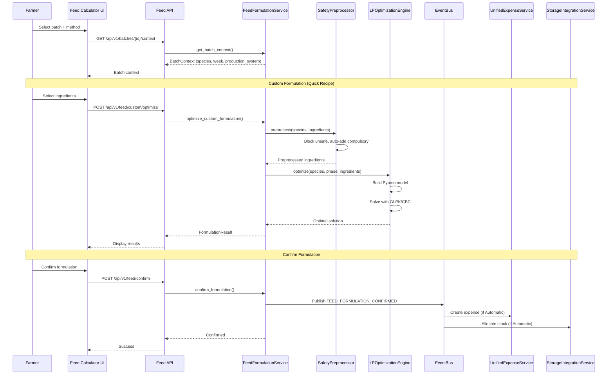

# Feed Calculator System - Production-Grade Specification (3 Methods + LP Optimization + 41 Ingredients + West African Context)

# Feed Calculator System - Production-Grade Specification

**Epic:** epic:bceeaefd-5139-4801-8c12-de8a8b6faf8a  
**Status:** Production-Ready Specification  
**Last Updated:** January 2026  
**Architecture:** Validated Tech Plan (spec:bceeaefd-5139-4801-8c12-de8a8b6faf8a/950515a2-7eeb-4375-9e58-6df156a25a3b)

---

## Overview

The Feed Calculator System is the **intelligence core** of LampFarms, providing farmers with three distinct feed formulation methods tailored to different skill levels, ingredient availability, and production systems. It integrates Pyomo LP optimization, West African safety protocols, and automatic expense/stock integration.

### Core Philosophy

**Backend Intelligence, Frontend Simplicity:**

- Backend handles LP optimization, safety validation, nutritional calculations
- Frontend provides simple, guided interfaces for each method
- Configuration-driven nutritional requirements (no hardcoded values)

**Farmer Freedom:**

- **Ready-Made Feed:** Simple arithmetic for farmers buying commercial feed
- **Custom Formulation:** 3 approaches (Quick Recipe: full LP, Flexible Mix: guided validation, Free Mix: warnings only)
- **Concentrate Mix:** Concentrate + grains with ratio slider

**West African Context:**

- Mandatory toxin binder (aflatoxin protection)
- Duck niacin supplementation (1.5 tsp/gallon - CRITICAL)
- Container-based measurements (bags, gallons, buckets)
- Local ingredient availability

**Dovetail Synergy:**

- Feed formulation → Auto-create expense (if Automatic pattern)
- Feed formulation → Auto-allocate stock (if Automatic pattern)
- Feed formulation → Update batch feed tracking
- Manual expense/stock entry (if Flexible pattern)

### Scope

**3 Feed Methods:**

1. **Ready-Made Feed** - Commercial feed (no formulation, simple arithmetic)
2. **Custom Formulation** - 3 approaches (Quick Recipe, Flexible Mix, Free Mix)
3. **Concentrate Mix** - Concentrate + grains with ratio slider

**Key Features:**

- Pyomo LP optimization (Quick Recipe approach)
- Safety preprocessing (block unsafe ingredients, auto-add compulsory supplements)
- Ingredient database (50+ ingredients with nutritional profiles)
- Species-specific nutritional requirements (4 species × 3-6 phases)
- Batch context integration (species, week, production system)
- Recipe management (save/load recipes, no prices saved)
- Automatic expense/stock integration (Automatic pattern only)

---

## System Architecture



---

## Section 1: Feed Planning (CRITICAL Foundation)

### Purpose

**Feed planning determines target quantity BEFORE ingredient selection.** This is essential for LP optimization and proper calculations.

### Planning Options

**Option A: Plan by Bags**

- Farmer knows how many bags to make
- Enter: Number of bags, bag size (kg)
- System calculates: Target quantity (kg)

**Option B: Plan by Duration**

- Farmer plans for X weeks/days
- System calculates: Target quantity based on batch context
- Formula: `target_kg = (daily_intake_g × bird_count × duration_days) / 1000`

### Batch Context Loading

**On batch selection, system loads:**

- Species (e.g., "Broilers")
- Current week (e.g., 6)
- Lifecycle phase (e.g., "Finisher")
- Production system ("Intensive" or "Semi-Intensive")
- Current population (e.g., 490 birds)
- Daily intake rate (from species.json, e.g., 150g/bird for broiler finisher)
- Nutritional requirements (from nutritional_requirements.json)

### ASCII Flow Diagram

```
┌─────────────────────────────────────────────────────────────────┐
│                    FEED PLANNING FLOW                           │
├─────────────────────────────────────────────────────────────────┤
│                                                                 │
│  1. SELECT BATCH                                                │
│     └─→ System loads: species, phase, bird count, daily intake │
│                                                                 │
│  2. SET PLANNING TARGET                                         │
│     └─→ Option A: Enter number of bags to make                 │
│     └─→ Option B: Enter duration (weeks/days)                  │
│     └─→ System calculates: target kg, estimated bags needed    │
│                                                                 │
│  3. SELECT METHOD                                               │
│     └─→ Ready-Made, Custom Formulation, or Concentrate Mix     │
│                                                                 │
│  4. ADD INGREDIENTS (via category popups)                       │
│     └─→ Energy sources popup                                   │
│     └─→ Protein sources popup (primary/secondary)              │
│     └─→ Calcium popup (single selection)                       │
│     └─→ Supplements (auto-added + optional)                    │
│                                                                 │
│  5. CALCULATE/OPTIMIZE                                          │
│     └─→ Ready-Made: Arithmetic only                            │
│     └─→ Custom Quick Recipe: LP optimization                   │
│     └─→ Custom Flexible/Free: Validation only                  │
│     └─→ Concentrate Mix: Ratio calculation                     │
│                                                                 │
│  6. VIEW RESULTS                                                │
│     └─→ Ingredient breakdown (bags, kg, %, cost, source)       │
│     └─→ Summary stats (total quantity, total cost, cost/kg)    │
│     └─→ Duration estimate (covers X days for Y birds)          │
│     └─→ NO nutritional calculations displayed to farmer        │
│                                                                 │
│  7. CONFIRM & PROCESS                                           │
│     └─→ Automatic pattern: Auto-create expense, auto-stock     │
│     └─→ Flexible pattern: Manual expense, manual stock         │
│                                                                 │
└─────────────────────────────────────────────────────────────────┘
```

---

## Section 2: Method 1 - Ready-Made Feed

### Purpose

Simple arithmetic for farmers buying commercial feed (no formulation needed).

### User Flow

```
1. Select batch (loads species, week, production system, daily intake)
2. Set planning target (bags or duration)
3. Enter feed details (brand, package size, quantity, price)
4. Calculate total cost and duration
5. Confirm → Auto-create expense (if Automatic) OR Manual entry (if Flexible)
```

### Wireframe: Ready-Made Feed

```wireframe
<!DOCTYPE html>
<html>
<head>
<style>
* { margin: 0; padding: 0; box-sizing: border-box; }
body { font-family: 'Manrope', sans-serif; background: #f9fafb; padding: 24px; }
.page-container { max-width: 800px; margin: 0 auto; }
.page-header { margin-bottom: 24px; }
.page-title { font-size: 28px; font-weight: 600; color: #111827; margin-bottom: 8px; }
.page-subtitle { font-size: 14px; color: #6b7280; }
.batch-context { background: #f0fdf4; border: 1px solid #bbf7d0; border-radius: 12px; padding: 16px; margin-bottom: 24px; }
.context-row { display: flex; justify-content: space-between; margin-bottom: 8px; }
.context-row:last-child { margin-bottom: 0; }
.context-label { font-size: 14px; color: #166534; }
.context-value { font-size: 14px; font-weight: 600; color: #166534; }
.form-section { background: white; border: 1px solid #e5e7eb; border-radius: 16px; padding: 24px; margin-bottom: 24px; }
.section-title { font-size: 18px; font-weight: 600; color: #111827; margin-bottom: 16px; }
.form-group { margin-bottom: 20px; }
.form-label { display: block; font-size: 14px; font-weight: 500; color: #374151; margin-bottom: 8px; }
.form-input { width: 100%; padding: 10px 16px; border: 1px solid #d1d5db; border-radius: 9999px; font-size: 14px; color: #111827; }
.form-input:focus { outline: none; border-color: #16a34a; }
.form-select { width: 100%; padding: 10px 16px; border: 1px solid #d1d5db; border-radius: 9999px; font-size: 14px; color: #111827; background: white; cursor: pointer; }
.form-select:focus { outline: none; border-color: #16a34a; }
.result-card { background: #f0fdf4; border: 1px solid #bbf7d0; border-radius: 12px; padding: 20px; margin-bottom: 24px; }
.result-row { display: flex; justify-content: space-between; margin-bottom: 12px; }
.result-row:last-child { margin-bottom: 0; }
.result-label { font-size: 14px; color: #166534; }
.result-value { font-size: 18px; font-weight: 600; color: #166534; }
.actions { display: flex; gap: 12px; justify-content: flex-end; }
.btn { padding: 10px 20px; border-radius: 9999px; font-size: 14px; font-weight: 500; cursor: pointer; transition: all 0.2s; border: none; }
.btn-secondary { background: white; color: #374151; border: 1px solid #d1d5db; }
.btn-secondary:hover { background: #f9fafb; }
.btn-primary { background: #16a34a; color: white; }
.btn-primary:hover { background: #15803d; }
</style>
</head>
<body>
<div class="page-container">
  <div class="page-header">
    <h1 class="page-title">Ready-Made Feed</h1>
    <p class="page-subtitle">Record commercial feed purchase</p>
  </div>
  <div class="batch-context">
    <div class="context-row">
      <span class="context-label">Batch:</span>
      <span class="context-value">Broilers Batch #12</span>
    </div>
    <div class="context-row">
      <span class="context-label">Species:</span>
      <span class="context-value">Broilers (Week 6, Finisher Phase)</span>
    </div>
    <div class="context-row">
      <span class="context-label">Production System:</span>
      <span class="context-value">Intensive (Automatic Feed Pattern)</span>
    </div>
    <div class="context-row">
      <span class="context-label">Current Population:</span>
      <span class="context-value">490 birds</span>
    </div>
  </div>
  <div class="form-section">
    <div class="section-title">Feed Details</div>
    <div class="form-group">
      <label class="form-label">Feed Type *</label>
      <select class="form-select" data-element-id="select-feed-type">
        <option value="">Select feed type...</option>
        <option value="broiler_starter">Broiler Starter (22-24% protein)</option>
        <option value="broiler_grower">Broiler Grower (20-22% protein)</option>
        <option value="broiler_finisher" selected>Broiler Finisher (18-20% protein)</option>
      </select>
    </div>
    <div class="form-group">
      <label class="form-label">Quantity (bags) *</label>
      <input type="number" class="form-input" value="12" data-element-id="input-quantity">
    </div>
    <div class="form-group">
      <label class="form-label">Bag Size (kg) *</label>
      <input type="number" class="form-input" value="50" data-element-id="input-bag-size">
    </div>
    <div class="form-group">
      <label class="form-label">Price per Bag (GH₵) *</label>
      <input type="number" step="0.01" class="form-input" value="185.00" data-element-id="input-price-per-bag">
    </div>
  </div>
  <div class="result-card">
    <div class="result-row">
      <span class="result-label">Total Quantity:</span>
      <span class="result-value">600 kg</span>
    </div>
    <div class="result-row">
      <span class="result-label">Total Cost:</span>
      <span class="result-value">GH₵ 2,220.00</span>
    </div>
    <div class="result-row">
      <span class="result-label">Cost per kg:</span>
      <span class="result-value">GH₵ 3.70</span>
    </div>
  </div>
  <div class="actions">
    <button class="btn btn-secondary" data-element-id="btn-cancel">Cancel</button>
    <button class="btn btn-primary" data-element-id="btn-confirm">Confirm & Create Expense</button>
  </div>
</div>
</body>
</html>
```

**Business Logic:**

- **Calculation:**
  - Total quantity = bags × bag_size
  - Total cost = bags × price_per_bag
  - Cost per kg = total_cost / total_quantity
- **Validation:**
  - Feed type required
  - Quantity > 0
  - Bag size > 0
  - Price per bag > 0
- **On Confirm (Automatic Pattern):**
  - Create feed formulation record
  - Publish `FEED_FORMULATION_CONFIRMED` event
  - Event handler creates expense automatically
  - Event handler allocates stock to batch automatically
- **On Confirm (Flexible Pattern):**
  - Create feed formulation record
  - Show manual expense entry form
  - Show manual stock allocation form

---

## Section 3: Ingredient Selection Popup (CRITICAL Component)

### Purpose

**Category-based ingredient selection with safety validation and stock/purchase options.**

### Popup Categories

1. **Energy Sources** - Maize, sorghum, millet, cassava HQCP, wheat bran, rice bran
2. **Protein Sources** - Primary (soybean meal, groundnut cake), Secondary (fish meal, PKC, BSF, cotton seed cake)
3. **Calcium Sources** - Limestone, oyster shell, bone meal (SINGLE SELECTION - radio buttons)
4. **Supplements** - Compulsory (auto-added), Optional (vitamins, enzymes)

### Ingredient Source Options

**From Stock:**

- Select from existing inventory
- Shows available quantity
- No price entry (already recorded)
- Stock deducted on confirm
- No expense created

**New Purchase:**

- Enter package size (kg)
- Enter quantity (bags)
- Enter price per bag
- Stock added then deducted on confirm
- Expense created automatically

### Wireframe: Energy Source Popup

```wireframe
<!DOCTYPE html>
<html>
<head>
<style>
* { margin: 0; padding: 0; box-sizing: border-box; }
body { font-family: 'Manrope', sans-serif; background: rgba(0,0,0,0.5); display: flex; align-items: center; justify-content: center; min-height: 100vh; padding: 24px; }
.popup { background: white; border-radius: 16px; max-width: 600px; width: 100%; box-shadow: 0 20px 25px -5px rgba(0,0,0,0.1); }
.popup-header { padding: 24px; border-bottom: 1px solid #e5e7eb; }
.popup-title { font-size: 20px; font-weight: 600; color: #111827; }
.popup-body { padding: 24px; max-height: 500px; overflow-y: auto; }
.source-tabs { display: flex; gap: 8px; margin-bottom: 20px; }
.source-tab { padding: 8px 16px; border-radius: 9999px; font-size: 14px; font-weight: 500; cursor: pointer; transition: all 0.2s; border: 1px solid #d1d5db; background: white; color: #374151; }
.source-tab.active { background: #16a34a; color: white; border-color: #16a34a; }
.stock-list { display: flex; flex-direction: column; gap: 12px; margin-bottom: 20px; }
.stock-item { border: 1px solid #e5e7eb; border-radius: 12px; padding: 16px; display: flex; justify-content: space-between; align-items: center; }
.stock-info { flex: 1; }
.stock-name { font-size: 14px; font-weight: 600; color: #111827; margin-bottom: 4px; }
.stock-available { font-size: 13px; color: #6b7280; }
.btn { padding: 8px 16px; border-radius: 9999px; font-size: 13px; font-weight: 500; cursor: pointer; transition: all 0.2s; border: none; }
.btn-secondary { background: white; color: #374151; border: 1px solid #d1d5db; }
.btn-secondary:hover { background: #f9fafb; }
.btn-primary { background: #16a34a; color: white; }
.btn-primary:hover { background: #15803d; }
.btn:disabled { opacity: 0.5; cursor: not-allowed; }
.form-group { margin-bottom: 16px; }
.form-label { display: block; font-size: 14px; font-weight: 500; color: #374151; margin-bottom: 8px; }
.form-select { width: 100%; padding: 10px 16px; border: 1px solid #d1d5db; border-radius: 9999px; font-size: 14px; color: #111827; background: white; }
.form-input { width: 100%; padding: 10px 16px; border: 1px solid #d1d5db; border-radius: 9999px; font-size: 14px; color: #111827; }
.form-input:focus { outline: none; border-color: #16a34a; }
.input-grid { display: grid; grid-template-columns: repeat(3, 1fr); gap: 12px; }
.warning-card { background: #fef3c7; border: 1px solid #fde68a; border-radius: 12px; padding: 12px; margin-top: 12px; }
.warning-text { font-size: 13px; color: #92400e; }
.popup-footer { padding: 24px; border-top: 1px solid #e5e7eb; display: flex; justify-content: flex-end; gap: 12px; }
</style>
</head>
<body>
<div class="popup">
  <div class="popup-header">
    <div class="popup-title">Add Energy Source</div>
  </div>
  <div class="popup-body">
    <div class="source-tabs">
      <div class="source-tab active" data-element-id="tab-from-stock">From Stock</div>
      <div class="source-tab" data-element-id="tab-new-purchase">New Purchase</div>
    </div>
    <div class="stock-list">
      <div class="stock-item">
        <div class="stock-info">
          <div class="stock-name">Maize (Corn)</div>
          <div class="stock-available">In stock: 8 bags (400kg) @ avg GH₵ 115/bag</div>
        </div>
        <button class="btn btn-primary" data-element-id="btn-select-maize">Select</button>
      </div>
      <div class="stock-item">
        <div class="stock-info">
          <div class="stock-name">Sorghum</div>
          <div class="stock-available">In stock: 2 bags (100kg) @ avg GH₵ 125/bag</div>
        </div>
        <button class="btn btn-primary" data-element-id="btn-select-sorghum">Select</button>
      </div>
      <div class="stock-item">
        <div class="stock-info">
          <div class="stock-name">Millet</div>
          <div class="stock-available">Out of stock</div>
        </div>
        <button class="btn btn-secondary" disabled data-element-id="btn-select-millet">Out of Stock</button>
      </div>
    </div>
  </div>
  <div class="popup-footer">
    <button class="btn btn-secondary" data-element-id="btn-cancel">Cancel</button>
  </div>
</div>
</body>
</html>
```

### Wireframe: New Purchase Entry

```wireframe
<!DOCTYPE html>
<html>
<head>
<style>
* { margin: 0; padding: 0; box-sizing: border-box; }
body { font-family: 'Manrope', sans-serif; background: rgba(0,0,0,0.5); display: flex; align-items: center; justify-content: center; min-height: 100vh; padding: 24px; }
.popup { background: white; border-radius: 16px; max-width: 600px; width: 100%; box-shadow: 0 20px 25px -5px rgba(0,0,0,0.1); }
.popup-header { padding: 24px; border-bottom: 1px solid #e5e7eb; }
.popup-title { font-size: 20px; font-weight: 600; color: #111827; }
.popup-body { padding: 24px; }
.source-tabs { display: flex; gap: 8px; margin-bottom: 20px; }
.source-tab { padding: 8px 16px; border-radius: 9999px; font-size: 14px; font-weight: 500; cursor: pointer; transition: all 0.2s; border: 1px solid #d1d5db; background: white; color: #374151; }
.source-tab.active { background: #16a34a; color: white; border-color: #16a34a; }
.form-group { margin-bottom: 16px; }
.form-label { display: block; font-size: 14px; font-weight: 500; color: #374151; margin-bottom: 8px; }
.form-select { width: 100%; padding: 10px 16px; border: 1px solid #d1d5db; border-radius: 9999px; font-size: 14px; color: #111827; background: white; }
.form-input { width: 100%; padding: 10px 16px; border: 1px solid #d1d5db; border-radius: 9999px; font-size: 14px; color: #111827; }
.form-input:focus { outline: none; border-color: #16a34a; }
.input-grid { display: grid; grid-template-columns: repeat(3, 1fr); gap: 12px; }
.warning-card { background: #fef3c7; border: 1px solid #fde68a; border-radius: 12px; padding: 12px; margin-top: 12px; }
.warning-text { font-size: 13px; color: #92400e; }
.popup-footer { padding: 24px; border-top: 1px solid #e5e7eb; display: flex; justify-content: flex-end; gap: 12px; }
.btn { padding: 10px 20px; border-radius: 9999px; font-size: 14px; font-weight: 500; cursor: pointer; transition: all 0.2s; border: none; }
.btn-secondary { background: white; color: #374151; border: 1px solid #d1d5db; }
.btn-secondary:hover { background: #f9fafb; }
.btn-primary { background: #16a34a; color: white; }
.btn-primary:hover { background: #15803d; }
</style>
</head>
<body>
<div class="popup">
  <div class="popup-header">
    <div class="popup-title">Add Energy Source</div>
  </div>
  <div class="popup-body">
    <div class="source-tabs">
      <div class="source-tab" data-element-id="tab-from-stock">From Stock</div>
      <div class="source-tab active" data-element-id="tab-new-purchase">New Purchase</div>
    </div>
    <div class="form-group">
      <label class="form-label">Select Ingredient *</label>
      <select class="form-select" data-element-id="select-ingredient">
        <option value="">Choose ingredient...</option>
        <option value="maize" selected>Maize (Corn)</option>
        <option value="sorghum">Sorghum (Low-Tannin)</option>
        <option value="millet">Pearl Millet</option>
        <option value="cassava_hqcp">Cassava Peel (HQCP Processed)</option>
      </select>
    </div>
    <div class="form-group">
      <label class="form-label">Purchase Details *</label>
      <div class="input-grid">
        <div>
          <input type="number" class="form-input" placeholder="Package (kg)" value="50" data-element-id="input-package-size">
        </div>
        <div>
          <input type="number" class="form-input" placeholder="Bags" value="5" data-element-id="input-quantity-bags">
        </div>
        <div>
          <input type="number" class="form-input" placeholder="Price/bag" value="120" data-element-id="input-price-per-bag">
        </div>
      </div>
    </div>
    <div class="warning-card">
      <div class="warning-text">⚠ Aflatoxin risk - toxin binder will be auto-added</div>
    </div>
  </div>
  <div class="popup-footer">
    <button class="btn btn-secondary" data-element-id="btn-cancel">Cancel</button>
    <button class="btn btn-primary" data-element-id="btn-add">Add Ingredient</button>
  </div>
</div>
</body>
</html>
```

### Wireframe: Protein Source Popup (Primary/Secondary Logic)

```wireframe
<!DOCTYPE html>
<html>
<head>
<style>
* { margin: 0; padding: 0; box-sizing: border-box; }
body { font-family: 'Manrope', sans-serif; background: rgba(0,0,0,0.5); display: flex; align-items: center; justify-content: center; min-height: 100vh; padding: 24px; }
.popup { background: white; border-radius: 16px; max-width: 700px; width: 100%; box-shadow: 0 20px 25px -5px rgba(0,0,0,0.1); }
.popup-header { padding: 24px; border-bottom: 1px solid #e5e7eb; }
.popup-title { font-size: 20px; font-weight: 600; color: #111827; margin-bottom: 4px; }
.popup-subtitle { font-size: 14px; color: #6b7280; }
.popup-body { padding: 24px; max-height: 600px; overflow-y: auto; }
.section { margin-bottom: 24px; }
.section-title { font-size: 14px; font-weight: 600; color: #374151; margin-bottom: 12px; }
.ingredient-grid { display: grid; grid-template-columns: repeat(2, 1fr); gap: 12px; }
.ingredient-card { border: 2px solid #e5e7eb; border-radius: 12px; padding: 16px; cursor: pointer; transition: all 0.2s; }
.ingredient-card:hover { border-color: #16a34a; background: #f0fdf4; }
.ingredient-card.selected { border-color: #16a34a; background: #f0fdf4; }
.ingredient-card.blocked { border-color: #fca5a5; background: #fef2f2; cursor: not-allowed; opacity: 0.6; }
.ingredient-name { font-size: 14px; font-weight: 600; color: #111827; margin-bottom: 4px; }
.ingredient-protein { font-size: 13px; color: #6b7280; margin-bottom: 4px; }
.ingredient-note { font-size: 12px; color: #9ca3af; }
.ingredient-blocked { font-size: 12px; color: #dc2626; font-weight: 500; }
.form-group { margin-bottom: 16px; }
.form-label { display: block; font-size: 14px; font-weight: 500; color: #374151; margin-bottom: 8px; }
.input-grid { display: grid; grid-template-columns: repeat(3, 1fr); gap: 12px; }
.form-input { width: 100%; padding: 10px 16px; border: 1px solid #d1d5db; border-radius: 9999px; font-size: 14px; color: #111827; }
.form-input:focus { outline: none; border-color: #16a34a; }
.popup-footer { padding: 24px; border-top: 1px solid #e5e7eb; display: flex; justify-content: flex-end; gap: 12px; }
.btn { padding: 10px 20px; border-radius: 9999px; font-size: 14px; font-weight: 500; cursor: pointer; transition: all 0.2s; border: none; }
.btn-secondary { background: white; color: #374151; border: 1px solid #d1d5db; }
.btn-secondary:hover { background: #f9fafb; }
.btn-primary { background: #16a34a; color: white; }
.btn-primary:hover { background: #15803d; }
</style>
</head>
<body>
<div class="popup">
  <div class="popup-header">
    <div class="popup-title">Add Protein Source</div>
    <div class="popup-subtitle">Broilers - Week 6 (Finisher Phase)</div>
  </div>
  <div class="popup-body">
    <div class="section">
      <div class="section-title">Primary Protein (required first)</div>
      <div class="ingredient-grid">
        <div class="ingredient-card selected" data-element-id="card-soybean">
          <div class="ingredient-name">Soybean Meal</div>
          <div class="ingredient-protein">44% protein</div>
          <div class="ingredient-note">Gold standard</div>
        </div>
        <div class="ingredient-card" data-element-id="card-groundnut">
          <div class="ingredient-name">Groundnut Cake</div>
          <div class="ingredient-protein">45% protein</div>
          <div class="ingredient-note">⚠ Aflatoxin risk</div>
        </div>
      </div>
    </div>
    <div class="section">
      <div class="section-title">Secondary Protein (enabled after primary)</div>
      <div class="ingredient-grid">
        <div class="ingredient-card" data-element-id="card-fish-meal">
          <div class="ingredient-name">Fish Meal</div>
          <div class="ingredient-protein">60% protein</div>
          <div class="ingredient-note">≤10% broiler</div>
        </div>
        <div class="ingredient-card" data-element-id="card-pkc">
          <div class="ingredient-name">Palm Kernel Cake</div>
          <div class="ingredient-protein">18% protein</div>
          <div class="ingredient-note">Needs enzymes if >10%</div>
        </div>
        <div class="ingredient-card" data-element-id="card-bsf">
          <div class="ingredient-name">BSF Larvae</div>
          <div class="ingredient-protein">42% protein</div>
          <div class="ingredient-note">Sustainable</div>
        </div>
        <div class="ingredient-card blocked" data-element-id="card-cotton">
          <div class="ingredient-name">Cotton Seed Cake</div>
          <div class="ingredient-blocked">✗ BLOCKED for Layers</div>
          <div class="ingredient-note">Gossypol causes yolk discoloration</div>
        </div>
      </div>
    </div>
    <div class="section">
      <div class="section-title">Selected: Soybean Meal (New Purchase)</div>
      <div class="form-group">
        <label class="form-label">Purchase Details *</label>
        <div class="input-grid">
          <input type="number" class="form-input" placeholder="Package (kg)" value="50" data-element-id="input-package-size">
          <input type="number" class="form-input" placeholder="Bags" value="2" data-element-id="input-quantity-bags">
          <input type="number" class="form-input" placeholder="Price/bag" value="380" data-element-id="input-price-per-bag">
        </div>
      </div>
    </div>
  </div>
  <div class="popup-footer">
    <button class="btn btn-secondary" data-element-id="btn-cancel">Cancel</button>
    <button class="btn btn-primary" data-element-id="btn-add">Add Ingredient</button>
  </div>
</div>
</body>
</html>
```

### Wireframe: Calcium Source Popup (Single Selection)

```wireframe
<!DOCTYPE html>
<html>
<head>
<style>
* { margin: 0; padding: 0; box-sizing: border-box; }
body { font-family: 'Manrope', sans-serif; background: rgba(0,0,0,0.5); display: flex; align-items: center; justify-content: center; min-height: 100vh; padding: 24px; }
.popup { background: white; border-radius: 16px; max-width: 600px; width: 100%; box-shadow: 0 20px 25px -5px rgba(0,0,0,0.1); }
.popup-header { padding: 24px; border-bottom: 1px solid #e5e7eb; }
.popup-title { font-size: 20px; font-weight: 600; color: #111827; margin-bottom: 4px; }
.popup-subtitle { font-size: 14px; color: #fca5a5; font-weight: 500; }
.popup-body { padding: 24px; }
.warning-card { background: #fef3c7; border: 1px solid #fde68a; border-radius: 12px; padding: 12px; margin-bottom: 20px; }
.warning-text { font-size: 13px; color: #92400e; }
.ingredient-grid { display: grid; grid-template-columns: repeat(3, 1fr); gap: 12px; margin-bottom: 20px; }
.ingredient-card { border: 2px solid #e5e7eb; border-radius: 12px; padding: 16px; text-align: center; cursor: pointer; transition: all 0.2s; }
.ingredient-card:hover { border-color: #16a34a; background: #f0fdf4; }
.ingredient-card.selected { border-color: #16a34a; background: #f0fdf4; }
.radio-circle { width: 20px; height: 20px; border: 2px solid #d1d5db; border-radius: 50%; margin: 0 auto 8px; display: flex; align-items: center; justify-content: center; }
.ingredient-card.selected .radio-circle { border-color: #16a34a; }
.radio-inner { width: 10px; height: 10px; background: #16a34a; border-radius: 50%; display: none; }
.ingredient-card.selected .radio-inner { display: block; }
.ingredient-name { font-size: 14px; font-weight: 600; color: #111827; margin-bottom: 4px; }
.ingredient-calcium { font-size: 13px; color: #6b7280; margin-bottom: 4px; }
.ingredient-note { font-size: 12px; color: #9ca3af; }
.form-group { margin-bottom: 16px; }
.form-label { display: block; font-size: 14px; font-weight: 500; color: #374151; margin-bottom: 8px; }
.input-grid { display: grid; grid-template-columns: repeat(3, 1fr); gap: 12px; }
.form-input { width: 100%; padding: 10px 16px; border: 1px solid #d1d5db; border-radius: 9999px; font-size: 14px; color: #111827; }
.form-input:focus { outline: none; border-color: #16a34a; }
.popup-footer { padding: 24px; border-top: 1px solid #e5e7eb; display: flex; justify-content: flex-end; gap: 12px; }
.btn { padding: 10px 20px; border-radius: 9999px; font-size: 14px; font-weight: 500; cursor: pointer; transition: all 0.2s; border: none; }
.btn-secondary { background: white; color: #374151; border: 1px solid #d1d5db; }
.btn-secondary:hover { background: #f9fafb; }
.btn-primary { background: #16a34a; color: white; }
.btn-primary:hover { background: #15803d; }
</style>
</head>
<body>
<div class="popup">
  <div class="popup-header">
    <div class="popup-title">Add Calcium Source (Choose ONE only)</div>
    <div class="popup-subtitle">⚠ Only ONE calcium source allowed - mixing causes imbalances</div>
  </div>
  <div class="popup-body">
    <div class="ingredient-grid">
      <div class="ingredient-card" data-element-id="card-limestone">
        <div class="radio-circle"><div class="radio-inner"></div></div>
        <div class="ingredient-name">Limestone</div>
        <div class="ingredient-calcium">38% calcium</div>
        <div class="ingredient-note">Most common</div>
      </div>
      <div class="ingredient-card selected" data-element-id="card-oyster-shell">
        <div class="radio-circle"><div class="radio-inner"></div></div>
        <div class="ingredient-name">Oyster Shell</div>
        <div class="ingredient-calcium">36% calcium</div>
        <div class="ingredient-note">Best for layers</div>
      </div>
      <div class="ingredient-card" data-element-id="card-bone-meal">
        <div class="radio-circle"><div class="radio-inner"></div></div>
        <div class="ingredient-name">Bone Meal</div>
        <div class="ingredient-calcium">24% calcium</div>
        <div class="ingredient-note">+12% phosphorus</div>
      </div>
    </div>
    <div class="form-group">
      <label class="form-label">Selected: Oyster Shell (New Purchase)</label>
      <div class="input-grid">
        <input type="number" class="form-input" placeholder="Package (kg)" value="50" data-element-id="input-package-size">
        <input type="number" class="form-input" placeholder="Bags" value="1" data-element-id="input-quantity-bags">
        <input type="number" class="form-input" placeholder="Price/bag" value="35" data-element-id="input-price-per-bag">
      </div>
    </div>
  </div>
  <div class="popup-footer">
    <button class="btn btn-secondary" data-element-id="btn-cancel">Cancel</button>
    <button class="btn btn-primary" data-element-id="btn-add">Add Ingredient</button>
  </div>
</div>
</body>
</html>
```

---

## Section 4: Method 2 - Custom Formulation (3 Approaches)

### Overview

Custom formulation allows farmers to create their own feed recipes with 3 different approaches based on skill level and preference.

### Approach 1: Quick Recipe (Full LP Optimization)

**Purpose:** Minimize cost while meeting all nutritional requirements automatically.

**User Flow:**

```
1. Select batch (loads species, week, production system)
2. Enter target quantity (kg)
3. Select ingredients from database
4. Click "Optimize Recipe"
5. Backend runs Pyomo LP optimization
6. Display optimal quantities and nutritional profile
7. Confirm → Auto-create expense/stock (if Automatic)
```

### Approach 2: Flexible Mix (Guided Validation)

**Purpose:** Farmer specifies quantities, system validates and provides suggestions.

**User Flow:**

```
1. Select batch
2. Enter target quantity
3. Select ingredients and enter quantities manually
4. Real-time validation (<100ms)
5. Debounced suggestions (300-500ms)
6. Adjust quantities based on feedback
7. Confirm → Auto-create expense/stock (if Automatic)
```

### Approach 3: Free Mix (Warnings Only)

**Purpose:** Experienced farmers formulate freely, system shows warnings only.

**User Flow:**

```
1. Select batch
2. Enter target quantity
3. Select ingredients and enter quantities freely
4. System shows warnings (no blocking)
5. Farmer proceeds despite warnings
6. Confirm → Auto-create expense/stock (if Automatic)
```

### Wireframe: Custom Formulation Main Page (Quick Recipe)

```wireframe
<!DOCTYPE html>
<html>
<head>
<style>
* { margin: 0; padding: 0; box-sizing: border-box; }
body { font-family: 'Manrope', sans-serif; background: #f9fafb; padding: 24px; }
.page-container { max-width: 1000px; margin: 0 auto; }
.page-header { margin-bottom: 24px; }
.page-title { font-size: 28px; font-weight: 600; color: #111827; margin-bottom: 8px; }
.page-subtitle { font-size: 14px; color: #6b7280; }
.approach-tabs { display: flex; gap: 8px; margin-bottom: 24px; }
.approach-tab { padding: 10px 20px; border-radius: 9999px; font-size: 14px; font-weight: 500; cursor: pointer; transition: all 0.2s; border: 1px solid #d1d5db; background: white; color: #374151; }
.approach-tab:hover { background: #f9fafb; }
.approach-tab.active { background: #16a34a; color: white; border-color: #16a34a; }
.batch-context { background: #f0fdf4; border: 1px solid #bbf7d0; border-radius: 12px; padding: 16px; margin-bottom: 24px; }
.context-row { display: flex; justify-content: space-between; margin-bottom: 8px; }
.context-row:last-child { margin-bottom: 0; }
.context-label { font-size: 14px; color: #166534; }
.context-value { font-size: 14px; font-weight: 600; color: #166534; }
.form-section { background: white; border: 1px solid #e5e7eb; border-radius: 16px; padding: 24px; margin-bottom: 24px; }
.section-title { font-size: 18px; font-weight: 600; color: #111827; margin-bottom: 16px; }
.form-group { margin-bottom: 20px; }
.form-label { display: block; font-size: 14px; font-weight: 500; color: #374151; margin-bottom: 8px; }
.form-input { width: 100%; padding: 10px 16px; border: 1px solid #d1d5db; border-radius: 9999px; font-size: 14px; color: #111827; }
.form-input:focus { outline: none; border-color: #16a34a; }
.ingredient-list { display: flex; flex-direction: column; gap: 12px; margin-bottom: 16px; }
.ingredient-item { display: flex; align-items: center; gap: 12px; padding: 12px; background: #f9fafb; border: 1px solid #e5e7eb; border-radius: 12px; }
.ingredient-name { flex: 1; font-size: 14px; color: #111827; }
.ingredient-category { font-size: 12px; color: #6b7280; background: #e5e7eb; padding: 4px 8px; border-radius: 4px; }
.ingredient-remove { cursor: pointer; color: #ef4444; font-size: 18px; }
.btn { padding: 10px 20px; border-radius: 9999px; font-size: 14px; font-weight: 500; cursor: pointer; transition: all 0.2s; border: none; }
.btn-secondary { background: white; color: #374151; border: 1px solid #d1d5db; }
.btn-secondary:hover { background: #f9fafb; }
.btn-primary { background: #16a34a; color: white; }
.btn-primary:hover { background: #15803d; }
.result-card { background: #f0fdf4; border: 1px solid #bbf7d0; border-radius: 12px; padding: 20px; margin-bottom: 24px; }
.result-title { font-size: 16px; font-weight: 600; color: #166534; margin-bottom: 16px; }
.result-table { width: 100%; }
.result-table th { text-align: left; font-size: 12px; color: #166534; padding: 8px; border-bottom: 1px solid #bbf7d0; }
.result-table td { font-size: 14px; color: #166534; padding: 8px; border-bottom: 1px solid #dcfce7; }
.result-table tr:last-child td { border-bottom: none; }
.nutrition-grid { display: grid; grid-template-columns: repeat(3, 1fr); gap: 12px; margin-top: 16px; }
.nutrition-stat { text-align: center; }
.nutrition-label { font-size: 12px; color: #166534; margin-bottom: 4px; }
.nutrition-value { font-size: 18px; font-weight: 600; color: #166534; }
.actions { display: flex; gap: 12px; justify-content: flex-end; }
</style>
</head>
<body>
<div class="page-container">
  <div class="page-header">
    <h1 class="page-title">Custom Formulation</h1>
    <p class="page-subtitle">Create cost-optimal feed recipe</p>
  </div>
  <div class="approach-tabs">
    <div class="approach-tab active" data-element-id="tab-quick-recipe">Quick Recipe (LP Optimize)</div>
    <div class="approach-tab" data-element-id="tab-flexible-mix">Flexible Mix (Guided)</div>
    <div class="approach-tab" data-element-id="tab-free-mix">Free Mix (Warnings)</div>
  </div>
  <div class="batch-context">
    <div class="context-row">
      <span class="context-label">Batch:</span>
      <span class="context-value">Broilers Batch #12</span>
    </div>
    <div class="context-row">
      <span class="context-label">Species:</span>
      <span class="context-value">Broilers (Week 6, Finisher Phase)</span>
    </div>
    <div class="context-row">
      <span class="context-label">Production System:</span>
      <span class="context-value">Intensive (Automatic Feed Pattern)</span>
    </div>
    <div class="context-row">
      <span class="context-label">Nutritional Requirements:</span>
      <span class="context-value">Protein: 18-20%, Energy: 3,100-3,300 kcal/kg</span>
    </div>
  </div>
  <div class="form-section">
    <div class="section-title">Recipe Details</div>
    <div class="form-group">
      <label class="form-label">Target Quantity (kg) *</label>
      <input type="number" class="form-input" value="630" data-element-id="input-target-quantity">
    </div>
    <div class="form-group">
      <label class="form-label">Selected Ingredients (5)</label>
      <div class="ingredient-list">
        <div class="ingredient-item">
          <span class="ingredient-name">Maize (Corn)</span>
          <span class="ingredient-category">Energy</span>
          <span class="ingredient-remove" data-element-id="remove-maize">✕</span>
        </div>
        <div class="ingredient-item">
          <span class="ingredient-name">Soybean Meal</span>
          <span class="ingredient-category">Protein</span>
          <span class="ingredient-remove" data-element-id="remove-soybean">✕</span>
        </div>
        <div class="ingredient-item">
          <span class="ingredient-name">Fish Meal</span>
          <span class="ingredient-category">Protein</span>
          <span class="ingredient-remove" data-element-id="remove-fish">✕</span>
        </div>
        <div class="ingredient-item">
          <span class="ingredient-name">Limestone</span>
          <span class="ingredient-category">Calcium</span>
          <span class="ingredient-remove" data-element-id="remove-limestone">✕</span>
        </div>
        <div class="ingredient-item">
          <span class="ingredient-name">Broiler Premix</span>
          <span class="ingredient-category">Supplement</span>
          <span class="ingredient-remove" data-element-id="remove-premix">✕</span>
        </div>
      </div>
      <button class="btn btn-secondary" data-element-id="btn-add-ingredient">+ Add Ingredient</button>
    </div>
    <button class="btn btn-primary" data-element-id="btn-optimize" style="width: 100%;">🔍 Optimize Recipe (LP)</button>
  </div>
  <div class="result-card">
    <div class="result-title">Optimal Recipe (Cost-Minimized)</div>
    <table class="result-table">
      <thead>
        <tr>
          <th>Ingredient</th>
          <th>Quantity</th>
          <th>%</th>
          <th>Cost</th>
          <th>Source</th>
        </tr>
      </thead>
      <tbody>
        <tr>
          <td>Maize</td>
          <td>7.6 bags (378kg)</td>
          <td>60%</td>
          <td>●●●●</td>
          <td><span style="background: #e0e7ff; color: #3730a3; padding: 2px 8px; border-radius: 4px; font-size: 11px;">stock</span></td>
        </tr>
        <tr>
          <td>Soybean Meal</td>
          <td>2.5 bags (126kg)</td>
          <td>20%</td>
          <td>950</td>
          <td><span style="background: #dcfce7; color: #166534; padding: 2px 8px; border-radius: 4px; font-size: 11px;">new</span></td>
        </tr>
        <tr>
          <td>Fish Meal</td>
          <td>0.6 bags (32kg)</td>
          <td>5%</td>
          <td>255</td>
          <td><span style="background: #dcfce7; color: #166534; padding: 2px 8px; border-radius: 4px; font-size: 11px;">new</span></td>
        </tr>
        <tr>
          <td>Oyster Shell</td>
          <td>0.1 bags (6kg)</td>
          <td>1%</td>
          <td>●●●●</td>
          <td><span style="background: #e0e7ff; color: #3730a3; padding: 2px 8px; border-radius: 4px; font-size: 11px;">stock</span></td>
        </tr>
        <tr style="background: #fffbeb;">
          <td colspan="5" style="padding: 8px; color: #92400e; font-size: 12px; text-align: center;">─── Auto-Added Supplements ───</td>
        </tr>
        <tr style="background: #fffbeb;">
          <td>Toxin Binder</td>
          <td>1 bag (25kg)</td>
          <td>0.1%</td>
          <td>180</td>
          <td><span style="background: #fef3c7; color: #92400e; padding: 2px 8px; border-radius: 4px; font-size: 11px;">auto</span></td>
        </tr>
        <tr style="background: #fffbeb;">
          <td>Lysine</td>
          <td>1 bag (25kg)</td>
          <td>0.1%</td>
          <td>800</td>
          <td><span style="background: #fef3c7; color: #92400e; padding: 2px 8px; border-radius: 4px; font-size: 11px;">auto</span></td>
        </tr>
        <tr style="background: #fffbeb;">
          <td>Methionine</td>
          <td>1 bag (25kg)</td>
          <td>0.1%</td>
          <td>1200</td>
          <td><span style="background: #fef3c7; color: #92400e; padding: 2px 8px; border-radius: 4px; font-size: 11px;">auto</span></td>
        </tr>
        <tr style="font-weight: 600; background: #dcfce7; border-top: 2px solid #16a34a;">
          <td>TOTAL</td>
          <td>12.6 bags (630kg)</td>
          <td>100%</td>
          <td>GH₵ 3,385</td>
          <td></td>
        </tr>
      </tbody>
    </table>
    <div style="margin-top: 16px; padding: 12px; background: #f0fdf4; border-radius: 8px;">
      <div style="font-size: 14px; color: #166534; margin-bottom: 4px;">✓ Covers 14 days for 490 birds (Finisher phase)</div>
    </div>
  </div>
  <div style="background: #f0fdf4; border: 1px solid #bbf7d0; border-radius: 12px; padding: 16px; margin-bottom: 24px;">
    <div style="font-size: 14px; font-weight: 600; color: #166534; margin-bottom: 12px;">What happens when you confirm:</div>
    <div style="font-size: 13px; color: #166534; margin-bottom: 4px;">✓ New purchases recorded as expenses (GH₵ 3,385)</div>
    <div style="font-size: 13px; color: #166534; margin-bottom: 4px;">✓ Ingredients deducted from stock</div>
    <div style="font-size: 13px; color: #166534;">✓ Mixed feed added to feed stock (630 kg)</div>
  </div>
  <div class="actions">
    <button class="btn btn-secondary" data-element-id="btn-save-recipe">💾 Save Recipe</button>
    <button class="btn btn-secondary" data-element-id="btn-cancel">Cancel</button>
    <button class="btn btn-primary" data-element-id="btn-confirm">Confirm & Create Expense</button>
  </div>
</div>
</body>
</html>
```

---

## Section 3: Method 3 - Concentrate Mix

### Purpose

Concentrate + grains with ratio slider (common in West Africa).

### User Flow

```
1. Select batch
2. Enter concentrate details (type, quantity, price)
3. Enter grain details (type, quantity, price)
4. Adjust ratio with slider (e.g., 70% concentrate, 30% grain)
5. Calculate total cost and nutritional profile
6. Confirm → Auto-create expense/stock (if Automatic)
```

### Wireframe: Concentrate Mix

```wireframe
<!DOCTYPE html>
<html>
<head>
<style>
* { margin: 0; padding: 0; box-sizing: border-box; }
body { font-family: 'Manrope', sans-serif; background: #f9fafb; padding: 24px; }
.page-container { max-width: 800px; margin: 0 auto; }
.page-header { margin-bottom: 24px; }
.page-title { font-size: 28px; font-weight: 600; color: #111827; margin-bottom: 8px; }
.page-subtitle { font-size: 14px; color: #6b7280; }
.batch-context { background: #f0fdf4; border: 1px solid #bbf7d0; border-radius: 12px; padding: 16px; margin-bottom: 24px; }
.context-row { display: flex; justify-content: space-between; margin-bottom: 8px; }
.context-row:last-child { margin-bottom: 0; }
.context-label { font-size: 14px; color: #166534; }
.context-value { font-size: 14px; font-weight: 600; color: #166534; }
.form-section { background: white; border: 1px solid #e5e7eb; border-radius: 16px; padding: 24px; margin-bottom: 24px; }
.section-title { font-size: 18px; font-weight: 600; color: #111827; margin-bottom: 16px; }
.form-group { margin-bottom: 20px; }
.form-label { display: block; font-size: 14px; font-weight: 500; color: #374151; margin-bottom: 8px; }
.form-input { width: 100%; padding: 10px 16px; border: 1px solid #d1d5db; border-radius: 9999px; font-size: 14px; color: #111827; }
.form-input:focus { outline: none; border-color: #16a34a; }
.form-select { width: 100%; padding: 10px 16px; border: 1px solid #d1d5db; border-radius: 9999px; font-size: 14px; color: #111827; background: white; cursor: pointer; }
.ratio-slider { margin: 24px 0; }
.slider-label { font-size: 14px; font-weight: 500; color: #374151; margin-bottom: 12px; text-align: center; }
.slider-track { width: 100%; height: 8px; background: #e5e7eb; border-radius: 4px; position: relative; margin-bottom: 8px; }
.slider-fill { height: 100%; background: #16a34a; border-radius: 4px; width: 70%; }
.slider-thumb { width: 20px; height: 20px; background: white; border: 2px solid #16a34a; border-radius: 50%; position: absolute; top: -6px; left: 70%; margin-left: -10px; cursor: pointer; }
.slider-values { display: flex; justify-content: space-between; font-size: 12px; color: #6b7280; }
.result-card { background: #f0fdf4; border: 1px solid #bbf7d0; border-radius: 12px; padding: 20px; margin-bottom: 24px; }
.result-row { display: flex; justify-content: space-between; margin-bottom: 12px; }
.result-row:last-child { margin-bottom: 0; }
.result-label { font-size: 14px; color: #166534; }
.result-value { font-size: 18px; font-weight: 600; color: #166534; }
.actions { display: flex; gap: 12px; justify-content: flex-end; }
.btn { padding: 10px 20px; border-radius: 9999px; font-size: 14px; font-weight: 500; cursor: pointer; transition: all 0.2s; border: none; }
.btn-secondary { background: white; color: #374151; border: 1px solid #d1d5db; }
.btn-secondary:hover { background: #f9fafb; }
.btn-primary { background: #16a34a; color: white; }
.btn-primary:hover { background: #15803d; }
</style>
</head>
<body>
<div class="page-container">
  <div class="page-header">
    <h1 class="page-title">Concentrate Mix</h1>
    <p class="page-subtitle">Concentrate + grains with ratio slider</p>
  </div>
  <div class="batch-context">
    <div class="context-row">
      <span class="context-label">Batch:</span>
      <span class="context-value">Broilers Batch #12</span>
    </div>
    <div class="context-row">
      <span class="context-label">Species:</span>
      <span class="context-value">Broilers (Week 6, Finisher Phase)</span>
    </div>
    <div class="context-row">
      <span class="context-label">Recommended Ratio:</span>
      <span class="context-value">70% Concentrate, 30% Grain</span>
    </div>
  </div>
  <div class="form-section">
    <div class="section-title">Concentrate Details</div>
    <div class="form-group">
      <label class="form-label">Concentrate Type *</label>
      <select class="form-select" data-element-id="select-concentrate-type">
        <option value="">Select concentrate...</option>
        <option value="broiler_finisher_concentrate" selected>Broiler Finisher Concentrate (35% protein)</option>
        <option value="layer_concentrate">Layer Concentrate (40% protein)</option>
      </select>
    </div>
    <div class="form-group">
      <label class="form-label">Quantity (bags) *</label>
      <input type="number" class="form-input" value="8" data-element-id="input-concentrate-bags">
    </div>
    <div class="form-group">
      <label class="form-label">Bag Size (kg) *</label>
      <input type="number" class="form-input" value="50" data-element-id="input-concentrate-bag-size">
    </div>
    <div class="form-group">
      <label class="form-label">Price per Bag (GH₵) *</label>
      <input type="number" step="0.01" class="form-input" value="285.00" data-element-id="input-concentrate-price">
    </div>
  </div>
  <div class="form-section">
    <div class="section-title">Grain Details</div>
    <div class="form-group">
      <label class="form-label">Grain Type *</label>
      <select class="form-select" data-element-id="select-grain-type">
        <option value="">Select grain...</option>
        <option value="maize" selected>Maize (Corn)</option>
        <option value="sorghum">Sorghum</option>
        <option value="millet">Millet</option>
      </select>
    </div>
    <div class="form-group">
      <label class="form-label">Quantity (bags) *</label>
      <input type="number" class="form-input" value="4" data-element-id="input-grain-bags">
    </div>
    <div class="form-group">
      <label class="form-label">Bag Size (kg) *</label>
      <input type="number" class="form-input" value="50" data-element-id="input-grain-bag-size">
    </div>
    <div class="form-group">
      <label class="form-label">Price per Bag (GH₵) *</label>
      <input type="number" step="0.01" class="form-input" value="120.00" data-element-id="input-grain-price">
    </div>
  </div>
  <div class="ratio-slider">
    <div class="slider-label">Concentrate:Grain Ratio - 70:30</div>
    <div class="slider-track">
      <div class="slider-fill"></div>
      <div class="slider-thumb" data-element-id="ratio-slider"></div>
    </div>
    <div class="slider-values">
      <span>100% Grain</span>
      <span>50:50</span>
      <span>100% Concentrate</span>
    </div>
  </div>
  <div class="result-card">
    <div class="result-row">
      <span class="result-label">Total Quantity:</span>
      <span class="result-value">600 kg</span>
    </div>
    <div class="result-row">
      <span class="result-label">Concentrate:</span>
      <span class="result-value">400 kg (8 bags × 50kg)</span>
    </div>
    <div class="result-row">
      <span class="result-label">Grain:</span>
      <span class="result-value">200 kg (4 bags × 50kg)</span>
    </div>
    <div class="result-row">
      <span class="result-label">Total Cost:</span>
      <span class="result-value">GH₵ 2,760.00</span>
    </div>
    <div class="result-row">
      <span class="result-label">Cost per kg:</span>
      <span class="result-value">GH₵ 4.60</span>
    </div>
  </div>
  <div class="actions">
    <button class="btn btn-secondary" data-element-id="btn-cancel">Cancel</button>
    <button class="btn btn-primary" data-element-id="btn-confirm">Confirm & Create Expense</button>
  </div>
</div>
</body>
</html>
```

**Business Logic:**

- **Ratio Calculation:**
  - Concentrate quantity = total_quantity × (concentrate_ratio / 100)
  - Grain quantity = total_quantity × (grain_ratio / 100)
  - Total quantity = concentrate_quantity + grain_quantity
- **Species-Specific Recommendations:**
  - Broilers: 70% concentrate, 30% grain
  - Layers: 75% concentrate, 25% grain
  - Ducks: 65% concentrate, 35% grain
  - Turkeys: 70% concentrate, 30% grain
- **Validation:**
  - Concentrate type required
  - Grain type required
  - Quantities > 0
  - Prices > 0

---

## Section 4: Safety Rules & West African Context

### Aflatoxin Protocols (MANDATORY)

**Context:** West Africa has high aflatoxin risk in maize and groundnut.

**Implementation:**

- **Toxin Binder:** Automatically added to ALL formulations (0.1% inclusion)
- **High-Risk Ingredients:** Maize, groundnut cake, cotton seed cake
- **Blocking:** Cannot create formulation without toxin binder

**Safety Preprocessor:**

```python
# Auto-add toxin binder (MANDATORY in West Africa)
if not any(i.id == "toxin_binder" for i in ingredients):
    ingredients.append(
        Ingredient(
            id="toxin_binder",
            name="Toxin Binder",
            quantity_kg=target_kg * 0.001,  # 0.1% inclusion
            auto_added=True,
            reason="MANDATORY in West Africa - aflatoxin protection"
        )
    )
```

### Duck Niacin Supplementation (CRITICAL)

**Context:** Ducks require 55mg/kg niacin (prevents leg weakness).

**Implementation:**

- **Requirement:** ≥55mg/kg niacin (NRC 1994)
- **Sources:** Waterfowl premix (150mg/kg), niacin supplement
- **Blocking:** Cannot create duck formulation if niacin < 55mg/kg

**Validation:**

```python
if species == "duck":
    total_niacin = sum(
        ing.quantity_kg * ing.niacin_mg_kg
        for ing in ingredients
    ) / target_kg
    
    if total_niacin < 55:
        raise ValidationError(
            "CRITICAL: Insufficient niacin for ducks",
            f"Required: 55mg/kg, Current: {total_niacin:.1f}mg/kg",
            "Add waterfowl premix (150mg/kg niacin)"
        )
```

### Species Safety Matrix

**Blocked Ingredients:**


| Ingredient       | Broilers | Layers | Ducks | Turkeys | Reason                                |
| ---------------- | -------- | ------ | ----- | ------- | ------------------------------------- |
| Cotton Seed Cake | ✓        | ✗      | ✓     | ✓       | Gossypol toxicity in layers           |
| Raw Cassava      | ✗        | ✗      | ✗     | ✗       | Cyanide (only HQCP processed allowed) |
| Chicken Premix   | ✓        | ✓      | ✗     | ✗       | Insufficient niacin for waterfowl     |
| Fish Meal (>10%) | ✓        | ✗      | ✓     | ✓       | Fishy egg taste in layers             |


**Compulsory Supplements:**


| Species  | Compulsory Supplements                                                     |
| -------- | -------------------------------------------------------------------------- |
| Broilers | Broiler premix, Toxin binder, Amino acids (lysine, methionine)             |
| Layers   | Layer premix, Toxin binder, Calcium source (limestone/oyster shell)        |
| Ducks    | Waterfowl premix, Toxin binder, Niacin supplement (if premix insufficient) |
| Turkeys  | Turkey premix, Toxin binder, Blackhead preventive                          |


---

## Section 5: Database Models (Complete SQLAlchemy Code)

### FeedFormulation Model

```python
from sqlalchemy import Column, Integer, String, Float, Date, Boolean, Enum, ForeignKey, JSON, Text
from sqlalchemy.orm import relationship
from app.models.base import Base
import enum

class FeedMethod(str, enum.Enum):
    READY_MADE = "ready_made"
    CUSTOM_QUICK_RECIPE = "custom_quick_recipe"
    CUSTOM_FLEXIBLE_MIX = "custom_flexible_mix"
    CUSTOM_FREE_MIX = "custom_free_mix"
    CONCENTRATE_MIX = "concentrate_mix"

class FeedFormulation(Base):
    """
    Feed formulation records with method-specific data.
    """
    __tablename__ = "feed_formulations"
    
    # Primary Key
    id = Column(Integer, primary_key=True, index=True)
    
    # Batch Context
    batch_id = Column(Integer, ForeignKey("batches.id"), nullable=False, index=True)
    farm_id = Column(Integer, ForeignKey("farms.id"), nullable=False, index=True)
    
    # Method
    method = Column(Enum(FeedMethod), nullable=False, index=True)
    
    # Common Fields
    target_quantity_kg = Column(Float, nullable=False)
    total_cost = Column(Float, nullable=False)
    cost_per_kg = Column(Float, nullable=False)
    
    # Ready-Made Feed Fields
    feed_type = Column(String(100), nullable=True)  # e.g., "Broiler Finisher"
    bags = Column(Integer, nullable=True)
    bag_size_kg = Column(Float, nullable=True)
    price_per_bag = Column(Float, nullable=True)
    
    # Custom Formulation Fields (LP Optimization)
    ingredients = Column(JSON, nullable=True)
    # [{"ingredient_id": 1, "name": "Maize", "quantity_kg": 378, "percentage": 60, "cost": 907.20}]
    
    nutritional_profile = Column(JSON, nullable=True)
    # {"protein": 19.2, "energy": 3180, "lysine": 1.05, "methionine": 0.42, "calcium": 0.95}
    
    lp_optimization_used = Column(Boolean, default=False, nullable=False)
    optimization_time_ms = Column(Integer, nullable=True)  # LP solve time
    
    # Concentrate Mix Fields
    concentrate_type = Column(String(100), nullable=True)
    concentrate_quantity_kg = Column(Float, nullable=True)
    concentrate_cost = Column(Float, nullable=True)
    grain_type = Column(String(100), nullable=True)
    grain_quantity_kg = Column(Float, nullable=True)
    grain_cost = Column(Float, nullable=True)
    concentrate_ratio = Column(Float, nullable=True)  # 0-100
    
    # Recipe Management
    recipe_name = Column(String(200), nullable=True)  # If saved as recipe
    is_saved_recipe = Column(Boolean, default=False, nullable=False)
    
    # Integration Status
    expense_created = Column(Boolean, default=False, nullable=False)
    stock_allocated = Column(Boolean, default=False, nullable=False)
    
    # Timestamps
    created_at = Column(Date, nullable=False)
    confirmed_at = Column(Date, nullable=True)
    
    # Relationships
    batch = relationship("Batch", back_populates="feed_formulations")
    farm = relationship("Farm", back_populates="feed_formulations")
    expense = relationship("Expense", back_populates="feed_formulation", uselist=False)
```

### Ingredient Model

```python
class Ingredient(Base):
    """
    Ingredient database with nutritional profiles and safety rules.
    """
    __tablename__ = "ingredients"
    
    id = Column(Integer, primary_key=True, index=True)
    farm_id = Column(Integer, ForeignKey("farms.id"), nullable=True, index=True)  # NULL = global ingredient
    
    # Basic Info
    name = Column(String(200), nullable=False)
    category = Column(String(50), nullable=False, index=True)  # energy, protein, calcium, supplement
    
    # Nutritional Profile
    protein_percentage = Column(Float, default=0, nullable=False)
    energy_kcal_kg = Column(Float, default=0, nullable=False)
    fiber_percentage = Column(Float, default=0, nullable=False)
    lysine_percentage = Column(Float, default=0, nullable=False)
    methionine_percentage = Column(Float, default=0, nullable=False)
    calcium_percentage = Column(Float, default=0, nullable=False)
    phosphorus_percentage = Column(Float, default=0, nullable=False)
    niacin_mg_kg = Column(Float, default=0, nullable=False)  # CRITICAL for ducks
    
    # Usage Limits
    usage_min_percentage = Column(Float, default=0, nullable=False)
    usage_max_percentage = Column(Float, default=100, nullable=False)
    
    # Safety Rules
    blocked_for_species = Column(JSON, nullable=True)  # ["layer"] for cotton seed cake
    required_for_species = Column(JSON, nullable=True)  # ["duck"] for waterfowl premix
    compulsory = Column(Boolean, default=False, nullable=False)
    
    # West African Context
    aflatoxin_risk = Column(String(20), nullable=True)  # HIGH, MEDIUM, LOW
    requires_toxin_binder = Column(Boolean, default=False, nullable=False)
    
    # Pricing
    price_per_kg = Column(Float, nullable=True)
    
    # Timestamps
    created_at = Column(Date, nullable=False)
    updated_at = Column(Date, nullable=False)
    
    # Relationships
    farm = relationship("Farm", back_populates="ingredients")
```

---

## Section 6: API Endpoints

### Feed Calculator Endpoints

**GET /api/v1/batches/{batch_id}/context**

- Get batch context for feed calculator
- Response: `BatchContext` schema (species, week, phase, production_system, population)

**POST /api/v1/feed/ready-made**

- Calculate ready-made feed
- Request: `ReadyMadeFeedRequest` schema
- Response: `FeedFormulationResult` schema

**POST /api/v1/feed/custom/optimize**

- Optimize custom formulation (Quick Recipe)
- Request: `CustomFormulationRequest` schema
- Response: `FeedFormulationResult` schema
- Uses Pyomo LP optimization

**POST /api/v1/feed/custom/validate**

- Validate custom formulation (Flexible Mix)
- Request: `CustomFormulationRequest` schema
- Response: `ValidationResult` schema

**POST /api/v1/feed/concentrate**

- Calculate concentrate mix
- Request: `ConcentrateMixRequest` schema
- Response: `FeedFormulationResult` schema

**POST /api/v1/feed/confirm**

- Confirm formulation and trigger integration
- Request: `ConfirmFormulationRequest` schema
- Response: `FeedFormulationResponse` schema
- Triggers: `FEED_FORMULATION_CONFIRMED` event

**GET /api/v1/feed/recipes**

- List saved recipes
- Response: `List[RecipeResponse]`

**POST /api/v1/feed/recipes**

- Save recipe
- Request: `SaveRecipeRequest` schema
- Response: `RecipeResponse` schema

**GET /api/v1/ingredients**

- List all ingredients
- Query params: `category`, `species`
- Response: `List[IngredientResponse]`

---

## Section 7: Event Integration (Dovetail Synergy)

### FEED_FORMULATION_CONFIRMED Event

**Event Payload:**

```python
@dataclass
class FeedFormulationConfirmedEvent:
    event_type: EventType = EventType.FEED_FORMULATION_CONFIRMED
    batch_id: int
    formulation_id: int
    method: str
    total_cost: float
    total_quantity_kg: float
    production_system: str  # intensive or semi_intensive
    ingredients: List[dict]  # For stock allocation
    timestamp: datetime
```

**Event Handlers:**

**1. UnifiedExpenseService (Automatic Pattern Only)**

```python
async def on_feed_formulation_confirmed(event: FeedFormulationConfirmedEvent, session):
    """
    Create expense automatically if batch uses Automatic feed pattern.
    """
    batch = await batch_repo.get(event.batch_id)
    
    # Only auto-create expense for Automatic pattern
    if batch.production_system == ProductionSystem.INTENSIVE:
        expense = Expense(
            batch_id=event.batch_id,
            category="feed",
            amount=event.total_cost,
            description=f"Feed formulation ({event.method})",
            feed_formulation_id=event.formulation_id,
            auto_created=True
        )
        await expense_repo.create(expense)
```

**2. StorageIntegrationService (Automatic Pattern Only)**

```python
async def on_feed_formulation_confirmed(event: FeedFormulationConfirmedEvent, session):
    """
    Allocate stock to batch automatically if batch uses Automatic feed pattern.
    """
    batch = await batch_repo.get(event.batch_id)
    
    # Only auto-allocate stock for Automatic pattern
    if batch.production_system == ProductionSystem.INTENSIVE:
        for ingredient in event.ingredients:
            allocation = StockAllocation(
                batch_id=event.batch_id,
                ingredient_id=ingredient['ingredient_id'],
                quantity_kg=ingredient['quantity_kg'],
                feed_formulation_id=event.formulation_id
            )
            await stock_allocation_repo.create(allocation)
```

**Flexible Pattern Behavior:**

- No automatic expense creation
- No automatic stock allocation
- Farmer manually enters expense
- Farmer manually allocates stock

---

## Section 8: LP Optimization Engine (Pyomo)

### Pyomo Model Structure

```python
from pyomo.environ import *

class LPOptimizationEngine:
    """
    Pyomo-based LP optimization for feed formulation.
    Minimizes cost while meeting all nutritional requirements.
    """
    
    def optimize(
        self,
        species: str,
        phase: str,
        target_kg: float,
        available_ingredients: List[Ingredient],
        requirements: dict
    ) -> OptimizationResult:
        
        # Create Pyomo ConcreteModel
        model = ConcreteModel()
        
        # Sets
        model.ingredients = Set(initialize=[i.id for i in available_ingredients])
        
        # Parameters (nutritional profiles)
        model.cost_per_kg = Param(
            model.ingredients,
            initialize={i.id: i.price_per_kg for i in available_ingredients}
        )
        model.protein_pct = Param(
            model.ingredients,
            initialize={i.id: i.protein_percentage for i in available_ingredients}
        )
        model.energy_kcal = Param(
            model.ingredients,
            initialize={i.id: i.energy_kcal_kg for i in available_ingredients}
        )
        model.lysine_pct = Param(
            model.ingredients,
            initialize={i.id: i.lysine_percentage for i in available_ingredients}
        )
        model.methionine_pct = Param(
            model.ingredients,
            initialize={i.id: i.methionine_percentage for i in available_ingredients}
        )
        model.calcium_pct = Param(
            model.ingredients,
            initialize={i.id: i.calcium_percentage for i in available_ingredients}
        )
        model.phosphorus_pct = Param(
            model.ingredients,
            initialize={i.id: i.phosphorus_percentage for i in available_ingredients}
        )
        
        # Duck-specific: Niacin
        if species == "duck":
            model.niacin_mg_kg = Param(
                model.ingredients,
                initialize={i.id: i.niacin_mg_kg for i in available_ingredients}
            )
        
        # Decision Variables
        model.quantity_kg = Var(model.ingredients, domain=NonNegativeReals)
        
        # Objective: Minimize total cost
        def cost_rule(model):
            return sum(
                model.quantity_kg[i] * model.cost_per_kg[i]
                for i in model.ingredients
            )
        model.total_cost = Objective(rule=cost_rule, sense=minimize)
        
        # Constraint 1: Total quantity
        def total_quantity_rule(model):
            return sum(model.quantity_kg[i] for i in model.ingredients) == target_kg
        model.total_quantity_constraint = Constraint(rule=total_quantity_rule)
        
        # Constraint 2: Protein (min/max)
        def protein_rule(model):
            total_protein = sum(
                model.quantity_kg[i] * model.protein_pct[i] / 100
                for i in model.ingredients
            )
            return (
                requirements['protein_min'] * target_kg / 100,
                total_protein,
                requirements['protein_max'] * target_kg / 100
            )
        model.protein_constraint = Constraint(rule=protein_rule)
        
        # Constraint 3: Energy (min/max)
        def energy_rule(model):
            total_energy = sum(
                model.quantity_kg[i] * model.energy_kcal[i]
                for i in model.ingredients
            )
            return (
                requirements['energy_min'] * target_kg,
                total_energy,
                requirements['energy_max'] * target_kg
            )
        model.energy_constraint = Constraint(rule=energy_rule)
        
        # Constraint 4: Lysine (min)
        def lysine_rule(model):
            total_lysine = sum(
                model.quantity_kg[i] * model.lysine_pct[i] / 100
                for i in model.ingredients
            )
            return total_lysine >= requirements['lysine_min'] * target_kg / 100
        model.lysine_constraint = Constraint(rule=lysine_rule)
        
        # Constraint 5: Methionine (min)
        def methionine_rule(model):
            total_methionine = sum(
                model.quantity_kg[i] * model.methionine_pct[i] / 100
                for i in model.ingredients
            )
            return total_methionine >= requirements['methionine_min'] * target_kg / 100
        model.methionine_constraint = Constraint(rule=methionine_rule)
        
        # Constraint 6: Calcium (min/max)
        def calcium_rule(model):
            total_calcium = sum(
                model.quantity_kg[i] * model.calcium_pct[i] / 100
                for i in model.ingredients
            )
            return (
                requirements['calcium_min'] * target_kg / 100,
                total_calcium,
                requirements['calcium_max'] * target_kg / 100
            )
        model.calcium_constraint = Constraint(rule=calcium_rule)
        
        # Constraint 7: Phosphorus (min)
        def phosphorus_rule(model):
            total_phosphorus = sum(
                model.quantity_kg[i] * model.phosphorus_pct[i] / 100
                for i in model.ingredients
            )
            return total_phosphorus >= requirements['phosphorus_min'] * target_kg / 100
        model.phosphorus_constraint = Constraint(rule=phosphorus_rule)
        
        # Constraint 8: Niacin (CRITICAL for ducks)
        if species == "duck":
            def niacin_rule(model):
                total_niacin_mg = sum(
                    model.quantity_kg[i] * model.niacin_mg_kg[i]
                    for i in model.ingredients
                )
                return total_niacin_mg >= 55 * target_kg  # 55mg/kg NRC 1994
            model.niacin_constraint = Constraint(rule=niacin_rule)
        
        # Constraint 9: Inclusion limits (per ingredient)
        def inclusion_limits_rule(model, i):
            ing = next(ing for ing in available_ingredients if ing.id == i)
            percentage = (model.quantity_kg[i] / target_kg) * 100
            return (
                ing.usage_min_percentage,
                percentage,
                ing.usage_max_percentage
            )
        model.inclusion_constraints = Constraint(
            model.ingredients,
            rule=inclusion_limits_rule
        )
        
        # Constraint 10: Calcium single selection (mutually exclusive)
        calcium_sources = [i.id for i in available_ingredients if i.category == 'calcium']
        if len(calcium_sources) > 1:
            model.calcium_selected = Var(calcium_sources, domain=Binary)
            
            def single_calcium_rule(model):
                return sum(model.calcium_selected[i] for i in calcium_sources) == 1
            model.single_calcium_constraint = Constraint(rule=single_calcium_rule)
            
            # Link binary to quantity
            for ca in calcium_sources:
                def calcium_link_rule(model, ca=ca):
                    return model.quantity_kg[ca] <= target_kg * model.calcium_selected[ca]
                setattr(model, f'calcium_link_{ca}', Constraint(rule=calcium_link_rule))
        
        # Solve
        solver = SolverFactory('cbc')  # or 'glpk'
        results = solver.solve(model, tee=False)
        
        # Check solution status
        if results.solver.status == SolverStatus.ok and \
           results.solver.termination_condition == TerminationCondition.optimal:
            return self.build_result(model, available_ingredients, target_kg)
        else:
            # Infeasibility analysis
            return self.analyze_infeasibility(model, requirements, available_ingredients)
```

### Infeasibility Analysis

```python
class InfeasibilityAnalyzer:
    """
    Provides farmer-friendly error messages when LP cannot find solution.
    """
    
    def analyze(self, model, requirements, ingredients) -> InfeasibilityReport:
        report = InfeasibilityReport()
        
        # Check 1: Insufficient protein sources
        max_protein = sum(
            ing.protein_percentage * ing.usage_max_percentage / 100
            for ing in ingredients if ing.category == 'protein'
        )
        if max_protein < requirements['protein_min']:
            report.add_issue(
                "insufficient_protein_sources",
                f"Cannot reach {requirements['protein_min']}% protein",
                f"Maximum possible: {max_protein:.1f}%",
                "Add high-protein ingredient (soybean meal, groundnut cake, fish meal)"
            )
        
        # Check 2: Insufficient energy sources
        max_energy = sum(
            ing.energy_kcal_kg * ing.usage_max_percentage / 100
            for ing in ingredients if ing.category == 'energy'
        )
        if max_energy < requirements['energy_min']:
            report.add_issue(
                "insufficient_energy_sources",
                f"Cannot reach {requirements['energy_min']} kcal/kg",
                f"Maximum possible: {max_energy:.0f} kcal/kg",
                "Add high-energy ingredient (maize, sorghum, millet)"
            )
        
        # Check 3: Duck niacin impossible
        if species == "duck":
            max_niacin = sum(
                ing.niacin_mg_kg * ing.usage_max_percentage / 100
                for ing in ingredients
            )
            if max_niacin < 55:
                report.add_issue(
                    "duck_niacin_impossible",
                    "Cannot reach 55mg/kg niacin requirement for ducks",
                    f"Maximum possible: {max_niacin:.1f} mg/kg",
                    "Add waterfowl premix (150mg/kg niacin) or niacin supplement"
                )
        
        return report
```

---

## Section 9: Configuration Files

### nutritional_requirements.json

```json
{
  "broiler": {
    "starter": {
      "weeks": [1, 3],
      "protein_min": 22,
      "protein_max": 24,
      "protein_target": 23,
      "energy_min": 3100,
      "energy_max": 3300,
      "energy_target": 3200,
      "lysine_min": 1.10,
      "methionine_min": 0.50,
      "calcium_min": 0.90,
      "calcium_max": 1.20,
      "phosphorus_min": 0.45
    },
    "grower": {
      "weeks": [4, 5],
      "protein_min": 19,
      "protein_max": 21,
      "protein_target": 20,
      "energy_min": 3100,
      "energy_max": 3300,
      "energy_target": 3200,
      "lysine_min": 1.00,
      "methionine_min": 0.38,
      "calcium_min": 0.85,
      "calcium_max": 1.10,
      "phosphorus_min": 0.40
    },
    "finisher": {
      "weeks": [6, 8],
      "protein_min": 18,
      "protein_max": 20,
      "protein_target": 19,
      "energy_min": 3100,
      "energy_max": 3300,
      "energy_target": 3200,
      "lysine_min": 0.90,
      "methionine_min": 0.32,
      "calcium_min": 0.80,
      "calcium_max": 1.00,
      "phosphorus_min": 0.35
    }
  },
  "layer": {
    "starter": {
      "weeks": [1, 6],
      "protein_min": 18,
      "protein_max": 20,
      "protein_target": 19,
      "energy_min": 2700,
      "energy_max": 2900,
      "energy_target": 2800,
      "lysine_min": 0.85,
      "methionine_min": 0.35,
      "calcium_min": 0.90,
      "calcium_max": 1.20,
      "phosphorus_min": 0.40
    },
    "grower": {
      "weeks": [7, 16],
      "protein_min": 16,
      "protein_max": 18,
      "protein_target": 17,
      "energy_min": 2650,
      "energy_max": 2850,
      "energy_target": 2750,
      "lysine_min": 0.75,
      "methionine_min": 0.30,
      "calcium_min": 0.85,
      "calcium_max": 1.10,
      "phosphorus_min": 0.35
    },
    "layer": {
      "weeks": [17, 68],
      "protein_min": 15,
      "protein_max": 18,
      "protein_target": 16.5,
      "energy_min": 2700,
      "energy_max": 2900,
      "energy_target": 2800,
      "lysine_min": 0.75,
      "methionine_min": 0.32,
      "calcium_min": 3.30,
      "calcium_max": 4.12,
      "phosphorus_min": 0.25
    }
  },
  "duck": {
    "starter": {
      "weeks": [1, 3],
      "protein_min": 20,
      "protein_max": 24,
      "protein_target": 22,
      "energy_min": 2800,
      "energy_max": 3000,
      "energy_target": 2900,
      "niacin_min": 55,
      "lysine_min": 0.90,
      "methionine_min": 0.40,
      "calcium_min": 0.65,
      "calcium_max": 0.90,
      "phosphorus_min": 0.40
    },
    "grower": {
      "weeks": [4, 7],
      "protein_min": 18,
      "protein_max": 20,
      "protein_target": 19,
      "energy_min": 2750,
      "energy_max": 2950,
      "energy_target": 2850,
      "niacin_min": 55,
      "lysine_min": 0.85,
      "methionine_min": 0.35,
      "calcium_min": 0.60,
      "calcium_max": 0.85,
      "phosphorus_min": 0.35
    },
    "finisher": {
      "weeks": [8, 10],
      "protein_min": 16,
      "protein_max": 18,
      "protein_target": 17,
      "energy_min": 2700,
      "energy_max": 2900,
      "energy_target": 2800,
      "niacin_min": 55,
      "lysine_min": 0.75,
      "methionine_min": 0.30,
      "calcium_min": 0.55,
      "calcium_max": 0.80,
      "phosphorus_min": 0.30
    }
  },
  "turkey": {
    "starter": {
      "weeks": [1, 4],
      "protein_min": 26,
      "protein_max": 28,
      "protein_target": 27,
      "energy_min": 2850,
      "energy_max": 3050,
      "energy_target": 2950,
      "lysine_min": 1.50,
      "methionine_min": 0.55,
      "calcium_min": 1.00,
      "calcium_max": 1.40,
      "phosphorus_min": 0.60
    },
    "grower": {
      "weeks": [5, 10],
      "protein_min": 22,
      "protein_max": 24,
      "protein_target": 23,
      "energy_min": 2900,
      "energy_max": 3100,
      "energy_target": 3000,
      "lysine_min": 1.20,
      "methionine_min": 0.45,
      "calcium_min": 0.90,
      "calcium_max": 1.20,
      "phosphorus_min": 0.50
    },
    "finisher": {
      "weeks": [11, 16],
      "protein_min": 18,
      "protein_max": 20,
      "protein_target": 19,
      "energy_min": 2850,
      "energy_max": 3050,
      "energy_target": 2950,
      "lysine_min": 1.00,
      "methionine_min": 0.38,
      "calcium_min": 0.80,
      "calcium_max": 1.10,
      "phosphorus_min": 0.45
    }
  }
}
```

---

## Acceptance Criteria

### Functional Requirements

**Ready-Made Feed:**

- [ ] Batch selection loads species, week, production system
- [ ] Feed type dropdown shows species-appropriate options
- [ ] Calculation: total_quantity = bags × bag_size, total_cost = bags × price_per_bag
- [ ] Confirm creates expense automatically (if Automatic pattern)
- [ ] Confirm shows manual expense form (if Flexible pattern)

**Custom Formulation (Quick Recipe):**

- [ ] Ingredient selection from database (41 ingredients with complete nutritional profiles)
- [ ] Safety preprocessing blocks unsafe ingredients
- [ ] Toxin binder auto-added (MANDATORY)
- [ ] Duck niacin validation (≥55mg/kg)
- [ ] Pyomo LP optimization minimizes cost
- [ ] Results show optimal quantities, nutritional profile, total cost
- [ ] Confirm creates expense/stock automatically (if Automatic pattern)

**Custom Formulation (Flexible Mix):**

- [ ] Farmer enters quantities manually
- [ ] Real-time validation (<100ms)
- [ ] Debounced suggestions (300-500ms)
- [ ] Nutritional profile calculated
- [ ] Warnings displayed (no blocking)
- [ ] Confirm creates expense/stock automatically (if Automatic pattern)

**Custom Formulation (Free Mix):**

- [ ] Farmer enters quantities freely
- [ ] Warnings only (no blocking)
- [ ] Nutritional profile calculated
- [ ] Confirm creates expense/stock automatically (if Automatic pattern)

**Concentrate Mix:**

- [ ] Concentrate + grain selection
- [ ] Ratio slider (0-100%)
- [ ] Species-specific ratio recommendations
- [ ] Calculation: total_cost = concentrate_cost + grain_cost
- [ ] Confirm creates expense/stock automatically (if Automatic pattern)

**Recipe Management:**

- [ ] Save recipe (no prices saved)
- [ ] Load saved recipe
- [ ] Recipe comparison (side-by-side)

**West African Context:**

- [ ] Toxin binder auto-added to ALL formulations
- [ ] Duck niacin enforced (≥55mg/kg)
- [ ] Container-based measurements (bags, gallons)
- [ ] Species safety matrix enforced

**Dual Feed Patterns:**

- [ ] Automatic pattern: Auto-create expense, auto-allocate stock
- [ ] Flexible pattern: Manual expense entry, manual stock allocation
- [ ] Production system determines integration behavior

### Performance Requirements

- [ ] Real-time validation: <100ms (95th percentile)
- [ ] Debounced validation: <500ms (95th percentile)
- [ ] LP optimization: <3 seconds (95th percentile)
- [ ] Ingredient database load: <200ms

### Integration Requirements

- [ ] FEED_FORMULATION_CONFIRMED event published on confirm
- [ ] UnifiedExpenseService creates expense (if Automatic pattern)
- [ ] StorageIntegrationService allocates stock (if Automatic pattern)
- [ ] Batch feed tracking updated
- [ ] Configuration loaded from nutritional_requirements.json

### UI/UX Requirements

**Design System:**

- [ ] FarmVista design system (green #16a34a, Manrope font)
- [ ] Rounded-full inputs (matching welcome-page.tsx)
- [ ] Shadcn/UI components (Button, Select, Dialog)
- [ ] Framer Motion animations (subtle transitions)

**Accessibility:**

- [ ] All interactive elements have data-element-id attributes
- [ ] Form inputs have labels
- [ ] Error messages displayed clearly
- [ ] Loading states for LP optimization

---

## Related Specifications

- spec:bceeaefd-5139-4801-8c12-de8a8b6faf8a/c18bcbcb-e4da-43cc-b5cd-5e27c2e4ed1f - Batch Management System
- spec:bceeaefd-5139-4801-8c12-de8a8b6faf8a/35142770-c1b0-4df2-85e2-5a839616334a - Backend Architecture
- spec:bceeaefd-5139-4801-8c12-de8a8b6faf8a/9e3bb05f-9ca8-4cc6-9f97-a5d0eb53ae92 - Frontend Architecture
- Finance System Specification (future)
- Stock Management System Specification (future)

## Complete Ingredient Database (41 Ingredients)

**Research Source:** file:priest/08-feed-calculator-visual-ux/02-INGREDIENT-DATABASE.md

**Location:** `backend/config/ingredients.json`

### Energy Sources (9 ingredients)

1. **Maize (Corn)** - 8.5% CP, 3350 kcal/kg ME, 20mg/kg niacin, HIGH aflatoxin risk
2. **Sorghum (Low-Tannin)** - 10.0% CP, 3250 kcal/kg ME, MODERATE aflatoxin risk
3. **Pearl Millet** - 11.0% CP, 3150 kcal/kg ME, 4.5% linoleic acid (excellent for layers)
4. **Cassava Peel (HQCP Processed)** - 2.5% CP, 2800 kcal/kg ME, CRITICAL: Raw cassava TOXIC (800ppm HCN)
5. **Wheat Bran** - 15.5% CP, 2100 kcal/kg ME, 11% fiber, Max 10% inclusion
6. **Rice Bran** - 13.5% CP, 2040 kcal/kg ME, HIGH rancidity risk, 2-week shelf life
7. **Palm Oil** - 8800 kcal/kg ME, Max 5% inclusion (digestive issues)
8. **Vegetable Oil** - 8500 kcal/kg ME, Max 5% inclusion (digestive issues)
9. **Molasses** - 4.0% CP, 2400 kcal/kg ME, Max 5% inclusion (diarrhea risk)

### Protein Sources (15 ingredients)

1. **Soybean Meal (44% CP)** - 44% CP, 2230 kcal/kg ME, 2.8% lysine, PRIMARY protein
2. **Soybean Meal (48% CP)** - 48% CP, 2400 kcal/kg ME, 2.9% lysine, PRIMARY protein
3. **Groundnut Cake** - 45% CP, 2150 kcal/kg ME, 160mg/kg niacin, VERY HIGH aflatoxin risk, PRIMARY protein
4. **Fish Meal (65% CP)** - 65% CP, 2800 kcal/kg ME, 5.0% lysine, Max 10% broilers, 8% layers (fishy taste)
5. **Fish Meal (72% CP)** - 72% CP, 3000 kcal/kg ME, 5.8% lysine
6. **Palm Kernel Cake** - 18% CP, 2400 kcal/kg ME, 16% fiber, Max 20% (requires enzymes above 10%)
7. **Cotton Seed Cake** - 41% CP, 2100 kcal/kg ME, BLOCKED for layers (gossypol causes yolk discoloration)
8. **Blood Meal** - 80% CP, 2600 kcal/kg ME, 7.5% lysine, Max 5% (palatability issues)
9. **Meat and Bone Meal** - 50% CP, 2400 kcal/kg ME, 10% Ca, 5% P
10. **Feather Meal** - 85% CP, 2300 kcal/kg ME, Max 3% (low digestibility)
11. **Black Soldier Fly Larvae (BSF)** - 42% CP, 2400 kcal/kg ME, 35% fat, sustainable fishmeal replacement
12. **Azolla (Water Fern)** - 25% CP, 1600 kcal/kg ME, excellent for ducks, on-farm cultivation
13. **Sunflower Seed Meal** - 38% CP, 2100 kcal/kg ME, 1.2% lysine
14. **Sesame Seed Cake** - 40% CP, 2200 kcal/kg ME, 1.0% lysine
15. **Brewers Dried Grains** - 25% CP, 1900 kcal/kg ME, 0.8% lysine

### Calcium Sources (6 ingredients)

1. **Limestone (Calcium Carbonate)** - 38% Ca, 0% P, SINGLE SELECTION (radio button)
2. **Oyster Shell** - 36% Ca, 0% P, SINGLE SELECTION, preferred for layers
3. **Bone Meal** - 24% Ca, 12% P, 12% CP, SINGLE SELECTION
4. **Dicalcium Phosphate (DCP)** - 22% Ca, 18% P, SINGLE SELECTION
5. **Monocalcium Phosphate (MCP)** - 16% Ca, 21% P, SINGLE SELECTION
6. **Eggshell Meal** - 36% Ca, 0% P, SINGLE SELECTION, on-farm recycling option

### Supplements (11 ingredients)

1. **Salt (Sodium Chloride)** - 39% Na, 60% Cl, 0.2-0.5% inclusion, COMPULSORY, Max 0.5% (toxicity)
2. **L-Lysine HCl** - 78% lysine, COMPULSORY, auto-add if deficient
3. **DL-Methionine** - 99% methionine, COMPULSORY, auto-add if deficient
4. **Mycotoxin Binder** - MANDATORY in West Africa (aflatoxin protection), 0.1-0.3% inclusion
5. **Vitamin Premix (Broiler)** - COMPULSORY for broilers, 0.25-0.5% inclusion
6. **Vitamin Premix (Layer)** - COMPULSORY for layers, 0.25-0.5% inclusion
7. **Waterfowl Vitamin Premix** - COMPULSORY for ducks, 150mg/kg niacin, 0.25-0.5% inclusion
8. **Vitamin Premix (Turkey)** - COMPULSORY for turkeys, 0.25-0.5% inclusion
9. **Niacin (Vitamin B3)** - 500,000mg/kg, essential for ducks, target 55mg/kg in final feed
10. **Coccidiostat** - COMPULSORY for broiler starter phase, 5-day withdrawal
11. **Blackhead Preventive** - COMPULSORY for turkey starter phase

### Inclusion Limits Summary

| Ingredient | Max % | Reason |
|------------|-------|--------|
| Wheat Bran | 10% | High fiber, low energy |
| Rice Bran | 15% | Rancidity risk, high fiber |
| Palm Kernel Cake | 20% | High fiber, low digestibility |
| Blood Meal | 5% | Palatability issues |
| Feather Meal | 3% | Low digestibility |
| Fish Meal (Broilers) | 10% | Fishy meat taste |
| Fish Meal (Layers) | 8% | Fishy egg taste |
| Salt | 0.5% | Toxicity above 1% |
| Vegetable/Palm Oil | 5% | Digestive issues, wet litter |
| Molasses | 5% | Diarrhea, wet litter |
| Cassava | 20% | Cyanide toxicity (only HQCP processed) |
| Cotton Seed Cake (Broilers) | 10% | Gossypol toxicity |
| Cotton Seed Cake (Turkeys) | 8% | Gossypol toxicity |

### Complete Safety Rules Matrix

**Species-Specific Blocks:**

| Ingredient | Broilers | Layers | Ducks | Turkeys | Reason |
|------------|----------|--------|-------|---------|--------|
| Cotton Seed Cake | ✓ (≤10%) | ✗ BLOCKED | ✓ (≤8%) | ✓ (≤8%) | Gossypol causes yolk discoloration in layers |
| Raw Cassava | ✗ BLOCKED | ✗ BLOCKED | ✗ BLOCKED | ✗ BLOCKED | 800ppm HCN - toxic (only HQCP processed allowed) |
| Chicken Premix | ✓ | ✓ | ✗ BLOCKED | ✗ BLOCKED | Insufficient niacin for waterfowl |
| High Calcium (>2%) | ✗ BLOCKED | ✓ | ✓ | ✓ | Kidney damage, gout in broilers/growers |
| Molasses (>5%) | ✗ BLOCKED | ✗ BLOCKED | ✗ BLOCKED | ✗ BLOCKED | Diarrhea, wet litter |

**Compulsory Supplements by Species:**

| Species | Compulsory Supplements |
|---------|------------------------|
| Broilers | Toxin binder, Broiler premix, Lysine, Methionine, Salt, Coccidiostat (starter only) |
| Layers | Toxin binder, Layer premix, Lysine, Methionine, Salt, Calcium source (limestone/oyster shell/bone meal) |
| Ducks | Toxin binder, Waterfowl premix, Lysine, Methionine, Niacin supplement (if premix insufficient) |
| Turkeys | Toxin binder, Turkey premix, Lysine, Methionine, Salt, Blackhead preventive (starter only) |

**West African Safety Protocols:**

1. **Aflatoxin Management (MANDATORY):**
   - Toxin binder in ALL formulations (GSA/SON requirement)
   - Aflatoxin limit <20ppb
   - Storage moisture <12%
   - Groundnut cake = VERY HIGH RISK (primary Aspergillus host)
   - Maize = HIGH RISK (common aflatoxin vector)

2. **Cassava Processing:**
   - Raw cassava BLOCKED (800ppm HCN)
   - Only HQCP processed cassava allowed (safe HCN <50ppm)
   - Processing method: IITA HQCP (Grate → Ferment 72-96h → Dewater → Sun-dry/Toast)

3. **Duck Niacin (CRITICAL):**
   - Minimum 55mg/kg in all duck phases (NRC 1994)
   - Deficiency causes leg weakness, bowed legs, inability to walk
   - Sources: Waterfowl premix (150mg/kg), Niacin supplement, Groundnut cake (160mg/kg)
   - BLOCK formulation if niacin <55mg/kg

---

## Related Research Files

**Priest Research (CRITICAL References):**

- file:priest/08-feed-calculator-visual-ux/00-MASTER-INDEX.md - Complete system overview
- file:priest/08-feed-calculator-visual-ux/01-SYSTEM-OVERVIEW.md - Architecture and principles
- file:priest/08-feed-calculator-visual-ux/02-INGREDIENT-DATABASE.md - Complete ingredient catalog (41 ingredients)
- file:priest/08-feed-calculator-visual-ux/03-SAFETY-RULES.md - Species safety matrix
- file:priest/08-feed-calculator-visual-ux/10-READY-MADE-FLOW.md - Ready-made feed flow
- file:priest/08-feed-calculator-visual-ux/11-CUSTOM-FORMULATION-FLOW.md - Custom formulation flows
- file:priest/08-feed-calculator-visual-ux/12-CONCENTRATE-MIX-FLOW.md - Concentrate mix flow
- file:priest/08-feed-calculator-visual-ux/20-RECIPE-MANAGEMENT.md - Recipe save/load
- file:priest/08-feed-calculator-visual-ux/30-LP-ENGINE-INTEGRATION.md - Pyomo LP optimization
- file:priest/08-feed-calculator-visual-ux/40-DOVETAIL-INTEGRATION.md - Stock/expense integration

---

**End of Feed Calculator System Specification**
