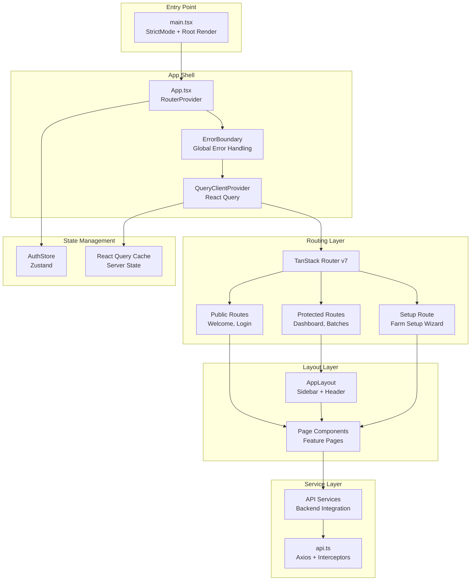
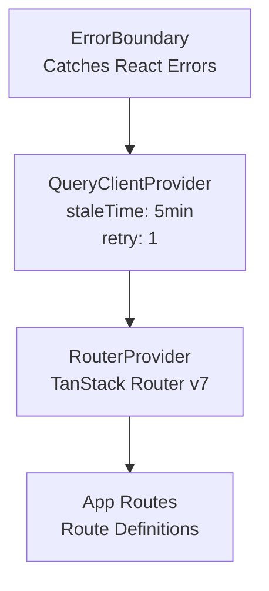
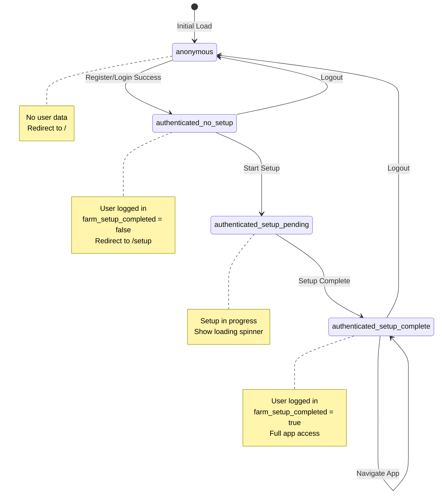
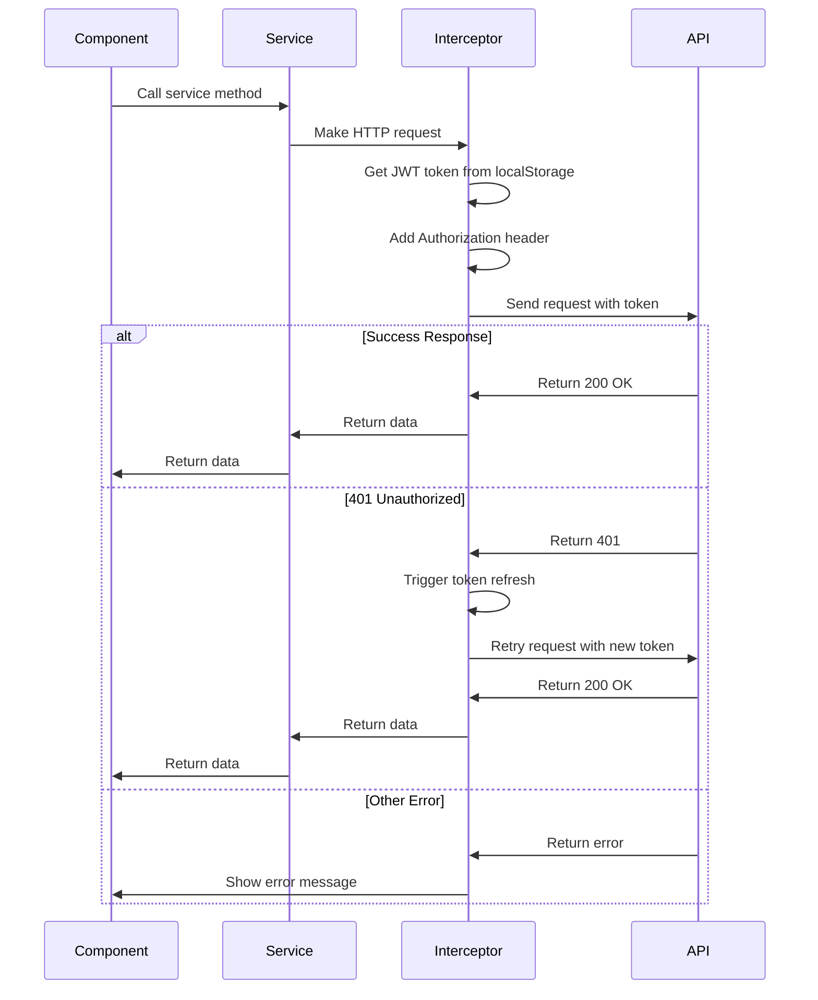

# Frontend Architecture - React 19, TanStack Router, FarmVista Design System & UI Patterns

# Frontend Architecture Specification

**Version:** 1.0.0  
**Last Updated:** January 16, 2026  
**Status:** Production-Ready  
**Epic:** LampFarms Production-Grade Platform - Complete System Consolidation

---

## Table of Contents

1. [Overview & Philosophy](#overview--philosophy)
2. [Technology Stack](#technology-stack)
3. [System Architecture](#system-architecture)
4. [FarmVista Design System](#farmvista-design-system)
5. [Component Library](#component-library)
6. [Auth State Machine](#auth-state-machine)
7. [Service Layer](#service-layer)
8. [Routing Architecture](#routing-architecture)
9. [Mobile-Responsive Patterns](#mobile-responsive-patterns)
10. [Wireframes](#wireframes)
11. [Implementation Guidelines](#implementation-guidelines)

---

## Overview & Philosophy

### Core Principles

**Backend Intelligence, Frontend Simplicity**
- Backend handles calculations, validations, and business logic
- Frontend displays outputs and captures user inputs
- Minimal client-side computation

**Configuration-Driven UI**
- Species-specific protocols loaded from configuration
- Dynamic forms based on species selection
- No hardcoded values in components

**Canonical Implementation Reference**
- **DO NOT DEVIATE:** file:frontend/src/pages/welcome-page.tsx is the single source of truth for UI patterns
- All new pages must follow welcome-page.tsx patterns:
  - Framer Motion animations
  - Shadcn/UI components
  - `rounded-full` inputs with floating labels
  - AppBackground gradient system
  - Consistent spacing and typography

**FarmVista Design Philosophy**
- Clean, professional agricultural aesthetic
- Card-based layouts with clear visual hierarchy
- Green-centric color palette (#16A34A primary)
- Data visualization through charts and gauges
- Mobile-first responsive design

---

## Technology Stack

### Core Technologies

| Technology | Version | Purpose |
|------------|---------|---------|
| **React** | 19.x | UI framework with concurrent features |
| **TypeScript** | 5.x | Type safety and developer experience |
| **TanStack Router** | 7.x | Type-safe routing with file-based structure |
| **TanStack Query** | 5.x | Server state management and caching |
| **Zustand** | 4.x | Client state management (auth, UI state) |
| **Framer Motion** | 11.x | Animations and transitions |
| **Shadcn/UI** | Latest | Component library (Radix UI + Tailwind) |
| **Tailwind CSS** | 3.x | Utility-first styling |
| **Vite** | 5.x | Build tool and dev server |
| **Axios** | 1.x | HTTP client with interceptors |

### Design System

| Element | Technology | Reference |
|---------|-----------|-----------|
| **Color Palette** | FarmVista green (#16A34A) | file:docs/FARMVISTA-DESIGN-ANALYSIS.md |
| **Typography** | Manrope font family | Google Fonts |
| **Icons** | Lucide React | https://lucide.dev |
| **Charts** | Recharts | https://recharts.org |
| **UI Components** | Shadcn/UI | https://ui.shadcn.com |

---

## System Architecture

### Frontend System Architecture



### Provider Composition Hierarchy



**Provider Order Rationale:**
1. **ErrorBoundary** - Must be outermost to catch all errors
2. **QueryClientProvider** - Provides React Query cache to all components
3. **RouterProvider** - Provides routing context
4. **AuthStore** - Zustand store (no provider needed, accessed via hooks)

---

## FarmVista Design System

### Color Palette

**Primary Colors:**

| Color | Hex | CSS Variable | Usage |
|-------|-----|--------------|-------|
| **Green 500** | `#16A34A` | `--primary` | Primary actions, active states, success |
| **Green 50** | `#F0FDF4` | `--primary/10` | Light backgrounds, hover states |
| **Black** | `#0D121C` | `--foreground` | Text, headings |
| **Grey** | `#F3F3F3` | `--muted` | Card backgrounds, borders |
| **White** | `#FFFFFF` | `--card` | Card surfaces, content areas |

**Accent Colors:**

| Color | Hex | Usage |
|-------|-----|-------|
| **Orange** | `#F97316` | Warnings, attention states |
| **Blue** | `#3B82F6` | Charts secondary color, links |
| **Yellow** | `#EAB308` | Weather icons, caution |
| **Red** | `#EF4444` | Errors, critical alerts |

### Typography System

**Font Family:** Manrope (Google Fonts)

| Element | Weight | Size | Tailwind Class |
|---------|--------|------|----------------|
| **Headings** | Bold (700) | 24-32px | `text-2xl font-bold` |
| **Subheadings** | Semibold (600) | 18-20px | `text-lg font-semibold` |
| **Body** | Regular (400) | 14-16px | `text-base` |
| **Labels** | Medium (500) | 12-14px | `text-sm font-medium` |
| **Captions** | Regular (400) | 11-12px | `text-xs text-muted-foreground` |

**Tailwind Config:**
```typescript
fontFamily: {
  sans: ['Manrope', 'system-ui', 'sans-serif'],
  serif: ['Playfair Display', 'Georgia', 'serif'], // Branding only
}
```

### Spacing Scale

| Size | Value | Tailwind | Usage |
|------|-------|----------|-------|
| **XS** | 4px | `space-1` | Tight spacing (icon gaps) |
| **SM** | 8px | `space-2` | Small spacing (within cards) |
| **MD** | 16px | `space-4` | Medium spacing (card padding) |
| **LG** | 24px | `space-6` | Large spacing (section gaps) |
| **XL** | 32px | `space-8` | XL spacing (page margins) |

### Border Radius Standards

| Element | Radius | Tailwind | Usage |
|---------|--------|----------|-------|
| **Inputs** | 9999px | `rounded-full` | Text inputs, search bars |
| **Buttons** | 9999px | `rounded-full` | Primary/secondary buttons |
| **Cards** | 12-16px | `rounded-xl` | Stat cards, content cards |
| **Badges** | 9999px | `rounded-full` | Status badges, pills |
| **Modals** | 24px | `rounded-3xl` | Dialogs, popups |

### Shadow System

| Level | Tailwind | Usage |
|-------|----------|-------|
| **Subtle** | `shadow-sm` | Stat cards, list items |
| **Medium** | `shadow` | Elevated cards, dropdowns |
| **Large** | `shadow-lg` | Modals, popovers |
| **XL** | `shadow-xl` | Main card container (welcome page) |

---

## Component Library

### Core Components

#### 1. StatCard Component

**Purpose:** Display KPI metrics with trend indicators

**Props:**
```typescript
interface StatCardProps {
  label: string
  value: string | number
  unit?: string
  trend?: { value: number; direction: 'up' | 'down' }
  icon?: LucideIcon
  className?: string
}
```

**Usage:**
```typescript
<StatCard
  label="Active Batches"
  value={5}
  unit="batches"
  trend={{ value: 12, direction: 'up' }}
  icon={Bird}
/>
```

#### 2. StatusBadge Component

**Purpose:** Display status with color-coded badges

**Props:**
```typescript
interface StatusBadgeProps {
  status: 'pending' | 'active' | 'completed' | 'alert'
  label?: string
  className?: string
}
```

**Status Colors:**
- **Pending:** Yellow (`bg-yellow-100 text-yellow-800`)
- **Active:** Blue (`bg-blue-100 text-blue-800`)
- **Completed:** Green (`bg-green-100 text-green-800`)
- **Alert:** Red (`bg-red-100 text-red-800`)

#### 3. DataTable Component

**Purpose:** Display tabular data with sorting and filtering

**Features:**
- Column sorting
- Row selection
- Pagination
- Search/filter
- Action buttons per row

#### 4. Chart Components

**Donut Chart:**
- Production overview
- Batch status distribution
- Center value display

**Line Chart:**
- Mortality trends
- FCR over time
- Revenue projections

**Gauge Chart:**
- Batch progress (Day X of Y)
- Feed consumption rate
- Health score

---

## Auth State Machine

### State Diagram



### Zustand Auth Store

**Location:** file:frontend/src/stores/auth-store.ts

**State:**
```typescript
interface AuthState {
  user: User | null
  authState: 'anonymous' | 'authenticated-no-setup' | 'authenticated-setup-pending' | 'authenticated-setup-complete'
  hasHydrated: boolean
  isLoading: boolean
  error: string | null
}
```

**Actions:**
```typescript
interface AuthActions {
  login: (email: string, password: string) => Promise<void>
  register: (email: string, password: string, name: string) => Promise<void>
  logout: () => void
  completeSetup: (farmData: FarmSetupData) => Promise<void>
  refreshAuth: () => Promise<void>
  clearError: () => void
}
```

**Persistence:**
- State persisted to localStorage
- Automatic hydration on app load
- Token refresh on 401 responses

---

## Service Layer

### Service Method Signatures (Example)

```typescript
// BatchService
interface BatchService {
  createBatch(data: CreateBatchDTO): Promise<Batch>
  getBatches(filters?: BatchFilters): Promise<Batch[]>
  getBatchById(id: number): Promise<Batch>
  recordMortality(batchId: number, data: MortalityDTO): Promise<void>
  advanceWeek(batchId: number): Promise<void>
  terminateBatch(batchId: number, reason: string): Promise<void>
}

// FeedService
interface FeedService {
  calculateFeed(data: FeedCalculationDTO): Promise<FeedFormulation>
  getFormulations(batchId: number): Promise<FeedFormulation[]>
  confirmFormulation(id: number): Promise<void>
}
```

### React Query Hook Patterns

```typescript
// Example React Query hooks
const { data: batches } = useQuery({
  queryKey: ['batches', filters],
  queryFn: () => batchService.getBatches(filters)
})

const createBatchMutation = useMutation({
  mutationFn: batchService.createBatch,
  onSuccess: () => queryClient.invalidateQueries(['batches'])
})
```

### Service Architecture

```mermaid
graph TD
    subgraph "Frontend Services"
        A[authService]
        B[batchService]
        C[feedCalculatorService]
        D[healthService]
        E[expenseService]
        F[stockService]
        G[dashboardService]
    end
    
    subgraph "API Client"
        H[api.ts<br/>Axios Instance]
        I[Request Interceptor<br/>Add JWT Token]
        J[Response Interceptor<br/>Handle 401 + Refresh]
    end
    
    subgraph "Backend API"
        K[/api/v1/auth/*]
        L[/api/v1/batches/*]
        M[/api/v1/feed_recipes/*]
        N[/api/v1/health/*]
        O[/api/v1/expenses/*]
    end
    
    A --> H
    B --> H
    C --> H
    D --> H
    E --> H
    F --> H
    G --> H
    
    H --> I
    I --> J
    J --> K
    J --> L
    J --> M
    J --> N
    J --> O
```

### Service Summary

| Service | Purpose | Key Methods | Backend Endpoints |
|---------|---------|-------------|-------------------|
| **authService** | Authentication & user management | login, register, logout, getCurrentUser, completeSetup | `/auth/login`, `/auth/register`, `/auth/me`, `/auth/setup` |
| **batchService** | Batch CRUD & lifecycle | getBatches, createBatch, getBatchById, advanceWeek, recordMortality, terminateBatch | `/batches/*` |
| **feedCalculatorService** | Feed recipe calculation | calculateReadyMade, calculateCustom, calculateConcentrate, saveRecipe | `/feed_recipes/*` |
| **healthService** | Health task management | getHealthTasks, completeTask, calculateMedication, recordVaccination | `/health/*` |
| **expenseService** | Expense tracking | getExpenses, createExpense, updateExpense, deleteExpense | `/expenses/*` |
| **stockService** | Inventory management | getStock, recordPurchase, allocateToBatch, getConsumption | `/stock/*` |
| **dashboardService** | Dashboard data | getQuickStats, getActiveBatches, getRecentActivity, getChartData | `/dashboard/*` |

### Axios Interceptor Flow



---

## Routing Architecture

### Route Structure

**TanStack Router v7** with file-based routing

```
/                    → WelcomePage (public)
/setup               → SetupPage (authenticated-no-setup)
/dashboard           → DashboardPage (authenticated-setup-complete)
/batches             → BatchListPage (authenticated-setup-complete)
/batches/create      → BatchCreatePage (authenticated-setup-complete)
/batches/:id         → BatchDetailPage (authenticated-setup-complete)
/feed                → FeedCalculatorPage (authenticated-setup-complete)
/health              → HealthDashboardPage (authenticated-setup-complete)
/expenses            → ExpensesPage (authenticated-setup-complete)
/stock               → StockPage (authenticated-setup-complete)
/records             → RecordsPage (authenticated-setup-complete)
/settings            → SettingsPage (authenticated-setup-complete)
```

### Route Guards

**Implementation:** file:frontend/src/router.tsx

**Guard Logic:**
```typescript
// Public Route (Welcome Page)
beforeLoad: () => {
  const { authState, hasHydrated } = useAuthStore.getState()
  if (!hasHydrated) return
  
  if (authState === 'authenticated-setup-complete') {
    throw redirect({ to: '/dashboard' })
  }
  if (authState === 'authenticated-no-setup') {
    throw redirect({ to: '/setup' })
  }
}

// Protected Route (Dashboard, Batches, etc.)
beforeLoad: () => {
  const { authState, hasHydrated } = useAuthStore.getState()
  if (!hasHydrated) return
  
  if (authState === 'anonymous') {
    throw redirect({ to: '/' })
  }
  if (authState === 'authenticated-no-setup') {
    throw redirect({ to: '/setup' })
  }
}

// Setup Route
beforeLoad: () => {
  const { authState, hasHydrated } = useAuthStore.getState()
  if (!hasHydrated) return
  
  if (authState === 'anonymous') {
    throw redirect({ to: '/' })
  }
  if (authState === 'authenticated-setup-complete') {
    throw redirect({ to: '/dashboard' })
  }
}
```

---

## Mobile-Responsive Patterns

### Desktop Layout (≥1024px)

```
┌─────────────────────────────────────────────────────────────────────────────┐
│ SIDEBAR (240px fixed)  │  MAIN CONTENT (fluid)                              │
│                        │                                                     │
│ ┌────────────────────┐ │  ┌─────────────────────────────────────────────┐   │
│ │ Logo               │ │  │ Header: Greeting + Search + Profile         │   │
│ ├────────────────────┤ │  └─────────────────────────────────────────────┘   │
│ │ Dashboard (active) │ │                                                     │
│ │ Batches            │ │  ┌──────────┐ ┌──────────┐ ┌──────────┐ ┌────────┐ │
│ │ Feed               │ │  │ Stat Card│ │ Stat Card│ │ Stat Card│ │Revenue │ │
│ │ Health             │ │  └──────────┘ └──────────┘ └──────────┘ └────────┘ │
│ │ Expenses           │ │                                                     │
│ │ Stock              │ │  ┌─────────────────────────┐ ┌───────────────────┐ │
│ │ Records            │ │  │ Chart (2/3 width)       │ │ Summary (1/3)     │ │
│ │ Settings           │ │  └─────────────────────────┘ └───────────────────┘ │
│ ├────────────────────┤ │                                                     │
│ │ Log Out            │ │  ┌─────────────────────────────────────────────┐   │
│ └────────────────────┘ │  │ Table / Task List                           │   │
│                        │  └─────────────────────────────────────────────┘   │
└─────────────────────────────────────────────────────────────────────────────┘
```

### Mobile Layout (<1024px)

```
┌─────────────────────────────────────┐
│ Header: Logo + Menu                 │
├─────────────────────────────────────┤
│                                     │
│ ┌─────────────────────────────────┐ │
│ │ Stat Card (full width)          │ │
│ └─────────────────────────────────┘ │
│                                     │
│ ┌─────────────────────────────────┐ │
│ │ Stat Card (full width)          │ │
│ └─────────────────────────────────┘ │
│                                     │
│ ┌─────────────────────────────────┐ │
│ │ Chart (full width)              │ │
│ └─────────────────────────────────┘ │
│                                     │
│ ┌─────────────────────────────────┐ │
│ │ Table (scrollable)              │ │
│ └─────────────────────────────────┘ │
│                                     │
├─────────────────────────────────────┤
│ Bottom Navigation (5 icons)         │
│ [Dashboard] [Batches] [Feed] [+] [...] │
└─────────────────────────────────────┘
```

### Responsive Breakpoints

| Breakpoint | Width | Layout |
|------------|-------|--------|
| **Mobile** | <640px | Stacked, bottom nav |
| **Tablet** | 640px-1024px | Stacked, collapsible sidebar |
| **Desktop** | ≥1024px | Sidebar + main content |

---

## Wireframes

### 1. StatCard Component

```wireframe
<!DOCTYPE html>
<html>
<head>
<style>
  * { margin: 0; padding: 0; box-sizing: border-box; }
  body { font-family: 'Manrope', system-ui, sans-serif; padding: 20px; background: #f3f3f3; }
  .stat-card { background: white; border-radius: 16px; padding: 20px; box-shadow: 0 1px 3px rgba(0,0,0,0.1); max-width: 280px; }
  .stat-label { font-size: 14px; color: #64748b; font-weight: 500; margin-bottom: 8px; }
  .stat-value { font-size: 32px; font-weight: 700; color: #0D121C; margin-bottom: 8px; }
  .stat-unit { font-size: 18px; font-weight: 400; color: #64748b; margin-left: 4px; }
  .stat-trend { font-size: 12px; display: flex; align-items: center; gap: 4px; }
  .trend-up { color: #16A34A; }
  .trend-down { color: #EF4444; }
  .stat-icon { position: absolute; top: 20px; right: 20px; width: 40px; height: 40px; color: #16A34A; }
</style>
</head>
<body>
  <div class="stat-card" data-element-id="stat-card">
    <div style="position: relative;">
      <svg class="stat-icon" fill="none" stroke="currentColor" viewBox="0 0 24 24">
        <path stroke-linecap="round" stroke-linejoin="round" stroke-width="2" d="M13 7h8m0 0v8m0-8l-8 8-4-4-6 6"/>
      </svg>
      <div class="stat-label">Active Batches</div>
      <div class="stat-value">
        5
        <span class="stat-unit">batches</span>
      </div>
      <div class="stat-trend trend-up">
        <span>↑</span>
        <span>12% from last month</span>
      </div>
    </div>
  </div>
</body>
</html>
```

### 2. StatusBadge Component

```wireframe
<!DOCTYPE html>
<html>
<head>
<style>
  * { margin: 0; padding: 0; box-sizing: border-box; }
  body { font-family: 'Manrope', system-ui, sans-serif; padding: 20px; background: #f3f3f3; }
  .badge-container { display: flex; gap: 12px; flex-wrap: wrap; }
  .status-badge { padding: 6px 12px; border-radius: 9999px; font-size: 12px; font-weight: 500; display: inline-block; }
  .badge-pending { background: #FEF3C7; color: #92400E; }
  .badge-active { background: #DBEAFE; color: #1E40AF; }
  .badge-completed { background: #D1FAE5; color: #065F46; }
  .badge-alert { background: #FEE2E2; color: #991B1B; }
</style>
</head>
<body>
  <div class="badge-container">
    <span class="status-badge badge-pending" data-element-id="badge-pending">Pending</span>
    <span class="status-badge badge-active" data-element-id="badge-active">Active</span>
    <span class="status-badge badge-completed" data-element-id="badge-completed">Completed</span>
    <span class="status-badge badge-alert" data-element-id="badge-alert">Alert</span>
  </div>
</body>
</html>
```

### 3. Sidebar Navigation (Desktop)

```wireframe
<!DOCTYPE html>
<html>
<head>
<style>
  * { margin: 0; padding: 0; box-sizing: border-box; }
  body { font-family: 'Manrope', system-ui, sans-serif; background: #f3f3f3; }
  .sidebar { width: 240px; height: 100vh; background: white; border-right: 1px solid #e5e7eb; padding: 20px; }
  .logo { font-size: 24px; font-weight: 700; color: #0D121C; margin-bottom: 32px; }
  .nav-item { display: flex; align-items: center; gap: 12px; padding: 12px 16px; border-radius: 12px; margin-bottom: 4px; cursor: pointer; transition: all 0.2s; }
  .nav-item:hover { background: #f3f3f3; }
  .nav-item.active { background: #16A34A; color: white; }
  .nav-icon { width: 20px; height: 20px; }
  .nav-label { font-size: 14px; font-weight: 500; }
  .nav-divider { height: 1px; background: #e5e7eb; margin: 16px 0; }
  .logout { color: #EF4444; }
</style>
</head>
<body>
  <div class="sidebar" data-element-id="sidebar">
    <div class="logo">LampFarms</div>
    
    <div class="nav-item active" data-element-id="nav-dashboard">
      <svg class="nav-icon" fill="none" stroke="currentColor" viewBox="0 0 24 24">
        <path stroke-linecap="round" stroke-linejoin="round" stroke-width="2" d="M3 12l2-2m0 0l7-7 7 7M5 10v10a1 1 0 001 1h3m10-11l2 2m-2-2v10a1 1 0 01-1 1h-3m-6 0a1 1 0 001-1v-4a1 1 0 011-1h2a1 1 0 011 1v4a1 1 0 001 1m-6 0h6"/>
      </svg>
      <span class="nav-label">Dashboard</span>
    </div>
    
    <div class="nav-item" data-element-id="nav-batches">
      <svg class="nav-icon" fill="none" stroke="currentColor" viewBox="0 0 24 24">
        <path stroke-linecap="round" stroke-linejoin="round" stroke-width="2" d="M19 11H5m14 0a2 2 0 012 2v6a2 2 0 01-2 2H5a2 2 0 01-2-2v-6a2 2 0 012-2m14 0V9a2 2 0 00-2-2M5 11V9a2 2 0 012-2m0 0V5a2 2 0 012-2h6a2 2 0 012 2v2M7 7h10"/>
      </svg>
      <span class="nav-label">Batches</span>
    </div>
    
    <div class="nav-item" data-element-id="nav-feed">
      <svg class="nav-icon" fill="none" stroke="currentColor" viewBox="0 0 24 24">
        <path stroke-linecap="round" stroke-linejoin="round" stroke-width="2" d="M9 7h6m0 10v-3m-3 3h.01M9 17h.01M9 14h.01M12 14h.01M15 11h.01M12 11h.01M9 11h.01M7 21h10a2 2 0 002-2V5a2 2 0 00-2-2H7a2 2 0 00-2 2v14a2 2 0 002 2z"/>
      </svg>
      <span class="nav-label">Feed Calculator</span>
    </div>
    
    <div class="nav-item" data-element-id="nav-health">
      <svg class="nav-icon" fill="none" stroke="currentColor" viewBox="0 0 24 24">
        <path stroke-linecap="round" stroke-linejoin="round" stroke-width="2" d="M4.318 6.318a4.5 4.5 0 000 6.364L12 20.364l7.682-7.682a4.5 4.5 0 00-6.364-6.364L12 7.636l-1.318-1.318a4.5 4.5 0 00-6.364 0z"/>
      </svg>
      <span class="nav-label">Health Dashboard</span>
    </div>
    
    <div class="nav-item" data-element-id="nav-expenses">
      <svg class="nav-icon" fill="none" stroke="currentColor" viewBox="0 0 24 24">
        <path stroke-linecap="round" stroke-linejoin="round" stroke-width="2" d="M12 8c-1.657 0-3 .895-3 2s1.343 2 3 2 3 .895 3 2-1.343 2-3 2m0-8c1.11 0 2.08.402 2.599 1M12 8V7m0 1v8m0 0v1m0-1c-1.11 0-2.08-.402-2.599-1M21 12a9 9 0 11-18 0 9 9 0 0118 0z"/>
      </svg>
      <span class="nav-label">Expenses</span>
    </div>
    
    <div class="nav-item" data-element-id="nav-stock">
      <svg class="nav-icon" fill="none" stroke="currentColor" viewBox="0 0 24 24">
        <path stroke-linecap="round" stroke-linejoin="round" stroke-width="2" d="M20 7l-8-4-8 4m16 0l-8 4m8-4v10l-8 4m0-10L4 7m8 4v10M4 7v10l8 4"/>
      </svg>
      <span class="nav-label">Stock</span>
    </div>
    
    <div class="nav-item" data-element-id="nav-records">
      <svg class="nav-icon" fill="none" stroke="currentColor" viewBox="0 0 24 24">
        <path stroke-linecap="round" stroke-linejoin="round" stroke-width="2" d="M9 12h6m-6 4h6m2 5H7a2 2 0 01-2-2V5a2 2 0 012-2h5.586a1 1 0 01.707.293l5.414 5.414a1 1 0 01.293.707V19a2 2 0 01-2 2z"/>
      </svg>
      <span class="nav-label">Records</span>
    </div>
    
    <div class="nav-item" data-element-id="nav-settings">
      <svg class="nav-icon" fill="none" stroke="currentColor" viewBox="0 0 24 24">
        <path stroke-linecap="round" stroke-linejoin="round" stroke-width="2" d="M10.325 4.317c.426-1.756 2.924-1.756 3.35 0a1.724 1.724 0 002.573 1.066c1.543-.94 3.31.826 2.37 2.37a1.724 1.724 0 001.065 2.572c1.756.426 1.756 2.924 0 3.35a1.724 1.724 0 00-1.066 2.573c.94 1.543-.826 3.31-2.37 2.37a1.724 1.724 0 00-2.572 1.065c-.426 1.756-2.924 1.756-3.35 0a1.724 1.724 0 00-2.573-1.066c-1.543.94-3.31-.826-2.37-2.37a1.724 1.724 0 00-1.065-2.572c-1.756-.426-1.756-2.924 0-3.35a1.724 1.724 0 001.066-2.573c-.94-1.543.826-3.31 2.37-2.37.996.608 2.296.07 2.572-1.065z"/>
        <path stroke-linecap="round" stroke-linejoin="round" stroke-width="2" d="M15 12a3 3 0 11-6 0 3 3 0 016 0z"/>
      </svg>
      <span class="nav-label">Settings</span>
    </div>
    
    <div class="nav-divider"></div>
    
    <div class="nav-item logout" data-element-id="nav-logout">
      <svg class="nav-icon" fill="none" stroke="currentColor" viewBox="0 0 24 24">
        <path stroke-linecap="round" stroke-linejoin="round" stroke-width="2" d="M17 16l4-4m0 0l-4-4m4 4H7m6 4v1a3 3 0 01-3 3H6a3 3 0 01-3-3V7a3 3 0 013-3h4a3 3 0 013 3v1"/>
      </svg>
      <span class="nav-label">Log Out</span>
    </div>
  </div>
</body>
</html>
```

### 4. Bottom Navigation (Mobile)

```wireframe
<!DOCTYPE html>
<html>
<head>
<style>
  * { margin: 0; padding: 0; box-sizing: border-box; }
  body { font-family: 'Manrope', system-ui, sans-serif; background: #f3f3f3; }
  .bottom-nav { position: fixed; bottom: 0; left: 0; right: 0; background: white; border-top: 1px solid #e5e7eb; display: flex; justify-content: space-around; padding: 12px 0; }
  .nav-item { display: flex; flex-direction: column; align-items: center; gap: 4px; cursor: pointer; }
  .nav-icon { width: 24px; height: 24px; color: #64748b; }
  .nav-item.active .nav-icon { color: #16A34A; }
  .nav-label { font-size: 10px; color: #64748b; font-weight: 500; }
  .nav-item.active .nav-label { color: #16A34A; }
</style>
</head>
<body>
  <div style="height: 100vh; padding-bottom: 80px;">
    <!-- Page content here -->
  </div>
  
  <div class="bottom-nav" data-element-id="bottom-nav">
    <div class="nav-item active" data-element-id="nav-dashboard">
      <svg class="nav-icon" fill="none" stroke="currentColor" viewBox="0 0 24 24">
        <path stroke-linecap="round" stroke-linejoin="round" stroke-width="2" d="M3 12l2-2m0 0l7-7 7 7M5 10v10a1 1 0 001 1h3m10-11l2 2m-2-2v10a1 1 0 01-1 1h-3m-6 0a1 1 0 001-1v-4a1 1 0 011-1h2a1 1 0 011 1v4a1 1 0 001 1m-6 0h6"/>
      </svg>
      <span class="nav-label">Dashboard</span>
    </div>
    
    <div class="nav-item" data-element-id="nav-batches">
      <svg class="nav-icon" fill="none" stroke="currentColor" viewBox="0 0 24 24">
        <path stroke-linecap="round" stroke-linejoin="round" stroke-width="2" d="M19 11H5m14 0a2 2 0 012 2v6a2 2 0 01-2 2H5a2 2 0 01-2-2v-6a2 2 0 012-2m14 0V9a2 2 0 00-2-2M5 11V9a2 2 0 012-2m0 0V5a2 2 0 012-2h6a2 2 0 012 2v2M7 7h10"/>
      </svg>
      <span class="nav-label">Batches</span>
    </div>
    
    <div class="nav-item" data-element-id="nav-feed">
      <svg class="nav-icon" fill="none" stroke="currentColor" viewBox="0 0 24 24">
        <path stroke-linecap="round" stroke-linejoin="round" stroke-width="2" d="M9 7h6m0 10v-3m-3 3h.01M9 17h.01M9 14h.01M12 14h.01M15 11h.01M12 11h.01M9 11h.01M7 21h10a2 2 0 002-2V5a2 2 0 00-2-2H7a2 2 0 00-2 2v14a2 2 0 002 2z"/>
      </svg>
      <span class="nav-label">Feed</span>
    </div>
    
    <div class="nav-item" data-element-id="nav-health">
      <svg class="nav-icon" fill="none" stroke="currentColor" viewBox="0 0 24 24">
        <path stroke-linecap="round" stroke-linejoin="round" stroke-width="2" d="M4.318 6.318a4.5 4.5 0 000 6.364L12 20.364l7.682-7.682a4.5 4.5 0 00-6.364-6.364L12 7.636l-1.318-1.318a4.5 4.5 0 00-6.364 0z"/>
      </svg>
      <span class="nav-label">Health</span>
    </div>
    
    <div class="nav-item" data-element-id="nav-more">
      <svg class="nav-icon" fill="none" stroke="currentColor" viewBox="0 0 24 24">
        <path stroke-linecap="round" stroke-linejoin="round" stroke-width="2" d="M4 6h16M4 12h16M4 18h16"/>
      </svg>
      <span class="nav-label">More</span>
    </div>
  </div>
</body>
</html>
```

### 5. Dashboard Layout (Responsive Grid)

```wireframe
<!DOCTYPE html>
<html>
<head>
<style>
  * { margin: 0; padding: 0; box-sizing: border-box; }
  body { font-family: 'Manrope', system-ui, sans-serif; background: #f3f3f3; padding: 20px; }
  .dashboard { max-width: 1400px; margin: 0 auto; }
  .header { margin-bottom: 32px; }
  .greeting { font-size: 28px; font-weight: 700; color: #0D121C; margin-bottom: 8px; }
  .subtext { font-size: 14px; color: #64748b; }
  .stats-grid { display: grid; grid-template-columns: repeat(auto-fit, minmax(240px, 1fr)); gap: 16px; margin-bottom: 24px; }
  .stat-card { background: white; border-radius: 16px; padding: 20px; box-shadow: 0 1px 3px rgba(0,0,0,0.1); }
  .stat-label { font-size: 14px; color: #64748b; margin-bottom: 8px; }
  .stat-value { font-size: 32px; font-weight: 700; color: #0D121C; }
  .charts-grid { display: grid; grid-template-columns: 2fr 1fr; gap: 16px; margin-bottom: 24px; }
  .chart-card { background: white; border-radius: 16px; padding: 20px; box-shadow: 0 1px 3px rgba(0,0,0,0.1); }
  .chart-title { font-size: 18px; font-weight: 600; color: #0D121C; margin-bottom: 16px; }
  .chart-placeholder { height: 200px; background: #f3f3f3; border-radius: 8px; display: flex; align-items: center; justify-content: center; color: #64748b; }
  @media (max-width: 1024px) {
    .charts-grid { grid-template-columns: 1fr; }
  }
</style>
</head>
<body>
  <div class="dashboard" data-element-id="dashboard">
    <div class="header">
      <div class="greeting">Good Morning, John!</div>
      <div class="subtext">Here's what's happening with your farm today</div>
    </div>
    
    <div class="stats-grid">
      <div class="stat-card" data-element-id="stat-active-batches">
        <div class="stat-label">Active Batches</div>
        <div class="stat-value">5</div>
      </div>
      
      <div class="stat-card" data-element-id="stat-total-birds">
        <div class="stat-label">Total Birds</div>
        <div class="stat-value">12,500</div>
      </div>
      
      <div class="stat-card" data-element-id="stat-avg-fcr">
        <div class="stat-label">Avg FCR</div>
        <div class="stat-value">1.65</div>
      </div>
      
      <div class="stat-card" data-element-id="stat-revenue">
        <div class="stat-label">Revenue (This Month)</div>
        <div class="stat-value">₵45,200</div>
      </div>
    </div>
    
    <div class="charts-grid">
      <div class="chart-card" data-element-id="chart-mortality">
        <div class="chart-title">Mortality Trend</div>
        <div class="chart-placeholder">Line Chart</div>
      </div>
      
      <div class="chart-card" data-element-id="chart-batch-status">
        <div class="chart-title">Batch Status</div>
        <div class="chart-placeholder">Donut Chart</div>
      </div>
    </div>
    
    <div class="chart-card" data-element-id="recent-activity">
      <div class="chart-title">Recent Activity</div>
      <div class="chart-placeholder">Activity List</div>
    </div>
  </div>
</body>
</html>
```

---

## Implementation Guidelines

### 1. Component Development Checklist

**For Every New Component:**
- [ ] Follow welcome-page.tsx patterns (rounded-full inputs, Framer Motion, AppBackground)
- [ ] Use FarmVista color palette (primary green #16A34A)
- [ ] Implement mobile-responsive design (breakpoints: 640px, 1024px)
- [ ] Add TypeScript types for all props
- [ ] Include data-element-id attributes for testing
- [ ] Use Shadcn/UI components where applicable
- [ ] Add loading states and error handling
- [ ] Implement accessibility (ARIA labels, keyboard navigation)

### 2. Service Integration Checklist

**For Every New Service:**
- [ ] Use shared api.ts axios instance
- [ ] Add TypeScript types for request/response
- [ ] Handle errors with try-catch and user-friendly messages
- [ ] Use React Query for data fetching (staleTime: 5min)
- [ ] Add loading and error states to UI
- [ ] Implement optimistic updates where appropriate

### 3. Routing Checklist

**For Every New Route:**
- [ ] Add route definition in router.tsx
- [ ] Implement appropriate route guard (public/protected/setup)
- [ ] Add navigation link in sidebar/bottom nav
- [ ] Test redirect flows (anonymous → login, no-setup → setup)
- [ ] Add page title and meta tags

### 4. State Management Checklist

**For Every New State:**
- [ ] Determine if server state (React Query) or client state (Zustand)
- [ ] Add TypeScript types for state shape
- [ ] Implement persistence if needed (localStorage)
- [ ] Add loading and error states
- [ ] Test state updates and side effects

### 5. Testing Checklist

**For Every Feature:**
- [ ] Unit tests for services (mock axios)
- [ ] Component tests (React Testing Library)
- [ ] Integration tests for user flows
- [ ] E2E tests for critical paths (Playwright)
- [ ] Accessibility tests (axe-core)

---

## Related Specifications

**Backend Integration:**
- spec:bceeaefd-5139-4801-8c12-de8a8b6faf8a/35142770-c1b0-4df2-85e2-5a839616334a - Backend Architecture

**Design References:**
- file:docs/FARMVISTA-DESIGN-ANALYSIS.md - FarmVista design philosophy
- file:docs/wireframes/ - Dashboard UI wireframes
- file:frontend/src/pages/welcome-page.tsx - Canonical implementation (DO NOT DEVIATE)

**Architecture Documentation:**
- file:docs/architecture/03-frontend-architecture.md - Frontend system architecture
- file:docs/ui-ux/01-component-hierarchy.md - Component hierarchy
- file:docs/state-management/01-context-architecture.md - State management patterns

---

## Acceptance Criteria

### Functional Requirements

**FR-1: Authentication Flow**
- [ ] User can register with email/password
- [ ] User can login with email/password
- [ ] User is redirected to setup if farm_setup_completed = false
- [ ] User is redirected to dashboard if farm_setup_completed = true
- [ ] User can logout and return to welcome page

**FR-2: Route Guards**
- [ ] Anonymous users cannot access protected routes
- [ ] Authenticated users without setup cannot access dashboard
- [ ] Authenticated users with setup can access all protected routes
- [ ] Route guards check hasHydrated before redirecting

**FR-3: Service Layer**
- [ ] All services use shared axios instance
- [ ] JWT tokens automatically attached to requests
- [ ] 401 responses trigger token refresh
- [ ] Errors display user-friendly messages

**FR-4: Component Library**
- [ ] StatCard displays KPI with trend indicator
- [ ] StatusBadge shows color-coded status
- [ ] DataTable supports sorting and filtering
- [ ] Charts render with Recharts library

### Non-Functional Requirements

**NFR-1: Performance**
- [ ] Initial page load < 2 seconds
- [ ] Route transitions < 300ms
- [ ] React Query cache reduces redundant API calls
- [ ] Images lazy-loaded and optimized

**NFR-2: Accessibility**
- [ ] WCAG 2.1 AA compliance
- [ ] Keyboard navigation for all interactive elements
- [ ] Screen reader support with ARIA labels
- [ ] Color contrast ratios meet standards

**NFR-3: Mobile Responsiveness**
- [ ] All pages responsive on mobile (320px+)
- [ ] Bottom navigation on mobile (<1024px)
- [ ] Touch-friendly tap targets (44x44px minimum)
- [ ] Horizontal scrolling avoided

**NFR-4: Code Quality**
- [ ] TypeScript strict mode enabled
- [ ] ESLint and Prettier configured
- [ ] No console errors or warnings
- [ ] Component props fully typed

---

## Version History

| Version | Date | Changes |
|---------|------|---------|
| 1.0.0 | January 16, 2026 | Initial specification with complete architecture, design system, and wireframes |

---

**Status:** Production-Ready  
**Next Steps:** Create Batch Management System Specification (3-step wizard, batch lifecycle, species-specific protocols)
