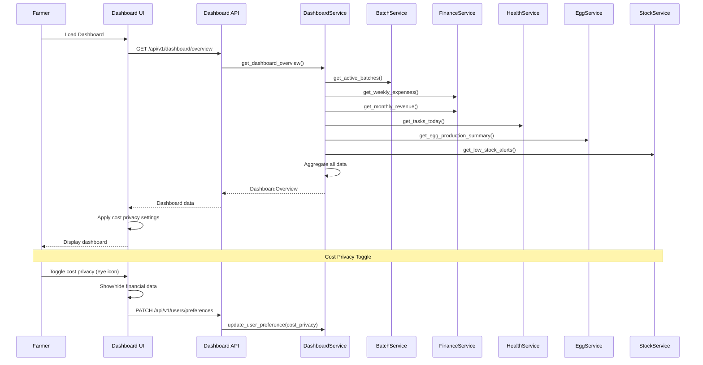

# Main Dashboard - Production-Grade Specification (Central Hub with Cost Privacy)

# Main Dashboard - Production-Grade Specification

**Epic:** epic:bceeaefd-5139-4801-8c12-de8a8b6faf8a  
**Status:** Production-Ready Specification  
**Last Updated:** January 2026  
**Architecture:** Validated Tech Plan (spec:bceeaefd-5139-4801-8c12-de8a8b6faf8a/950515a2-7eeb-4375-9e58-6df156a25a3b)

---

## Overview

The Main Dashboard serves as the **central hub** of LampFarms, providing farmers with a comprehensive overview of their farm operations at a glance. It aggregates data from all systems (Batch, Feed, Water-Health, Finance, Stock, Eggs, Records) and presents it in a clean, actionable format.

### Core Philosophy

**Backend Intelligence, Frontend Simplicity:**

- Backend aggregates data from all systems
- Frontend displays clear, actionable overview
- Real-time updates for critical metrics
- Cost privacy maintained throughout

**Farmer-Centric Design:**

- Quick overview (key metrics at a glance)
- Easy navigation (sidebar with all 9 menu items)
- Compact batch summaries (active batches with status)
- Recent activity (latest actions across all systems)
- Tab-based charts (space conservative, changeable)

**Cost Privacy:**

- Financial data hidden by default (eye icon toggle)
- User preference saved in Settings
- Applies to all financial metrics (expenses, revenue, costs)
- Non-financial data always visible

### Scope

**Dashboard Components:**

1. **Sidebar Navigation** - All 9 navigation items with user avatar at bottom
2. **Quick Stats** - Active batches, tasks today, weekly expenses, monthly revenue
3. **Active Batches** - Compact tile cards with essential info and quick actions
4. **Tab-Based Charts** - Overview, Expenses, Production, Performance (space conservative)
5. **Recent Activity** - Compact feed of latest actions (right sidebar, minimal)

---

## System Architecture



---

## Section 1: Main Dashboard Layout (Desktop)

### Purpose

Central hub with sidebar navigation, quick stats, active batch tiles, tab-based charts, and recent activity.

### ASCII Layout Diagram

```
┌────────────────────────────────────────────────────────────────────────────────────────┐
│  SIDEBAR (240px)    │              MAIN CONTENT (flex-1)                │ ACTIVITY (280px)│
│                     │                                                    │                 │
│  🏠 Dashboard       │  Welcome back, Farmer Kofi! 👋                    │ Recent Activity │
│  🐔 Batches         │                                                    │                 │
│  🌾 Feed            │  Quick Stats (4 cards):                           │ • Feed calc...  │
│  💧 Water-Health    │  ┌──────────┬──────────┬──────────┬──────────┐   │   2 hours ago   │
│  🥚 Eggs            │  │ Active   │ Tasks    │ This Week│ This     │   │                 │
│  💰 Finance         │  │ Batches  │ Today    │ Expenses │ Month    │   │ • Mortality...  │
│  📦 Stock           │  │          │          │          │ Revenue  │   │   5 hours ago   │
│  📊 Records         │  │ 3        │ 5        │ ●●●● 👁  │ ●●●● 👁  │   │                 │
│  ⚙️ Settings        │  └──────────┴──────────┴──────────┴──────────┘   │ • Vaccination.. │
│                     │                                                    │   1 day ago     │
│  ─────────────      │  Active Batches (3 compact tiles):                │                 │
│  [KM]               │  ┌──────────┬──────────┬──────────┐              │ • Egg sale...   │
│  Kofi Mensah        │  │ Broilers │ Layers   │ Ducks    │              │   1 day ago     │
│  Farm Owner         │  │ Batch#12 │ Batch#8  │ Batch#5  │              │                 │
│  (Avatar Bottom)    │  │ Week 6   │ Week 30  │ Week 12  │              │ [View All]      │
│                     │  │ Day 5    │ Day 3    │ Day 2    │              │                 │
│                     │  │ 490/500  │ 485/500  │ 295/300  │              │                 │
│                     │  │ Finisher │ Peak Prod│ Finisher │              │                 │
│                     │  │ 2 tasks  │ 1 task   │ 3 tasks  │              │                 │
│                     │  │ [View]   │ [View]   │ [View]   │              │                 │
│                     │  │ [📝 Mort]│ [📝 Mort]│ [📝 Mort]│              │                 │
│                     │  └──────────┴──────────┴──────────┘              │                 │
│                     │                                                    │                 │
│                     │  Tab-Based Charts (space conservative):           │                 │
│                     │  [Overview] [Expenses] [Production] [Performance] │                 │
│                     │  ┌────────────────────────────────────────────┐   │                 │
│                     │  │ Chart content (changeable by tab)         │   │                 │
│                     │  │ - Overview: Batch status distribution     │   │                 │
│                     │  │ - Expenses: Weekly expense breakdown      │   │                 │
│                     │  │ - Production: Egg production trends       │   │                 │
│                     │  │ - Performance: Mortality rates by batch   │   │                 │
│                     │  └────────────────────────────────────────────┘   │                 │
│                     │                                                    │                 │
└────────────────────────────────────────────────────────────────────────────────────────┘
```

### Wireframe: Main Dashboard (Desktop)

```wireframe
<!DOCTYPE html>
<html>
<head>
<style>
* { margin: 0; padding: 0; box-sizing: border-box; }
body { font-family: 'Manrope', sans-serif; background: #f9fafb; display: flex; min-height: 100vh; }
.sidebar { width: 240px; background: white; border-right: 1px solid #e5e7eb; display: flex; flex-direction: column; }
.sidebar-header { padding: 24px; border-bottom: 1px solid #e5e7eb; }
.logo { font-size: 20px; font-weight: 600; color: #16a34a; }
.nav-menu { flex: 1; padding: 16px 0; }
.nav-item { display: flex; align-items: center; gap: 12px; padding: 12px 24px; color: #6b7280; cursor: pointer; transition: all 0.2s; }
.nav-item:hover { background: #f9fafb; color: #16a34a; }
.nav-item.active { background: #f0fdf4; color: #16a34a; border-right: 3px solid #16a34a; }
.nav-icon { font-size: 20px; }
.nav-text { font-size: 14px; font-weight: 500; }
.sidebar-footer { padding: 16px; border-top: 1px solid #e5e7eb; }
.user-profile { display: flex; align-items: center; gap: 12px; }
.user-avatar { width: 40px; height: 40px; border-radius: 50%; background: #16a34a; color: white; display: flex; align-items: center; justify-content: center; font-weight: 600; }
.user-info { flex: 1; }
.user-name { font-size: 14px; font-weight: 600; color: #111827; }
.user-role { font-size: 12px; color: #6b7280; }
.main-content { flex: 1; padding: 24px; overflow-y: auto; }
.page-header { margin-bottom: 24px; }
.page-title { font-size: 28px; font-weight: 600; color: #111827; }
.quick-stats { display: grid; grid-template-columns: repeat(4, 1fr); gap: 16px; margin-bottom: 32px; }
.stat-card { background: white; border: 1px solid #e5e7eb; border-radius: 12px; padding: 20px; }
.stat-header { display: flex; justify-content: space-between; align-items: center; margin-bottom: 12px; }
.stat-label { font-size: 14px; color: #6b7280; }
.stat-privacy { cursor: pointer; color: #9ca3af; font-size: 16px; }
.stat-value { font-size: 32px; font-weight: 600; color: #111827; }
.stat-value.hidden { color: #d1d5db; }
.section-title { font-size: 18px; font-weight: 600; color: #111827; margin-bottom: 16px; }
.batch-grid { display: grid; grid-template-columns: repeat(3, 1fr); gap: 16px; margin-bottom: 32px; }
.batch-card { background: white; border: 1px solid #e5e7eb; border-radius: 12px; padding: 16px; }
.batch-header { margin-bottom: 12px; }
.batch-species { font-size: 12px; color: #6b7280; text-transform: uppercase; }
.batch-name { font-size: 16px; font-weight: 600; color: #111827; }
.batch-meta { display: flex; gap: 8px; margin-bottom: 8px; font-size: 13px; color: #6b7280; }
.batch-stats { margin-bottom: 12px; }
.batch-stat { display: flex; justify-content: space-between; padding: 4px 0; font-size: 13px; }
.batch-stat-label { color: #6b7280; }
.batch-stat-value { color: #111827; font-weight: 500; }
.batch-actions { display: flex; gap: 8px; }
.btn { padding: 8px 16px; border-radius: 9999px; font-size: 13px; font-weight: 500; cursor: pointer; transition: all 0.2s; border: none; }
.btn-secondary { background: white; color: #374151; border: 1px solid #d1d5db; }
.btn-secondary:hover { background: #f9fafb; }
.chart-section { background: white; border: 1px solid #e5e7eb; border-radius: 12px; padding: 24px; margin-bottom: 32px; }
.chart-tabs { display: flex; gap: 8px; border-bottom: 2px solid #e5e7eb; margin-bottom: 24px; }
.chart-tab { padding: 12px 24px; font-size: 14px; font-weight: 500; color: #6b7280; cursor: pointer; border-bottom: 2px solid transparent; margin-bottom: -2px; }
.chart-tab.active { color: #16a34a; border-bottom-color: #16a34a; }
.chart-placeholder { height: 300px; background: #f9fafb; border-radius: 8px; display: flex; align-items: center; justify-content: center; color: #9ca3af; }
.activity-sidebar { width: 280px; background: white; border-left: 1px solid #e5e7eb; padding: 24px; overflow-y: auto; }
.activity-title { font-size: 16px; font-weight: 600; color: #111827; margin-bottom: 16px; }
.activity-list { display: flex; flex-direction: column; gap: 16px; }
.activity-item { padding-bottom: 16px; border-bottom: 1px solid #e5e7eb; }
.activity-item:last-child { border-bottom: none; }
.activity-description { font-size: 13px; color: #374151; margin-bottom: 4px; }
.activity-time { font-size: 12px; color: #9ca3af; }
.activity-footer { margin-top: 16px; }
.link { color: #16a34a; font-size: 13px; font-weight: 500; cursor: pointer; }
</style>
</head>
<body>
<div class="sidebar">
  <div class="sidebar-header">
    <div class="logo">🌾 LampFarms</div>
  </div>
  <div class="nav-menu">
    <div class="nav-item active" data-element-id="nav-dashboard">
      <span class="nav-icon">🏠</span>
      <span class="nav-text">Dashboard</span>
    </div>
    <div class="nav-item" data-element-id="nav-batches">
      <span class="nav-icon">🐔</span>
      <span class="nav-text">Batches</span>
    </div>
    <div class="nav-item" data-element-id="nav-feed">
      <span class="nav-icon">🌾</span>
      <span class="nav-text">Feed</span>
    </div>
    <div class="nav-item" data-element-id="nav-water-health">
      <span class="nav-icon">💧</span>
      <span class="nav-text">Water-Health</span>
    </div>
    <div class="nav-item" data-element-id="nav-eggs">
      <span class="nav-icon">🥚</span>
      <span class="nav-text">Eggs</span>
    </div>
    <div class="nav-item" data-element-id="nav-finance">
      <span class="nav-icon">💰</span>
      <span class="nav-text">Finance</span>
    </div>
    <div class="nav-item" data-element-id="nav-stock">
      <span class="nav-icon">📦</span>
      <span class="nav-text">Stock</span>
    </div>
    <div class="nav-item" data-element-id="nav-records">
      <span class="nav-icon">📊</span>
      <span class="nav-text">Records</span>
    </div>
    <div class="nav-item" data-element-id="nav-settings">
      <span class="nav-icon">⚙️</span>
      <span class="nav-text">Settings</span>
    </div>
  </div>
  <div class="sidebar-footer">
    <div class="user-profile">
      <div class="user-avatar">KM</div>
      <div class="user-info">
        <div class="user-name">Kofi Mensah</div>
        <div class="user-role">Farm Owner</div>
      </div>
    </div>
  </div>
</div>
<div class="main-content">
  <div class="page-header">
    <h1 class="page-title">Welcome back, Farmer Kofi! 👋</h1>
  </div>
  <div class="quick-stats">
    <div class="stat-card">
      <div class="stat-header">
        <span class="stat-label">Active Batches</span>
      </div>
      <div class="stat-value">3</div>
    </div>
    <div class="stat-card">
      <div class="stat-header">
        <span class="stat-label">Tasks Today</span>
      </div>
      <div class="stat-value">5</div>
    </div>
    <div class="stat-card">
      <div class="stat-header">
        <span class="stat-label">This Week Expenses</span>
        <span class="stat-privacy" data-element-id="toggle-expenses">👁</span>
      </div>
      <div class="stat-value">●●●●</div>
    </div>
    <div class="stat-card">
      <div class="stat-header">
        <span class="stat-label">This Month Revenue</span>
        <span class="stat-privacy" data-element-id="toggle-revenue">👁</span>
      </div>
      <div class="stat-value">●●●●</div>
    </div>
  </div>
  <div class="section-title">Active Batches</div>
  <div class="batch-grid">
    <div class="batch-card">
      <div class="batch-header">
        <div class="batch-species">Broilers</div>
        <div class="batch-name">Batch #12</div>
      </div>
      <div class="batch-meta">
        <span>Week 6</span>
        <span>•</span>
        <span>Day 5</span>
      </div>
      <div class="batch-stats">
        <div class="batch-stat">
          <span class="batch-stat-label">Population:</span>
          <span class="batch-stat-value">490/500</span>
        </div>
        <div class="batch-stat">
          <span class="batch-stat-label">Phase:</span>
          <span class="batch-stat-value">Finisher</span>
        </div>
        <div class="batch-stat">
          <span class="batch-stat-label">Tasks:</span>
          <span class="batch-stat-value">2 pending</span>
        </div>
      </div>
      <div class="batch-actions">
        <button class="btn btn-secondary" data-element-id="btn-view-batch-1">View</button>
        <button class="btn btn-secondary" data-element-id="btn-mortality-1">📝 Mortality</button>
      </div>
    </div>
    <div class="batch-card">
      <div class="batch-header">
        <div class="batch-species">Layers</div>
        <div class="batch-name">Batch #8</div>
      </div>
      <div class="batch-meta">
        <span>Week 30</span>
        <span>•</span>
        <span>Day 3</span>
      </div>
      <div class="batch-stats">
        <div class="batch-stat">
          <span class="batch-stat-label">Population:</span>
          <span class="batch-stat-value">485/500</span>
        </div>
        <div class="batch-stat">
          <span class="batch-stat-label">Phase:</span>
          <span class="batch-stat-value">Peak Production</span>
        </div>
        <div class="batch-stat">
          <span class="batch-stat-label">Tasks:</span>
          <span class="batch-stat-value">1 pending</span>
        </div>
      </div>
      <div class="batch-actions">
        <button class="btn btn-secondary" data-element-id="btn-view-batch-2">View</button>
        <button class="btn btn-secondary" data-element-id="btn-mortality-2">📝 Mortality</button>
      </div>
    </div>
    <div class="batch-card">
      <div class="batch-header">
        <div class="batch-species">Ducks</div>
        <div class="batch-name">Batch #5</div>
      </div>
      <div class="batch-meta">
        <span>Week 12</span>
        <span>•</span>
        <span>Day 2</span>
      </div>
      <div class="batch-stats">
        <div class="batch-stat">
          <span class="batch-stat-label">Population:</span>
          <span class="batch-stat-value">295/300</span>
        </div>
        <div class="batch-stat">
          <span class="batch-stat-label">Phase:</span>
          <span class="batch-stat-value">Finisher</span>
        </div>
        <div class="batch-stat">
          <span class="batch-stat-label">Tasks:</span>
          <span class="batch-stat-value">3 pending</span>
        </div>
      </div>
      <div class="batch-actions">
        <button class="btn btn-secondary" data-element-id="btn-view-batch-3">View</button>
        <button class="btn btn-secondary" data-element-id="btn-mortality-3">📝 Mortality</button>
      </div>
    </div>
  </div>
  <div class="chart-section">
    <div class="chart-tabs">
      <div class="chart-tab active" data-element-id="tab-overview">Overview</div>
      <div class="chart-tab" data-element-id="tab-expenses">Expenses</div>
      <div class="chart-tab" data-element-id="tab-production">Production</div>
      <div class="chart-tab" data-element-id="tab-performance">Performance</div>
    </div>
    <div class="chart-placeholder">Chart content (changeable by tab)</div>
  </div>
</div>
<div class="activity-sidebar">
  <div class="activity-title">Recent Activity</div>
  <div class="activity-list">
    <div class="activity-item">
      <div class="activity-description">Feed calculated for Batch #12</div>
      <div class="activity-time">2 hours ago</div>
    </div>
    <div class="activity-item">
      <div class="activity-description">Medication completed for Batch #8</div>
      <div class="activity-time">5 hours ago</div>
    </div>
    <div class="activity-item">
      <div class="activity-description">Vaccination completed for Batch #5</div>
      <div class="activity-time">1 day ago</div>
    </div>
    <div class="activity-item">
      <div class="activity-description">Egg sale recorded for Batch #8</div>
      <div class="activity-time">1 day ago</div>
    </div>
  </div>
  <div class="activity-footer">
    <a class="link" data-element-id="link-view-all">View All Activity →</a>
  </div>
</div>
</body>
</html>
```

---

## Section 2: Main Dashboard Layout (Mobile)

### Purpose

Mobile-optimized dashboard with bottom navigation and stacked layout.

### ASCII Layout Diagram

```
┌────────────────────────────────────┐
│  🌾 LampFarms          [KM] ⚙️     │
├────────────────────────────────────┤
│  Welcome back, Farmer Kofi! 👋     │
│                                    │
│  Quick Stats (2x2 grid):           │
│  ┌──────────┬──────────┐           │
│  │ Active   │ Tasks    │           │
│  │ Batches  │ Today    │           │
│  │ 3        │ 5        │           │
│  ├──────────┼──────────┤           │
│  │ This Week│ This     │           │
│  │ Expenses │ Month    │           │
│  │ ●●●● 👁  │ Revenue  │           │
│  │          │ ●●●● 👁  │           │
│  └──────────┴──────────┘           │
│                                    │
│  Active Batches (stacked):         │
│  ┌────────────────────────────────┐│
│  │ Broilers - Batch #12           ││
│  │ Week 6, Day 5 | 490/500        ││
│  │ Finisher | 2 tasks             ││
│  │ [View] [📝 Mortality]          ││
│  └────────────────────────────────┘│
│  ┌────────────────────────────────┐│
│  │ Layers - Batch #8              ││
│  │ Week 30, Day 3 | 485/500       ││
│  │ Peak Production | 1 task       ││
│  │ [View] [📝 Mortality]          ││
│  └────────────────────────────────┘│
│                                    │
│  Charts (tab-based):               │
│  [Overview] [Expenses] [Prod] [...│
│  ┌────────────────────────────────┐│
│  │ Chart content                  ││
│  └────────────────────────────────┘│
│                                    │
│  Recent Activity:                  │
│  • Feed calculated (Batch #12)     │
│  • Medication completed (Batch #8) │
│  • Vaccination (Batch #5)          │
│  [View All]                        │
│                                    │
├────────────────────────────────────┤
│  🏠  🐔  🌾  💧  ⚙️  (Bottom Nav)  │
└────────────────────────────────────┘
```

### Wireframe: Main Dashboard (Mobile)

```wireframe
<!DOCTYPE html>
<html>
<head>
<style>
* { margin: 0; padding: 0; box-sizing: border-box; }
body { font-family: 'Manrope', sans-serif; background: #f9fafb; padding-bottom: 80px; }
.mobile-header { background: white; padding: 16px; border-bottom: 1px solid #e5e7eb; display: flex; justify-content: space-between; align-items: center; }
.logo { font-size: 18px; font-weight: 600; color: #16a34a; }
.header-actions { display: flex; gap: 12px; align-items: center; }
.user-avatar { width: 32px; height: 32px; border-radius: 50%; background: #16a34a; color: white; display: flex; align-items: center; justify-content: center; font-size: 12px; font-weight: 600; }
.settings-icon { font-size: 20px; color: #6b7280; cursor: pointer; }
.page-content { padding: 16px; }
.page-title { font-size: 20px; font-weight: 600; color: #111827; margin-bottom: 16px; }
.quick-stats { display: grid; grid-template-columns: repeat(2, 1fr); gap: 12px; margin-bottom: 24px; }
.stat-card { background: white; border: 1px solid #e5e7eb; border-radius: 12px; padding: 16px; }
.stat-header { display: flex; justify-content: space-between; align-items: center; margin-bottom: 8px; }
.stat-label { font-size: 12px; color: #6b7280; }
.stat-privacy { cursor: pointer; color: #9ca3af; font-size: 14px; }
.stat-value { font-size: 24px; font-weight: 600; color: #111827; }
.section-title { font-size: 16px; font-weight: 600; color: #111827; margin-bottom: 12px; }
.batch-list { display: flex; flex-direction: column; gap: 12px; margin-bottom: 24px; }
.batch-card { background: white; border: 1px solid #e5e7eb; border-radius: 12px; padding: 16px; }
.batch-header { display: flex; justify-content: space-between; align-items: center; margin-bottom: 8px; }
.batch-title { font-size: 14px; font-weight: 600; color: #111827; }
.batch-meta { font-size: 12px; color: #6b7280; margin-bottom: 8px; }
.batch-actions { display: flex; gap: 8px; margin-top: 12px; }
.btn { padding: 8px 16px; border-radius: 9999px; font-size: 12px; font-weight: 500; cursor: pointer; transition: all 0.2s; border: none; }
.btn-secondary { background: white; color: #374151; border: 1px solid #d1d5db; }
.chart-section { background: white; border: 1px solid #e5e7eb; border-radius: 12px; padding: 16px; margin-bottom: 24px; }
.chart-tabs { display: flex; gap: 4px; overflow-x: auto; border-bottom: 2px solid #e5e7eb; margin-bottom: 16px; }
.chart-tab { padding: 8px 16px; font-size: 12px; font-weight: 500; color: #6b7280; cursor: pointer; border-bottom: 2px solid transparent; margin-bottom: -2px; white-space: nowrap; }
.chart-tab.active { color: #16a34a; border-bottom-color: #16a34a; }
.chart-placeholder { height: 200px; background: #f9fafb; border-radius: 8px; display: flex; align-items: center; justify-content: center; color: #9ca3af; font-size: 12px; }
.activity-section { background: white; border: 1px solid #e5e7eb; border-radius: 12px; padding: 16px; margin-bottom: 24px; }
.activity-list { display: flex; flex-direction: column; gap: 12px; }
.activity-item { padding-bottom: 12px; border-bottom: 1px solid #e5e7eb; }
.activity-item:last-child { border-bottom: none; }
.activity-description { font-size: 12px; color: #374151; margin-bottom: 4px; }
.activity-time { font-size: 11px; color: #9ca3af; }
.link { color: #16a34a; font-size: 12px; font-weight: 500; cursor: pointer; margin-top: 12px; display: inline-block; }
.bottom-nav { position: fixed; bottom: 0; left: 0; right: 0; background: white; border-top: 1px solid #e5e7eb; display: flex; justify-content: space-around; padding: 12px 0; }
.nav-item { display: flex; flex-direction: column; align-items: center; gap: 4px; cursor: pointer; }
.nav-icon { font-size: 20px; color: #6b7280; }
.nav-item.active .nav-icon { color: #16a34a; }
.nav-label { font-size: 10px; color: #6b7280; }
.nav-item.active .nav-label { color: #16a34a; }
</style>
</head>
<body>
<div class="mobile-header">
  <div class="logo">🌾 LampFarms</div>
  <div class="header-actions">
    <div class="user-avatar">KM</div>
    <div class="settings-icon">⚙️</div>
  </div>
</div>
<div class="page-content">
  <div class="page-title">Welcome back, Farmer Kofi! 👋</div>
  <div class="quick-stats">
    <div class="stat-card">
      <div class="stat-header">
        <span class="stat-label">Active Batches</span>
      </div>
      <div class="stat-value">3</div>
    </div>
    <div class="stat-card">
      <div class="stat-header">
        <span class="stat-label">Tasks Today</span>
      </div>
      <div class="stat-value">5</div>
    </div>
    <div class="stat-card">
      <div class="stat-header">
        <span class="stat-label">This Week</span>
        <span class="stat-privacy" data-element-id="toggle-expenses-mobile">👁</span>
      </div>
      <div class="stat-value">●●●●</div>
    </div>
    <div class="stat-card">
      <div class="stat-header">
        <span class="stat-label">This Month</span>
        <span class="stat-privacy" data-element-id="toggle-revenue-mobile">👁</span>
      </div>
      <div class="stat-value">●●●●</div>
    </div>
  </div>
  <div class="section-title">Active Batches</div>
  <div class="batch-list">
    <div class="batch-card">
      <div class="batch-header">
        <div class="batch-title">Broilers - Batch #12</div>
      </div>
      <div class="batch-meta">Week 6, Day 5 | 490/500 birds | Finisher | 2 tasks</div>
      <div class="batch-actions">
        <button class="btn btn-secondary" data-element-id="btn-view-batch-1-mobile">View</button>
        <button class="btn btn-secondary" data-element-id="btn-mortality-1-mobile">📝 Mortality</button>
      </div>
    </div>
    <div class="batch-card">
      <div class="batch-header">
        <div class="batch-title">Layers - Batch #8</div>
      </div>
      <div class="batch-meta">Week 30, Day 3 | 485/500 birds | Peak Production | 1 task</div>
      <div class="batch-actions">
        <button class="btn btn-secondary" data-element-id="btn-view-batch-2-mobile">View</button>
        <button class="btn btn-secondary" data-element-id="btn-mortality-2-mobile">📝 Mortality</button>
      </div>
    </div>
    <div class="batch-card">
      <div class="batch-header">
        <div class="batch-title">Ducks - Batch #5</div>
      </div>
      <div class="batch-meta">Week 12, Day 2 | 295/300 birds | Finisher | 3 tasks</div>
      <div class="batch-actions">
        <button class="btn btn-secondary" data-element-id="btn-view-batch-3-mobile">View</button>
        <button class="btn btn-secondary" data-element-id="btn-mortality-3-mobile">📝 Mortality</button>
      </div>
    </div>
  </div>
  <div class="chart-section">
    <div class="chart-tabs">
      <div class="chart-tab active" data-element-id="tab-overview-mobile">Overview</div>
      <div class="chart-tab" data-element-id="tab-expenses-mobile">Expenses</div>
      <div class="chart-tab" data-element-id="tab-production-mobile">Production</div>
      <div class="chart-tab" data-element-id="tab-performance-mobile">Performance</div>
    </div>
    <div class="chart-placeholder">Chart content</div>
  </div>
  <div class="activity-section">
    <div class="section-title">Recent Activity</div>
    <div class="activity-list">
      <div class="activity-item">
        <div class="activity-description">Feed calculated for Batch #12</div>
        <div class="activity-time">2 hours ago</div>
      </div>
      <div class="activity-item">
        <div class="activity-description">Medication completed for Batch #8</div>
        <div class="activity-time">5 hours ago</div>
      </div>
      <div class="activity-item">
        <div class="activity-description">Vaccination completed for Batch #5</div>
        <div class="activity-time">1 day ago</div>
      </div>
    </div>
    <a class="link" data-element-id="link-view-all-mobile">View All Activity →</a>
  </div>
</div>
<div class="bottom-nav">
  <div class="nav-item active" data-element-id="nav-dashboard-mobile">
    <div class="nav-icon">🏠</div>
    <div class="nav-label">Home</div>
  </div>
  <div class="nav-item" data-element-id="nav-batches-mobile">
    <div class="nav-icon">🐔</div>
    <div class="nav-label">Batches</div>
  </div>
  <div class="nav-item" data-element-id="nav-feed-mobile">
    <div class="nav-icon">🌾</div>
    <div class="nav-label">Feed</div>
  </div>
  <div class="nav-item" data-element-id="nav-water-health-mobile">
    <div class="nav-icon">💧</div>
    <div class="nav-label">Health</div>
  </div>
  <div class="nav-item" data-element-id="nav-more-mobile">
    <div class="nav-icon">⚙️</div>
    <div class="nav-label">More</div>
  </div>
</div>
</body>
</html>
```

---

## Section 3: Quick Stats Component

### Purpose

Display key metrics at a glance with cost privacy toggles.

### Quick Stats Breakdown

**1. Active Batches**

- Count of batches with `batch_status = "active"`
- No cost privacy (always visible)
- Click to navigate to Batches page

**2. Tasks Today**

- Count of health tasks due today across all active batches
- No cost privacy (always visible)
- Click to navigate to Water-Health page

**3. This Week Expenses**

- Sum of expenses from Monday to Sunday (current week)
- **Cost privacy enabled** (eye icon toggle)
- Hidden by default: Shows "●●●●" instead of amount
- Click eye icon to reveal: Shows "GH₵ 12,450"
- User preference saved in Settings

**4. This Month Revenue**

- Sum of revenue from 1st to last day of current month
- **Cost privacy enabled** (eye icon toggle)
- Hidden by default: Shows "●●●●" instead of amount
- Click eye icon to reveal: Shows "GH₵ 45,800"
- User preference saved in Settings

### Cost Privacy Implementation

```typescript
// User Preference Model
interface UserPreferences {
  cost_privacy_enabled: boolean; // Default: true
  show_expenses: boolean; // Default: false
  show_revenue: boolean; // Default: false
}

// Frontend State
const [costPrivacy, setCostPrivacy] = useState({
  expenses: !userPreferences.show_expenses,
  revenue: !userPreferences.show_revenue
});

// Toggle Handler
const toggleCostPrivacy = (type: 'expenses' | 'revenue') => {
  const newValue = !costPrivacy[type];
  setCostPrivacy({ ...costPrivacy, [type]: newValue });
  
  // Save to backend
  updateUserPreference({
    [`show_${type}`]: !newValue
  });
};

// Display Logic
const displayValue = (value: number, isHidden: boolean) => {
  if (isHidden) return '●●●●';
  return `GH₵ ${value.toLocaleString()}`;
};
```

---

## Section 4: Active Batches Component

### Purpose

Display compact batch tiles with essential info and quick actions.

### Batch Tile Content

**Header:**

- Species (uppercase, small text)
- Batch name (bold)

**Meta:**

- Current week and day (e.g., "Week 6, Day 5")
- Population (current/initial, e.g., "490/500")

**Stats:**

- Lifecycle phase (e.g., "Finisher")
- Pending tasks count (e.g., "2 tasks")

**Actions:**

- View Details button (navigate to batch details page)
- Record Mortality button (open mortality popup)

### Business Logic

**Batch Selection:**

- Show only batches with `batch_status = "active"`
- Sort by `current_week` descending (most advanced batches first)
- Limit to 6 batches on desktop, 3 on mobile
- "View All Batches" link to navigate to Batches page

**Quick Actions:**

- **View Details:** Navigate to `/batches/{batch_id}`
- **Record Mortality:** Open mortality recording popup (same as in Batch Management spec)

---

## Section 5: Tab-Based Charts Component

### Purpose

Space-conservative charts with 4 tabs (Overview, Expenses, Production, Performance).

### Chart Tabs

**1. Overview Tab**

- **Chart Type:** Donut chart
- **Data:** Batch status distribution
  - Active: X batches
  - Completed: Y batches
  - Terminated: Z batches
- **Colors:** Green (#16a34a), Blue (#3b82f6), Gray (#6b7280)

**2. Expenses Tab**

- **Chart Type:** Bar chart
- **Data:** Weekly expense breakdown (last 4 weeks)
  - Week 1: GH₵ X
  - Week 2: GH₵ Y
  - Week 3: GH₵ Z
  - Week 4: GH₵ W
- **Cost Privacy:** Apply if enabled (show bars without values)

**3. Production Tab**

- **Chart Type:** Line chart
- **Data:** Egg production trends (layers/ducks only, last 7 days)
  - Day 1: X eggs
  - Day 2: Y eggs
  - ...
  - Day 7: Z eggs
- **Note:** Show "No egg production data" if no layers/ducks batches

**4. Performance Tab**

- **Chart Type:** Bar chart
- **Data:** Mortality rates by batch (active batches only)
  - Batch #1: X%
  - Batch #2: Y%
  - Batch #3: Z%
- **Colors:** Green (<2%), Yellow (2-5%), Red (>5%)

### Chart Library

Use **Recharts** (already in project dependencies):

```typescript
import { BarChart, LineChart, PieChart } from 'recharts';
```

---

## Section 6: Recent Activity Component

### Purpose

Compact feed of latest actions across all systems.

### Activity Item Format

```typescript
interface ActivityItem {
  id: string;
  timestamp: Date;
  action: string; // "feed_calculated", "medication_completed", "vaccination_completed", "egg_sale_recorded", etc.
  batchName: string;
  system: string; // "feed", "water-health", "eggs", "finance", "stock"
  description: string; // Human-readable description
}
```

### Activity Display

**Format:**

- Description (e.g., "Feed calculated for Batch #12")
- Relative time (e.g., "2 hours ago", "1 day ago")

**Sorting:**

- Most recent first
- Limit to 5 items on desktop, 3 on mobile
- "View All Activity" link to navigate to Records page

**Activity Types:**

- Feed calculated
- Medication completed
- Vaccination completed
- Egg sale recorded
- Mortality recorded
- Week advanced
- Batch created
- Batch terminated
- Stock purchase recorded
- Expense recorded

---

## Section 7: Backend Integration

### API Endpoints

**GET /api/v1/dashboard/overview**

- Returns complete dashboard data
- Response: `DashboardOverview` schema

**GET /api/v1/dashboard/quick-stats**

- Returns quick stats only
- Response: `QuickStats` schema

**GET /api/v1/dashboard/active-batches**

- Returns active batch summaries
- Response: `List[ActiveBatchSummary]`

**GET /api/v1/dashboard/recent-activity**

- Returns recent activity feed
- Query params: `limit` (default: 10)
- Response: `List[ActivityItem]`

**GET /api/v1/dashboard/charts/{chart_type}**

- Returns chart data for specific tab
- Path params: `chart_type` (overview, expenses, production, performance)
- Response: `ChartData` schema

**PATCH /api/v1/users/preferences**

- Updates user preferences (cost privacy)
- Request body: `UserPreferencesUpdate` schema
- Response: `UserPreferences` schema

### Data Schemas

```python
from pydantic import BaseModel
from typing import List, Optional
from datetime import datetime

class QuickStats(BaseModel):
    active_batches: int
    tasks_today: int
    weekly_expenses: float
    monthly_revenue: float

class ActiveBatchSummary(BaseModel):
    batch_id: int
    batch_name: str
    species: str
    current_week: int
    current_day: int
    lifecycle_phase: str
    current_population: int
    initial_population: int
    mortality_rate: float
    tasks_pending: int
    batch_status: str

class ActivityItem(BaseModel):
    id: str
    timestamp: datetime
    action: str
    batch_name: str
    system: str
    description: str

class ChartData(BaseModel):
    chart_type: str
    data: dict

class DashboardOverview(BaseModel):
    quick_stats: QuickStats
    active_batches: List[ActiveBatchSummary]
    recent_activity: List[ActivityItem]
    chart_data: dict

class UserPreferencesUpdate(BaseModel):
    cost_privacy_enabled: Optional[bool] = None
    show_expenses: Optional[bool] = None
    show_revenue: Optional[bool] = None
```

### DashboardService

```python
class DashboardService:
    """
    Aggregates data from all systems for dashboard display.
    """
    
    async def get_dashboard_overview(
        self,
        user_id: int,
        farm_id: int
    ) -> DashboardOverview:
        """
        Get complete dashboard overview.
        
        Aggregates:
        - Quick stats (active batches, tasks today, weekly expenses, monthly revenue)
        - Active batch summaries (status, tasks, population)
        - Recent activity feed (latest actions across all systems)
        - Chart data (overview, expenses, production, performance)
        """
        pass
    
    async def get_quick_stats(
        self,
        farm_id: int
    ) -> QuickStats:
        """
        Calculate quick stats.
        
        - Active batches: Count batches with batch_status = "active"
        - Tasks today: Count health tasks due today
        - Weekly expenses: Sum expenses from Monday to Sunday (current week)
        - Monthly revenue: Sum revenue from 1st to last day of current month
        """
        pass
    
    async def get_active_batches(
        self,
        farm_id: int,
        limit: int = 6
    ) -> List[ActiveBatchSummary]:
        """
        Get active batch summaries.
        
        - Filter: batch_status = "active"
        - Sort: current_week descending
        - Limit: 6 on desktop, 3 on mobile
        """
        pass
    
    async def get_recent_activity(
        self,
        farm_id: int,
        limit: int = 10
    ) -> List[ActivityItem]:
        """
        Get recent activity feed.
        
        - Query system_events table
        - Filter: farm_id, event types (feed_calculated, medication_completed, etc.)
        - Sort: timestamp descending
        - Limit: 10 items
        """
        pass
    
    async def get_chart_data(
        self,
        farm_id: int,
        chart_type: str
    ) -> ChartData:
        """
        Get chart data for specific tab.
        
        - overview: Batch status distribution (donut chart)
        - expenses: Weekly expense breakdown (bar chart)
        - production: Egg production trends (line chart)
        - performance: Mortality rates by batch (bar chart)
        """
        pass
```

---

## Section 8: Cost Privacy Feature

### Overview

Cost privacy allows farmers to hide financial data (expenses, revenue, costs) from workers or visitors. This is a critical feature for West African farmers who want to maintain financial confidentiality.

### Implementation

**User Preference:**

```python
class UserPreferences(Base):
    __tablename__ = "user_preferences"
    
    id = Column(Integer, primary_key=True, index=True)
    user_id = Column(Integer, ForeignKey("users.id"), nullable=False, unique=True)
    
    # Cost Privacy
    cost_privacy_enabled = Column(Boolean, default=True, nullable=False)
    show_expenses = Column(Boolean, default=False, nullable=False)
    show_revenue = Column(Boolean, default=False, nullable=False)
    
    # Relationships
    user = relationship("User", back_populates="preferences")
```

**Frontend State:**

```typescript
// Zustand store
interface DashboardStore {
  costPrivacy: {
    expenses: boolean;
    revenue: boolean;
  };
  toggleCostPrivacy: (type: 'expenses' | 'revenue') => void;
}

const useDashboardStore = create<DashboardStore>((set) => ({
  costPrivacy: {
    expenses: true, // Hidden by default
    revenue: true
  },
  toggleCostPrivacy: (type) => set((state) => ({
    costPrivacy: {
      ...state.costPrivacy,
      [type]: !state.costPrivacy[type]
    }
  }))
}));
```

**Display Logic:**

```typescript
const QuickStatCard = ({ label, value, type, isFinancial }) => {
  const { costPrivacy, toggleCostPrivacy } = useDashboardStore();
  const isHidden = isFinancial && costPrivacy[type];
  
  return (
    <div className="stat-card">
      <div className="stat-header">
        <span className="stat-label">{label}</span>
        {isFinancial && (
          <button onClick={() => toggleCostPrivacy(type)}>
            {isHidden ? '👁' : '👁‍🗨'}
          </button>
        )}
      </div>
      <div className="stat-value">
        {isHidden ? '●●●●' : `GH₵ ${value.toLocaleString()}`}
      </div>
    </div>
  );
};
```

**Where Cost Privacy Applies:**

- Quick Stats: Weekly expenses, monthly revenue
- Tab-Based Charts: Expenses tab (hide bar values)
- Batch Details: Expense tab (hide amounts)
- Finance Page: All expense/revenue amounts
- Stock Page: Purchase costs
- Feed Calculator: Ingredient costs, formulation costs

**Where Cost Privacy Does NOT Apply:**

- Active batches count
- Tasks today count
- Batch population
- Mortality rates
- Lifecycle phases
- Health task status

---

## Acceptance Criteria

### Functional Requirements

**Dashboard Layout:**

- [ ] Desktop: Sidebar (240px) + Main content (flex-1) + Activity sidebar (280px)
- [ ] Mobile: Stacked layout with bottom navigation
- [ ] Sidebar navigation with 9 menu items (Dashboard, Batches, Feed, Water-Health, Eggs, Finance, Stock, Records, Settings)
- [ ] User avatar at sidebar bottom (not top)
- [ ] Active state highlighting on current page

**Quick Stats:**

- [ ] Active batches count (no cost privacy)
- [ ] Tasks today count (no cost privacy)
- [ ] Weekly expenses (with cost privacy toggle)
- [ ] Monthly revenue (with cost privacy toggle)
- [ ] Cost privacy toggles work (eye icon)
- [ ] User preference saved on toggle

**Active Batches:**

- [ ] Show only active batches (batch_status = "active")
- [ ] Sort by current_week descending
- [ ] Limit to 6 on desktop, 3 on mobile
- [ ] Compact tile cards with essential info
- [ ] Quick actions: View Details, Record Mortality
- [ ] "View All Batches" link

**Tab-Based Charts:**

- [ ] 4 tabs: Overview, Expenses, Production, Performance
- [ ] Overview: Batch status distribution (donut chart)
- [ ] Expenses: Weekly expense breakdown (bar chart, cost privacy applied)
- [ ] Production: Egg production trends (line chart, show "No data" if no layers/ducks)
- [ ] Performance: Mortality rates by batch (bar chart, color-coded)
- [ ] Charts render correctly with Recharts

**Recent Activity:**

- [ ] Show latest 5 activities on desktop, 3 on mobile
- [ ] Display description and relative time
- [ ] "View All Activity" link
- [ ] Activity types: feed_calculated, medication_completed, vaccination_completed, egg_sale_recorded, mortality_recorded, week_advanced, batch_created, batch_terminated, stock_purchase_recorded, expense_recorded

**Cost Privacy:**

- [ ] Financial data hidden by default (●●●●)
- [ ] Eye icon toggle reveals/hides data
- [ ] User preference saved in database
- [ ] Applies to: weekly expenses, monthly revenue, expense charts, batch expense tabs
- [ ] Does NOT apply to: active batches, tasks today, population, mortality rates

### Performance Requirements

- [ ] Dashboard loads in <2 seconds
- [ ] Quick stats update in <500ms
- [ ] Batch tiles load in <1 second
- [ ] Charts render in <1 second
- [ ] Recent activity loads in <500ms

### Integration Requirements

- [ ] Aggregates data from BatchService (active batches, mortality rates)
- [ ] Aggregates data from FinanceService (weekly expenses, monthly revenue)
- [ ] Aggregates data from HealthService (tasks today)
- [ ] Aggregates data from EggService (egg production trends)
- [ ] Aggregates data from StockService (low stock alerts)
- [ ] Queries system_events table for recent activity
- [ ] Applies user preferences from Settings

### UI/UX Requirements

**Design System:**

- [ ] FarmVista design system (green #16a34a, Manrope font)
- [ ] Shadcn/UI components (Card, Button, Tabs)
- [ ] Recharts for charts
- [ ] Framer Motion for animations (subtle transitions)
- [ ] Mobile-responsive layouts

**Accessibility:**

- [ ] All interactive elements have data-element-id attributes
- [ ] Cost privacy toggles have aria-labels
- [ ] Charts have alt text
- [ ] Loading states for async operations
- [ ] Error messages displayed clearly

---

## Related Specifications

- spec:bceeaefd-5139-4801-8c12-de8a8b6faf8a/c18bcbcb-e4da-43cc-b5cd-5e27c2e4ed1f - Batch Management System
- spec:bceeaefd-5139-4801-8c12-de8a8b6faf8a/35142770-c1b0-4df2-85e2-5a839616334a - Backend Architecture
- spec:bceeaefd-5139-4801-8c12-de8a8b6faf8a/9e3bb05f-9ca8-4cc6-9f97-a5d0eb53ae92 - Frontend Architecture
- Navigation System Specification (next)
- Finance System Specification (future)
- Egg Production System Specification (future)

---

**End of Main Dashboard Specification**