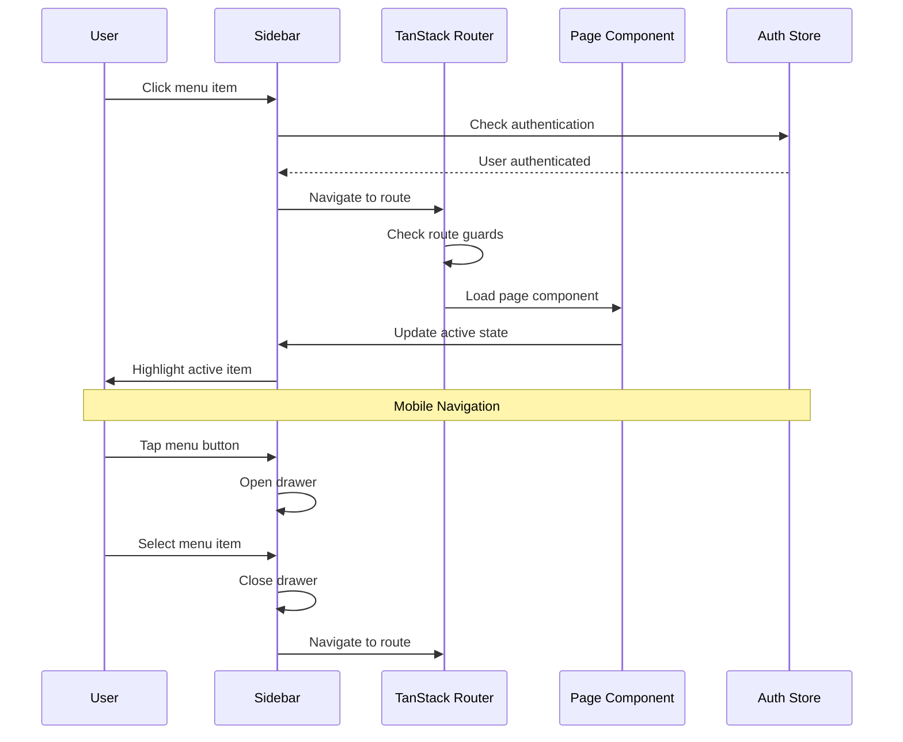

# Navigation System & Icon Integration - Production-Grade Specification

# Navigation System & Icon Integration - Production-Grade Specification

**Epic:** epic:bceeaefd-5139-4801-8c12-de8a8b6faf8a  
**Status:** Production-Ready Specification  
**Last Updated:** January 2026  
**Architecture:** Validated Tech Plan (spec:bceeaefd-5139-4801-8c12-de8a8b6faf8a/950515a2-7eeb-4375-9e58-6df156a25a3b)

---

## Overview

The Navigation System specification defines the complete sidebar navigation, icon integration, routing, and mobile responsiveness for LampFarms. This system provides consistent, accessible navigation across all pages and devices.

### Core Philosophy

**Consistency:**

- Follow existing file:frontend/src/components/navigation/sidebar.tsx pattern
- Use Shadcn/UI Sidebar component (already in project)
- Maintain FarmVista design system

**Simplicity:**

- 9 main navigation items (grouped logically)
- Clear active state highlighting
- Intuitive icon-text pairing

**Accessibility:**

- Keyboard navigation (Tab, Enter, Arrow keys)
- ARIA labels on all interactive elements
- Tooltips on collapsed sidebar
- Screen reader friendly

### Scope

**Navigation Components:**

1. **Sidebar Navigation** - Desktop sidebar with 9 menu items
2. **Icon System** - Lucide React icons (consistent, accessible)
3. **Active State** - Visual feedback for current page
4. **Mobile Navigation** - Drawer/sheet pattern for mobile devices
5. **Routing** - TanStack Router v7 integration

---

## System Architecture



---

## Section 1: Sidebar Navigation Structure

### Navigation Groups

**Farm Management (8 items):**

1. Dashboard - Overview with stats and charts
2. Batches - Batch management
3. Feed - Feed calculator
4. Water-Health - Health management
5. Eggs - Egg production tracking
6. Finance - Expense and revenue tracking
7. Stock - Inventory management
8. Records - Historical data and analytics

**System (1 item):**  
9. Settings - System configuration

**Footer:**

- User profile (avatar + name + role)
- Logout button

### Menu Item Structure

```typescript
interface NavItem {
  title: string;
  url: string;
  icon: LucideIcon;
  badge?: string; // Optional badge (e.g., "3" for pending tasks)
}

const mainNavItems: NavItem[] = [
  { title: 'Dashboard', url: '/dashboard', icon: LayoutDashboard },
  { title: 'Batches', url: '/batches', icon: Bird },
  { title: 'Feed', url: '/feed', icon: Wheat },
  { title: 'Water-Health', url: '/health', icon: Droplets },
  { title: 'Eggs', url: '/eggs', icon: Egg },
  { title: 'Finance', url: '/finance', icon: DollarSign },
  { title: 'Stock', url: '/stock', icon: Package },
  { title: 'Records', url: '/records', icon: FileText },
];

const settingsNavItems: NavItem[] = [
  { title: 'Settings', url: '/settings', icon: Settings },
];
```

### ASCII Layout Diagram

```
┌────────────────────────────────────────────────────────────────┐
│  SIDEBAR (240px)         │         MAIN CONTENT (flex-1)       │
│                          │                                      │
│  🌾 LampFarms            │  Page Content                        │
│  ─────────────           │                                      │
│                          │                                      │
│  Farm Management         │                                      │
│  🏠 Dashboard            │                                      │
│  🐔 Batches              │                                      │
│  🌾 Feed                 │                                      │
│  💧 Water-Health         │                                      │
│  🥚 Eggs                 │                                      │
│  💰 Finance              │                                      │
│  📦 Stock                │                                      │
│  📊 Records              │                                      │
│                          │                                      │
│  System                  │                                      │
│  ⚙️ Settings             │                                      │
│                          │                                      │
│  ─────────────           │                                      │
│  [KM]                    │                                      │
│  Kofi Mensah             │                                      │
│  Farm Owner              │                                      │
│  🚪 Logout               │                                      │
└────────────────────────────────────────────────────────────────┘
```

### Wireframe: Sidebar Navigation (Desktop)

```wireframe
<!DOCTYPE html>
<html>
<head>
<style>
* { margin: 0; padding: 0; box-sizing: border-box; }
body { font-family: 'Manrope', sans-serif; background: #f9fafb; display: flex; min-height: 100vh; }
.sidebar { width: 240px; background: white; border-right: 1px solid #e5e7eb; display: flex; flex-direction: column; }
.sidebar-header { padding: 20px; border-bottom: 1px solid #e5e7eb; }
.logo { display: flex; align-items: center; gap: 12px; }
.logo-icon { font-size: 24px; }
.logo-text { font-size: 18px; font-weight: 600; color: #111827; }
.sidebar-content { flex: 1; padding: 16px 0; overflow-y: auto; }
.nav-group { margin-bottom: 24px; }
.nav-label { font-size: 11px; font-weight: 600; color: #9ca3af; text-transform: uppercase; letter-spacing: 0.05em; padding: 0 20px; margin-bottom: 8px; }
.nav-menu { display: flex; flex-direction: column; gap: 2px; }
.nav-item { display: flex; align-items: center; gap: 12px; padding: 10px 20px; color: #6b7280; cursor: pointer; transition: all 0.2s; }
.nav-item:hover { background: #f9fafb; color: #111827; }
.nav-item.active { background: #f0fdf4; color: #16a34a; font-weight: 500; border-right: 3px solid #16a34a; }
.nav-icon { font-size: 20px; width: 20px; display: flex; align-items: center; justify-content: center; }
.nav-text { font-size: 14px; }
.sidebar-footer { border-top: 1px solid #e5e7eb; padding: 16px; }
.user-profile { display: flex; align-items: center; gap: 12px; padding: 8px; border-radius: 8px; cursor: pointer; transition: all 0.2s; margin-bottom: 8px; }
.user-prohover { background: #f9fafb; }
.user-avatar { width: 40px; height: 40px; border-radius: 50%; background: #16a34a; color: white; display: flex; align-items: center; justify-content: center; font-weight: 600; font-size: 14px; }
.user-info { flex: 1; }
.user-name { font-size: 14px; font-weight: 600; color: #111827; }
.user-role { font-size: 12px; color: #6b7280; }
.logout-button { display: flex; align-items: center; gap: 12px; padding: 10px 20px; color: #ef4444; cursor: pointer; transition: all 0.2s; border-radius: 8px; }
.logout-button:hover { background: #fef2f2; }
.main-content { flex: 1; padding: 24px; }
.page-placeholder { background: white; border-radius: 12px; padding: 32px; text-align: center; color: #6b7280; }
</style>
</head>
<body>
<div class="sidebar">
  <div class="sidebar-header">
    <div class="logo">
      <span class="logo-icon">🌾</span>
      <span class="logo-text">LampFarms</span>
    </div>
  </div>
  <div class="sidebar-content">
    <div class="nav-group">
      <div class="nav-label">Farm Management</div>
      <div class="nav-menu">
        <div class="nav-item active" data-element-id="nav-dashboard">
          <span class="nav-icon">🏠</span>
          <span class="nav-text">Dashboard</span>
        </div>
        <div class="nav-item" data-element-id="nav-batches">
          <span class="nav-icon">🐔</span>
          <span class="nav-text">Batches</span>
        </div>
        <div class="nav-item" data-element-id="nav-feed">
          <span class="nav-icon">🌾</span>
          <span class="nav-text">Feed</span>
        </div>
        <div class="nav-item" data-element-id="nav-water-health">
          <span class="nav-icon">💧</span>
          <span class="nav-text">Water-Health</span>
        </div>
        <div class="nav-item" data-element-id="nav-eggs">
          <span class="nav-icon">🥚</span>
          <span class="nav-text">Eggs</span>
        </div>
        <div class="nav-item" data-element-id="nav-finance">
          <span class="nav-icon">💰</span>
          <span class="nav-text">Finance</span>
        </div>
        <div class="nav-item" data-element-id="nav-stock">
          <span class="nav-icon">📦</span>
          <span class="nav-text">Stock</span>
        </div>
        <div class="nav-item" data-element-id="nav-records">
          <span class="nav-icon">📊</span>
          <span class="nav-text">Records</span>
        </div>
      </div>
    </div>
    <div class="nav-group">
      <div class="nav-label">System</div>
      <div class="nav-menu">
        <div class="nav-item" data-element-id="nav-settings">
          <span class="nav-icon">⚙️</span>
          <span class="nav-text">Settings</span>
        </div>
      </div>
    </div>
  </div>
  <div class="sidebar-footer">
    <div class="user-profile" data-element-id="user-profile">
      <div class="user-avatar">KM</div>
      <div class="user-info">
        <div class="user-name">Kofi Mensah</div>
        <div class="user-role">Farm Owner</div>
      </div>
    </div>
    <div class="logout-button" data-element-id="logout-button">
      <span class="nav-icon">🚪</span>
      <span class="nav-text">Logout</span>
    </div>
  </div>
</div>
<div class="main-content">
  <div class="page-placeholder">
    <h2 style="font-size: 24px; font-weight: 600; margin-bottom: 8px;">Page Content</h2>
    <p>Main content area for the selected page</p>
  </div>
</div>
</body>
</html>
```

---

## Section 2: Collapsed Sidebar (Icon Mode)

### Purpose

Space-saving mode for desktop users who want more screen real estate.

### Wireframe: Collapsed Sidebar

```wireframe
<!DOCTYPE html>
<html>
<head>
<style>
* { margin: 0; padding: 0; box-sizing: border-box; }
body { font-family: 'Manrope', sans-serif; background: #f9fafb; display: flex; min-height: 100vh; }
.sidebar { width: 64px; background: white; border-right: 1px solid #e5e7eb; display: flex; flex-direction: column; transition: width 0.2s; }
.sidebar-header { padding: 16px; border-bottom: 1px solid #e5e7eb; display: flex; justify-content: center; }
.logo-icon { font-size: 24px; cursor: pointer; }
.sidebar-content { flex: 1; padding: 8px 0; overflow-y: auto; }
.nav-group { margin-bottom: 16px; }
.nav-menu { display: flex; flex-direction: column; gap: 2px; }
.nav-item { display: flex; align-items: center; justify-content: center; padding: 12px; color: #6b7280; cursor: pointer; transition: all 0.2s; position: relative; margin: 0 8px; border-radius: 8px; }
.nav-item:hover { background: #f9fafb; color: #111827; }
.nav-item.active { background: #f0fdf4; color: #16a34a; }
.nav-icon { font-size: 20px; }
.tooltip { position: absolute; left: 100%; margin-left: 12px; background: #1f2937; color: white; padding: 6px 12px; border-radius: 6px; font-size: 12px; white-space: nowrap; opacity: 0; pointer-events: none; transition: opacity 0.2s; z-index: 50; }
.nav-item:hover .tooltip { opacity: 1; }
.sidebar-footer { border-top: 1px solid #e5e7eb; padding: 8px; }
.user-avatar { width: 40px; height: 40px; border-radius: 50%; background: #16a34a; color: white; display: flex; align-items: center; justify-content: center; font-weight: 600; font-size: 14px; cursor: pointer; margin: 0 auto 8px; }
.logout-button { display: flex; align-items: center; justify-content: center; padding: 12px; color: #ef4444; cursor: pointer; transition: all 0.2s; border-radius: 8px; margin: 0 8px; position: relative; }
.logout-button:hover { background: #fef2f2; }
.main-content { flex: 1; padding: 24px; }
.page-placeholder { background: white; border-radius: 12px; padding: 32px; text-align: center; color: #6b7280; }
</style>
</head>
<body>
<div class="sidebar">
  <div class="sidebar-header">
    <span class="logo-icon" data-element-id="logo">🌾</span>
  </div>
  <div class="sidebar-content">
    <div class="nav-group">
      <div class="nav-menu">
        <div class="nav-item active" data-element-id="nav-dashboard">
          <span class="nav-icon">🏠</span>
          <div class="tooltip">Dashboard</div>
        </div>
        <div class="nav-item" data-element-id="nav-batches">
          <span class="nav-icon">🐔</span>
          <div class="tooltip">Batches</div>
        </div>
        <div class="nav-item" data-element-id="nav-feed">
          <span class="nav-icon">🌾</span>
          <div class="tooltip">Feed</div>
        </div>
        <div class="nav-item" data-element-id="nav-water-health">
          <span class="nav-icon">💧</span>
          <div class="tooltip">Water-Health</div>
        </div>
        <div class="nav-item" data-element-id="nav-eggs">
          <span class="nav-icon">🥚</span>
          <div class="tooltip">Eggs</div>
        </div>
        <div class="nav-item" data-element-id="nav-finance">
          <span class="nav-icon">💰</span>
          <div class="tooltip">Finance</div>
        </div>
        <div class="nav-item" data-element-id="nav-stock">
          <span class="nav-icon">📦</span>
          <div class="tooltip">Stock</div>
        </div>
        <div class="nav-item" data-element-id="nav-records">
          <span class="nav-icon">📊</span>
          <div class="tooltip">Records</div>
        </div>
      </div>
    </div>
    <div class="nav-group">
      <div class="nav-menu">
        <div class="nav-item" data-element-id="nav-settings">
          <span class="nav-icon">⚙️</span>
          <div class="tooltip">Settings</div>
        </div>
      </div>
    </div>
  </div>
  <div class="sidebar-footer">
    <div class="user-avatar" data-element-id="user-profile">KM</div>
    <div class="logout-button" data-element-id="logout-button">
      <span class="nav-icon">🚪</span>
      <div class="tooltip">Logout</div>
    </div>
  </div>
</div>
<div class="main-content">
  <div class="page-placeholder">
    <h2 style="font-size: 24px; font-weight: 600; margin-bottom: 8px;">Icon Mode Active</h2>
    <p>Sidebar collapsed to icon-only view. Hover for tooltips.</p>
  </div>
</div>
</body>
</html>
```

---

## Section 3: Mobile Navigation (Drawer)

### Purpose

Mobile-optimized navigation using drawer/sheet pattern.

### Wireframe: Mobile Navigation

```wireframe
<!DOCTYPE html>
<html>
<head>
<style>
* { margin: 0; padding: 0; box-sizing: border-box; }
body { font-family: 'Manrope', sans-serif; background: #f9fafb; }
.mobile-header { height: 56px; background: white; border-bottom: 1px solid #e5e7eb; display: flex; align-items: center; padding: 0 16px; gap: 16px; position: sticky; top: 0; z-index: 10; }
.menu-button { width: 40px; height: 40px; display: flex; align-items: center; justify-content: center; cursor: pointer; border-radius: 8px; transition: all 0.2s; }
.menu-button:hover { background: #f9fafb; }
.menu-icon { font-size: 24px; color: #6b7280; }
.header-title { font-size: 18px; font-weight: 600; color: #111827; }
.mobile-content { padding: 16px; }
.content-card { background: white; border-radius: 12px; padding: 24px; text-align: center; color: #6b7280; }
.overlay { position: fixed; inset: 0; background: rgba(0, 0, 0, 0.5); z-index: 40; }
.drawer { position: fixed; left: 0; top: 0; bottom: 0; width: 280px; background: white; z-index: 50; display: flex; flex-direction: column; box-shadow: 4px 0 12px rgba(0,0,0,0.1); }
.drawer-header { padding: 20px; border-bottom: 1px solid #e5e7eb; display: flex; align-items: center; justify-content: space-between; }
.logo { display: flex; align-items: center; gap: 12px; }
.logo-icon { font-size: 24px; }
.logo-text { font-size: 18px; font-weight: 600; color: #111827; }
.close-button { width: 32px; height: 32px; display: flex; align-items: center; justify-content: center; cursor: pointer; border-radius: 6px; transition: all 0.2s; }
.close-button:hover { background: #f9fafb; }
.close-icon { font-size: 20px; color: #6b7280; }
.drawer-content { flex: 1; padding: 16px 0; overflow-y: auto; }
.nav-group { margin-bottom: 24px; }
.nav-label { font-size: 11px; font-weight: 600; color: #9ca3af; text-transform: uppercase; letter-spacing: 0.05em; padding: 0 20px; margin-bottom: 8px; }
.nav-menu { display: flex; flex-direction: column; gap: 2px; }
.nav-item { display: flex; align-items: center; gap: 12px; padding: 12px 20px; color: #6b7280; cursor: pointer; transition: all 0.2s; }
.nav-item:hover { background: #f9fafb; color: #111827; }
.nav-item.active { background: #f0fdf4; color: #16a34a; font-weight: 500; }
.nav-icon { font-size: 20px; width: 20px; display: flex; align-items: center; justify-content: center; }
.nav-text { font-size: 14px; }
.drawer-footer { border-top: 1px solid #e5e7eb; padding: 16px; }
.user-profile { display: flex; align-items: center; gap: 12px; padding: 8px; border-radius: 8px; cursor: pointer; transition: all 0.2s; margin-bottom: 8px; }
.user-prohover { background: #f9fafb; }
.user-avatar { width: 40px; height: 40px; border-radius: 50%; background: #16a34a; color: white; display: flex; align-items: center; justify-content: center; font-weight: 600; font-size: 14px; }
.user-info { flex: 1; }
.user-name { font-size: 14px; font-weight: 600; color: #111827; }
.user-role { font-size: 12px; color: #6b7280; }
.logout-button { display: flex; align-items: center; gap: 12px; padding: 10px 20px; color: #ef4444; cursor: pointer; transition: all 0.2s; border-radius: 8px; }
.logout-button:hover { background: #fef2f2; }
</style>
</head>
<body>
<div class="mobile-header">
  <div class="menu-button" data-element-id="menu-button">
    <span class="menu-icon">☰</span>
  </div>
  <h1 class="header-title">Dashboard</h1>
</div>
<div class="mobile-content">
  <div class="content-card">
    <h2 style="font-size: 20px; font-weight: 600; margin-bottom: 8px;">Mobile View</h2>
    <p>Tap menu button to open navigation drawer</p>
  </div>
</div>
<div class="overlay" data-element-id="overlay"></div>
<div class="drawer">
  <div class="drawer-header">
    <div class="logo">
      <span class="logo-icon">🌾</span>
      <span class="logo-text">LampFarms</span>
    </div>
    <div class="close-button" data-element-id="close-button">
      <span class="close-icon">✕</span>
    </div>
  </div>
  <div class="drawer-content">
    <div class="nav-group">
      <div class="nav-label">Farm Management</div>
      <div class="nav-menu">
        <div class="nav-item active" data-element-id="nav-dashboard-mobile">
          <span class="nav-icon">🏠</span>
          <span class="nav-text">Dashboard</span>
        </div>
        <div class="nav-item" data-element-id="nav-batches-mobile">
          <span class="nav-icon">🐔</span>
          <span class="nav-text">Batches</span>
        </div>
        <div class="nav-item" data-element-id="nav-feed-mobile">
          <span class="nav-icon">🌾</span>
          <span class="nav-text">Feed</span>
        </div>
        <div class="nav-item" data-element-id="nav-water-health-mobile">
          <span class="nav-icon">💧</span>
          <span class="nav-text">Water-Health</span>
        </div>
        <div class="nav-item" data-element-id="nav-eggs-mobile">
          <span class="nav-icon">🥚</span>
          <span class="nav-text">Eggs</span>
        </div>
        <div class="nav-item" data-element-id="nav-finance-mobile">
          <span class="nav-icon">💰</span>
          <span class="nav-text">Finance</span>
        </div>
        <div class="nav-item" data-element-id="nav-stock-mobile">
          <span class="nav-icon">📦</span>
          <span class="nav-text">Stock</span>
        </div>
        <div class="nav-item" data-element-id="nav-records-mobile">
          <span class="nav-icon">📊</span>
          <span class="nav-text">Records</span>
        </div>
      </div>
    </div>
    <div class="nav-group">
      <div class="nav-label">System</div>
      <div class="nav-menu">
        <div class="nav-item" data-element-id="nav-settings-mobile">
          <span class="nav-icon">⚙️</span>
          <span class="nav-text">Settings</span>
        </div>
      </div>
    </div>
  </div>
  <div class="drawer-footer">
    <div class="user-profile" data-element-id="user-profile-mobile">
      <div class="user-avatar">KM</div>
      <div class="user-info">
        <div class="user-name">Kofi Mensah</div>
        <div class="user-role">Farm Owner</div>
      </div>
    </div>
    <div class="logout-button" data-element-id="logout-button-mobile">
      <span class="nav-icon">🚪</span>
      <span class="nav-text">Logout</span>
    </div>
  </div>
</div>
</body>
</html>
```

---

## Section 4: Icon System

### Lucide React Icons

**Primary Icon Library:** `lucide-react` (already in project)

**Icon Mapping:**


| Page         | Icon | Lucide Component  |
| ------------ | ---- | ----------------- |
| Dashboard    | 🏠   | `LayoutDashboard` |
| Batches      | 🐔   | `Bird`            |
| Feed         | 🌾   | `Wheat`           |
| Water-Health | 💧   | `Droplets`        |
| Eggs         | 🥚   | `Egg`             |
| Finance      | 💰   | `DollarSign`      |
| Stock        | 📦   | `Package`         |
| Records      | 📊   | `FileText`        |
| Settings     | ⚙️   | `Settings`        |
| Logout       | 🚪   | `LogOut`          |


**Usage Pattern:**

```typescript
import { LayoutDashboard, Bird, Wheat, Droplets, Egg, DollarSign, Package, FileText, Settings, LogOut } from 'lucide-react';

<LayoutDashboard className="h-5 w-5" />
```

**Icon Sizing:**

- Sidebar: 20x20px (`h-5 w-5`)
- Mobile: 20x20px (`h-5 w-5`)
- Collapsed: 20x20px (`h-5 w-5`)

**Icon Colors:**

- Default: `currentColor` (inherits from parent)
- Active: `#16a34a` (green)
- Hover: `#111827` (dark gray)

---

## Section 5: Active State Management

### Implementation

**Using TanStack Router:**

```typescript
import { useLocation } from '@tanstack/react-router';

const location = useLocation();
const isActive = location.pathname === item.url;
```

**Active State Styles:**

```typescript
<div
  className={cn(
    "nav-item",
    isActive && "active"
  )}
>
  <item.icon className="h-5 w-5" />
  <span>{item.title}</span>
</div>
```

**CSS Classes:**

```css
.nav-item {
  display: flex;
  align-items: center;
  gap: 12px;
  padding: 10px 20px;
  color: #6b7280;
  cursor: pointer;
  transition: all 0.2s;
}

.nav-item:hover {
  background: #f9fafb;
  color: #111827;
}

.nav-item.active {
  background: #f0fdf4;
  color: #16a34a;
  font-weight: 500;
  border-right: 3px solid #16a34a;
}
```

---

## Section 6: Routing Configuration

### TanStack Router v7

**Route Structure:**

```typescript
// Public routes
/ - WelcomePage (login/register)

// Protected routes (require auth)
/dashboard - DashboardPage
/farm-setup - FarmSetupPage (one-time setup)

// Main application routes
/batches - BatchDashboardPage
/batches/:id - BatchDetailsPage
/batches/new - BatchCreationPage
/feed - FeedCalculatorPage
/health - WaterHealthPage
/eggs - EggProductionPage
/finance - FinancePage
/stock - StockManagementPage
/records - RecordsPage
/settings - SettingsPage
```

**Route Guards:**

```typescript
// Authentication guard
const beforeLoad = async ({ context }) => {
  const { user } = context.auth;
  if (!user) {
    throw redirect({ to: '/' });
  }
};

// Farm setup guard
const beforeLoad = async ({ context }) => {
  const { user } = context.auth;
  if (user && !user.farm_id) {
    throw redirect({ to: '/farm-setup' });
  }
};
```

---

## Section 7: Responsive Behavior

### Breakpoints

**Tailwind CSS Breakpoints:**

- `sm:` - 640px and up
- `md:` - 768px and up
- `lg:` - 1024px and up

**Sidebar Behavior:**


| Screen Size    | Behavior                                  |
| -------------- | ----------------------------------------- |
| Desktop (lg+)  | Sidebar visible, collapsible to icon mode |
| Tablet (md-lg) | Sidebar collapsed by default, expandable  |
| Mobile (<md)   | Sidebar hidden, accessible via drawer     |


**Implementation:**

```typescript
<SidebarProvider>
  <AppSidebar />
  <SidebarInset>
    <header className="flex h-14 items-center gap-4 border-b px-6">
      <SidebarTrigger className="-ml-1" />
      <h1 className="text-lg font-semibold">Page Title</h1>
    </header>
    <main className="flex-1 p-6">
      {/* Page content */}
    </main>
  </SidebarInset>
</SidebarProvider>
```

---

## Section 8: Accessibility Features

### Keyboard Navigation

**Supported Keys:**

- `Tab` - Navigate between menu items
- `Enter` / `Space` - Activate menu item
- `Escape` - Close mobile drawer
- `Arrow Up/Down` - Navigate menu items (optional)

**Implementation:**

```typescript
<div
  role="button"
  tabIndex={0}
  onKeyDown={(e) => {
    if (e.key === 'Enter' || e.key === ' ') {
      navigate({ to: item.url });
    }
  }}
>
  {/* Menu item content */}
</div>
```

### ARIA Labels

```typescript
<nav aria-label="Main navigation">
  <div
    role="button"
    aria-label={`Navigate to ${item.title}`}
    aria-current={isActive ? 'page' : undefined}
  >
    <item.icon aria-hidden="true" />
    <span>{item.title}</span>
  </div>
</nav>
```

### Tooltips

**Collapsed Sidebar:**

- Show tooltip on hover
- Position: Right of icon
- Delay: 200ms
- Background: Dark gray (#1f2937)
- Text: White

**Implementation:**

```typescript
<TooltipProvider>
  <Tooltip>
    <TooltipTrigger asChild>
      <div className="nav-item">
        <item.icon />
      </div>
    </TooltipTrigger>
    <TooltipContent side="right">
      {item.title}
    </TooltipContent>
  </Tooltip>
</TooltipProvider>
```

---

## Acceptance Criteria

### Functional Requirements

**Navigation:**

- [ ] All 9 menu items navigate correctly
- [ ] Active page highlighted with green background and border
- [ ] Sidebar collapsible to icon mode (desktop)
- [ ] Mobile drawer opens/closes correctly
- [ ] User profile displays at sidebar bottom
- [ ] Logout button works

**Icons:**

- [ ] All Lucide React icons display correctly
- [ ] Icons sized consistently (20x20px)
- [ ] Icons inherit color from parent
- [ ] Icons accessible (aria-hidden="true")

**Routing:**

- [ ] All routes configured in TanStack Router
- [ ] Route guards work (auth, farm setup)
- [ ] Browser back/forward buttons work
- [ ] Direct URL access works
- [ ] 404 page for invalid routes

**Responsive:**

- [ ] Desktop: Sidebar visible, collapsible
- [ ] Tablet: Sidebar collapsed by default
- [ ] Mobile: Sidebar hidden, drawer accessible
- [ ] Touch interactions work on mobile
- [ ] Landscape/portrait orientation supported

**Accessibility:**

- [ ] Keyboard navigation works (Tab, Enter, Escape)
- [ ] ARIA labels on all interactive elements
- [ ] Tooltips on collapsed sidebar
- [ ] Screen reader friendly
- [ ] Focus states visible

### Performance Requirements

- [ ] Navigation transition <100ms
- [ ] Icon load time <50ms
- [ ] Sidebar collapse animation smooth (60fps)
- [ ] Mobile drawer animation smooth (60fps)

### UI/UX Requirements

**Design System:**

- [ ] FarmVista design system (green #16a34a, Manrope font)
- [ ] Shadcn/UI Sidebar component
- [ ] Consistent spacing and sizing
- [ ] Smooth transitions and animations

**User Experience:**

- [ ] Clear visual feedback on hover
- [ ] Clear active state indication
- [ ] Intuitive icon-text pairing
- [ ] Responsive touch targets (44x44px minimum)

---

## Related Specifications

- spec:bceeaefd-5139-4801-8c12-de8a8b6faf8a/8af1669c-fe26-4bb7-8b9d-59d4c7bf6621 - Main Dashboard
- spec:bceeaefd-5139-4801-8c12-de8a8b6faf8a/c18bcbcb-e4da-43cc-b5cd-5e27c2e4ed1f - Batch Management System
- spec:bceeaefd-5139-4801-8c12-de8a8b6faf8a/9e3bb05f-9ca8-4cc6-9f97-a5d0eb53ae92 - Frontend Architecture
- spec:bceeaefd-5139-4801-8c12-de8a8b6faf8a/35142770-c1b0-4df2-85e2-5a839616334a - Backend Architecture

---

**End of Navigation System & Icon Integration Specification**