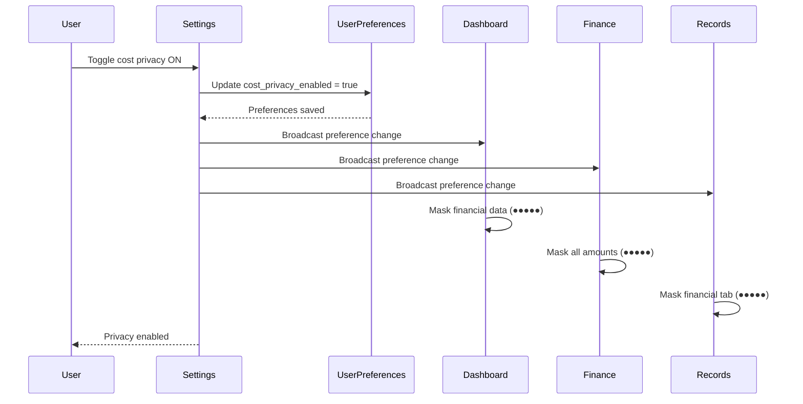
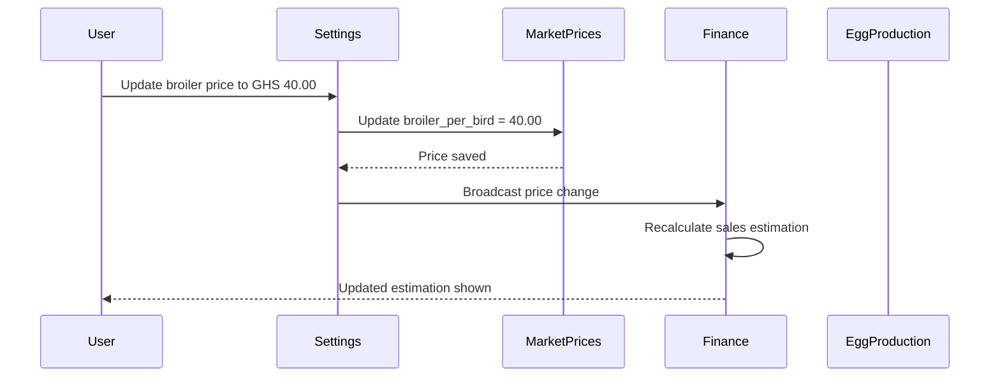
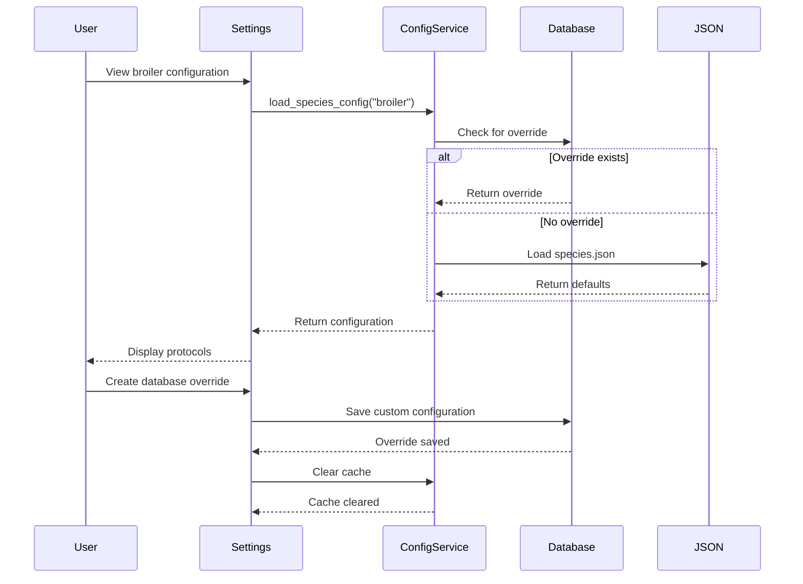
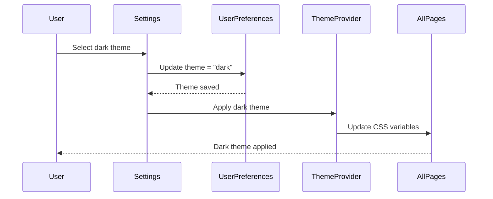

# Settings System - Production-Grade Specification (Theme, Market Prices, Species Config, User Preferences)

# Settings System - Production-Grade Specification

## Overview

The Settings System provides centralized configuration management for the LampFarms platform, enabling farmers to customize their experience, manage market prices, view species protocols, configure system behavior, and manage data. This specification aligns with the validated architecture from spec:bceeaefd-5139-4801-8c12-de8a8b6faf8a/35142770-c1b0-4df2-85e2-5a839616334a (Backend Architecture) and spec:bceeaefd-5139-4801-8c12-de8a8b6faf8a/9e3bb05f-9ca8-4cc6-9f97-a5d0eb53ae92 (Frontend Architecture).

**Core Philosophy:**

- **Backend Intelligence, Frontend Simplicity:** Backend manages configuration persistence and validation, frontend displays clean interfaces
- **Configuration-Driven Behavior:** Hybrid approach (JSON defaults + database overrides) as specified in Backend Architecture
- **Cost Privacy Everywhere:** User preferences propagate to all systems (Dashboard, Finance, Feed, Stock, Egg, Records)
- **Farmer Freedom:** Farmers control their experience (theme, language, currency, notifications)

**Key Features:**

1. User Preferences (theme, notifications, cost privacy, language, currency, date formats)
2. Market Prices Management (bird sales by species/weight, egg prices by size)
3. Species Configuration Viewer (read-only protocols with database override capability)
4. System Settings (backup schedule, data retention, farm details)
5. Data Management (export/import, backup/restore)

---

## System Architecture

### Integration with Configuration System

The Settings System provides the UI layer for the hybrid configuration system defined in spec:bceeaefd-5139-4801-8c12-de8a8b6faf8a/35142770-c1b0-4df2-85e2-5a839616334a:

```
Settings UI
  ↓
ConfigService (3-tier hierarchy)
  ↓
1. Cache (in-memory, fast access)
2. Database Overrides (user customizations)
3. JSON Files (defaults)
   - species.json
   - species_protocols.json
   - ingredients.json
   - medications.json
```

**Configuration Loading Priority:**

1. Check cache (if available, return immediately)
2. Check database for overrides (if exists, cache and return)
3. Load from JSON file (cache and return)

---

## UI Wireframes

### 1. Settings Dashboard (5-Tab Interface)

```wireframe
<!DOCTYPE html>
<html>
<head>
<style>
  * { margin: 0; padding: 0; box-sizing: border-box; }
  body { font-family: 'Manrope', sans-serif; background: #f9fafb; padding: 24px; }
  .settings-container { max-width: 1200px; margin: 0 auto; }
  .settings-header { margin-bottom: 24px; }
  .settings-header h1 { font-size: 24px; font-weight: 600; color: #111827; margin-bottom: 8px; }
  .settings-header p { font-size: 14px; color: #6b7280; }
  
  .tabs-container { background: white; border-radius: 12px; box-shadow: 0 1px 3px rgba(0,0,0,0.1); }
  .tabs-list { display: flex; border-bottom: 1px solid #e5e7eb; padding: 0 24px; }
  .tab-trigger { padding: 16px 20px; font-size: 14px; font-weight: 500; color: #6b7280; border: none; background: none; cursor: pointer; border-bottom: 2px solid transparent; transition: all 0.2s; }
  .tab-trigger.active { color: #16a34a; border-bottom-color: #16a34a; }
  .tab-trigger:hover { color: #111827; }
  
  .tab-content { padding: 24px; }
  .settings-section { margin-bottom: 32px; }
  .settings-section:last-child { margin-bottom: 0; }
  .section-title { font-size: 16px; font-weight: 600; color: #111827; margin-bottom: 16px; }
  .section-description { font-size: 14px; color: #6b7280; margin-bottom: 16px; }
  
  .setting-item { display: flex; justify-content: space-between; align-items: center; padding: 16px; background: #f9fafb; border-radius: 8px; margin-bottom: 12px; }
  .setting-item:last-child { margin-bottom: 0; }
  .setting-info { flex: 1; }
  .setting-label { font-size: 14px; font-weight: 500; color: #111827; margin-bottom: 4px; }
  .setting-desc { font-size: 13px; color: #6b7280; }
  .setting-control { margin-left: 16px; }
  
  .theme-selector { display: flex; gap: 12px; }
  .theme-option { width: 80px; height: 60px; border-radius: 8px; border: 2px solid #e5e7eb; cursor: pointer; display: flex; flex-direction: column; overflow: hidden; transition: all 0.2s; }
  .theme-option.selected { border-color: #16a34a; box-shadow: 0 0 0 3px rgba(22, 163, 74, 0.1); }
  .theme-option:hover { border-color: #16a34a; }
  .theme-light { background: white; }
  .theme-dark { background: #1f2937; }
  .theme-auto { background: linear-gradient(90deg, white 50%, #1f2937 50%); }
  .theme-label { font-size: 11px; text-align: center; padding: 4px; background: white; color: #111827; }
  
  .toggle-switch { position: relative; width: 44px; height: 24px; background: #d1d5db; border-radius: 12px; cursor: pointer; transition: background 0.2s; }
  .toggle-switch.on { background: #16a34a; }
  .toggle-knob { position: absolute; top: 2px; left: 2px; width: 20px; height: 20px; background: white; border-radius: 50%; transition: transform 0.2s; }
  .toggle-switch.on .toggle-knob { transform: translateX(20px); }
  
  select { padding: 8px 12px; border: 1px solid #d1d5db; border-radius: 8px; font-size: 14px; color: #111827; background: white; cursor: pointer; }
  select:focus { outline: none; border-color: #16a34a; }
  
  .save-button { background: #16a34a; color: white; padding: 10px 20px; border-radius: 9999px; border: none; font-size: 14px; font-weight: 500; cursor: pointer; margin-top: 24px; }
  .save-button:hover { background: #15803d; }
</style>
</head>
<body>
  <div class="settings-container">
    <div class="settings-header">
      <h1>Settings</h1>
      <p>Manage your preferences, market prices, and system configuration</p>
    </div>
    
    <div class="tabs-container">
      <div class="tabs-list">
        <button class="tab-trigger active" data-element-id="preferences-tab">Preferences</button>
        <button class="tab-trigger" data-element-id="prices-tab">Market Prices</button>
        <button class="tab-trigger" data-element-id="species-tab">Species Config</button>
        <button class="tab-trigger" data-element-id="system-tab">System</button>
        <button class="tab-trigger" data-element-id="data-tab">Data</button>
      </div>
      
      <div class="tab-content">
        <!-- Preferences Tab -->
        <div class="settings-section">
          <div class="section-title">Appearance</div>
          <div class="section-description">Customize how LampFarms looks and feels</div>
          
          <div class="setting-item">
            <div class="setting-info">
              <div class="setting-label">Theme</div>
              <div class="setting-desc">Choose your preferred color scheme</div>
            </div>
            <div class="setting-control">
              <div class="theme-selector">
                <div class="theme-option theme-light selected" data-element-id="theme-light">
                  <div style="flex: 1;"></div>
                  <div class="theme-label">Light</div>
                </div>
                <div class="theme-option theme-dark" data-element-id="theme-dark">
                  <div style="flex: 1;"></div>
                  <div class="theme-label">Dark</div>
                </div>
                <div class="theme-option theme-auto" data-element-id="theme-auto">
                  <div style="flex: 1;"></div>
                  <div class="theme-label">Auto</div>
                </div>
              </div>
            </div>
          </div>
        </div>
        
        <div class="settings-section">
          <div class="section-title">Privacy</div>
          <div class="section-description">Control what financial information is visible</div>
          
          <div class="setting-item">
            <div class="setting-info">
              <div class="setting-label">Hide Costs by Default</div>
              <div class="setting-desc">Mask financial data (expenses, revenue, profit) with ●●●●●</div>
            </div>
            <div class="setting-control">
              <div class="toggle-switch on" data-element-id="cost-privacy-toggle">
                <div class="toggle-knob"></div>
              </div>
            </div>
          </div>
        </div>
        
        <div class="settings-section">
          <div class="section-title">Regional Settings</div>
          <div class="section-description">Configure language, currency, and date formats</div>
          
          <div class="setting-item">
            <div class="setting-info">
              <div class="setting-label">Language</div>
              <div class="setting-desc">Choose your preferred language</div>
            </div>
            <div class="setting-control">
              <select data-element-id="language-select">
                <option value="en">English</option>
                <option value="tw">Twi (Ghana)</option>
                <option value="yo">Yoruba (Nigeria)</option>
                <option value="ha">Hausa (Nigeria)</option>
              </select>
            </div>
          </div>
          
          <div class="setting-item">
            <div class="setting-info">
              <div class="setting-label">Currency</div>
              <div class="setting-desc">Choose your local currency</div>
            </div>
            <div class="setting-control">
              <select data-element-id="currency-select">
                <option value="GHS">GHS (Ghana Cedis)</option>
                <option value="NGN">NGN (Nigerian Naira)</option>
                <option value="USD">USD (US Dollar)</option>
              </select>
            </div>
          </div>
          
          <div class="setting-item">
            <div class="setting-info">
              <div class="setting-label">Date Format</div>
              <div class="setting-desc">Choose how dates are displayed</div>
            </div>
            <div class="setting-control">
              <select data-element-id="date-format-select">
                <option value="DD/MM/YYYY">DD/MM/YYYY (e.g., 16/01/2026)</option>
                <option value="MM/DD/YYYY">MM/DD/YYYY (e.g., 01/16/2026)</option>
                <option value="YYYY-MM-DD">YYYY-MM-DD (e.g., 2026-01-16)</option>
              </select>
            </div>
          </div>
        </div>
        
        <div class="settings-section">
          <div class="section-title">Notifications</div>
          <div class="section-description">Control what alerts you receive</div>
          
          <div class="setting-item">
            <div class="setting-info">
              <div class="setting-label">Health Task Reminders</div>
              <div class="setting-desc">Get notified about upcoming vaccinations and medications</div>
            </div>
            <div class="setting-control">
              <div class="toggle-switch on" data-element-id="health-notifications-toggle">
                <div class="toggle-knob"></div>
              </div>
            </div>
          </div>
          
          <div class="setting-item">
            <div class="setting-info">
              <div class="setting-label">Low Stock Alerts</div>
              <div class="setting-desc">Get notified when stock falls below reorder level</div>
            </div>
            <div class="setting-control">
              <div class="toggle-switch on" data-element-id="stock-notifications-toggle">
                <div class="toggle-knob"></div>
              </div>
            </div>
          </div>
          
          <div class="setting-item">
            <div class="setting-info">
              <div class="setting-label">Withdrawal Period Warnings</div>
              <div class="setting-desc">Get notified when batches are in withdrawal period</div>
            </div>
            <div class="setting-control">
              <div class="toggle-switch on" data-element-id="withdrawal-notifications-toggle">
                <div class="toggle-knob"></div>
              </div>
            </div>
          </div>
        </div>
        
        <button class="save-button" data-element-id="save-preferences">Save Preferences</button>
      </div>
    </div>
  </div>
</body>
</html>
```

### 2. Market Prices Tab

```wireframe
<!DOCTYPE html>
<html>
<head>
<style>
  * { margin: 0; padding: 0; box-sizing: border-box; }
  body { font-family: 'Manrope', sans-serif; background: #f9fafb; padding: 24px; }
  .prices-container { max-width: 1200px; margin: 0 auto; background: white; border-radius: 12px; padding: 24px; }
  
  .prices-header { margin-bottom: 24px; }
  .prices-header h2 { font-size: 18px; font-weight: 600; color: #111827; margin-bottom: 8px; }
  .prices-header p { font-size: 14px; color: #6b7280; }
  
  .prices-grid { display: grid; grid-template-columns: repeat(2, 1fr); gap: 24px; margin-bottom: 32px; }
  
  .price-section { background: #f9fafb; border-radius: 8px; padding: 20px; }
  .price-section-title { font-size: 16px; font-weight: 600; color: #111827; margin-bottom: 16px; display: flex; align-items: center; gap: 8px; }
  .species-icon { width: 24px; height: 24px; background: #16a34a; border-radius: 50%; display: flex; align-items: center; justify-content: center; color: white; font-size: 12px; }
  
  .price-input-group { margin-bottom: 12px; }
  .price-input-group:last-child { margin-bottom: 0; }
  .price-label { font-size: 13px; font-weight: 500; color: #374151; margin-bottom: 6px; display: block; }
  .price-input-wrapper { position: relative; }
  .currency-prefix { position: absolute; left: 12px; top: 50%; transform: translateY(-50%); font-size: 14px; color: #6b7280; }
  .price-input { width: 100%; padding: 10px 12px 10px 48px; border: 1px solid #d1d5db; border-radius: 8px; font-size: 14px; }
  .price-input:focus { outline: none; border-color: #16a34a; }
  .price-unit { font-size: 13px; color: #6b7280; margin-top: 4px; }
  
  .egg-prices-section { grid-column: 1 / -1; }
  .egg-prices-grid { display: grid; grid-template-columns: repeat(4, 1fr); gap: 16px; }
  
  .info-box { background: #eff6ff; border: 1px solid #bfdbfe; border-radius: 8px; padding: 12px; margin-top: 24px; }
  .info-box-title { font-size: 13px; font-weight: 600; color: #1e40af; margin-bottom: 6px; }
  .info-box-text { font-size: 13px; color: #1e40af; line-height: 1.5; }
  
  .save-button { background: #16a34a; color: white; padding: 10px 20px; border-radius: 9999px; border: none; font-size: 14px; font-weight: 500; cursor: pointer; margin-top: 24px; }
  .save-button:hover { background: #15803d; }
</style>
</head>
<body>
  <div class="prices-container">
    <div class="prices-header">
      <h2>Market Prices</h2>
      <p>Configure current market prices for birds and eggs. These prices are used for revenue estimation and sales recording.</p>
    </div>
    
    <div class="prices-grid">
      <!-- Broiler Prices -->
      <div class="price-section">
        <div class="price-section-title">
          <div class="species-icon">🐔</div>
          Broiler Prices
        </div>
        <div class="price-input-group">
          <label class="price-label">Price per Bird (Live Weight)</label>
          <div class="price-input-wrapper">
            <span class="currency-prefix">GHS</span>
            <input type="number" class="price-input" value="35.00" step="0.50" data-element-id="broiler-per-bird-price">
          </div>
          <div class="price-unit">For 2.5-3.0 kg birds</div>
        </div>
        <div class="price-input-group">
          <label class="price-label">Price per Kilogram</label>
          <div class="price-input-wrapper">
            <span class="currency-prefix">GHS</span>
            <input type="number" class="price-input" value="12.00" step="0.50" data-element-id="broiler-per-kg-price">
          </div>
        </div>
      </div>
      
      <!-- Layer Prices -->
      <div class="price-section">
        <div class="price-section-title">
          <div class="species-icon">🐓</div>
          Layer Prices
        </div>
        <div class="price-input-group">
          <label class="price-label">Spent Layer Price (per bird)</label>
          <div class="price-input-wrapper">
            <span class="currency-prefix">GHS</span>
            <input type="number" class="price-input" value="25.00" step="0.50" data-element-id="layer-spent-price">
          </div>
          <div class="price-unit">After 68-week cycle</div>
        </div>
      </div>
      
      <!-- Duck Prices -->
      <div class="price-section">
        <div class="price-section-title">
          <div class="species-icon">🦆</div>
          Duck Prices
        </div>
        <div class="price-input-group">
          <label class="price-label">Price per Bird (Live Weight)</label>
          <div class="price-input-wrapper">
            <span class="currency-prefix">GHS</span>
            <input type="number" class="price-input" value="45.00" step="0.50" data-element-id="duck-per-bird-price">
          </div>
          <div class="price-unit">For 3.0-3.5 kg ducks</div>
        </div>
        <div class="price-input-group">
          <label class="price-label">Price per Kilogram</label>
          <div class="price-input-wrapper">
            <span class="currency-prefix">GHS</span>
            <input type="number" class="price-input" value="15.00" step="0.50" data-element-id="duck-per-kg-price">
          </div>
        </div>
      </div>
      
      <!-- Turkey Prices -->
      <div class="price-section">
        <div class="price-section-title">
          <div class="species-icon">🦃</div>
          Turkey Prices
        </div>
        <div class="price-input-group">
          <label class="price-label">Price per Bird (Hens)</label>
          <div class="price-input-wrapper">
            <span class="currency-prefix">GHS</span>
            <input type="number" class="price-input" value="120.00" step="1.00" data-element-id="turkey-hen-price">
          </div>
          <div class="price-unit">6-8 kg hens</div>
        </div>
        <div class="price-input-group">
          <label class="price-label">Price per Bird (Toms)</label>
          <div class="price-input-wrapper">
            <span class="currency-prefix">GHS</span>
            <input type="number" class="price-input" value="200.00" step="1.00" data-element-id="turkey-tom-price">
          </div>
          <div class="price-unit">10-14 kg toms</div>
        </div>
        <div class="price-input-group">
          <label class="price-label">Holiday Premium (%)</label>
          <div class="price-input-wrapper">
            <span class="currency-prefix">+</span>
            <input type="number" class="price-input" value="30" step="5" data-element-id="turkey-premium">
          </div>
          <div class="price-unit">Christmas/Thanksgiving markup</div>
        </div>
      </div>
      
      <!-- Egg Prices -->
      <div class="price-section egg-prices-section">
        <div class="price-section-title">
          <div class="species-icon">🥚</div>
          Egg Prices
        </div>
        <div class="egg-prices-grid">
          <div class="price-input-group">
            <label class="price-label">Large Crate (30 eggs)</label>
            <div class="price-input-wrapper">
              <span class="currency-prefix">GHS</span>
              <input type="number" class="price-input" value="18.00" step="0.50" data-element-id="egg-large-crate-price">
            </div>
          </div>
          <div class="price-input-group">
            <label class="price-label">Medium Crate (30 eggs)</label>
            <div class="price-input-wrapper">
              <span class="currency-prefix">GHS</span>
              <input type="number" class="price-input" value="16.00" step="0.50" data-element-id="egg-medium-crate-price">
            </div>
          </div>
          <div class="price-input-group">
            <label class="price-label">Small Crate (30 eggs)</label>
            <div class="price-input-wrapper">
              <span class="currency-prefix">GHS</span>
              <input type="number" class="price-input" value="14.00" step="0.50" data-element-id="egg-small-crate-price">
            </div>
          </div>
          <div class="price-input-group">
            <label class="price-label">Duck Eggs (per dozen)</label>
            <div class="price-input-wrapper">
              <span class="currency-prefix">GHS</span>
              <input type="number" class="price-input" value="12.00" step="0.50" data-element-id="duck-egg-dozen-price">
            </div>
          </div>
        </div>
      </div>
    </div>
    
    <div class="info-box">
      <div class="info-box-title">💡 How Market Prices Are Used</div>
      <div class="info-box-text">
        These prices are used for:<br>
        • Sales estimation in Finance dashboard<br>
        • Revenue calculations when recording sales<br>
        • Profitability analysis in Records system<br>
        • Break-even analysis for batch planning
      </div>
    </div>
    
    <button class="save-button" data-element-id="save-prices">Save Market Prices</button>
  </div>
</body>
</html>
```

### 3. Species Configuration Tab

```wireframe
<!DOCTYPE html>
<html>
<head>
<style>
  * { margin: 0; padding: 0; box-sizing: border-box; }
  body { font-family: 'Manrope', sans-serif; background: #f9fafb; padding: 24px; }
  .species-config-container { max-width: 1200px; margin: 0 auto; background: white; border-radius: 12px; padding: 24px; }
  
  .config-header { margin-bottom: 24px; }
  .config-header h2 { font-size: 18px; font-weight: 600; color: #111827; margin-bottom: 8px; }
  .config-header p { font-size: 14px; color: #6b7280; }
  
  .species-selector { display: flex; gap: 12px; margin-bottom: 24px; }
  .species-button { padding: 12px 20px; border: 2px solid #e5e7eb; border-radius: 8px; background: white; cursor: pointer; font-size: 14px; font-weight: 500; color: #6b7280; transition: all 0.2s; }
  .species-button.active { border-color: #16a34a; background: #f0fdf4; color: #16a34a; }
  .species-button:hover { border-color: #16a34a; }
  
  .config-content { background: #f9fafb; border-radius: 8px; padding: 20px; }
  .config-section { margin-bottom: 24px; }
  .config-section:last-child { margin-bottom: 0; }
  .config-section-title { font-size: 15px; font-weight: 600; color: #111827; margin-bottom: 12px; }
  
  .protocol-table { width: 100%; border-collapse: collapse; }
  .protocol-table th { text-align: left; padding: 10px 12px; background: #e5e7eb; font-size: 13px; font-weight: 600; color: #374151; border-bottom: 2px solid #d1d5db; }
  .protocol-table td { padding: 10px 12px; font-size: 13px; color: #111827; border-bottom: 1px solid #e5e7eb; }
  .protocol-table tr:last-child td { border-bottom: none; }
  
  .info-badge { display: inline-block; padding: 4px 8px; background: #dbeafe; color: #1e40af; border-radius: 4px; font-size: 12px; font-weight: 500; }
  
  .warning-box { background: #fef3c7; border: 1px solid #fbbf24; border-radius: 8px; padding: 12px; margin-top: 16px; }
  .warning-box-title { font-size: 13px; font-weight: 600; color: #92400e; margin-bottom: 6px; }
  .warning-box-text { font-size: 13px; color: #92400e; }
  
  .override-section { background: white; border: 2px dashed #d1d5db; border-radius: 8px; padding: 16px; margin-top: 24px; }
  .override-title { font-size: 14px; font-weight: 600; color: #111827; margin-bottom: 8px; }
  .override-desc { font-size: 13px; color: #6b7280; margin-bottom: 12px; }
  .override-button { background: white; color: #16a34a; padding: 8px 16px; border: 1px solid #16a34a; border-radius: 9999px; font-size: 13px; font-weight: 500; cursor: pointer; }
  .override-button:hover { background: #f0fdf4; }
</style>
</head>
<body>
  <div class="species-config-container">
    <div class="config-header">
      <h2>Species Configuration</h2>
      <p>View species-specific protocols and lifecycle phases. These are loaded from configuration files and can be customized per farm.</p>
    </div>
    
    <div class="species-selector">
      <button class="species-button active" data-element-id="broiler-config-btn">🐔 Broilers</button>
      <button class="species-button" data-element-id="layer-config-btn">🐓 Layers</button>
      <button class="species-button" data-element-id="duck-config-btn">🦆 Ducks</button>
      <button class="species-button" data-element-id="turkey-config-btn">🦃 Turkeys</button>
    </div>
    
    <div class="config-content">
      <!-- Broiler Configuration (Active) -->
      <div class="config-section">
        <div class="config-section-title">Lifecycle Phases (8-week cycle)</div>
        <table class="protocol-table">
          <thead>
            <tr>
              <th>Phase</th>
              <th>Weeks</th>
              <th>Feed Type</th>
              <th>Temperature</th>
              <th>Space (sq ft/bird)</th>
            </tr>
          </thead>
          <tbody>
            <tr>
              <td>Brooding</td>
              <td>0-2</td>
              <td>Starter</td>
              <td>32-35°C</td>
              <td>0.5</td>
            </tr>
            <tr>
              <td>Starter</td>
              <td>3-4</td>
              <td>Starter</td>
              <td>26-29°C</td>
              <td>0.75</td>
            </tr>
            <tr>
              <td>Grower</td>
              <td>5-6</td>
              <td>Grower</td>
              <td>21-24°C</td>
              <td>1.0</td>
            </tr>
            <tr>
              <td>Finisher</td>
              <td>7-8</td>
              <td>Finisher</td>
              <td>21-24°C</td>
              <td>1.0</td>
            </tr>
          </tbody>
        </table>
      </div>
      
      <div class="config-section">
        <div class="config-section-title">Vaccination Schedule (6 protocols)</div>
        <table class="protocol-table">
          <thead>
            <tr>
              <th>Week</th>
              <th>Day</th>
              <th>Vaccine</th>
              <th>Method</th>
              <th>Anti-Stress</th>
            </tr>
          </thead>
          <tbody>
            <tr>
              <td>1</td>
              <td>7</td>
              <td>Gumboro (IBD)</td>
              <td>Drinking water</td>
              <td><span class="info-badge">2 days</span></td>
            </tr>
            <tr>
              <td>2</td>
              <td>14</td>
              <td>HB1 (Newcastle + IB)</td>
              <td>Drinking water</td>
              <td><span class="info-badge">2 days</span></td>
            </tr>
            <tr>
              <td>3</td>
              <td>21</td>
              <td>Gumboro Plus</td>
              <td>Drinking water</td>
              <td><span class="info-badge">2 days</span></td>
            </tr>
            <tr>
              <td>4</td>
              <td>28</td>
              <td>Lasota (Newcastle)</td>
              <td>Drinking water</td>
              <td><span class="info-badge">2 days</span></td>
            </tr>
            <tr>
              <td>5</td>
              <td>35</td>
              <td>Gumboro Plus (Final)</td>
              <td>Drinking water</td>
              <td><span class="info-badge">2 days</span></td>
            </tr>
            <tr>
              <td>6</td>
              <td>36</td>
              <td>Deworming (Fenbendazole)</td>
              <td>Drinking water</td>
              <td>-</td>
            </tr>
          </tbody>
        </table>
      </div>
      
      <div class="config-section">
        <div class="config-section-title">Nutritional Requirements</div>
        <table class="protocol-table">
          <thead>
            <tr>
              <th>Phase</th>
              <th>Protein (%)</th>
              <th>Energy (kcal/kg)</th>
              <th>Lysine (%)</th>
              <th>Methionine (%)</th>
              <th>Calcium (%)</th>
            </tr>
          </thead>
          <tbody>
            <tr>
              <td>Starter (0-4w)</td>
              <td>22-24</td>
              <td>2900-3100</td>
              <td>1.2</td>
              <td>0.5</td>
              <td>1.0-1.2</td>
            </tr>
            <tr>
              <td>Grower (5-6w)</td>
              <td>20-22</td>
              <td>3000-3200</td>
              <td>1.0</td>
              <td>0.4</td>
              <td>0.9-1.0</td>
            </tr>
            <tr>
              <td>Finisher (7-8w)</td>
              <td>18-20</td>
              <td>3100-3300</td>
              <td>0.9</td>
              <td>0.38</td>
              <td>0.9-1.0</td>
            </tr>
          </tbody>
        </table>
      </div>
      
      <div class="warning-box">
        <div class="warning-box-title">⚠️ Read-Only Configuration</div>
        <div class="warning-box-text">
          These protocols are loaded from species.json and species_protocols.json configuration files. 
          To customize for your farm, use the "Create Database Override" option below.
        </div>
      </div>
      
      <div class="override-section">
        <div class="override-title">Database Overrides</div>
        <div class="override-desc">
          Create farm-specific customizations that override the default protocols. 
          Useful for regional variations or specific farming practices.
        </div>
        <button class="override-button" data-element-id="create-override-btn">Create Database Override</button>
      </div>
    </div>
  </div>
</body>
</html>
```

---

## Database Models

### UserPreferences Model (Unified)

**Purpose:** Store all user preferences in a single model (consolidates cost privacy, water-health preferences, and general preferences)

```python
class UserPreferences(Base):
    __tablename__ = "user_preferences"
    
    id = Column(Integer, primary_key=True, index=True)
    user_id = Column(Integer, ForeignKey("users.id"), unique=True, nullable=False, index=True)
    
    # Appearance
    theme = Column(String(20), default="light", nullable=False)
    # Values: "light", "dark", "auto"
    
    # Privacy
    cost_privacy_enabled = Column(Boolean, default=True, nullable=False)
    # Hide financial data (expenses, revenue, profit) with ●●●●●
    
    # Regional Settings
    language = Column(String(10), default="en", nullable=False)
    # Values: "en" (English), "tw" (Twi), "yo" (Yoruba), "ha" (Hausa)
    
    currency = Column(String(10), default="GHS", nullable=False)
    # Values: "GHS" (Ghana Cedis), "NGN" (Nigerian Naira), "USD" (US Dollar)
    
    date_format = Column(String(20), default="DD/MM/YYYY", nullable=False)
    # Values: "DD/MM/YYYY", "MM/DD/YYYY", "YYYY-MM-DD"
    
    # Notifications
    health_task_notifications = Column(Boolean, default=True, nullable=False)
    low_stock_notifications = Column(Boolean, default=True, nullable=False)
    withdrawal_period_notifications = Column(Boolean, default=True, nullable=False)
    
    # Water-Health Preferences (from Water-Health spec)
    measurement_unit = Column(String(20), default="gallons", nullable=False)
    # Values: "gallons", "liters", "containers"
    
    container_type = Column(String(50), nullable=True)
    # Values: "bell_drinker", "local_drinker", "jerry_can", "drum", etc.
    
    # Timestamps
    created_at = Column(DateTime, default=datetime.utcnow, nullable=False)
    updated_at = Column(DateTime, default=datetime.utcnow, onupdate=datetime.utcnow, nullable=False)
    
    # Relationships
    user = relationship("User", back_populates="preferences")
```

**Key Design Decisions:**

- **Unified Model:** Consolidates all user preferences (was split across Finance and Water-Health specs)
- **Sensible Defaults:** All fields have defaults appropriate for West African context
- **One-to-One Relationship:** Each user has exactly one preferences record

---

### MarketPrices Model

**Purpose:** Store current market prices for revenue estimation and sales recording

```python
class MarketPrices(Base):
    __tablename__ = "market_prices"
    
    id = Column(Integer, primary_key=True, index=True)
    farm_id = Column(Integer, ForeignKey("farms.id"), nullable=False, index=True)
    
    # Bird Prices (per bird)
    broiler_per_bird = Column(Float, nullable=False)  # GHS 35.00 (2.5-3.0 kg)
    broiler_per_kg = Column(Float, nullable=False)  # GHS 12.00
    
    layer_spent_bird = Column(Float, nullable=False)  # GHS 25.00 (after 68 weeks)
    
    duck_per_bird = Column(Float, nullable=False)  # GHS 45.00 (3.0-3.5 kg)
    duck_per_kg = Column(Float, nullable=False)  # GHS 15.00
    
    turkey_hen_per_bird = Column(Float, nullable=False)  # GHS 120.00 (6-8 kg)
    turkey_tom_per_bird = Column(Float, nullable=False)  # GHS 200.00 (10-14 kg)
    turkey_holiday_premium_pct = Column(Float, default=30.0, nullable=False)  # 30% markup
    
    # Egg Prices
    egg_large_crate = Column(Float, nullable=False)  # GHS 18.00 (30 eggs)
    egg_medium_crate = Column(Float, nullable=False)  # GHS 16.00 (30 eggs)
    egg_small_crate = Column(Float, nullable=False)  # GHS 14.00 (30 eggs)
    duck_egg_dozen = Column(Float, nullable=False)  # GHS 12.00 (12 eggs)
    
    # Currency
    currency = Column(String(10), default="GHS", nullable=False)
    # Values: "GHS", "NGN", "USD"
    
    # Timestamps
    created_at = Column(DateTime, default=datetime.utcnow, nullable=False)
    updated_at = Column(DateTime, default=datetime.utcnow, onupdate=datetime.utcnow, nullable=False)
    
    # Relationships
    farm = relationship("Farm", back_populates="market_prices")
```

**Key Design Decisions:**

- **Farm-Specific:** Each farm has its own market prices (prices vary by region)
- **Comprehensive Coverage:** All 4 species + egg sizes
- **Holiday Premium:** Turkey seasonal pricing (Christmas/Thanksgiving)
- **Currency Tracking:** Supports GHS, NGN, USD

---

### SystemSettings Model

**Purpose:** Store system-level configuration (backup, retention, farm details)

```python
class SystemSettings(Base):
    __tablename__ = "system_settings"
    
    id = Column(Integer, primary_key=True, index=True)
    farm_id = Column(Integer, ForeignKey("farms.id"), unique=True, nullable=False, index=True)
    
    # Backup Settings
    auto_backup_enabled = Column(Boolean, default=True, nullable=False)
    backup_frequency = Column(String(20), default="weekly", nullable=False)
    # Values: "daily", "weekly", "monthly"
    
    backup_retention_days = Column(Integer, default=30, nullable=False)
    # Keep backups for 30 days
    
    # Data Retention
    completed_batch_retention_days = Column(Integer, default=730, nullable=False)
    # Keep completed batches for 2 years (730 days)
    
    archived_batch_retention_days = Column(Integer, default=1825, nullable=False)
    # Keep archived batches for 5 years (1825 days)
    
    # Farm Details
    farm_name = Column(String(200), nullable=False)
    farm_location = Column(String(200), nullable=True)
    farm_contact = Column(String(100), nullable=True)
    farm_email = Column(String(100), nullable=True)
    
    # Timestamps
    created_at = Column(DateTime, default=datetime.utcnow, nullable=False)
    updated_at = Column(DateTime, default=datetime.utcnow, onupdate=datetime.utcnow, nullable=False)
    
    # Relationships
    farm = relationship("Farm", back_populates="system_settings")
```

**Key Design Decisions:**

- **Farm-Specific:** Each farm has its own system settings
- **Automatic Backups:** Weekly backups by default
- **Data Retention:** 2 years for completed batches, 5 years for archived
- **Farm Details:** Contact information for reports/exports

---

## Backend Integration

### API Endpoints

**Base URL:** `/api/v1/settings`

#### 1. User Preferences

```
GET /api/v1/settings/preferences
Response: {
  theme: "light",
  cost_privacy_enabled: true,
  language: "en",
  currency: "GHS",
  date_format: "DD/MM/YYYY",
  health_task_notifications: true,
  low_stock_notifications: true,
  withdrawal_period_notifications: true,
  measurement_unit: "gallons",
  container_type: "bell_drinker"
}

PUT /api/v1/settings/preferences
Body: { theme: "dark", cost_privacy_enabled: false, ... }
Response: { message: "Preferences updated successfully" }
```

#### 2. Market Prices

```
GET /api/v1/settings/market-prices
Response: {
  broiler_per_bird: 35.00,
  broiler_per_kg: 12.00,
  layer_spent_bird: 25.00,
  duck_per_bird: 45.00,
  duck_per_kg: 15.00,
  turkey_hen_per_bird: 120.00,
  turkey_tom_per_bird: 200.00,
  turkey_holiday_premium_pct: 30.0,
  egg_large_crate: 18.00,
  egg_medium_crate: 16.00,
  egg_small_crate: 14.00,
  duck_egg_dozen: 12.00,
  currency: "GHS"
}

PUT /api/v1/settings/market-prices
Body: { broiler_per_bird: 40.00, ... }
Response: { message: "Market prices updated successfully" }
```

#### 3. Species Configuration

```
GET /api/v1/settings/species-config/{species}
Response: {
  species: "broiler",
  lifecycle_weeks: 8,
  production_systems: ["intensive"],
  lifecycle_phases: [...],
  nutritional_requirements: {...},
  vaccination_schedule: [...],
  source: "json"  // or "database_override"
}

POST /api/v1/settings/species-config/{species}/override
Body: { lifecycle_phases: [...], nutritional_requirements: {...} }
Response: { message: "Database override created successfully" }

DELETE /api/v1/settings/species-config/{species}/override
Response: { message: "Database override removed, using JSON defaults" }
```

#### 4. System Settings

```
GET /api/v1/settings/system
Response: {
  auto_backup_enabled: true,
  backup_frequency: "weekly",
  backup_retention_days: 30,
  completed_batch_retention_days: 730,
  archived_batch_retention_days: 1825,
  farm_name: "Green Valley Farms",
  farm_location: "Accra, Ghana",
  farm_contact: "+233 24 123 4567",
  farm_email: "info@greenvalley.com"
}

PUT /api/v1/settings/system
Body: { auto_backup_enabled: false, backup_frequency: "daily", ... }
Response: { message: "System settings updated successfully" }
```

#### 5. Data Management

```
POST /api/v1/settings/export
Body: { format: "json", include_batches: true, include_expenses: true, ... }
Response: { download_url: "/exports/lampfarms-2026-01-16.json" }

POST /api/v1/settings/import
Body: FormData with file upload
Response: { message: "Data imported successfully", batches_imported: 5, expenses_imported: 120 }

POST /api/v1/settings/backup
Response: { message: "Backup created successfully", backup_id: "backup-2026-01-16-123456" }

GET /api/v1/settings/backups
Response: {
  backups: [
    { id: "backup-2026-01-16-123456", created_at: "2026-01-16T10:30:00Z", size_mb: 2.5 },
    ...
  ]
}

POST /api/v1/settings/restore/{backup_id}
Response: { message: "Backup restored successfully" }
```

---

## Service Layer

### SettingsService

**Responsibilities:**

- Load and save user preferences
- Load and save market prices
- Load species configuration (with override support)
- Manage system settings
- Handle data export/import
- Manage backups

**Dependencies:**

- ConfigService (load species configuration)
- UserPreferencesRepository (data access)
- MarketPricesRepository (data access)
- SystemSettingsRepository (data access)

**Key Methods:**

```python
class SettingsService:
    async def get_user_preferences(self, user_id: int) -> UserPreferences
    async def update_user_preferences(self, user_id: int, preferences: dict) -> UserPreferences
    
    async def get_market_prices(self, farm_id: int) -> MarketPrices
    async def update_market_prices(self, farm_id: int, prices: dict) -> MarketPrices
    
    async def get_species_config(self, species: str) -> dict
    async def create_species_override(self, species: str, config: dict) -> None
    async def delete_species_override(self, species: str) -> None
    
    async def get_system_settings(self, farm_id: int) -> SystemSettings
    async def update_system_settings(self, farm_id: int, settings: dict) -> SystemSettings
    
    async def export_data(self, farm_id: int, format: str, options: dict) -> str
    async def import_data(self, farm_id: int, file_path: str) -> dict
    
    async def create_backup(self, farm_id: int) -> str
    async def list_backups(self, farm_id: int) -> List[dict]
    async def restore_backup(self, farm_id: int, backup_id: str) -> None
```

---

## Integration with Other Systems

### 1. Cost Privacy Integration

**Affected Systems:**

- Dashboard (weekly expenses, monthly revenue)
- Finance (all expenses, revenue, profit, ROI)
- Feed Calculator (stock item costs)
- Stock Management (stock item costs)
- Egg Production (revenue amounts)
- Records (financial tab data)

**Integration Flow:**



**Implementation:**

- Frontend checks `userPreferences.cost_privacy_enabled` before displaying financial data
- If enabled: Show `●●●●●`
- Eye icon click: Reveal for 30 seconds, then re-mask
- Export: Respect privacy settings (mask in PDF/CSV)

---

### 2. Market Prices Integration

**Affected Systems:**

- Finance (revenue estimation, sales recording)
- Egg Production (egg sale revenue calculation)
- Records (profitability analysis)

**Integration Flow:**



**Implementation:**

- Finance Service loads market prices for revenue calculations
- Egg Production Service loads egg prices for sale recording
- Records System uses market prices for profitability analysis

---

### 3. Species Configuration Integration

**Affected Systems:**

- Batch Management (lifecycle phases, production systems)
- Feed Calculator (nutritional requirements)
- Water-Health (vaccination schedules, water consumption)
- Finance (cost estimates)

**Integration Flow:**



**Implementation:**

- ConfigService implements 3-tier hierarchy (cache → DB → JSON)
- Settings UI provides read-only view + override creation
- Database overrides take precedence over JSON defaults

---

### 4. Theme Integration

**Affected Systems:**

- All frontend pages (Dashboard, Batch, Feed, Water-Health, Finance, Stock, Egg, Records, Settings, Navigation)

**Integration Flow:**



**Implementation:**

- ThemeProvider (React Context) wraps entire app
- Loads theme from UserPreferences on app startup
- Applies CSS variables for colors
- Persists theme selection in database

---

## Configuration File Integration

### species.json (Read-Only View)

**Location:** `backend/config/species.json`

**Settings UI displays:**

- Lifecycle phases (weeks, feed type, temperature, space)
- Vaccination schedules (36 protocols for 4 species)
- Nutritional requirements (protein, energy, lysine, methionine, calcium by phase)
- Production systems (intensive, semi-intensive)
- Foraging modifiers (ducks/turkeys)

**Database Override Capability:**

- Farmer can create custom configuration in database
- Database overrides take precedence over JSON
- Useful for regional variations or specific practices

---

### species_protocols.json (Read-Only View)

**Location:** `backend/config/species_protocols.json`

**Settings UI displays:**

- Complete vaccination schedules (36 protocols)
- Health checkpoints (4-6 per species)
- Deworming schedules
- Emergency protocols

**Database Override Capability:**

- Farmer can customize vaccination schedules
- Useful for regional disease prevalence variations

---

## Data Management Features

### 1. Export Data

**Formats:**

- JSON (complete data export)
- CSV (tabular data for Excel)
- PDF (formatted reports)

**Export Options:**

- Include batches (active, completed, archived)
- Include expenses (all categories)
- Include revenue (all types)
- Include health records (vaccinations, medications)
- Include feed formulations
- Include stock inventory
- Include egg production records

**Privacy:**

- Respect cost privacy settings
- Mask financial data if enabled
- Include privacy note in export

---

### 2. Import Data

**Supported Formats:**

- JSON (from previous export)
- CSV (batches, expenses, revenue)

**Import Validation:**

- Validate data structure
- Check for duplicates
- Verify foreign key relationships
- Report errors before importing

**Conflict Resolution:**

- Skip duplicates (default)
- Update existing records
- Create new records only

---

### 3. Backup & Restore

**Automatic Backups:**

- Scheduled via APScheduler
- Frequency: daily, weekly, monthly (configurable)
- Retention: 30 days (configurable)
- Storage: Local filesystem or cloud (S3, Google Cloud Storage)

**Manual Backups:**

- On-demand backup creation
- Immediate download
- Includes all data (batches, expenses, revenue, health, feed, stock, eggs)

**Restore:**

- Select backup from list
- Preview backup contents
- Confirm restore (WARNING: overwrites current data)
- Restore process with progress indicator

---

## Acceptance Criteria

### Functional Requirements

**User Preferences:**

- ✅ Farmer can select theme (light, dark, auto)
- ✅ Farmer can toggle cost privacy (hide/show financial data)
- ✅ Farmer can select language (English, Twi, Yoruba, Hausa)
- ✅ Farmer can select currency (GHS, NGN, USD)
- ✅ Farmer can select date format (DD/MM/YYYY, MM/DD/YYYY, YYYY-MM-DD)
- ✅ Farmer can toggle notifications (health tasks, low stock, withdrawal periods)
- ✅ Preferences persist across sessions
- ✅ Preferences apply to all systems immediately

**Market Prices:**

- ✅ Farmer can update bird prices (4 species)
- ✅ Farmer can update egg prices (4 sizes)
- ✅ Farmer can set turkey holiday premium (%)
- ✅ Prices propagate to Finance revenue calculations
- ✅ Prices propagate to Egg Production sales recording
- ✅ Prices propagate to Records profitability analysis

**Species Configuration:**

- ✅ Farmer can view species protocols (read-only)
- ✅ Farmer can view vaccination schedules (36 protocols)
- ✅ Farmer can view nutritional requirements
- ✅ Farmer can create database overrides (custom protocols)
- ✅ Farmer can delete database overrides (revert to JSON defaults)
- ✅ Overrides propagate to all systems (Batch, Feed, Water-Health)

**System Settings:**

- ✅ Farmer can configure backup frequency (daily, weekly, monthly)
- ✅ Farmer can configure data retention (completed batches, archived batches)
- ✅ Farmer can update farm details (name, location, contact, email)
- ✅ Settings persist across sessions

**Data Management:**

- ✅ Farmer can export data (JSON, CSV, PDF)
- ✅ Farmer can import data (JSON, CSV)
- ✅ Farmer can create manual backups
- ✅ Farmer can view backup list
- ✅ Farmer can restore from backup
- ✅ Export respects cost privacy settings

---

### Performance Requirements

- ✅ Preferences load in <100ms (cached)
- ✅ Market prices load in <100ms (single query)
- ✅ Species configuration loads in <200ms (JSON file or cache)
- ✅ Preference updates apply immediately (<500ms)
- ✅ Export generation completes in <5 seconds for 100 batches
- ✅ Backup creation completes in <10 seconds for 100 batches

---

### Integration Requirements

- ✅ Cost privacy propagates to 6 systems (Dashboard, Finance, Feed, Stock, Egg, Records)
- ✅ Market prices propagate to 3 systems (Finance, Egg Production, Records)
- ✅ Species configuration propagates to 4 systems (Batch, Feed, Water-Health, Finance)
- ✅ Theme applies to all frontend pages
- ✅ Currency applies to all financial displays
- ✅ Language applies to all UI text (if i18n implemented)

---

### UI/UX Requirements

- ✅ Settings accessible from sidebar navigation (Settings icon)
- ✅ 5-tab interface (Preferences, Market Prices, Species Config, System, Data)
- ✅ Theme selector with visual previews (light, dark, auto)
- ✅ Toggle switches for boolean preferences
- ✅ Dropdowns for select preferences
- ✅ Currency prefix on all price inputs (GHS, NGN, USD)
- ✅ Save button at bottom of each tab
- ✅ Success toast on save
- ✅ Validation errors displayed inline
- ✅ Mobile-responsive (stacked layout on mobile)

---

## Related Specifications

- spec:bceeaefd-5139-4801-8c12-de8a8b6faf8a/35142770-c1b0-4df2-85e2-5a839616334a - Backend Architecture (ConfigService, hybrid configuration)
- spec:bceeaefd-5139-4801-8c12-de8a8b6faf8a/9e3bb05f-9ca8-4cc6-9f97-a5d0eb53ae92 - Frontend Architecture (ThemeProvider, service layer)
- spec:bceeaefd-5139-4801-8c12-de8a8b6faf8a/9024827f-8dea-465d-800c-cdf5749dc498 - Finance System (cost privacy, market prices usage)
- spec:bceeaefd-5139-4801-8c12-de8a8b6faf8a/dfa10566-d896-41f4-805f-953f7b47d5f3 - Species-Specific Batch Management (species.json, species_protocols.json)
- spec:bceeaefd-5139-4801-8c12-de8a8b6faf8a/fb99cad1-d468-4a18-bd81-d987f1ae6f63 - Feed Calculator (ingredients.json)
- spec:bceeaefd-5139-4801-8c12-de8a8b6faf8a/2a098707-5645-4c66-ba4b-27e04df312ca - Water-Health System (medications.json)

**Reference:** docs/priest new/specs/Settings_System_-_Enhanced_Comprehensive_Specification.md (priest research)

---

## Summary

The Settings System provides centralized configuration management with:

- ✅ User preferences (theme, cost privacy, language, currency, notifications)
- ✅ Market prices (4 species + 4 egg sizes)
- ✅ Species configuration viewer (read-only + override capability)
- ✅ System settings (backup, retention, farm details)
- ✅ Data management (export, import, backup, restore)
- ✅ Integration with all 14 other systems
- ✅ Hybrid configuration approach (JSON defaults + database overrides)
- ✅ Cost privacy propagation
- ✅ FarmVista design system compliance

This specification completes the 15-spec production-grade suite for the LampFarms platform.