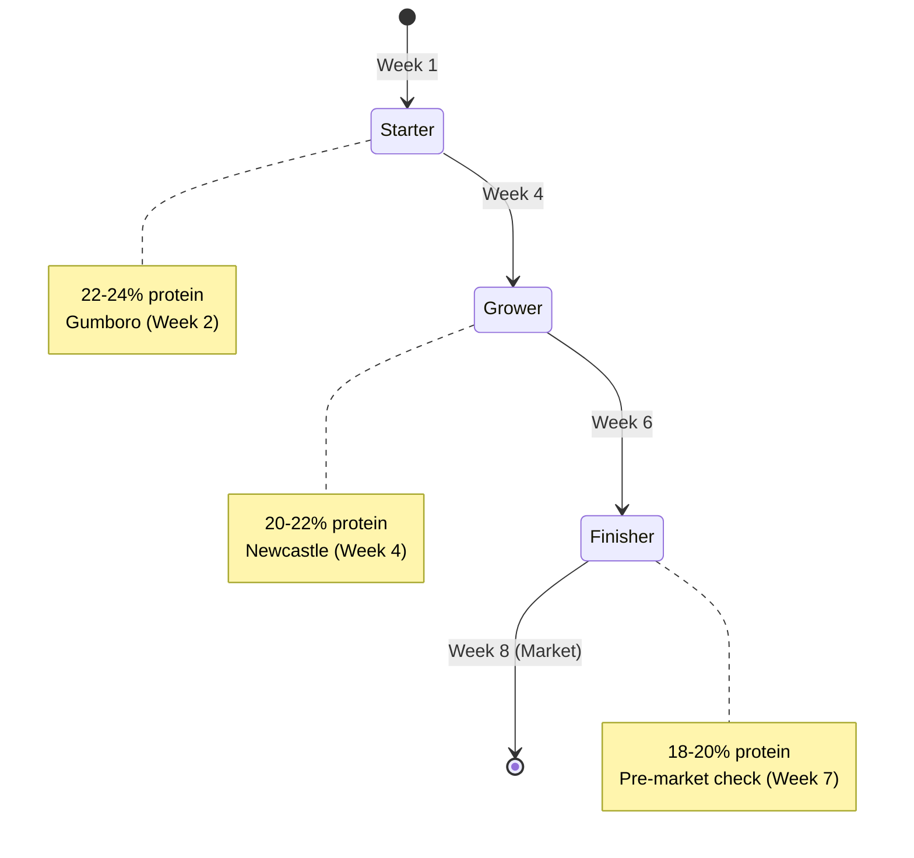
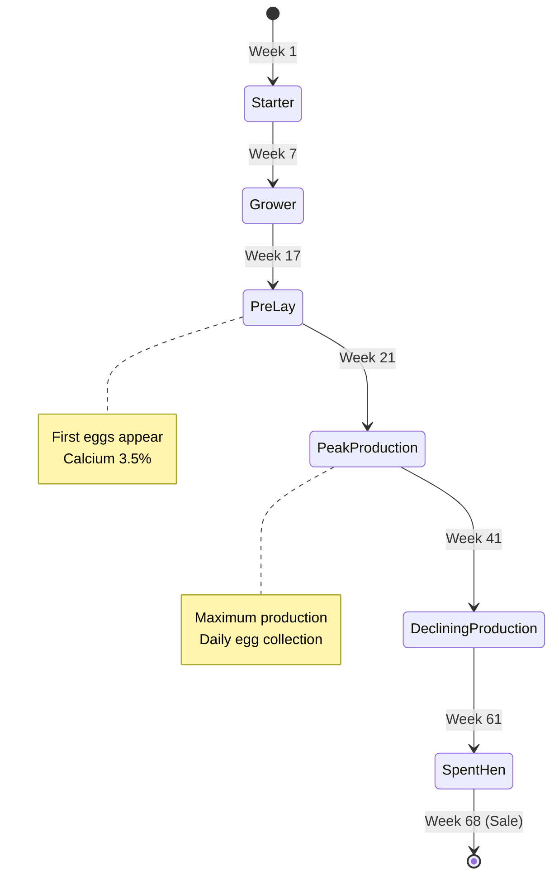
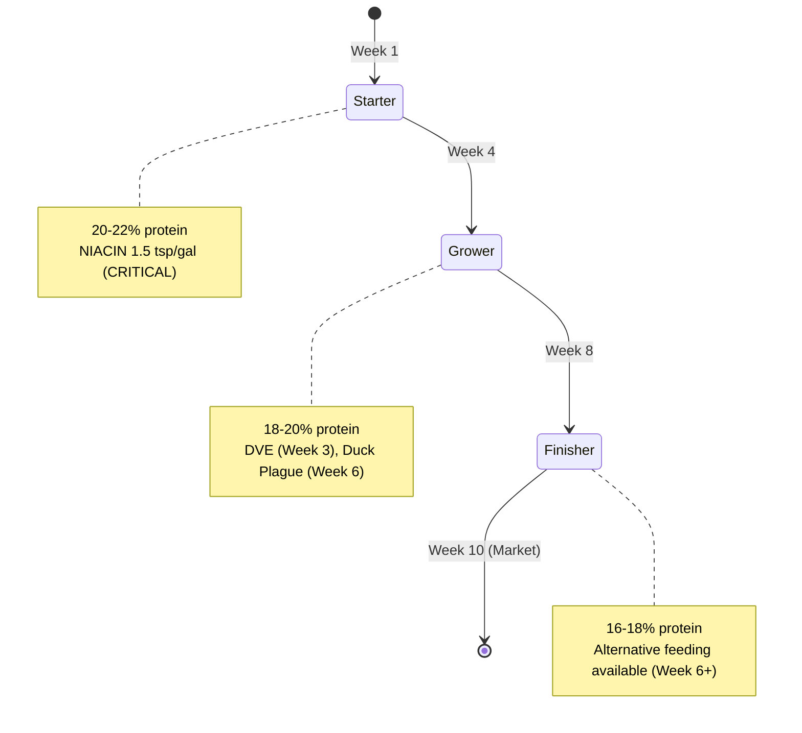
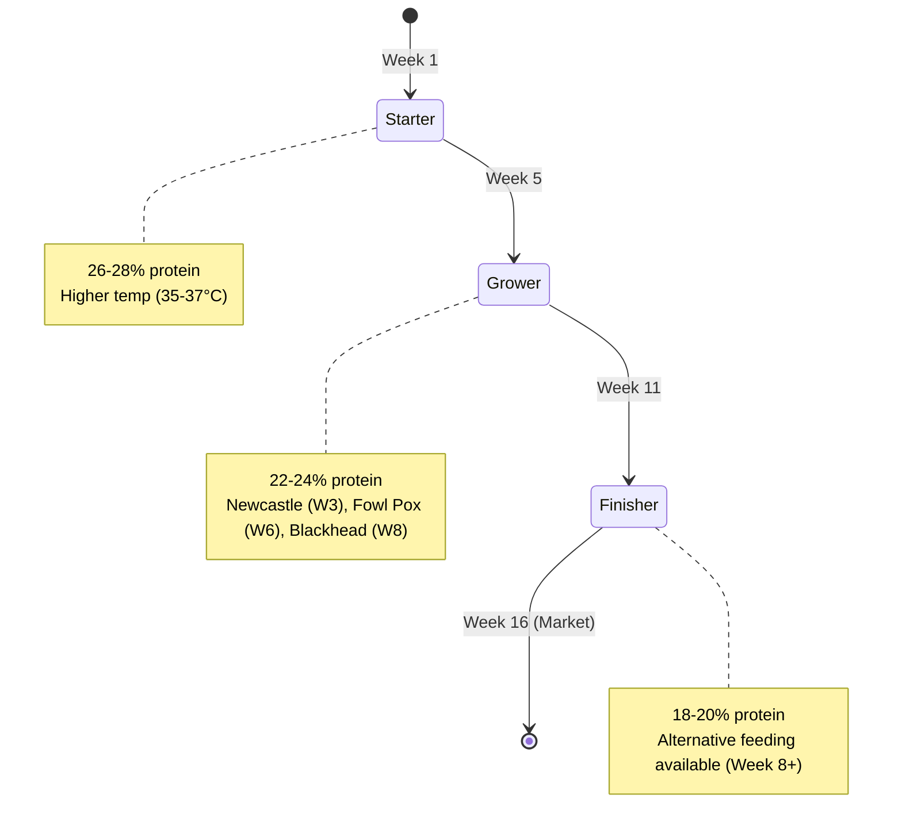

# Species-Specific Batch Management - Production-Grade Specification (All 4 Species)

# Species-Specific Batch Management - Production-Grade Specification

**Status:** Production-Ready  
**Last Updated:** January 2026

---

## Overview

This specification defines species-specific batch management behaviors for all 4 poultry species supported by LampFarms: **Broilers**, **Layers**, **Ducks**, and **Turkeys**. Each species has unique lifecycle phases, vaccination schedules, feed transitions, and production patterns that are automatically configured based on species selection during batch creation.

### Core Philosophy

**Configuration-Driven Behavior:**
- All species-specific behavior driven by file:backend/config/species.json and file:backend/config/species_protocols.json
- No hardcoded species data in code
- Automatic protocol loading on batch creation
- Species selection determines all system behavior

**Farmer-Centric Design:**
- Species-appropriate protocols and guidance
- Automatic task generation based on species
- Clear lifecycle phase indicators
- Species-specific performance metrics

### Scope

**4 Poultry Species:**
1. **Broilers** - 8-week lifecycle, meat production, intensive only
2. **Layers** - 68-week lifecycle, egg production, intensive only
3. **Ducks** - 10-week lifecycle, meat/egg production, alternative feeding from Week 6
4. **Turkeys** - 16-week lifecycle, meat production, alternative feeding from Week 8

---

## Section 1: Broiler Batch Management

### Lifecycle Overview

**Duration:** 8 weeks  
**Production System:** Intensive only  
**Alternative Feeding:** Not available  
**Target Weight:** 2.0-2.5 kg at Week 8

### Lifecycle Phases



**Phase 1: Starter (Week 1-3)**
- **Feed:** Broiler Starter (22-24% protein)
- **Focus:** Chick quality, early growth
- **Critical:** Gumboro vaccination (Week 2)
- **Consumption:** 0.05 kg per bird per day

**Phase 2: Grower (Week 4-5)**
- **Feed:** Broiler Grower (20-22% protein)
- **Focus:** Rapid growth, leg health
- **Critical:** Newcastle vaccination (Week 4)
- **Consumption:** 0.09 kg per bird per day

**Phase 3: Finisher (Week 6-8)**
- **Feed:** Broiler Finisher (18-20% protein)
- **Focus:** Market weight, withdrawal periods
- **Critical:** Pre-market health check (Week 7)
- **Consumption:** 0.15 kg per bird per day

### Vaccination Schedule

From file:backend/config/species_protocols.json:

| Week | Day | Vaccine | Method | Duration | Priority |
|------|-----|---------|--------|----------|----------|
| Week 1 | Day 7 | Gumboro (IBD) | Drinking water | 1 day | CRITICAL |
| Week 2 | Day 14 | HB1 (Newcastle + IB) | Drinking water | 1 day | CRITICAL |
| Week 3 | Day 21 | Gumboro Plus (IBD booster) | Drinking water | 1 day | CRITICAL |
| Week 4 | Day 28 | Lasota (Newcastle booster) | Drinking water | 1 day | CRITICAL |
| Week 5 | Day 35 | Gumboro Plus (Final IBD) | Drinking water | 1 day | CRITICAL |
| Week 6 | Day 36 | Deworming (Fenbendazole) | Drinking water | 1 day | HIGH |

**Vaccination Protocol (5-Step Process):**
1. Buy vaccine early morning with ice blocks (cold chain critical)
2. Remove water 2-3 hours before (make birds thirsty)
3. Mix vaccine in half of daily water
4. Ensure all birds drink within 1 hour
5. Give anti-stress next 2 days

### Health Checkpoints

| Week | Checkpoint | Description | Required |
|------|------------|-------------|----------|
| Week 1 | Chick Quality Check | Check navels, activity, uniformity | Yes |
| Week 3 | Growth Check | Weigh sample birds against targets | Yes |
| Week 5 | Leg Health | Check for leg problems or gait issues | No |
| Week 7 | Pre-market Health | Withdrawal period verification | Yes |

### Nutritional Requirements

From file:backend/config/species.json:

- **Protein:** Minimum 18%
- **Energy:** Minimum 2,800 kcal/kg
- **Fiber:** Maximum 6%

---

## Section 2: Layer Batch Management

### Lifecycle Overview

**Duration:** 68 weeks  
**Production System:** Intensive only  
**Alternative Feeding:** Not available  
**Egg Production:** Starts Week 17, peaks Week 24-40

### Lifecycle Phases



**Phase 1: Starter (Week 1-6)**
- **Feed:** Layer Starter (18-20% protein)
- **Focus:** Chick quality, early development
- **Critical:** Marek vaccination (Week 2)
- **Consumption:** 0.06 kg per bird per day

**Phase 2: Grower (Week 7-16)**
- **Feed:** Layer Grower (16-18% protein)
- **Focus:** Skeletal development, uniformity
- **Critical:** Newcastle (Week 6), Infectious Bronchitis (Week 16)
- **Consumption:** 0.09 kg per bird per day

**Phase 3: Pre-Lay (Week 17-20)**
- **Feed:** Layer Pre-Lay (17-18% protein, 3.5% calcium)
- **Focus:** Reproductive development, first eggs
- **Critical:** Light management, calcium supplementation
- **Consumption:** 0.12 kg per bird per day

**Phase 4: Peak Production (Week 21-40)**
- **Feed:** Layer Feed (16-17% protein, 3.5-4% calcium)
- **Focus:** Maximum egg production, shell quality
- **Critical:** Daily egg collection, calcium monitoring
- **Consumption:** 0.12 kg per bird per day

**Phase 5: Declining Production (Week 41-60)**
- **Feed:** Layer Feed (16% protein, 3.5% calcium)
- **Focus:** Maintaining production, cost efficiency
- **Critical:** Shell quality monitoring
- **Consumption:** 0.12 kg per bird per day

**Phase 6: Spent Hen (Week 61-68)**
- **Feed:** Layer Feed (reduced quantity)
- **Focus:** Planning sale, final health check
- **Critical:** Spent hen sale planning
- **Consumption:** 0.10 kg per bird per day

### Vaccination Schedule

From file:backend/config/species_protocols.json:

| Week | Day | Vaccine | Method | Duration | Priority |
|------|-----|---------|--------|----------|----------|
| Week 1 | Day 7 | Gumboro (IBD) | Drinking water | 1 day | CRITICAL |
| Week 2 | Day 14 | HB1 (Newcastle + IB) | Drinking water | 1 day | CRITICAL |
| Week 3 | Day 21 | Gumboro Plus (IBD booster) | Drinking water | 1 day | CRITICAL |
| Week 4 | Day 28 | Lasota (Newcastle booster) | Drinking water | 1 day | CRITICAL |
| Week 5 | Day 35 | Gumboro Plus (Final IBD) | Drinking water | 1 day | CRITICAL |
| Week 7 | Day 49 | Deworming | Drinking water | 1 day | HIGH |
| Week 8 | Day 56 | 1st Fowl Pox | Wing web injection | 1 day | CRITICAL |
| Week 10 | Day 70 | Lasota (Newcastle booster) | Drinking water | 1 day | HIGH |
| Week 12 | Day 84 | 2nd Fowl Pox | Wing web injection | 1 day | HIGH |
| Week 13 | Day 91 | Deworming | Drinking water | 1 day | HIGH |
| Week 16 | Day 112 | 3rd Newcastle | Drinking water | 1 day | HIGH |
| Week 19+ | Monthly | Deworming | Drinking water | 1 day | HIGH |
| Week 19+ | Quarterly | Newcastle booster | Drinking water | 1 day | HIGH |

**Vaccination Protocol (5-Step Process):**
1. Buy vaccine early morning with ice blocks (cold chain critical)
2. Remove water 2-3 hours before (make birds thirsty)
3. Mix vaccine in half of daily water
4. Ensure all birds drink within 1 hour
5. Give anti-stress next 2 days

### Health Checkpoints

| Week | Checkpoint | Description | Required |
|------|------------|-------------|----------|
| Week 1 | Arrival Check | Hydration and alertness | Yes |
| Week 8 | Uniformity Check | Body weight uniformity | Yes |
| Week 16 | Pre-lay Condition | Keel bone and fleshing | Yes |
| Week 24 | Peak Production | Identify non-layers | No |
| Week 40 | Mid-lay Health | Shell quality check | No |
| Week 60 | Late-lay Condition | Feather cover and calcium status | No |

### Nutritional Requirements

From file:backend/config/species.json:

- **Protein:** Minimum 16%
- **Energy:** Minimum 2,650 kcal/kg
- **Fiber:** Maximum 7%
- **Calcium:** Minimum 3.5% (critical for egg production)

---

## Section 3: Duck Batch Management

### Lifecycle Overview

**Duration:** 10 weeks  
**Production System:** Intensive or Semi-Intensive  
**Alternative Feeding:** Available from Week 6  
**Target Weight:** 2.5-3.0 kg at Week 10

### Lifecycle Phases



**Phase 1: Starter (Week 1-3)**
- **Feed:** Duck Starter (20-22% protein)
- **Focus:** Duckling vitality, water access
- **Critical:** Niacin supplementation (1.5 tsp/gallon - CRITICAL)
- **Consumption:** 0.06 kg per bird per day

**Phase 2: Grower (Week 4-7)**
- **Feed:** Duck Grower (18-20% protein)
- **Focus:** Feathering, rapid growth
- **Critical:** Duck Viral Enteritis (Week 3), Duck Plague (Week 6)
- **Consumption:** 0.11 kg per bird per day

**Phase 3: Finisher (Week 8-10)**
- **Feed:** Duck Finisher (16-18% protein)
- **Focus:** Market weight, final health check
- **Alternative Feeding:** Available from Week 6 (if semi-intensive)
- **Consumption:** 0.16 kg per bird per day (intensive) or reduced (semi-intensive)

### Vaccination Schedule

From file:backend/config/species_protocols.json:

| Week | Day | Vaccine | Method | Duration | Priority |
|------|-----|---------|--------|----------|----------|
| Week 1 | Day 7 | Duck Viral Hepatitis | Subcutaneous injection | 1 day | CRITICAL |
| Week 2 | Day 14 | Duck Plague | Drinking water | 1 day | HIGH (endemic areas) |
| Week 3 | Day 21 | Newcastle (optional) | Drinking water | 1 day | OPTIONAL (if mixing with chickens) |
| Week 4 | Day 28 | Deworming | Drinking water | 1 day | HIGH |
| Week 5 | Day 35 | Duck Plague booster | Drinking water | 1 day | HIGH (if endemic) |
| Week 7 | Day 49 | Deworming | Drinking water | 1 day | HIGH |

**Layer Ducks (Week 18+):**
- Duck Plague booster every 6 months
- Deworm monthly
- Newcastle booster if mixing with chickens

**Vaccination Protocol (5-Step Process):**
1. Buy vaccine early morning with ice blocks (cold chain critical)
2. Remove water 2-3 hours before (make birds thirsty)
3. Mix vaccine in half of daily water
4. Ensure all birds drink within 1 hour
5. Give anti-stress next 2 days

### Health Checkpoints

| Week | Checkpoint | Description | Required |
|------|------------|-------------|----------|
| Week 1 | Duckling Vitality | Activity and water finding | Yes |
| Week 4 | Feathering Check | Down replacement progress | Yes |
| Week 7 | Health Assessment | General condition | No |
| Week 10 | Final Inspection | Market readiness | Yes |

### Alternative Feeding (Week 6+)

**Foraging Modifiers (Semi-Intensive Only):**
- **Week 6-7:** 15% feed reduction
- **Week 8-10:** 25% feed reduction

**Calculation:**
```
Adjusted Feed = Base Feed × (1 - Foraging Modifier)

Example (Week 8, Semi-Intensive):
Base Feed = 0.16 kg/bird/day
Foraging Modifier = 0.25 (25%)
Adjusted Feed = 0.16 × (1 - 0.25) = 0.12 kg/bird/day
```

### Nutritional Requirements

From file:backend/config/species.json:

- **Protein:** Minimum 17%
- **Energy:** Minimum 2,700 kcal/kg
- **Fiber:** Maximum 6%
- **Niacin:** 1.5 tsp/gallon (CRITICAL - prevents leg problems)

### Special Requirements

**Water Access:**
- Ducks need 2-3x more water than chickens
- Swimming water optional but beneficial
- Clean water critical for health

**Niacin Supplementation (CRITICAL):**
- **Why:** Ducks cannot synthesize niacin efficiently
- **Consequence:** Leg problems, bowed legs, inability to walk
- **Solution:** 1.5 tsp niacin per gallon of water OR 55mg/kg in feed
- **Frequency:** Daily throughout lifecycle

---

## Section 4: Turkey Batch Management

### Lifecycle Overview

**Duration:** 16 weeks  
**Production System:** Intensive or Semi-Intensive  
**Alternative Feeding:** Available from Week 8  
**Target Weight:** 8-12 kg at Week 16

### Lifecycle Phases



**Phase 1: Starter (Week 1-4)**
- **Feed:** Turkey Starter (26-28% protein)
- **Focus:** Poult start, crop fill check
- **Critical:** Higher temperature (35-37°C)
- **Consumption:** 0.04 kg per bird per day

**Phase 2: Grower (Week 5-10)**
- **Feed:** Turkey Grower (22-24% protein)
- **Focus:** Skeletal growth, development
- **Critical:** Newcastle (Week 3), Fowl Pox (Week 6), Blackhead Prevention (Week 8)
- **Consumption:** 0.08 kg per bird per day

**Phase 3: Finisher (Week 11-16)**
- **Feed:** Turkey Finisher (18-20% protein)
- **Focus:** Market weight, finish quality
- **Alternative Feeding:** Available from Week 8 (if semi-intensive)
- **Consumption:** 0.14 kg per bird per day (intensive) or reduced (semi-intensive)

### Vaccination Schedule

From file:backend/config/species_protocols.json:

| Week | Day | Vaccine | Method | Duration | Priority |
|------|-----|---------|--------|----------|----------|
| Week 1 | Day 7 | Gumboro (IBD) | Drinking water | 1 day | CRITICAL |
| Week 2 | Day 14 | HB1 (Newcastle + IB) | Drinking water | 1 day | CRITICAL |
| Week 3 | Day 21 | Gumboro Plus (IBD booster) | Drinking water | 1 day | CRITICAL |
| Week 4 | Day 28 | 1st Fowl Pox + Lasota | Wing web + Drinking water | 1 day | CRITICAL |
| Week 5 | Day 35 | Gumboro Plus (Final IBD) | Drinking water | 1 day | CRITICAL |
| Week 7 | Day 49 | Deworming | Drinking water | 1 day | HIGH |
| Week 8 | Day 56 | 2nd Fowl Pox | Wing web injection | 1 day | CRITICAL |
| Week 10 | Day 70 | Lasota (Newcastle booster) | Drinking water | 1 day | HIGH |
| Week 12 | Day 84 | 3rd Fowl Pox | Wing web injection | 1 day | HIGH |
| Week 13 | Day 91 | Deworming | Drinking water | 1 day | HIGH |
| Week 16 | Day 112 | 3rd Newcastle | Drinking water | 1 day | HIGH |

**CRITICAL: Blackhead Prevention Protocol**
- Blackhead (Histomoniasis) is the #1 killer of turkeys
- Give Blackhead preventive every 2 weeks throughout production
- NEVER raise turkeys with chickens (chickens carry Heterakis worm)
- Regular deworming critical (Heterakis worm carries Blackhead)

**Vaccination Protocol (5-Step Process):**
1. Buy vaccine early morning with ice blocks (cold chain critical)
2. Remove water 2-3 hours before (make birds thirsty)
3. Mix vaccine in half of daily water
4. Ensure all birds drink within 1 hour
5. Give anti-stress next 2 days

### Health Checkpoints

| Week | Checkpoint | Description | Required |
|------|------------|-------------|----------|
| Week 1 | Poult Start | Crop fill check | Yes |
| Week 4 | Development Check | Skeletal growth | Yes |
| Week 8 | Range Readiness | Hardiness assessment | Yes |
| Week 12 | Growth Monitoring | Weight gain trajectory | No |
| Week 16 | Finish Quality | Fleshing score | Yes |

### Alternative Feeding (Week 8+)

**Foraging Modifiers (Semi-Intensive Only):**
- **Week 8-12:** 12% feed reduction
- **Week 13-16:** 22% feed reduction

**Calculation:**
```
Adjusted Feed = Base Feed × (1 - Foraging Modifier)

Example (Week 13, Semi-Intensive):
Base Feed = 0.14 kg/bird/day
Foraging Modifier = 0.22 (22%)
Adjusted Feed = 0.14 × (1 - 0.22) = 0.11 kg/bird/day
```

### Nutritional Requirements

From file:backend/config/species.json:

- **Protein:** Minimum 19%
- **Energy:** Minimum 2,850 kcal/kg
- **Fiber:** Maximum 5%

### Special Requirements

**Space:**
- Turkeys need 2-3 sq ft per bird (larger than chickens)
- Higher perches for roosting
- More ventilation required

**Temperature:**
- Higher brooding temperature (35-37°C vs 32-35°C for chickens)
- Longer brooding period (4 weeks vs 3 weeks)

---

## Section 5: Species Comparison Table

### Quick Reference

| Feature | Broilers | Layers | Ducks | Turkeys |
|---------|----------|--------|-------|---------|
| **Duration** | 8 weeks | 68 weeks | 10 weeks | 16 weeks |
| **Production** | Meat | Eggs | Meat/Eggs | Meat |
| **Production System** | Intensive only | Intensive only | Both | Both |
| **Alternative Feeding** | No | No | Week 6+ | Week 8+ |
| **Critical Vaccines** | Gumboro (W2), Newcastle (W4) | Marek (W2), Newcastle (W6), IB (W16) | DVE (W3), Duck Plague (W6) | Newcastle (W3), Fowl Pox (W6), Blackhead (W8) |
| **Target Weight** | 2.0-2.5 kg | N/A | 2.5-3.0 kg | 8-12 kg |
| **Egg Production** | No | Week 17-68 | Week 20+ (optional) | No |
| **Special Needs** | Standard | Calcium, Light | Water 2-3x, Niacin | Space 2-3x, Higher temp |
| **Lifecycle Phases** | 3 phases | 6 phases | 3 phases | 3 phases |

---

## Section 6: UI Wireframes

### Wireframe 1: Species Selection (Batch Creation Step 1)

```wireframe
<!DOCTYPE html>
<html>
<head>
<style>
* { margin: 0; padding: 0; box-sizing: border-box; }
body { font-family: 'Manrope', sans-serif; background: #f9fafb; padding: 24px; }
.container { max-width: 800px; margin: 0 auto; background: white; border-radius: 12px; padding: 32px; box-shadow: 0 1px 3px rgba(0,0,0,0.1); }
h1 { font-size: 24px; font-weight: 600; color: #111827; margin-bottom: 8px; }
.subtitle { color: #6b7280; font-size: 14px; margin-bottom: 32px; }
.species-grid { display: grid; grid-template-columns: repeat(2, 1fr); gap: 16px; margin-bottom: 32px; }
.species-card { border: 2px solid #e5e7eb; border-radius: 12px; padding: 24px; cursor: pointer; transition: all 0.2s; }
.species-card:hover { border-color: #16a34a; background: #f0fdf4; }
.species-card.selected { border-color: #16a34a; background: #f0fdf4; }
.species-icon { font-size: 48px; margin-bottom: 12px; }
.species-name { font-size: 18px; font-weight: 600; color: #111827; margin-bottom: 4px; }
.species-duration { color: #6b7280; font-size: 14px; margin-bottom: 8px; }
.species-tags { display: flex; gap: 8px; flex-wrap: wrap; }
.tag { background: #e5e7eb; color: #374151; padding: 4px 8px; border-radius: 6px; font-size: 12px; }
.tag.meat { background: #fee2e2; color: #991b1b; }
.tag.eggs { background: #fef3c7; color: #92400e; }
.tag.alternative { background: #dbeafe; color: #1e40af; }
.buttons { display: flex; gap: 12px; justify-content: flex-end; }
.btn { padding: 10px 20px; border-radius: 8px; font-size: 14px; font-weight: 500; cursor: pointer; border: none; }
.btn-secondary { background: #f3f4f6; color: #374151; }
.btn-primary { background: #16a34a; color: white; }
.btn-primary:disabled { background: #d1d5db; cursor: not-allowed; }
</style>
</head>
<body>
<div class="container">
  <h1>Create New Batch - Step 1 of 3</h1>
  <p class="subtitle">Select the species for this batch. This determines lifecycle phases, vaccination schedules, and feed requirements.</p>
  
  <div class="species-grid">
    <div class="species-card selected" data-element-id="species-broiler">
      <div class="species-icon">🐔</div>
      <div class="species-name">Broilers</div>
      <div class="species-duration">8 weeks • Intensive only</div>
      <div class="species-tags">
        <span class="tag meat">Meat</span>
        <span class="tag">2.0-2.5 kg</span>
      </div>
    </div>
    
    <div class="species-card" data-element-id="species-layer">
      <div class="species-icon">🥚</div>
      <div class="species-name">Layers</div>
      <div class="species-duration">68 weeks • Intensive only</div>
      <div class="species-tags">
        <span class="tag eggs">Eggs</span>
        <span class="tag">Week 17+</span>
      </div>
    </div>
    
    <div class="species-card" data-element-id="species-duck">
      <div class="species-icon">🦆</div>
      <div class="species-name">Ducks</div>
      <div class="species-duration">10 weeks • Both systems</div>
      <div class="species-tags">
        <span class="tag meat">Meat</span>
        <span class="tag eggs">Eggs</span>
        <span class="tag alternative">Alt Feed W6+</span>
      </div>
    </div>
    
    <div class="species-card" data-element-id="species-turkey">
      <div class="species-icon">🦃</div>
      <div class="species-name">Turkeys</div>
      <div class="species-duration">16 weeks • Both systems</div>
      <div class="species-tags">
        <span class="tag meat">Meat</span>
        <span class="tag">8-12 kg</span>
        <span class="tag alternative">Alt Feed W8+</span>
      </div>
    </div>
  </div>
  
  <div class="buttons">
    <button class="btn btn-secondary" data-element-id="btn-cancel">Cancel</button>
    <button class="btn btn-primary" data-element-id="btn-next">Next: House & Details</button>
  </div>
</div>
</body>
</html>
```

### Wireframe 2: Species Protocol Display (Week-by-Week Guidance)

```wireframe
<!DOCTYPE html>
<html>
<head>
<style>
* { margin: 0; padding: 0; box-sizing: border-box; }
body { font-family: 'Manrope', sans-serif; background: #f9fafb; padding: 24px; }
.container { max-width: 1000px; margin: 0 auto; background: white; border-radius: 12px; padding: 32px; box-shadow: 0 1px 3px rgba(0,0,0,0.1); }
.header { display: flex; justify-content: space-between; align-items: center; margin-bottom: 24px; }
h1 { font-size: 24px; font-weight: 600; color: #111827; }
.species-badge { background: #f0fdf4; color: #16a34a; padding: 6px 12px; border-radius: 8px; font-size: 14px; font-weight: 500; }
.timeline { position: relative; padding-left: 40px; }
.timeline::before { content: ''; position: absolute; left: 16px; top: 0; bottom: 0; width: 2px; background: #e5e7eb; }
.week-item { position: relative; margin-bottom: 32px; }
.week-item::before { content: ''; position: absolute; left: -32px; top: 8px; width: 12px; height: 12px; border-radius: 50%; background: #16a34a; border: 2px solid white; box-shadow: 0 0 0 2px #16a34a; }
.week-header { display: flex; align-items: center; gap: 12px; margin-bottom: 12px; }
.week-number { font-size: 18px; font-weight: 600; color: #111827; }
.phase-badge { background: #dbeafe; color: #1e40af; padding: 4px 8px; border-radius: 6px; font-size: 12px; font-weight: 500; }
.week-content { background: #f9fafb; border-radius: 8px; padding: 16px; }
.task-list { list-style: none; }
.task-item { display: flex; align-items: start; gap: 8px; margin-bottom: 8px; color: #374151; font-size: 14px; }
.task-item::before { content: '✓'; color: #16a34a; font-weight: bold; }
.critical { color: #dc2626; font-weight: 500; }
</style>
</head>
<body>
<div class="container">
  <div class="header">
    <h1>Broiler Lifecycle Protocol</h1>
    <span class="species-badge">🐔 Broilers • 8 weeks</span>
  </div>
  
  <div class="timeline">
    <div class="week-item">
      <div class="week-header">
        <span class="week-number">Week 1</span>
        <span class="phase-badge">Starter Phase</span>
      </div>
      <div class="week-content">
        <ul class="task-list">
          <li class="task-item">Chick Quality Check (Day 1) - Check navels, activity, uniformity</li>
          <li class="task-item">Feed: Broiler Starter (22-24% protein) - 0.05 kg/bird/day</li>
          <li class="task-item">Temperature: 32-35°C</li>
        </ul>
      </div>
    </div>
    
    <div class="week-item">
      <div class="week-header">
        <span class="week-number">Week 2</span>
        <span class="phase-badge">Starter Phase</span>
      </div>
      <div class="week-content">
        <ul class="task-list">
          <li class="task-item critical">Gumboro Vaccination (Water delivery, 1 day) - CRITICAL</li>
          <li class="task-item">Continue Broiler Starter feed</li>
        </ul>
      </div>
    </div>
    
    <div class="week-item">
      <div class="week-header">
        <span class="week-number">Week 3</span>
        <span class="phase-badge">Starter Phase</span>
      </div>
      <div class="week-content">
        <ul class="task-list">
          <li class="task-item">Growth Check - Weigh sample birds against targets</li>
          <li class="task-item">Continue Broiler Starter feed</li>
        </ul>
      </div>
    </div>
    
    <div class="week-item">
      <div class="week-header">
        <span class="week-number">Week 4</span>
        <span class="phase-badge">Grower Phase</span>
      </div>
      <div class="week-content">
        <ul class="task-list">
          <li class="task-item critical">Newcastle Vaccination (Water delivery, 1 day) - CRITICAL</li>
          <li class="task-item">Feed Transition: Broiler Grower (20-22% protein) - 0.09 kg/bird/day</li>
        </ul>
      </div>
    </div>
    
    <div class="week-item">
      <div class="week-header">
        <span class="week-number">Week 5</span>
        <span class="phase-badge">Grower Phase</span>
      </div>
      <div class="week-content">
        <ul class="task-list">
          <li class="task-item">Leg Health Check - Check for leg problems or gait issues</li>
          <li class="task-item">Continue Broiler Grower feed</li>
        </ul>
      </div>
    </div>
    
    <div class="week-item">
      <div class="week-header">
        <span class="week-number">Week 6</span>
        <span class="phase-badge">Finisher Phase</span>
      </div>
      <div class="week-content">
        <ul class="task-list">
          <li class="task-item">Feed Transition: Broiler Finisher (18-20% protein) - 0.15 kg/bird/day</li>
        </ul>
      </div>
    </div>
    
    <div class="week-item">
      <div class="week-header">
        <span class="week-number">Week 7</span>
        <span class="phase-badge">Finisher Phase</span>
      </div>
      <div class="week-content">
        <ul class="task-list">
          <li class="task-item critical">Pre-market Health Check - Withdrawal period verification</li>
          <li class="task-item">Continue Broiler Finisher feed</li>
        </ul>
      </div>
    </div>
    
    <div class="week-item">
      <div class="week-header">
        <span class="week-number">Week 8</span>
        <span class="phase-badge">Market Ready</span>
      </div>
      <div class="week-content">
        <ul class="task-list">
          <li class="task-item">Target Weight: 2.0-2.5 kg</li>
          <li class="task-item">Final health inspection before sale</li>
          <li class="task-item">Batch termination and financial summary</li>
        </ul>
      </div>
    </div>
  </div>
</div>
</body>
</html>
```

### Wireframe 3: Alternative Feeding Toggle (Ducks/Turkeys Only)

```wireframe
<!DOCTYPE html>
<html>
<head>
<style>
* { margin: 0; padding: 0; box-sizing: border-box; }
body { font-family: 'Manrope', sans-serif; background: #f9fafb; padding: 24px; }
.container { max-width: 600px; margin: 0 auto; background: white; border-radius: 12px; padding: 32px; box-shadow: 0 1px 3px rgba(0,0,0,0.1); }
h2 { font-size: 20px; font-weight: 600; color: #111827; margin-bottom: 8px; }
.subtitle { color: #6b7280; font-size: 14px; margin-bottom: 24px; }
.option-card { border: 2px solid #e5e7eb; border-radius: 12px; padding: 20px; margin-bottom: 16px; cursor: pointer; transition: all 0.2s; }
.option-card:hover { border-color: #16a34a; }
.option-card.selected { border-color: #16a34a; background: #f0fdf4; }
.option-header { display: flex; align-items: center; gap: 12px; margin-bottom: 8px; }
.radio { width: 20px; height: 20px; border: 2px solid #d1d5db; border-radius: 50%; display: flex; align-items: center; justify-content: center; }
.radio.selected { border-color: #16a34a; }
.radio.selected::after { content: ''; width: 10px; height: 10px; background: #16a34a; border-radius: 50%; }
.option-title { font-size: 16px; font-weight: 600; color: #111827; }
.option-description { color: #6b7280; font-size: 14px; line-height: 1.5; margin-bottom: 12px; }
.option-details { background: #f9fafb; border-radius: 8px; padding: 12px; }
.detail-item { display: flex; justify-content: space-between; margin-bottom: 8px; font-size: 14px; }
.detail-item:last-child { margin-bottom: 0; }
.detail-label { color: #6b7280; }
.detail-value { color: #111827; font-weight: 500; }
.info-box { background: #dbeafe; border-left: 4px solid #3b82f6; padding: 12px; border-radius: 8px; margin-top: 24px; }
.info-box p { color: #1e40af; font-size: 14px; line-height: 1.5; }
</style>
</head>
<body>
<div class="container">
  <h2>Production System</h2>
  <p class="subtitle">Choose how you'll manage this duck batch. This affects feed consumption calculations.</p>
  
  <div class="option-card selected" data-element-id="option-intensive">
    <div class="option-header">
      <div class="radio selected"></div>
      <span class="option-title">Intensive (Automatic)</span>
    </div>
    <p class="option-description">
      Birds are confined and fed commercial feed only. System automatically calculates feed requirements and creates expenses.
    </p>
    <div class="option-details">
      <div class="detail-item">
        <span class="detail-label">Feed Source:</span>
        <span class="detail-value">100% Commercial Feed</span>
      </div>
      <div class="detail-item">
        <span class="detail-label">Stock Allocation:</span>
        <span class="detail-value">Automatic</span>
      </div>
      <div class="detail-item">
        <span class="detail-label">Expense Creation:</span>
        <span class="detail-value">Automatic</span>
      </div>
    </div>
  </div>
  
  <div class="option-card" data-element-id="option-semi-intensive">
    <div class="option-header">
      <div class="radio"></div>
      <span class="option-title">Semi-Intensive (Flexible)</span>
    </div>
    <p class="option-description">
      Birds have access to foraging areas. Feed consumption is reduced based on foraging availability. You manage stock and expenses manually.
    </p>
    <div class="option-details">
      <div class="detail-item">
        <span class="detail-label">Feed Source:</span>
        <span class="detail-value">Commercial + Foraging</span>
      </div>
      <div class="detail-item">
        <span class="detail-label">Feed Reduction:</span>
        <span class="detail-value">Week 6-7: 15% | Week 8-10: 25%</span>
      </div>
      <div class="detail-item">
        <span class="detail-label">Stock Allocation:</span>
        <span class="detail-value">Manual</span>
      </div>
      <div class="detail-item">
        <span class="detail-label">Expense Creation:</span>
        <span class="detail-value">Manual</span>
      </div>
    </div>
  </div>
  
  <div class="info-box">
    <p><strong>Note:</strong> Alternative feeding (semi-intensive) is available from Week 6 for ducks. The system will automatically reduce feed consumption calculations based on the foraging modifiers above.</p>
  </div>
</div>
</body>
</html>
```

### Wireframe 4: Species Comparison Table

```wireframe
<!DOCTYPE html>
<html>
<head>
<style>
* { margin: 0; padding: 0; box-sizing: border-box; }
body { font-family: 'Manrope', sans-serif; background: #f9fafb; padding: 24px; }
.container { max-width: 1200px; margin: 0 auto; background: white; border-radius: 12px; padding: 32px; box-shadow: 0 1px 3px rgba(0,0,0,0.1); }
h1 { font-size: 24px; font-weight: 600; color: #111827; margin-bottom: 24px; }
table { width: 100%; border-collapse: collapse; }
th { background: #f9fafb; color: #6b7280; font-size: 12px; font-weight: 600; text-transform: uppercase; padding: 12px; text-align: left; border-bottom: 2px solid #e5e7eb; }
td { padding: 16px 12px; border-bottom: 1px solid #e5e7eb; color: #374151; font-size: 14px; }
tr:last-child td { border-bottom: none; }
.feature-cell { font-weight: 500; color: #111827; }
.icon { font-size: 20px; margin-right: 8px; }
.tag { display: inline-block; background: #e5e7eb; color: #374151; padding: 4px 8px; border-radius: 6px; font-size: 12px; margin-right: 4px; margin-bottom: 4px; }
.tag.meat { background: #fee2e2; color: #991b1b; }
.tag.eggs { background: #fef3c7; color: #92400e; }
.tag.alternative { background: #dbeafe; color: #1e40af; }
.tag.critical { background: #fecaca; color: #991b1b; }
</style>
</head>
<body>
<div class="container">
  <h1>Species Comparison</h1>
  
  <table>
    <thead>
      <tr>
        <th>Feature</th>
        <th><span class="icon">🐔</span>Broilers</th>
        <th><span class="icon">🥚</span>Layers</th>
        <th><span class="icon">🦆</span>Ducks</th>
        <th><span class="icon">🦃</span>Turkeys</th>
      </tr>
    </thead>
    <tbody>
      <tr>
        <td class="feature-cell">Duration</td>
        <td>8 weeks</td>
        <td>68 weeks</td>
        <td>10 weeks</td>
        <td>16 weeks</td>
      </tr>
      <tr>
        <td class="feature-cell">Production</td>
        <td><span class="tag meat">Meat</span></td>
        <td><span class="tag eggs">Eggs</span></td>
        <td><span class="tag meat">Meat</span><span class="tag eggs">Eggs</span></td>
        <td><span class="tag meat">Meat</span></td>
      </tr>
      <tr>
        <td class="feature-cell">Production System</td>
        <td>Intensive only</td>
        <td>Intensive only</td>
        <td>Both</td>
        <td>Both</td>
      </tr>
      <tr>
        <td class="feature-cell">Alternative Feeding</td>
        <td>Not available</td>
        <td>Not available</td>
        <td><span class="tag alternative">Week 6+</span><br>15-25% reduction</td>
        <td><span class="tag alternative">Week 8+</span><br>12-22% reduction</td>
      </tr>
      <tr>
        <td class="feature-cell">Critical Vaccines</td>
        <td>
          <span class="tag critical">Gumboro (W2)</span>
          <span class="tag critical">Newcastle (W4)</span>
        </td>
        <td>
          <span class="tag critical">Marek (W2)</span>
          <span class="tag critical">Newcastle (W6)</span>
          <span class="tag critical">IB (W16)</span>
        </td>
        <td>
          <span class="tag critical">DVE (W3)</span>
          <span class="tag critical">Duck Plague (W6)</span>
        </td>
        <td>
          <span class="tag critical">Newcastle (W3)</span>
          <span class="tag critical">Fowl Pox (W6)</span>
          <span class="tag critical">Blackhead (W8)</span>
        </td>
      </tr>
      <tr>
        <td class="feature-cell">Target Weight</td>
        <td>2.0-2.5 kg</td>
        <td>N/A</td>
        <td>2.5-3.0 kg</td>
        <td>8-12 kg</td>
      </tr>
      <tr>
        <td class="feature-cell">Egg Production</td>
        <td>No</td>
        <td>Week 17-68<br>Peak: Week 24-40</td>
        <td>Week 20+ (optional)</td>
        <td>No</td>
      </tr>
      <tr>
        <td class="feature-cell">Special Needs</td>
        <td>Standard</td>
        <td>Calcium 3.5%<br>Light management</td>
        <td>Water 2-3x<br><strong>Niacin 1.5 tsp/gal</strong></td>
        <td>Space 2-3x<br>Higher temp (35-37°C)</td>
      </tr>
      <tr>
        <td class="feature-cell">Lifecycle Phases</td>
        <td>3 phases</td>
        <td>6 phases</td>
        <td>3 phases</td>
        <td>3 phases</td>
      </tr>
    </tbody>
  </table>
</div>
</body>
</html>
```

---

## Section 7: Backend Integration

### Configuration Files

**file:backend/config/species.json**

```json
{
  "broiler": {
    "name": "Broilers",
    "duration_weeks": 8,
    "production_systems": ["intensive"],
    "alternative_feeding_available": false,
    "lifecycle_phases": [
      {
        "name": "Starter",
        "start_week": 1,
        "end_week": 3,
        "feed_type": "Broiler Starter",
        "protein_min": 22,
        "protein_max": 24,
        "consumption_rate": 0.05
      },
      {
        "name": "Grower",
        "start_week": 4,
        "end_week": 5,
        "feed_type": "Broiler Grower",
        "protein_min": 20,
        "protein_max": 22,
        "consumption_rate": 0.09
      },
      {
        "name": "Finisher",
        "start_week": 6,
        "end_week": 8,
        "feed_type": "Broiler Finisher",
        "protein_min": 18,
        "protein_max": 20,
        "consumption_rate": 0.15
      }
    ],
    "nutritional_requirements": {
      "protein_min": 18,
      "energy_min": 2800,
      "fiber_max": 6
    },
    "target_weight_kg": 2.25
  },
  "layer": {
    "name": "Layers",
    "duration_weeks": 68,
    "production_systems": ["intensive"],
    "alternative_feeding_available": false,
    "egg_production_start_week": 17,
    "lifecycle_phases": [
      {
        "name": "Starter",
        "start_week": 1,
        "end_week": 6,
        "feed_type": "Layer Starter",
        "protein_min": 18,
        "protein_max": 20,
        "consumption_rate": 0.06
      },
      {
        "name": "Grower",
        "start_week": 7,
        "end_week": 16,
        "feed_type": "Layer Grower",
        "protein_min": 16,
        "protein_max": 18,
        "consumption_rate": 0.09
      },
      {
        "name": "Pre-Lay",
        "start_week": 17,
        "end_week": 20,
        "feed_type": "Layer Pre-Lay",
        "protein_min": 17,
        "protein_max": 18,
        "calcium_min": 3.5,
        "consumption_rate": 0.12
      },
      {
        "name": "Peak Production",
        "start_week": 21,
        "end_week": 40,
        "feed_type": "Layer Feed",
        "protein_min": 16,
        "protein_max": 17,
        "calcium_min": 3.5,
        "calcium_max": 4.0,
        "consumption_rate": 0.12
      },
      {
        "name": "Declining Production",
        "start_week": 41,
        "end_week": 60,
        "feed_type": "Layer Feed",
        "protein_min": 16,
        "calcium_min": 3.5,
        "consumption_rate": 0.12
      },
      {
        "name": "Spent Hen",
        "start_week": 61,
        "end_week": 68,
        "feed_type": "Layer Feed",
        "protein_min": 16,
        "consumption_rate": 0.10
      }
    ],
    "nutritional_requirements": {
      "protein_min": 16,
      "energy_min": 2650,
      "fiber_max": 7,
      "calcium_min": 3.5
    }
  },
  "duck": {
    "name": "Ducks",
    "duration_weeks": 10,
    "production_systems": ["intensive", "semi_intensive"],
    "alternative_feeding_available": true,
    "alternative_feeding_start_week": 6,
    "lifecycle_phases": [
      {
        "name": "Starter",
        "start_week": 1,
        "end_week": 3,
        "feed_type": "Duck Starter",
        "protein_min": 20,
        "protein_max": 22,
        "consumption_rate": 0.06,
        "special_requirements": ["niacin_supplementation"]
      },
      {
        "name": "Grower",
        "start_week": 4,
        "end_week": 7,
        "feed_type": "Duck Grower",
        "protein_min": 18,
        "protein_max": 20,
        "consumption_rate": 0.11,
        "foraging_modifier": {
          "week_6": 0.15,
          "week_7": 0.15
        }
      },
      {
        "name": "Finisher",
        "start_week": 8,
        "end_week": 10,
        "feed_type": "Duck Finisher",
        "protein_min": 16,
        "protein_max": 18,
        "consumption_rate": 0.16,
        "foraging_modifier": {
          "week_8": 0.25,
          "week_9": 0.25,
          "week_10": 0.25
        }
      }
    ],
    "nutritional_requirements": {
      "protein_min": 17,
      "energy_min": 2700,
      "fiber_max": 6,
      "niacin_supplementation": "1.5 tsp/gallon"
    },
    "target_weight_kg": 2.75,
    "water_consumption_multiplier": 2.5
  },
  "turkey": {
    "name": "Turkeys",
    "duration_weeks": 16,
    "production_systems": ["intensive", "semi_intensive"],
    "alternative_feeding_available": true,
    "alternative_feeding_start_week": 8,
    "lifecycle_phases": [
      {
        "name": "Starter",
        "start_week": 1,
        "end_week": 4,
        "feed_type": "Turkey Starter",
        "protein_min": 26,
        "protein_max": 28,
        "consumption_rate": 0.04,
        "special_requirements": ["higher_temperature"]
      },
      {
        "name": "Grower",
        "start_week": 5,
        "end_week": 10,
        "feed_type": "Turkey Grower",
        "protein_min": 22,
        "protein_max": 24,
        "consumption_rate": 0.08,
        "foraging_modifier": {
          "week_8": 0.12,
          "week_9": 0.12,
          "week_10": 0.12
        }
      },
      {
        "name": "Finisher",
        "start_week": 11,
        "end_week": 16,
        "feed_type": "Turkey Finisher",
        "protein_min": 18,
        "protein_max": 20,
        "consumption_rate": 0.14,
        "foraging_modifier": {
          "week_11": 0.12,
          "week_12": 0.12,
          "week_13": 0.22,
          "week_14": 0.22,
          "week_15": 0.22,
          "week_16": 0.22
        }
      }
    ],
    "nutritional_requirements": {
      "protein_min": 19,
      "energy_min": 2850,
      "fiber_max": 5
    },
    "target_weight_kg": 10,
    "space_requirement_multiplier": 2.5,
    "brooding_temperature_celsius": 36
  }
}
```

**file:backend/config/species_protocols.json**

```json
{
  "broiler": {
    "vaccination_schedule": [
      {
        "week": 2,
        "vaccine": "Gumboro",
        "method": "Water delivery",
        "duration_days": 1,
        "priority": "critical"
      },
      {
        "week": 4,
        "vaccine": "Newcastle",
        "method": "Water delivery",
        "duration_days": 1,
        "priority": "critical"
      }
    ],
    "health_checkpoints": [
      {
        "week": 1,
        "checkpoint": "Chick Quality Check",
        "description": "Check navels, activity, uniformity",
        "required": true
      },
      {
        "week": 3,
        "checkpoint": "Growth Check",
        "description": "Weigh sample birds against targets",
        "required": true
      },
      {
        "week": 5,
        "checkpoint": "Leg Health",
        "description": "Check for leg problems or gait issues",
        "required": false
      },
      {
        "week": 7,
        "checkpoint": "Pre-market Health",
        "description": "Withdrawal period verification",
        "required": true
      }
    ]
  },
  "layer": {
    "vaccination_schedule": [
      {
        "week": 2,
        "vaccine": "Marek",
        "method": "Injection",
        "duration_days": 1,
        "priority": "critical"
      },
      {
        "week": 6,
        "vaccine": "Newcastle",
        "method": "Water delivery",
        "duration_days": 1,
        "priority": "critical"
      },
      {
        "week": 16,
        "vaccine": "Infectious Bronchitis",
        "method": "Water delivery",
        "duration_days": 1,
        "priority": "critical"
      }
    ],
    "health_checkpoints": [
      {
        "week": 1,
        "checkpoint": "Arrival Check",
        "description": "Hydration and alertness",
        "required": true
      },
      {
        "week": 8,
        "checkpoint": "Uniformity Check",
        "description": "Body weight uniformity",
        "required": true
      },
      {
        "week": 16,
        "checkpoint": "Pre-lay Condition",
        "description": "Keel bone and fleshing",
        "required": true
      },
      {
        "week": 24,
        "checkpoint": "Peak Production",
        "description": "Identify non-layers",
        "required": false
      },
      {
        "week": 40,
        "checkpoint": "Mid-lay Health",
        "description": "Shell quality check",
        "required": false
      },
      {
        "week": 60,
        "checkpoint": "Late-lay Condition",
        "description": "Feather cover and calcium status",
        "required": false
      }
    ]
  },
  "duck": {
    "vaccination_schedule": [
      {
        "week": 3,
        "vaccine": "Duck Viral Enteritis",
        "method": "Injection",
        "duration_days": 1,
        "priority": "critical"
      },
      {
        "week": 6,
        "vaccine": "Duck Plague",
        "method": "Water delivery",
        "duration_days": 1,
        "priority": "critical"
      }
    ],
    "health_checkpoints": [
      {
        "week": 1,
        "checkpoint": "Duckling Vitality",
        "description": "Activity and water finding",
        "required": true
      },
      {
        "week": 4,
        "checkpoint": "Feathering Check",
        "description": "Down replacement progress",
        "required": true
      },
      {
        "week": 7,
        "checkpoint": "Health Assessment",
        "description": "General condition",
        "required": false
      },
      {
        "week": 10,
        "checkpoint": "Final Inspection",
        "description": "Market readiness",
        "required": true
      }
    ]
  },
  "turkey": {
    "vaccination_schedule": [
      {
        "week": 3,
        "vaccine": "Newcastle",
        "method": "Water delivery",
        "duration_days": 1,
        "priority": "critical"
      },
      {
        "week": 6,
        "vaccine": "Fowl Pox",
        "method": "Wing web",
        "duration_days": 2,
        "priority": "critical"
      },
      {
        "week": 8,
        "vaccine": "Blackhead Prevention",
        "method": "Water delivery",
        "duration_days": 5,
        "priority": "critical"
      }
    ],
    "health_checkpoints": [
      {
        "week": 1,
        "checkpoint": "Poult Start",
        "description": "Crop fill check",
        "required": true
      },
      {
        "week": 4,
        "checkpoint": "Development Check",
        "description": "Skeletal growth",
        "required": true
      },
      {
        "week": 8,
        "checkpoint": "Range Readiness",
        "description": "Hardiness assessment",
        "required": true
      },
      {
        "week": 12,
        "checkpoint": "Growth Monitoring",
        "description": "Weight gain trajectory",
        "required": false
      },
      {
        "week": 16,
        "checkpoint": "Finish Quality",
        "description": "Fleshing score",
        "required": true
      }
    ]
  }
}
```

### Service Integration

**SpeciesProtocolService**

```python
class SpeciesProtocolService:
    """
    Loads and provides species-specific protocols from configuration files.
    References: spec:bceeaefd-5139-4801-8c12-de8a8b6faf8a/35142770-c1b0-4df2-85e2-5a839616334a
    """
    
    async def load_species_protocol(self, species: str) -> SpeciesProtocol:
        """
        Load complete species protocol from configuration.
        
        Returns:
        - Lifecycle phases
        - Vaccination schedule
        - Health checkpoints
        - Feed transitions
        - Nutritional requirements
        - Alternative feeding rules (if applicable)
        """
        pass
    
    async def get_vaccination_schedule(self, species: str) -> List[VaccinationTask]:
        """Get vaccination schedule for species."""
        pass
    
    async def get_health_checkpoints(self, species: str) -> List[HealthCheckpoint]:
        """Get health checkpoints for species."""
        pass
    
    async def get_consumption_rate(
        self,
        species: str,
        current_week: int,
        production_system: str
    ) -> float:
        """
        Get feed consumption rate for species at current week.
        Adjusts for alternative feeding if applicable.
        """
        pass
```

**Automatic Task Generation**

```python
async def create_batch_with_protocol(
    batch_data: BatchCreate,
    species: str
) -> BatchResponse:
    """
    Create batch and automatically generate all species-specific tasks.
    
    Steps:
    1. Load species protocol from configuration
    2. Create batch record
    3. Generate vaccination tasks (based on schedule)
    4. Generate health checkpoint tasks
    5. Set up feed transition reminders
    6. Configure alternative feeding (if applicable)
    7. Emit BATCH_CREATED event
    8. Return batch with all tasks pre-configured
    """
    pass
```

---

## Section 8: Integration with Other Systems

### Feed Calculator Integration

**Species-Specific Nutritional Requirements:**
- Feed Calculator uses `species.json` to enforce nutritional minimums/maximums
- LP optimization constraints based on species requirements
- Feed phase transitions trigger feed calculator updates

**Reference:** spec:bceeaefd-5139-4801-8c12-de8a8b6faf8a/fb99cad1-d468-4a18-bd81-d987f1ae6f63

### Water-Health Integration

**Species-Specific Vaccination Schedules:**
- Water-Health system loads vaccination schedule from `species_protocols.json`
- Automatic task generation on batch creation
- Species-specific dosage calculations (e.g., duck niacin)

**Reference:** spec:bceeaefd-5139-4801-8c12-de8a8b6faf8a/2a098707-5645-4c66-ba4b-27e04df312ca

### Finance Integration

**Species-Specific Revenue Estimation:**
- Broilers: population × expected weight × market price
- Layers: (egg production × price × days) + spent layer value
- Ducks: egg revenue + meat revenue (dual-purpose)
- Turkeys: population × weight × seasonal premium price

**Reference:** spec:bceeaefd-5139-4801-8c12-de8a8b6faf8a/9024827f-8dea-465d-800c-cdf5749dc498

### Stock Management Integration

**Species-Specific Consumption Rates:**
- Stock system uses `species.json` consumption rates
- Alternative feeding modifiers applied for ducks/turkeys
- Automatic stock allocation based on species requirements

**Reference:** spec:bceeaefd-5139-4801-8c12-de8a8b6faf8a/e5714a4e-bc2c-494e-9725-b8797c41b5d2

---

## Acceptance Criteria

### Functional Requirements
- [ ] Species selection loads appropriate protocol from configuration
- [ ] Vaccination tasks auto-generated based on species schedule
- [ ] Health checkpoints auto-scheduled based on species
- [ ] Feed transitions auto-planned based on species phases
- [ ] Alternative feeding available for Ducks (Week 6+) and Turkeys (Week 8+)
- [ ] Alternative feeding NOT available for Broilers and Layers
- [ ] Feed consumption rates adjust based on species and week
- [ ] Nutritional requirements enforce species-specific minimums/maximums
- [ ] Niacin supplementation enforced for ducks (CRITICAL)
- [ ] Higher temperature requirements enforced for turkeys

### Configuration Requirements
- [ ] All species data loaded from file:backend/config/species.json
- [ ] All protocols loaded from file:backend/config/species_protocols.json
- [ ] No hardcoded species values in code
- [ ] Configuration validation on load
- [ ] Cache invalidation on configuration changes

### Integration Requirements
- [ ] Batch creation triggers protocol loading
- [ ] Feed Calculator uses species nutritional requirements
- [ ] Water-Health uses species vaccination schedules
- [ ] Week advancement triggers species-specific tasks
- [ ] Alternative feeding affects feed consumption calculations
- [ ] Finance system uses species-specific revenue estimation

### UI/UX Requirements
- [ ] Species selection clear in batch creation wizard
- [ ] Species-specific guidance displayed throughout
- [ ] Alternative feeding toggle shown only for Ducks/Turkeys
- [ ] Lifecycle phase indicators match species phases
- [ ] Species comparison table accessible for reference

---

## Related Specifications

- spec:bceeaefd-5139-4801-8c12-de8a8b6faf8a/35142770-c1b0-4df2-85e2-5a839616334a - Backend Architecture
- spec:bceeaefd-5139-4801-8c12-de8a8b6faf8a/9e3bb05f-9ca8-4cc6-9f97-a5d0eb53ae92 - Frontend Architecture
- spec:bceeaefd-5139-4801-8c12-de8a8b6faf8a/c18bcbcb-e4da-43cc-b5cd-5e27c2e4ed1f - Batch Management System
- spec:bceeaefd-5139-4801-8c12-de8a8b6faf8a/fb99cad1-d468-4a18-bd81-d987f1ae6f63 - Feed Calculator System
- spec:bceeaefd-5139-4801-8c12-de8a8b6faf8a/2a098707-5645-4c66-ba4b-27e04df312ca - Water-Health System
- spec:bceeaefd-5139-4801-8c12-de8a8b6faf8a/9024827f-8dea-465d-800c-cdf5749dc498 - Finance System
- spec:bceeaefd-5139-4801-8c12-de8a8b6faf8a/e5714a4e-bc2c-494e-9725-b8797c41b5d2 - Stock Management System

---

**End of Species-Specific Batch Management Specification**
