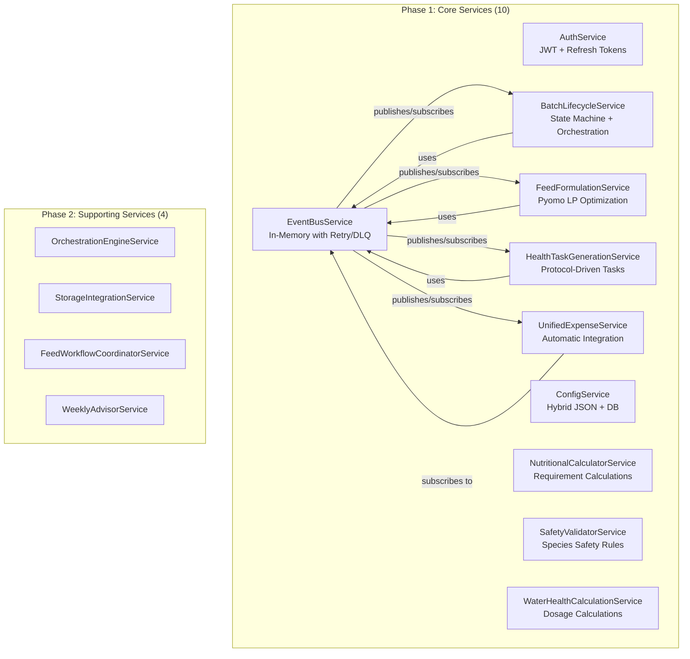
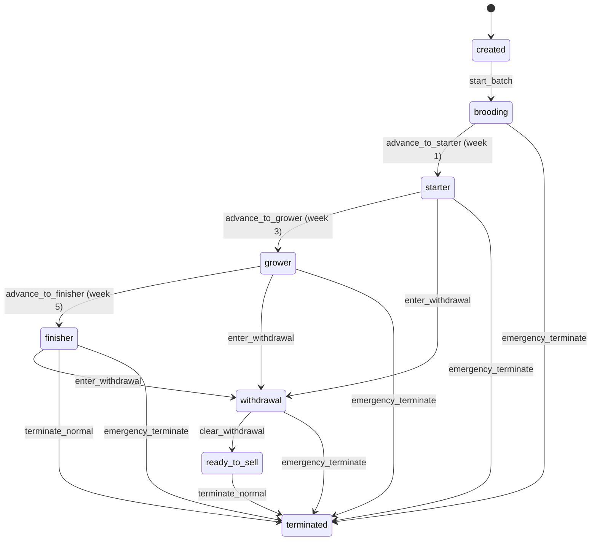
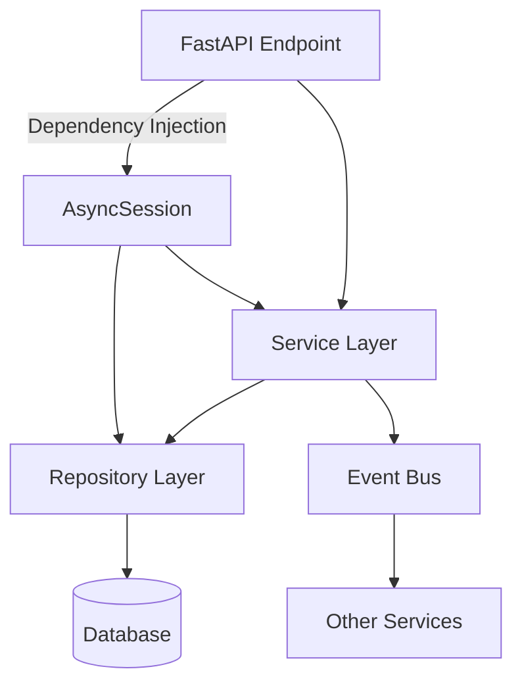
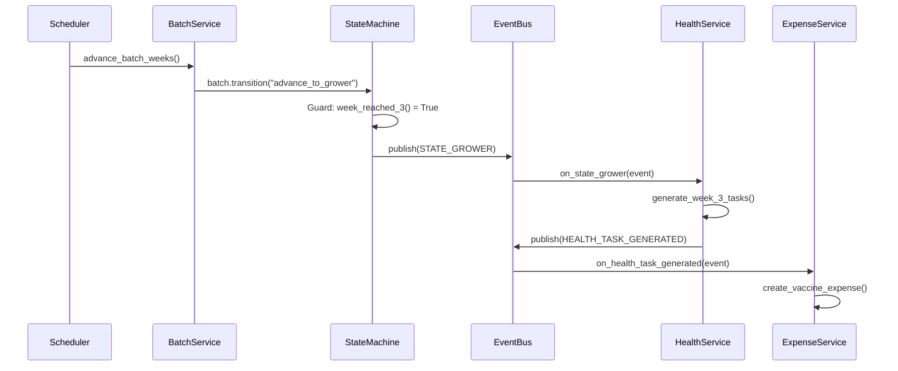
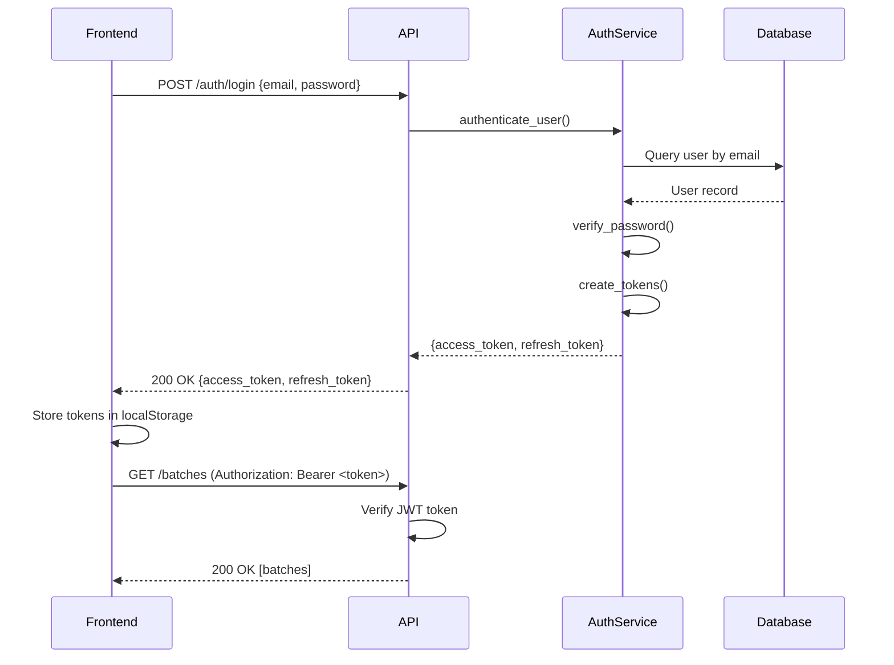
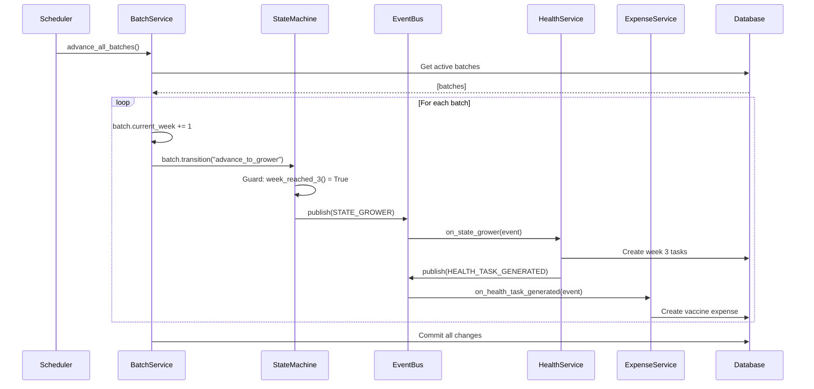
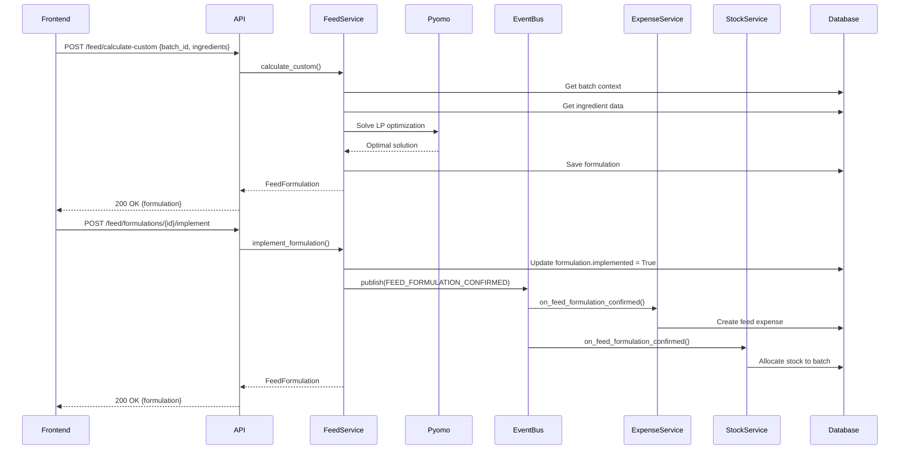

# Tech Plan: LampFarms Production-Grade Platform - Architecture & Implementation Strategy

# Tech Plan: LampFarms Production-Grade Platform

**Epic:** spec:bceeaefd-5139-4801-8c12-de8a8b6faf8a/2c73a304-598c-472c-b79c-20584f6dc34b  
**Date:** January 16, 2026  
**Status:** Tech Plan - Ready for Architecture Validation  
**Scope:** Complete system architecture for all 15 systems with Phase 1 focus on core 6 services

---

## Architecture Validation Summary

**Status:** ✅ Validated - All critical decisions reviewed and resolved

**Key Architectural Improvements:**

1. **State Machine Integration** - Changed from `@property` to cached instance variable with global callback registration
2. **Event Bus Transactions** - Each handler gets isolated transaction (no cascading failures)
3. **Phase 1 Services** - Expanded from 6 to 10 services (added ConfigService, NutritionalCalc, SafetyValidator, WaterHealthCalc)
4. **Batch Model Fields** - Renamed `lifecycle_state` → `lifecycle_phase`, `status` → `batch_status` for clarity
5. **APScheduler Transactions** - Per-batch transactions with error isolation (continue on failure)
6. **JSON Storage** - Use SQLAlchemy JSON type (SQLite dev, PostgreSQL/MySQL production)

**Validation Date:** January 16, 2026  
**Validated By:** Architecture review with stress-testing against 6 focus areas (Simplicity, Flexibility, Robustness, Scaling, Codebase Fit, Requirements Consistency)

---

## 1. Architectural Approach

### 1.1 Service Architecture (Phase 1: Core 10 Services)

**Core Services to Implement:**



**Phase 1 Service Responsibilities:**


| Service                           | Responsibility                            | Key Methods                                                                  | Dependencies    |
| --------------------------------- | ----------------------------------------- | ---------------------------------------------------------------------------- | --------------- |
| **AuthService**                   | User authentication, JWT token management | `login()`, `register()`, `refresh_token()`, `get_current_user()`             | None            |
| **EventBusService**               | Publish/subscribe event coordination      | `publish()`, `subscribe()`, `unsubscribe()`                                  | None            |
| **BatchLifecycleService**         | Batch state management, week advancement  | `start_batch()`, `advance_week()`, `enter_withdrawal()`, `terminate_batch()` | EventBusService |
| **FeedFormulationService**        | LP optimization for feed recipes          | `calculate_ready_made()`, `calculate_custom()`, `calculate_concentrate()`    | EventBusService |
| **HealthTaskGenerationService**   | Generate vaccination/medication tasks     | `generate_weekly_tasks()`, `generate_vaccination_schedule()`                 | EventBusService |
| **UnifiedExpenseService**         | Automatic expense creation from events    | `create_feed_expense()`, `create_health_expense()`                           | EventBusService |
| **ConfigService**                 | Load configuration (JSON + DB overrides)  | `get_species_protocol()`, `get_nutritional_requirements()`                   | None            |
| **NutritionalCalculatorService**  | Calculate nutritional requirements        | `get_requirements()`, `validate_formula()`                                   | ConfigService   |
| **SafetyValidatorService**        | Validate species safety rules             | `validate_ingredient()`, `validate_medication()`                             | ConfigService   |
| **WaterHealthCalculationService** | Calculate water-based dosages             | `calculate_dosage()`, `calculate_water_volume()`                             | ConfigService   |


---

### 1.2 APScheduler 4.x Integration

**Scheduled Jobs:**

```python
# 3 Core Scheduled Jobs
1. generate_daily_batch_tasks() - Daily at 6 AM
   - Generate health tasks for all active batches
   - Check upcoming vaccinations
   
2. advance_batch_weeks() - Weekly on Sunday at midnight
   - Increment current_week for all active batches
   - Trigger state machine transitions (starter → grower, etc.)
   - Emit WEEK_ADVANCED events
   
3. check_withdrawal_periods() - Every 4 hours
   - Check batches in withdrawal state
   - Clear withdrawal if period complete
   - Emit WITHDRAWAL_CLEARED events
```

**Implementation Pattern (APScheduler 4.x with Transaction Isolation):**

```python
# backend/app/services/scheduler.py
from apscheduler import AsyncScheduler
from apscheduler.datastores.sqlalchemy import SQLAlchemyDataStore
from apscheduler.triggers.cron import CronTrigger

@asynccontextmanager
async def scheduler_lifespan(app: FastAPI):
    engine = create_async_engine(settings.DATABASE_URL)
    data_store = SQLAlchemyDataStore(engine)
    scheduler = AsyncScheduler(data_store)
    
    async with scheduler:
        await scheduler.add_schedule(
            generate_daily_batch_tasks,
            CronTrigger(hour=6, minute=0),
            id="daily_batch_tasks"
        )
        await scheduler.start_in_background()
        yield

# Job with per-batch transaction isolation
async def advance_batch_weeks() -> None:
    """Advance week counter for all active batches."""
    from app.services.batch_lifecycle_service import BatchLifecycleService
    from app.core.database import async_session_maker
    
    # Get batches in separate read-only session
    async with async_session_maker() as read_session:
        batch_repo = BatchRepository(read_session)
        batches = await batch_repo.get_active_batches()
    
    # Process each batch in its own transaction
    for batch in batches:
        async with async_session_maker() as session:
            try:
                service = BatchLifecycleService(session)
                await service.advance_batch_week(batch.id)
                await session.commit()  # Commit per batch
            except Exception as e:
                await session.rollback()
                logger.error(f"Failed to advance batch {batch.id}: {e}")
                # Continue with next batch
```

**Key Differences from APScheduler 3.x:**

- Uses `AsyncScheduler` (not `AsyncIOScheduler`)
- Uses `SQLAlchemyDataStore` (not `SQLAlchemyJobStore`)
- Uses `start_in_background()` (not `start()`)
- Integrated via FastAPI lifespan (not `@app.on_event`)

---

### 1.3 State Machine Pattern (python-statemachine)

**Batch Lifecycle States:**



**State Machine Implementation:**

```python
# backend/app/services/batch_state_machine.py
from statemachine import StateMachine, State

class BatchLifecycleMachine(StateMachine):
    # States
    created = State(initial=True, value="created")
    brooding = State(value="brooding")
    starter = State(value="starter")
    grower = State(value="grower")
    finisher = State(value="finisher")
    withdrawal = State(value="withdrawal")
    ready_to_sell = State(value="ready_to_sell")
    terminated = State(final=True, value="terminated")
    
    # Transitions with guards
    start_batch = created.to(brooding, cond="has_initial_population")
    advance_to_starter = brooding.to(starter, cond="week_reached_1")
    advance_to_grower = starter.to(grower, cond="week_reached_3")
    advance_to_finisher = grower.to(finisher, cond="week_reached_5")
    
    enter_withdrawal = (
        starter.to(withdrawal, cond="has_active_withdrawal") |
        grower.to(withdrawal, cond="has_active_withdrawal") |
        finisher.to(withdrawal, cond="has_active_withdrawal")
    )
    
    clear_withdrawal = withdrawal.to(
        ready_to_sell,
        cond="withdrawal_period_complete",
        validators="validate_withdrawal_cleared"
    )
    
    # Guards (return bool)
    def has_initial_population(self) -> bool:
        return self.batch.initial_count > 0
    
    def week_reached_3(self) -> bool:
        return self.batch.current_week >= 3
    
    # Validators (raise exceptions)
    def validate_withdrawal_cleared(self) -> None:
        if not self.withdrawal_period_complete():
            raise ValueError("Withdrawal period not complete")
```

---

### 1.4 Repository-Service Pattern

**Pattern Structure:**



**BaseRepository (Generic):**

```python
# backend/app/repositories/base.py
class BaseRepository(Generic[ModelType]):
    def __init__(self, model: Type[ModelType], session: AsyncSession):
        self.model = model
        self.session = session
    
    async def get(self, id: int) -> Optional[ModelType]: ...
    async def get_multi(self, skip: int = 0, limit: int = 100) -> List[ModelType]: ...
    async def create(self, obj_in: Dict[str, Any]) -> ModelType: ...
    async def update(self, id: int, obj_in: Dict[str, Any]) -> Optional[ModelType]: ...
    async def delete(self, id: int) -> bool: ...
```

**Domain Repository Example:**

```python
# backend/app/repositories/batch_repository.py
class BatchRepository(BaseRepository[Batch]):
    async def get_active_batches(self, farm_id: Optional[int] = None) -> List[Batch]:
        """Get all non-terminated batches."""
        query = select(Batch).where(Batch.lifecycle_state != "terminated")
        if farm_id:
            query = query.where(Batch.farm_id == farm_id)
        result = await self.session.execute(query)
        return list(result.scalars().all())
```

**Service Layer Pattern:**

```python
# backend/app/services/batch_lifecycle_service.py
class BatchLifecycleService:
    def __init__(self, session: AsyncSession):
        self.session = session
        self.batch_repo = BatchRepository(session)
    
    async def advance_batch_week(self, batch_id: int) -> Batch:
        batch = await self.batch_repo.get(batch_id)
        batch.current_week += 1
        
        # State machine handles transitions
        await self._check_stage_advancement(batch)
        
        # Emit event for side effects
        batch_event_bus.publish(BatchEvent(
            event_type="WEEK_ADVANCED",
            batch_id=batch_id,
            data={"new_week": batch.current_week}
        ))
        
        return batch
        # Note: Service doesn't commit - caller controls transaction
```

---

### 1.5 Event Bus Design (In-Memory)

**Event Types:**

```python
# backend/app/services/batch_event_bus.py
class EventType(str, Enum):
    # Lifecycle events
    BATCH_CREATED = "BATCH_CREATED"
    BATCH_STARTED = "BATCH_STARTED"
    BATCH_TERMINATED = "BATCH_TERMINATED"
    
    # State events
    STATE_BROODING = "STATE_BROODING"
    STATE_STARTER = "STATE_STARTER"
    STATE_GROWER = "STATE_GROWER"
    STATE_FINISHER = "STATE_FINISHER"
    STATE_WITHDRAWAL = "STATE_WITHDRAWAL"
    
    # Scheduled events
    WEEK_ADVANCED = "WEEK_ADVANCED"
    DAILY_TASKS_GENERATED = "DAILY_TASKS_GENERATED"
    
    # Integration events
    FEED_FORMULATION_CONFIRMED = "FEED_FORMULATION_CONFIRMED"
    HEALTH_TASK_COMPLETED = "HEALTH_TASK_COMPLETED"
    MORTALITY_RECORDED = "MORTALITY_RECORDED"

@dataclass
class BatchEvent:
    event_type: str | EventType
    batch_id: int
    data: Dict[str, Any] = field(default_factory=dict)
    event_id: str = field(default_factory=lambda: str(uuid.uuid4()))
    timestamp: datetime = field(default_factory=datetime.utcnow)
```

**Event Bus with Transaction Isolation:**

```python
class BatchEventBus:
    def __init__(self, max_retries: int = 3):
        self._handlers: Dict[str, List[EventHandler]] = {}
        self._dead_letter_queue: deque[BatchEvent] = deque(maxlen=1000)
        self._max_retries = max_retries
        self._session_maker = None  # Injected at startup
    
    def set_session_maker(self, session_maker):
        """Inject session maker for handler transactions."""
        self._session_maker = session_maker
    
    def subscribe(self, event_type: str | EventType, handler: EventHandler):
        """Subscribe handler to event type."""
        ...
    
    async def publish(self, event: BatchEvent):
        """Publish event to all subscribers with isolated transactions."""
        key = (
            event.event_type.value 
            if isinstance(event.event_type, EventType) 
            else event.event_type
        )
        
        handlers = self._handlers.get(key, [])
        
        for handler in handlers:
            # Each handler gets its own transaction
            async with self._session_maker() as session:
                try:
                    await handler(event, session)
                    await session.commit()
                except Exception as e:
                    await session.rollback()
                    logger.error(f"Handler failed for {event.event_type}: {e}")
                    self._dead_letter_queue.append(event)
```

**Event Flow Example:**



---

### 1.6 Configuration System (Hybrid)

**Approach:** JSON files as defaults + database overrides for customization

**Configuration Files:**

```
backend/config/
├── species.json              # 4 species: broilers, layers, ducks, turkeys
├── species_protocols.json    # Vaccination schedules, lifecycle phases
├── nutritional_requirements.json
└── safety_rules.json
```

**Database Override Model:**

```python
# backend/app/models/system.py
class Configuration(Base):
    __tablename__ = "configurations"
    
    key = Column(String, unique=True, index=True, nullable=False)
    value = Column(Text, nullable=False)  # JSON stored as string
    category = Column(String, index=True)  # "species", "protocol", "nutrition"
    farm_id = Column(Integer, ForeignKey("farms.id"), nullable=True)  # Farm-specific override
```

**Configuration Loading Pattern:**

```python
# backend/app/services/config_service.py
class ConfigService:
    async def get_species_protocol(self, species_id: int, farm_id: Optional[int] = None):
        # 1. Check database override (farm-specific)
        if farm_id:
            override = await self._get_db_override(f"species_protocol_{species_id}", farm_id)
            if override:
                return json.loads(override.value)
        
        # 2. Check database override (global)
        override = await self._get_db_override(f"species_protocol_{species_id}")
        if override:
            return json.loads(override.value)
        
        # 3. Fall back to JSON file
        return self._load_from_json("species_protocols.json", species_id)
```

---

### 1.7 High-Level API Structure

**API Endpoint Groups:**

```
/api/v1/
├── auth/
│   ├── POST /register
│   ├── POST /login
│   ├── POST /refresh
│   └── GET /me
│
├── farms/
│   ├── GET /farms
│   ├── POST /farms
│   └── GET /farms/{id}
│
├── batches/
│   ├── GET /batches
│   ├── POST /batches
│   ├── GET /batches/{id}
│   ├── POST /batches/{id}/start
│   ├── POST /batches/{id}/advance-week
│   ├── POST /batches/{id}/mortality
│   └── POST /batches/{id}/terminate
│
├── feed/
│   ├── POST /feed/calculate-ready-made
│   ├── POST /feed/calculate-custom
│   ├── POST /feed/calculate-concentrate
│   └── GET /feed/formulations
│
├── health/
│   ├── GET /health/tasks
│   ├── POST /health/tasks/{id}/complete
│   └── GET /health/schedules/{batch_id}
│
├── expenses/
│   ├── GET /expenses
│   ├── POST /expenses
│   └── GET /expenses/batch/{batch_id}
│
└── species/
    ├── GET /species
    └── GET /species/{id}/protocol
```

**Authentication Pattern:**

```python
# All protected endpoints use JWT bearer token
Authorization: Bearer <access_token>

# Token refresh flow
POST /api/v1/auth/refresh
Body: { "refresh_token": "<refresh_token>" }
Response: { "access_token": "<new_access_token>" }
```

---

### 1.8 Frontend Architecture Overview

**Technology Stack:**

- React 19 + TypeScript
- TanStack Router (React Router v7)
- React Query (server state)
- Zustand (client state - optional)
- Shadcn/UI components
- Tailwind CSS + FarmVista design tokens

**Frontend Structure:**

```
frontend/src/
├── pages/                    # Page components
│   ├── welcome-page.tsx     # Canonical implementation (DO NOT DEVIATE)
│   ├── dashboard-page.tsx
│   ├── batches/
│   │   ├── batch-list-page.tsx
│   │   ├── batch-create-page.tsx
│   │   └── batch-detail-page.tsx
│   ├── feed/
│   │   └── feed-calculator-page.tsx
│   ├── health/
│   │   └── health-dashboard-page.tsx
│   └── finance/
│       ├── expenses-page.tsx
│       └── revenue-page.tsx
│
├── components/              # Reusable components
│   ├── layout/
│   │   ├── app-layout.tsx
│   │   ├── sidebar.tsx
│   │   └── bottom-nav.tsx
│   ├── dashboard/
│   │   ├── stat-card.tsx
│   │   ├── status-badge.tsx
│   │   └── trend-indicator.tsx
│   └── ui/                  # Shadcn/UI components
│
├── services/                # API service layer
│   ├── api.ts              # Axios instance with interceptors
│   ├── auth-service.ts
│   ├── batch-service.ts
│   ├── feed-service.ts
│   └── health-service.ts
│
├── contexts/                # React Context
│   └── auth-context.tsx    # Auth state machine
│
└── hooks/                   # Custom hooks
    └── use-batches.ts      # React Query hooks
```

**Frontend Service Layer Pattern:**

```typescript
// frontend/src/services/batch-service.ts
export const batchService = {
  async getBatches(farmId?: number): Promise<Batch[]> {
    const { data } = await api.get('/batches', { params: { farm_id: farmId } })
    return data
  },
  
  async createBatch(batchData: CreateBatchDto): Promise<Batch> {
    const { data } = await api.post('/batches', batchData)
    return data
  },
  
  async advanceWeek(batchId: number): Promise<Batch> {
    const { data } = await api.post(`/batches/${batchId}/advance-week`)
    return data
  }
}
```

**React Query Integration:**

```typescript
// frontend/src/hooks/use-batches.ts
export function useBatches(farmId?: number) {
  return useQuery({
    queryKey: ['batches', farmId],
    queryFn: () => batchService.getBatches(farmId),
    staleTime: 5 * 60 * 1000, // 5 minutes
  })
}

export function useAdvanceWeek() {
  const queryClient = useQueryClient()
  
  return useMutation({
    mutationFn: (batchId: number) => batchService.advanceWeek(batchId),
    onSuccess: () => {
      queryClient.invalidateQueries({ queryKey: ['batches'] })
    }
  })
}
```

---

## 2. Data Model

### 2.1 Critical Models (Complete SQLAlchemy Code)

#### 2.1.1 Batch Model (Enhanced)

```python
# backend/app/models/farm.py
from sqlalchemy import Column, String, Integer, ForeignKey, Enum, Float, Date, DateTime, Boolean
from sqlalchemy.orm import relationship
from datetime import datetime

class Batch(Base):
    __tablename__ = "batches"
    
    # Basic Info
    name = Column(String, index=True, nullable=False)
    farm_id = Column(Integer, ForeignKey("farms.id"), nullable=False)
    species_id = Column(Integer, ForeignKey("species.id"), nullable=False)
    breed = Column(String, nullable=True)  # Breed within species
    
    # Production System
    production_system = Column(
        Enum(ProductionSystem), 
        default=ProductionSystem.INTENSIVE, 
        nullable=False
    )
    house_id = Column(Integer, ForeignKey("houses.id"), nullable=True)
    
    # Lifecycle Tracking
    lifecycle_phase = Column(
        String(50), 
        default="created", 
        nullable=False, 
        index=True
    )  # State machine field (technical phases)
    start_date = Column(Date, nullable=True)
    current_week = Column(Integer, default=0, nullable=False)
    current_day = Column(Integer, default=0, nullable=False)
    lifecycle_phase = Column(String(50), nullable=True)  # "starter", "grower", "finisher"
    
    # Population Tracking
    initial_count = Column(Integer, nullable=False)
    current_count = Column(Integer, nullable=False)
    mortality_count = Column(Integer, default=0, nullable=False)
    mortality_rate = Column(Float, default=0.0, nullable=False)  # Percentage
    
    # Performance Metrics
    target_weight = Column(Float, nullable=True)  # Target market weight (kg)
    actual_weight = Column(Float, nullable=True)  # Current average weight (kg)
    fcr = Column(Float, nullable=True)  # Feed Conversion Ratio
    
    # Alternative Feeding (Ducks/Turkeys)
    alternative_feeding_enabled = Column(Boolean, default=False)
    alternative_feeding_start_week = Column(Integer, nullable=True)
    
    # Withdrawal Period
    withdrawal_end_date = Column(DateTime, nullable=True)
    withdrawal_reason = Column(String(255), nullable=True)
    
    # Termination
    termination_date = Column(Date, nullable=True)
    termination_reason = Column(String(255), nullable=True)
    batch_status = Column(
        Enum(BatchStatus), 
        default=BatchStatus.PREPARATION, 
        nullable=False,
        index=True
    )  # Business-level status (preparation, active, completed, archived)
    
    # Timestamps
    created_at = Column(DateTime, default=datetime.utcnow, nullable=False)
    updated_at = Column(DateTime, default=datetime.utcnow, onupdate=datetime.utcnow)
    
    # Relationships
    farm = relationship("Farm", back_populates="batches")
    species = relationship("Species", back_populates="batches")
    house = relationship("House", back_populates="batches")
    mortality_records = relationship("MortalityRecord", back_populates="batch")
    health_tasks = relationship("HealthTask", back_populates="batch")
    feed_formulations = relationship("FeedFormulation", back_populates="batch")
    expenses = relationship("Expense", back_populates="batch")
    week_summaries = relationship("BatchWeekSummary", back_populates="batch")
    
    # State Machine Integration
    def __init__(self, **kwargs):
        super().__init__(**kwargs)
        # Initialize state machine as instance variable
        from app.services.batch_state_machine import BatchLifecycleMachine
        self._state_machine = BatchLifecycleMachine(self)
        # Restore state from database
        if self.lifecycle_phase:
            self._state_machine._set_current_state(
                self._state_machine._get_state_by_value(self.lifecycle_phase)
            )
    
    @property
    def state_machine(self):
        """Get cached state machine instance."""
        if not hasattr(self, '_state_machine'):
            from app.services.batch_state_machine import BatchLifecycleMachine
            self._state_machine = BatchLifecycleMachine(self)
            if self.lifecycle_phase:
                self._state_machine._set_current_state(
                    self._state_machine._get_state_by_value(self.lifecycle_phase)
                )
        return self._state_machine
    
    def transition(self, event_name: str):
        """Execute state transition and persist new state."""
        sm = self.state_machine
        event = getattr(sm, event_name)
        event()  # Execute transition
        self.lifecycle_phase = sm.current_state.value  # Persist state
```

#### 2.1.2 HealthTask Model

```python
# backend/app/models/health.py
from sqlalchemy import Column, String, Integer, ForeignKey, Enum, Float, Date, DateTime, Boolean, Text
from sqlalchemy.orm import relationship
from datetime import datetime
import enum

class TaskType(str, enum.Enum):
    VACCINATION = "vaccination"
    MEDICATION = "medication"
    DEWORMING = "deworming"
    INSPECTION = "inspection"

class TaskStatus(str, enum.Enum):
    PENDING = "pending"
    COMPLETED = "completed"
    SKIPPED = "skipped"
    OVERDUE = "overdue"

class HealthTask(Base):
    __tablename__ = "health_tasks"
    
    # Task Info
    batch_id = Column(Integer, ForeignKey("batches.id"), nullable=False, index=True)
    task_type = Column(Enum(TaskType), nullable=False, index=True)
    title = Column(String(255), nullable=False)
    description = Column(Text, nullable=True)
    
    # Scheduling
    scheduled_date = Column(Date, nullable=False, index=True)
    scheduled_week = Column(Integer, nullable=False)  # Batch week
    scheduled_day = Column(Integer, nullable=False)   # Day within week
    
    # Medication/Vaccine Details
    medication_id = Column(Integer, ForeignKey("medications.id"), nullable=True)
    vaccine_id = Column(Integer, ForeignKey("vaccines.id"), nullable=True)
    dosage = Column(Float, nullable=True)
    dosage_unit = Column(String(50), nullable=True)
    
    # Water-Based Administration
    water_volume = Column(Float, nullable=True)  # Liters
    container_type = Column(String(50), nullable=True)  # "gallon", "bucket", "drum"
    container_count = Column(Integer, nullable=True)
    
    # Completion
    status = Column(Enum(TaskStatus), default=TaskStatus.PENDING, nullable=False, index=True)
    completed_date = Column(DateTime, nullable=True)
    completed_by = Column(Integer, ForeignKey("users.id"), nullable=True)
    notes = Column(Text, nullable=True)
    
    # Withdrawal Period
    withdrawal_days = Column(Integer, nullable=True)
    withdrawal_end_date = Column(Date, nullable=True)
    
    # Automatic Expense Creation
    expense_created = Column(Boolean, default=False)
    expense_id = Column(Integer, ForeignKey("expenses.id"), nullable=True)
    
    # Timestamps
    created_at = Column(DateTime, default=datetime.utcnow, nullable=False)
    updated_at = Column(DateTime, default=datetime.utcnow, onupdate=datetime.utcnow)
    
    # Relationships
    batch = relationship("Batch", back_populates="health_tasks")
    medication = relationship("Medication")
    vaccine = relationship("Vaccine")
    expense = relationship("Expense")
    completed_by_user = relationship("User")
```

#### 2.1.3 FeedFormulation Model

```python
# backend/app/models/feed.py
from sqlalchemy import Column, String, Integer, ForeignKey, Enum, Float, Date, DateTime, Boolean, Text, JSON
from sqlalchemy.orm import relationship
from datetime import datetime
import enum

class FormulationType(str, enum.Enum):
    READY_MADE = "ready_made"
    CUSTOM = "custom"
    CONCENTRATE_MIX = "concentrate_mix"

class FeedFormulation(Base):
    __tablename__ = "feed_formulations"
    
    # Formulation Info
    batch_id = Column(Integer, ForeignKey("batches.id"), nullable=False, index=True)
    formulation_type = Column(Enum(FormulationType), nullable=False)
    name = Column(String(255), nullable=False)
    
    # Batch Context
    batch_week = Column(Integer, nullable=False)
    batch_count = Column(Integer, nullable=False)
    lifecycle_phase = Column(String(50), nullable=False)  # "starter", "grower", "finisher"
    
    # Ready-Made Feed
    ready_made_feed_name = Column(String(255), nullable=True)
    ready_made_quantity = Column(Float, nullable=True)  # kg
    ready_made_price_per_kg = Column(Float, nullable=True)
    
    # Custom Formulation (LP Optimization)
    ingredients = Column(JSON, nullable=True)  # [{"ingredient_id": 1, "quantity": 50, "cost": 25}]
    total_quantity = Column(Float, nullable=True)  # kg
    total_cost = Column(Float, nullable=True)
    cost_per_kg = Column(Float, nullable=True)
    
    # Nutritional Analysis
    crude_protein = Column(Float, nullable=True)  # %
    metabolizable_energy = Column(Float, nullable=True)  # kcal/kg
    crude_fiber = Column(Float, nullable=True)  # %
    calcium = Column(Float, nullable=True)  # %
    phosphorus = Column(Float, nullable=True)  # %
    
    # LP Optimization Results
    optimization_status = Column(String(50), nullable=True)  # "optimal", "infeasible"
    optimization_objective = Column(Float, nullable=True)  # Minimized cost
    
    # Concentrate Mix
    concentrate_name = Column(String(255), nullable=True)
    concentrate_quantity = Column(Float, nullable=True)  # kg
    grain_name = Column(String(255), nullable=True)
    grain_quantity = Column(Float, nullable=True)  # kg
    concentrate_ratio = Column(Float, nullable=True)  # e.g., 0.3 for 30:70
    
    # Implementation
    implemented = Column(Boolean, default=False)
    implemented_date = Column(DateTime, nullable=True)
    
    # Automatic Expense Creation
    expense_created = Column(Boolean, default=False)
    expense_id = Column(Integer, ForeignKey("expenses.id"), nullable=True)
    
    # Stock Allocation
    stock_allocated = Column(Boolean, default=False)
    
    # Timestamps
    created_at = Column(DateTime, default=datetime.utcnow, nullable=False)
    updated_at = Column(DateTime, default=datetime.utcnow, onupdate=datetime.utcnow)
    
    # Relationships
    batch = relationship("Batch", back_populates="feed_formulations")
    expense = relationship("Expense")
```

---

### 2.2 Important Models (Detailed Field Specs)

#### 2.2.1 House Model

**Purpose:** Production units for batch assignment


| Field              | Type            | Constraints                      | Description                         |
| ------------------ | --------------- | -------------------------------- | ----------------------------------- |
| `id`               | Integer         | PK, Auto-increment               | Primary key                         |
| `farm_id`          | Integer         | FK(farms.id), NOT NULL, Index    | Farm reference                      |
| `name`             | String(255)     | NOT NULL, Index                  | House name/number                   |
| `capacity`         | Integer         | NOT NULL                         | Maximum bird capacity               |
| `house_type`       | Enum(HouseType) | NOT NULL                         | "open", "closed", "semi_open"       |
| `current_batch_id` | Integer         | FK(batches.id), Nullable, Unique | Current batch (one batch per house) |
| `is_active`        | Boolean         | Default=True                     | Active status                       |
| `created_at`       | DateTime        | Default=now()                    | Creation timestamp                  |


**Indexes:** `farm_id`, `name`, `current_batch_id`

**Relationships:**

- `farm` → Farm (many-to-one)
- `batches` → Batch (one-to-many, historical)
- `current_batch` → Batch (one-to-one, current)

---

#### 2.2.2 MortalityRecord Model

**Purpose:** Detailed mortality tracking per batch


| Field         | Type        | Constraints                     | Description             |
| ------------- | ----------- | ------------------------------- | ----------------------- |
| `id`          | Integer     | PK, Auto-increment              | Primary key             |
| `batch_id`    | Integer     | FK(batches.id), NOT NULL, Index | Batch reference         |
| `date`        | Date        | NOT NULL, Index                 | Mortality date          |
| `batch_week`  | Integer     | NOT NULL                        | Week of batch lifecycle |
| `batch_day`   | Integer     | NOT NULL                        | Day within week         |
| `count`       | Integer     | NOT NULL                        | Number of birds died    |
| `cause`       | String(255) | Nullable                        | Cause of death          |
| `notes`       | Text        | Nullable                        | Additional notes        |
| `recorded_by` | Integer     | FK(users.id), Nullable          | User who recorded       |
| `created_at`  | DateTime    | Default=now()                   | Creation timestamp      |


**Indexes:** `batch_id`, `date`

**Relationships:**

- `batch` → Batch (many-to-one)
- `recorded_by_user` → User (many-to-one)

---

#### 2.2.3 StockAllocation Model

**Purpose:** Track inventory allocation to batches


| Field               | Type             | Constraints                             | Description                                 |
| ------------------- | ---------------- | --------------------------------------- | ------------------------------------------- |
| `id`                | Integer          | PK, Auto-increment                      | Primary key                                 |
| `batch_id`          | Integer          | FK(batches.id), NOT NULL, Index         | Batch reference                             |
| `inventory_item_id` | Integer          | FK(inventory_items.id), NOT NULL, Index | Inventory item reference                    |
| `quantity`          | Float            | NOT NULL                                | Quantity allocated                          |
| `unit`              | String(50)       | NOT NULL                                | Unit of measurement                         |
| `allocation_date`   | DateTime         | Default=now(), Index                    | Allocation timestamp                        |
| `source_type`       | Enum(SourceType) | NOT NULL                                | "feed_formulation", "health_task", "manual" |
| `source_id`         | Integer          | Nullable                                | Reference to source record                  |
| `notes`             | Text             | Nullable                                | Additional notes                            |


**Indexes:** `batch_id`, `inventory_item_id`, `allocation_date`

**Relationships:**

- `batch` → Batch (many-to-one)
- `inventory_item` → InventoryItem (many-to-one)

---

#### 2.2.4 BatchWeekSummary Model

**Purpose:** Weekly performance summaries per batch


| Field             | Type     | Constraints                     | Description              |
| ----------------- | -------- | ------------------------------- | ------------------------ |
| `id`              | Integer  | PK, Auto-increment              | Primary key              |
| `batch_id`        | Integer  | FK(batches.id), NOT NULL, Index | Batch reference          |
| `week_number`     | Integer  | NOT NULL                        | Week of batch lifecycle  |
| `start_date`      | Date     | NOT NULL                        | Week start date          |
| `end_date`        | Date     | NOT NULL                        | Week end date            |
| `start_count`     | Integer  | NOT NULL                        | Bird count at week start |
| `end_count`       | Integer  | NOT NULL                        | Bird count at week end   |
| `mortality_count` | Integer  | Default=0                       | Mortality during week    |
| `mortality_rate`  | Float    | Default=0.0                     | Mortality percentage     |
| `feed_consumed`   | Float    | Nullable                        | Total feed consumed (kg) |
| `average_weight`  | Float    | Nullable                        | Average bird weight (kg) |
| `fcr`             | Float    | Nullable                        | Feed Conversion Ratio    |
| `total_cost`      | Float    | Nullable                        | Total expenses for week  |
| `notes`           | Text     | Nullable                        | Weekly notes             |
| `created_at`      | DateTime | Default=now()                   | Creation timestamp       |


**Indexes:** `batch_id`, `week_number`

**Unique Constraint:** `(batch_id, week_number)`

**Relationships:**

- `batch` → Batch (many-to-one)

---

#### 2.2.5 WithdrawalPeriod Model

**Purpose:** Track medication withdrawal periods


| Field             | Type                   | Constraints                     | Description                     |
| ----------------- | ---------------------- | ------------------------------- | ------------------------------- |
| `id`              | Integer                | PK, Auto-increment              | Primary key                     |
| `batch_id`        | Integer                | FK(batches.id), NOT NULL, Index | Batch reference                 |
| `health_task_id`  | Integer                | FK(health_tasks.id), NOT NULL   | Health task reference           |
| `medication_id`   | Integer                | FK(medications.id), Nullable    | Medication reference            |
| `start_date`      | Date                   | NOT NULL                        | Withdrawal start date           |
| `end_date`        | Date                   | NOT NULL, Index                 | Withdrawal end date             |
| `withdrawal_days` | Integer                | NOT NULL                        | Duration in days                |
| `status`          | Enum(WithdrawalStatus) | Default="active"                | "active", "cleared", "violated" |
| `cleared_date`    | DateTime               | Nullable                        | Date withdrawal cleared         |
| `notes`           | Text                   | Nullable                        | Additional notes                |
| `created_at`      | DateTime               | Default=now()                   | Creation timestamp              |


**Indexes:** `batch_id`, `end_date`

**Relationships:**

- `batch` → Batch (many-to-one)
- `health_task` → HealthTask (many-to-one)
- `medication` → Medication (many-to-one)

---

#### 2.2.6 EggProductionRecord Model

**Purpose:** Daily egg production tracking (layers/ducks)


| Field             | Type     | Constraints                     | Description              |
| ----------------- | -------- | ------------------------------- | ------------------------ |
| `id`              | Integer  | PK, Auto-increment              | Primary key              |
| `batch_id`        | Integer  | FK(batches.id), NOT NULL, Index | Batch reference          |
| `date`            | Date     | NOT NULL, Index                 | Production date          |
| `batch_week`      | Integer  | NOT NULL                        | Week of batch lifecycle  |
| `eggs_collected`  | Integer  | NOT NULL                        | Number of eggs collected |
| `eggs_broken`     | Integer  | Default=0                       | Broken eggs              |
| `eggs_sold`       | Integer  | Default=0                       | Eggs sold                |
| `eggs_in_stock`   | Integer  | Default=0                       | Eggs in inventory        |
| `average_weight`  | Float    | Nullable                        | Average egg weight (g)   |
| `production_rate` | Float    | Nullable                        | Production rate (%)      |
| `notes`           | Text     | Nullable                        | Additional notes         |
| `recorded_by`     | Integer  | FK(users.id), Nullable          | User who recorded        |
| `created_at`      | DateTime | Default=now()                   | Creation timestamp       |


**Indexes:** `batch_id`, `date`

**Unique Constraint:** `(batch_id, date)`

**Relationships:**

- `batch` → Batch (many-to-one)
- `recorded_by_user` → User (many-to-one)

---

#### 2.2.7 Revenue Model

**Purpose:** Revenue tracking from batch sales


| Field            | Type              | Constraints                     | Description                                          |
| ---------------- | ----------------- | ------------------------------- | ---------------------------------------------------- |
| `id`             | Integer           | PK, Auto-increment              | Primary key                                          |
| `batch_id`       | Integer           | FK(batches.id), Nullable, Index | Batch reference (if batch-specific)                  |
| `date`           | Date              | NOT NULL, Index                 | Revenue date                                         |
| `revenue_type`   | Enum(RevenueType) | NOT NULL                        | "live_bird_sale", "egg_sale", "manure_sale", "other" |
| `quantity`       | Float             | NOT NULL                        | Quantity sold                                        |
| `unit`           | String(50)        | NOT NULL                        | Unit of measurement                                  |
| `price_per_unit` | Float             | NOT NULL                        | Price per unit                                       |
| `total_amount`   | Float             | NOT NULL                        | Total revenue                                        |
| `customer_name`  | String(255)       | Nullable                        | Customer name                                        |
| `payment_method` | String(50)        | Nullable                        | Payment method                                       |
| `notes`          | Text              | Nullable                        | Additional notes                                     |
| `recorded_by`    | Integer           | FK(users.id), Nullable          | User who recorded                                    |
| `created_at`     | DateTime          | Default=now()                   | Creation timestamp                                   |


**Indexes:** `batch_id`, `date`, `revenue_type`

**Relationships:**

- `batch` → Batch (many-to-one)
- `recorded_by_user` → User (many-to-one)

---

#### 2.2.8 Configuration Model

**Purpose:** Database overrides for JSON configuration files


| Field         | Type        | Constraints                   | Description                                  |
| ------------- | ----------- | ----------------------------- | -------------------------------------------- |
| `id`          | Integer     | PK, Auto-increment            | Primary key                                  |
| `key`         | String(255) | Unique, NOT NULL, Index       | Configuration key                            |
| `value`       | Text        | NOT NULL                      | JSON value as string                         |
| `category`    | String(100) | Index                         | "species", "protocol", "nutrition", "safety" |
| `farm_id`     | Integer     | FK(farms.id), Nullable, Index | Farm-specific override (null = global)       |
| `description` | Text        | Nullable                      | Configuration description                    |
| `created_at`  | DateTime    | Default=now()                 | Creation timestamp                           |
| `updated_at`  | DateTime    | Default=now(), onupdate=now() | Update timestamp                             |


**Indexes:** `key`, `category`, `farm_id`

**Unique Constraint:** `(key, farm_id)` (one override per key per farm)

**Relationships:**

- `farm` → Farm (many-to-one)

---

### 2.3 Supporting Models (High-Level Overview)

#### 2.3.1 Enhanced Existing Models

**User Model (Enhanced):**

- Add: `farm_id` (FK to farms.id) - User's primary farm
- Add: `role` (Enum: "owner", "manager", "worker") - User role
- Add: `farm_setup_completed` (Boolean) - Setup completion flag

**Farm Model (Enhanced):**

- Add: `owner_id` (FK to users.id) - Farm owner
- Add: `timezone` (String) - Farm timezone for scheduling
- Add: `currency` (String) - Currency for financial tracking

**Species Model (Enhanced):**

- Add: `lifecycle_weeks` (Integer) - Default lifecycle duration
- Add: `default_production_system` (Enum) - Default production system
- Add: `icon` (String) - Icon name for UI

**SystemEvent Model (Enhanced):**

- Add: `event_type` (Enum) - Typed event types
- Add: `batch_id` (FK, Nullable) - Batch reference
- Add: `correlation_id` (String) - Event correlation ID
- Add: `retry_count` (Integer) - Retry attempts

#### 2.3.2 New Supporting Models

**Medication Model:**

- `name`, `type`, `dosage_per_kg`, `withdrawal_days`, `species_restrictions`

**Vaccine Model:**

- `name`, `disease`, `administration_method`, `dosage`, `species_id`

**Ingredient Model:**

- `name`, `category`, `crude_protein`, `metabolizable_energy`, `price_per_kg`

**SafetyRule Model:**

- `species_id`, `ingredient_id`, `rule_type`, `max_percentage`, `reason`

---

### 2.4 Database Schema Changes Summary

**New Tables (15):**

1. `houses` - Production units
2. `mortality_records` - Mortality tracking
3. `health_tasks` - Health task management
4. `feed_formulations` - Feed recipe records
5. `batch_week_summaries` - Weekly performance
6. `withdrawal_periods` - Medication withdrawal
7. `egg_production_records` - Egg production (layers/ducks)
8. `stock_allocations` - Inventory allocation
9. `revenues` - Revenue tracking
10. `configurations` - Configuration overrides
11. `medications` - Medication catalog
12. `vaccines` - Vaccine catalog
13. `ingredients` - Feed ingredient catalog
14. `safety_rules` - Species safety rules
15. `scheduled_jobs` - APScheduler job store (auto-created)

**Enhanced Tables (5):**

1. `batches` - Add 20+ fields for lifecycle tracking
2. `users` - Add farm_id, role, farm_setup_completed
3. `farms` - Add owner_id, timezone, currency
4. `species` - Add lifecycle_weeks, default_production_system, icon
5. `system_events` - Add event_type, batch_id, correlation_id, retry_count

**Multi-Database Considerations:**

- Use SQLAlchemy abstractions (no raw SQL)
- Use `JSON` column type (SQLAlchemy handles database-specific serialization)
  - PostgreSQL: Uses native JSONB (queryable, indexed)
  - MySQL: Uses native JSON (queryable)
  - SQLite: Uses TEXT (dev-only, no queries needed)
- Use `DateTime` with UTC (avoid timezone-aware types)
- Development: SQLite (simple, no server)
- Production: PostgreSQL or MySQL (native JSON support)
- Test migrations on SQLite (dev) and PostgreSQL (staging/production)

---

## 3. Component Architecture

### 3.1 Backend Services (Phase 1: Core 6)

#### 3.1.1 AuthService

**Responsibility:** User authentication and JWT token management

**Interface:**

```python
class AuthService:
    async def register(self, email: str, password: str, full_name: str) -> User
    async def login(self, email: str, password: str) -> TokenPair
    async def refresh_token(self, refresh_token: str) -> TokenPair
    async def get_current_user(self, token: str) -> User
    async def verify_password(self, plain: str, hashed: str) -> bool
    async def get_password_hash(self, password: str) -> str
```

**Dependencies:** None

**Integration Points:**

- All API endpoints use `get_current_user` for authentication
- Token refresh flow via `/api/v1/auth/refresh`

---

#### 3.1.2 EventBusService

**Responsibility:** Publish/subscribe event coordination

**Interface:**

```python
class EventBusService:
    def subscribe(self, event_type: EventType, handler: Callable[[BatchEvent], None])
    def unsubscribe(self, event_type: EventType, handler: Callable)
    def publish(self, event: BatchEvent)
    def get_dead_letters(self) -> List[BatchEvent]
    def clear_dead_letters(self) -> int
```

**Event Handlers (Registered at Startup):**

```python
# Automatic expense creation
event_bus.subscribe(EventType.FEED_FORMULATION_CONFIRMED, 
                   unified_expense_service.on_feed_formulation_confirmed)

event_bus.subscribe(EventType.HEALTH_TASK_COMPLETED, 
                   unified_expense_service.on_health_task_completed)

# Stock allocation
event_bus.subscribe(EventType.FEED_FORMULATION_CONFIRMED, 
                   storage_integration_service.on_feed_formulation_confirmed)
```

---

#### 3.1.3 BatchLifecycleService

**Responsibility:** Batch state management and lifecycle orchestration

**Interface:**

```python
class BatchLifecycleService:
    async def create_batch(self, batch_data: CreateBatchDto) -> Batch
    async def start_batch(self, batch_id: int) -> Batch
    async def advance_batch_week(self, batch_id: int) -> Batch
    async def advance_all_batches(self) -> List[Batch]  # Scheduled job
    async def record_mortality(self, batch_id: int, count: int, cause: str) -> MortalityRecord
    async def enter_withdrawal(self, batch_id: int, days: int, reason: str) -> Batch
    async def check_withdrawal_clearances(self) -> List[Batch]  # Scheduled job
    async def terminate_batch(self, batch_id: int, reason: str) -> Batch
```

**Dependencies:**

- EventBusService (publish lifecycle events)
- BatchRepository (data access)

**Events Published:**

- `BATCH_CREATED`, `BATCH_STARTED`, `WEEK_ADVANCED`, `MORTALITY_RECORDED`, `BATCH_TERMINATED`

---

#### 3.1.4 FeedFormulationService

**Responsibility:** LP optimization for feed recipes

**Interface:**

```python
class FeedFormulationService:
    async def calculate_ready_made(
        self, 
        batch_id: int, 
        feed_name: str, 
        quantity: float, 
        price_per_kg: float
    ) -> FeedFormulation
    
    async def calculate_custom(
        self, 
        batch_id: int, 
        ingredient_ids: List[int], 
        optimization_method: str  # "quick_recipe", "flexible_mix", "free_mix"
    ) -> FeedFormulation
    
    async def calculate_concentrate(
        self, 
        batch_id: int, 
        concentrate_name: str, 
        grain_name: str, 
        ratio: float
    ) -> FeedFormulation
    
    async def implement_formulation(self, formulation_id: int) -> FeedFormulation
```

**Dependencies:**

- EventBusService (publish formulation events)
- Pyomo (LP optimization)
- FeedFormulationRepository (data access)

**Events Published:**

- `FEED_FORMULATION_CONFIRMED` (triggers expense creation + stock allocation)

---

#### 3.1.5 HealthTaskGenerationService

**Responsibility:** Generate vaccination/medication tasks based on species protocols

**Interface:**

```python
class HealthTaskGenerationService:
    async def generate_weekly_tasks(self, batch_id: int) -> List[HealthTask]
    async def generate_vaccination_schedule(self, batch_id: int) -> List[HealthTask]
    async def generate_daily_tasks_for_all_batches(self) -> List[HealthTask]  # Scheduled job
    async def complete_task(self, task_id: int, notes: str) -> HealthTask
    async def calculate_medication_dosage(
        self, 
        batch_id: int, 
        medication_id: int, 
        container_type: str
    ) -> Dict[str, Any]
```

**Dependencies:**

- EventBusService (publish task events)
- ConfigService (load species protocols)
- HealthTaskRepository (data access)

**Events Published:**

- `HEALTH_TASK_GENERATED`, `HEALTH_TASK_COMPLETED` (triggers expense creation)

---

#### 3.1.6 UnifiedExpenseService

**Responsibility:** Automatic expense creation from feed/health events

**Interface:**

```python
class UnifiedExpenseService:
    async def create_feed_expense(self, formulation_id: int) -> Expense
    async def create_health_expense(self, task_id: int) -> Expense
    async def create_manual_expense(self, expense_data: CreateExpenseDto) -> Expense
    async def get_batch_expenses(self, batch_id: int) -> List[Expense]
    
    # Event handlers
    async def on_feed_formulation_confirmed(self, event: BatchEvent)
    async def on_health_task_completed(self, event: BatchEvent)
```

**Dependencies:**

- EventBusService (subscribe to events)
- ExpenseRepository (data access)

**Events Subscribed:**

- `FEED_FORMULATION_CONFIRMED`, `HEALTH_TASK_COMPLETED`

---

### 3.2 Frontend Components

#### 3.2.1 Page Components

**Dashboard Page:**

- `<DashboardPage>` - Main dashboard with stat cards, charts, recent activity
- Components: `<StatCard>`, `<StatusBadge>`, `<DonutChart>`, `<LineChart>`

**Batch Management Pages:**

- `<BatchListPage>` - List all batches with filters
- `<BatchCreatePage>` - 3-step wizard (Species/Details, House Assignment, Review)
- `<BatchDetailPage>` - Tabbed view (Overview, Feed, Health, Finance, Performance)

**Feed Calculator Page:**

- `<FeedCalculatorPage>` - Tabbed interface (Ready-Made, Custom, Concentrate)
- Components: `<IngredientSelector>`, `<NutritionalSummary>`, `<CostBreakdown>`

**Health Dashboard Page:**

- `<HealthDashboardPage>` - Weekly task list, upcoming vaccinations, withdrawal warnings
- Components: `<TaskCard>`, `<VaccinationSchedule>`, `<WithdrawalAlert>`

**Finance Pages:**

- `<ExpensesPage>` - Expense list with filters, automatic vs manual
- `<RevenuePage>` - Revenue tracking, sales recording

---

#### 3.2.2 Reusable Components

**Layout Components:**

- `<AppLayout>` - Main layout with sidebar + header
- `<Sidebar>` - Navigation menu (240px fixed, collapsible)
- `<BottomNav>` - Mobile navigation (5 icons)

**Dashboard Components:**

- `<StatCard>` - KPI card with value, trend, icon
- `<StatusBadge>` - Color-coded status pill
- `<TrendIndicator>` - Up/down arrow with percentage

**Data Visualization:**

- `<DonutChart>` - Production overview, batch status
- `<LineChart>` - Mortality trend, FCR over time
- `<GaugeChart>` - Performance metrics

---

#### 3.2.3 Service Layer (Frontend)

**API Services:**

```typescript
// frontend/src/services/batch-service.ts
export const batchService = {
  getBatches: (farmId?: number) => api.get('/batches', { params: { farm_id: farmId } }),
  createBatch: (data: CreateBatchDto) => api.post('/batches', data),
  getBatchById: (id: number) => api.get(`/batches/${id}`),
  advanceWeek: (id: number) => api.post(`/batches/${id}/advance-week`),
  recordMortality: (id: number, data: MortalityDto) => api.post(`/batches/${id}/mortality`, data),
  terminateBatch: (id: number, reason: string) => api.post(`/batches/${id}/terminate`, { reason })
}

// frontend/src/services/feed-service.ts
export const feedService = {
  calculateReadyMade: (data: ReadyMadeDto) => api.post('/feed/calculate-ready-made', data),
  calculateCustom: (data: CustomDto) => api.post('/feed/calculate-custom', data),
  calculateConcentrate: (data: ConcentrateDto) => api.post('/feed/calculate-concentrate', data),
  getFormulations: (batchId: number) => api.get('/feed/formulations', { params: { batch_id: batchId } })
}

// frontend/src/services/health-service.ts
export const healthService = {
  getTasks: (batchId: number) => api.get('/health/tasks', { params: { batch_id: batchId } }),
  completeTask: (taskId: number, notes: string) => api.post(`/health/tasks/${taskId}/complete`, { notes }),
  getSchedule: (batchId: number) => api.get(`/health/schedules/${batchId}`)
}
```

**React Query Hooks:**

```typescript
// frontend/src/hooks/use-batches.ts
export function useBatches(farmId?: number) {
  return useQuery({
    queryKey: ['batches', farmId],
    queryFn: () => batchService.getBatches(farmId),
    staleTime: 5 * 60 * 1000
  })
}

export function useAdvanceWeek() {
  const queryClient = useQueryClient()
  return useMutation({
    mutationFn: (batchId: number) => batchService.advanceWeek(batchId),
    onSuccess: () => queryClient.invalidateQueries({ queryKey: ['batches'] })
  })
}
```

---

### 3.3 Integration Points (API Contracts)

**Authentication Flow:**



**Batch Week Advancement Flow:**



**Feed Formulation Flow:**



---

### 3.4 Data Flow Summary

**Key Data Flows:**

1. **Batch Creation → Health Task Generation**
  - User creates batch → `BATCH_CREATED` event → HealthTaskGenerationService generates vaccination schedule
2. **Week Advancement → State Transition → Task Generation**
  - Scheduler advances week → State machine transitions → `STATE_GROWER` event → HealthTaskGenerationService generates week-specific tasks
3. **Feed Formulation → Expense + Stock**
  - User confirms formulation → `FEED_FORMULATION_CONFIRMED` event → UnifiedExpenseService creates expense + StorageIntegrationService allocates stock
4. **Health Task Completion → Expense + Withdrawal**
  - User completes task → `HEALTH_TASK_COMPLETED` event → UnifiedExpenseService creates expense + WithdrawalPeriod created if applicable
5. **Withdrawal Period Check → State Transition**
  - Scheduler checks withdrawal periods → If complete, state machine transitions → `WITHDRAWAL_CLEARED` event

---

## Implementation Notes

### Configuration Files (Fully Specified in System Specs)

All 4 configuration files are fully specified in system specs:

- **species.json** - See Species-Specific Batch Management Specification (complete week-by-week protocols for 4 species)
- **species_protocols.json** - See Species-Specific Batch Management Specification (36 vaccination protocols + health checkpoints)
- **ingredients.json** - See Feed Calculator System Specification (41 ingredients with nutritional profiles)
- **medications.json** - See Water-Health System Specification (52 medications with dosages, conflicts, withdrawal periods)

### Phase 2 Services (4 Remaining)

- **OrchestrationEngineService** - Complex workflow coordination across multiple systems
- **StorageIntegrationService** - Advanced stock management with batch allocation
- **FeedWorkflowCoordinatorService** - Multi-step feed workflow orchestration
- **WeeklyAdvisorService** - Analytics, insights, and recommendations

### Phase 1 Priorities (Core 10 Services)

**Week 1-2: Foundation**

- APScheduler 4.x integration with FastAPI lifespan
- State machine implementation with guards/validators (cached instance)
- BaseRepository + domain repositories
- Event bus with transaction isolation
- ConfigService (hybrid JSON + DB)

**Week 3-4: Utility Services**

- AuthService (JWT + refresh tokens)
- NutritionalCalculatorService (requirement calculations)
- SafetyValidatorService (species safety rules)
- WaterHealthCalculationService (dosage calculations)

**Week 5-6: Core Domain Services**

- BatchLifecycleService (CRUD + state management)
- FeedFormulationService (LP optimization)
- HealthTaskGenerationService (protocol-driven)
- UnifiedExpenseService (automatic integration)

**Week 7-8: Frontend**

- Dashboard page with stat cards
- Batch list + create pages
- Feed calculator page (ready-made only)
- Health dashboard page

### Phase 2 (Remaining 4 Services)

**To be implemented after Phase 1 validation:**

- OrchestrationEngineService (complex orchestration)
- StorageIntegrationService (stock management)
- FeedWorkflowCoordinatorService (workflow coordination)
- WeeklyAdvisorService (analytics and insights)

---

## References

**Source Documentation:**

- file:docs/ORCHESTRATION-RESEARCH-REFINED.md - APScheduler 4.x, python-statemachine patterns
- file:docs/architecture/02-backend-architecture.md - 14 services architecture
- file:docs/architecture/03-frontend-architecture.md - React 19, TanStack Router, React Query
- file:docs/FARMVISTA-DESIGN-ANALYSIS.md - FarmVista design system
- file:frontend/src/pages/welcome-page.tsx - Canonical UI implementation

**Epic Brief:**

- spec:bceeaefd-5139-4801-8c12-de8a8b6faf8a/2c73a304-598c-472c-b79c-20584f6dc34b

**Current Implementation:**

- file:backend/app/models/ - Basic models (~10% complete)
- file:frontend/src/ - UI components and 2 pages

---

**Status:** Tech Plan Complete - Ready for Architecture Validation  
**Next Step:** Validate architecture for robustness, simplicity, and codebase fit before proceeding to ticket breakdown
