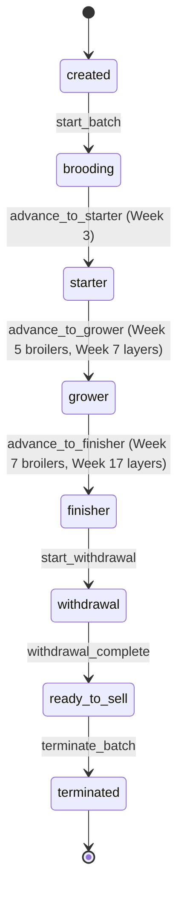

# APScheduler 4.x & State Machine Integration

## Overview

Integrate APScheduler 4.x with FastAPI and implement Batch lifecycle state machine with python-statemachine. This enables automated batch progression and lifecycle management.

## Scope

**In Scope:**
- Integrate APScheduler 4.x with FastAPI lifespan (not deprecated @app.on_event)
- Configure SQLAlchemyDataStore for job persistence
- Implement 3 scheduled jobs:
  1. advance_batch_weeks() - Sunday midnight, per-batch transactions
  2. generate_daily_tasks() - Daily 6am, health task generation
  3. check_withdrawal_periods() - Daily 8am, withdrawal warnings
- Implement BatchLifecycleMachine with python-statemachine
- Add cached state machine instance to Batch model
- Register global callbacks for state transitions
- Implement guards and validators

**Out of Scope:**
- Frontend week advancement UI (Phase 2)
- Manual week advancement (Phase 2)

## Spec References

- spec:bceeaefd-5139-4801-8c12-de8a8b6faf8a/35142770-c1b0-4df2-85e2-5a839616334a (Backend Architecture - APScheduler, State Machine)
- spec:bceeaefd-5139-4801-8c12-de8a8b6faf8a/c18bcbcb-e4da-43cc-b5cd-5e27c2e4ed1f (Batch Management - Lifecycle)
- spec:bceeaefd-5139-4801-8c12-de8a8b6faf8a/f8459c0d-edda-4273-a388-05dc54be731b (Core Flows - Week Advancement Journey)

## State Machine States



## APScheduler Jobs

**Job 1: advance_batch_weeks()**
```python
@scheduler.scheduled_job('cron', day_of_week='sun', hour=0, minute=0)
async def advance_batch_weeks():
    # Get all active batches
    # For each batch (separate transaction):
    #   - Increment current_week
    #   - Check lifecycle phase advancement
    #   - Transition state machine if threshold reached
    #   - Emit WEEK_ADVANCED event
    #   - Commit transaction
```

**Job 2: generate_daily_tasks()**
```python
@scheduler.scheduled_job('cron', hour=6, minute=0)
async def generate_daily_tasks():
    # Generate health tasks for today
    # Based on species_protocols.json
```

**Job 3: check_withdrawal_periods()**
```python
@scheduler.scheduled_job('cron', hour=8, minute=0)
async def check_withdrawal_periods():
    # Check all active withdrawal periods
    # Emit WITHDRAWAL_PERIOD_ENDED for completed ones
```

## Acceptance Criteria

- [ ] APScheduler 4.x integrated with FastAPI lifespan
- [ ] SQLAlchemyDataStore configured for job persistence
- [ ] 3 scheduled jobs running correctly
- [ ] Per-batch transaction isolation working (one batch failure doesn't affect others)
- [ ] State machine transitions working (created → brooding → starter → grower → finisher → withdrawal → ready_to_sell → terminated)
- [ ] Guards prevent invalid transitions
- [ ] Validators check prerequisites (e.g., week threshold reached)
- [ ] Callbacks emit events on state transitions
- [ ] State persisted in lifecycle_phase field
- [ ] Cached state machine instance working (@property with lazy init)

## Dependencies

- **Ticket 1:** Batch model must exist
- **Ticket 3:** BatchLifecycleService must exist

## Estimated Effort

**4 days**