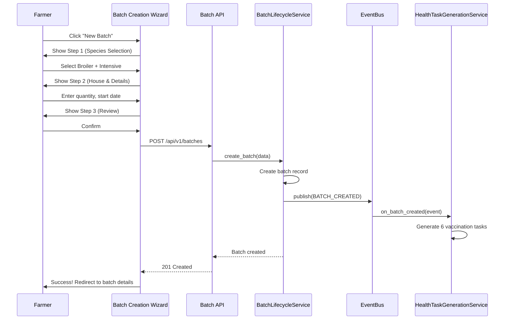

# Batch Management API & Frontend (3-Step Wizard + Dashboard)

## Overview

Implement complete Batch Management system with 3-step creation wizard, batch dashboard, batch details (5 tabs), and lifecycle operations (mortality, week advancement, termination).

## Scope

**In Scope:**
- Implement Batch Management API endpoints (10 endpoints)
- Build 3-step batch creation wizard:
  - Step 1: Species & Production System Selection (intensive vs semi-intensive)
  - Step 2: House Assignment & Batch Details
  - Step 3: Review & Confirm
- Build batch dashboard (list view with filters: species, status, house)
- Build batch details page (5 tabs: Overview, Feed, Health, Performance, Expenses)
- Build mortality recording popup
- Build week advancement popup (manual trigger)
- Build batch termination popup (with withdrawal period check)
- Implement BATCH_CREATED event emission (triggers health task generation)
- Implement dual feed pattern selection (Automatic vs Flexible)

**Performance Analytics (Hybrid Approach):**
- Implement conditional display for Performance tab
- Show weight tracking inputs if UserPreferences.advanced_performance_tracking_enabled
- Show basic metrics ALWAYS (mortality, population, feed consumed, duration)
- Show enable prompt if advanced tracking disabled

**Out of Scope:**
- Feed Calculator integration (Ticket 6)
- Health tasks integration (Ticket 7)
- Performance metrics (Phase 3)

## Spec References

- spec:bceeaefd-5139-4801-8c12-de8a8b6faf8a/c18bcbcb-e4da-43cc-b5cd-5e27c2e4ed1f (Batch Management System)
- spec:bceeaefd-5139-4801-8c12-de8a8b6faf8a/dfa10566-d896-41f4-805f-953f7b47d5f3 (Species-Specific - 4 Species Protocols)
- spec:bceeaefd-5139-4801-8c12-de8a8b6faf8a/f8459c0d-edda-4273-a388-05dc54be731b (Core Flows - Batch Creation Journey)

## User Journey

## API Endpoints

1. POST /api/v1/batches - Create batch
2. GET /api/v1/batches - List batches (with filters)
3. GET /api/v1/batches/{id} - Get batch details
4. PUT /api/v1/batches/{id} - Update batch
5. POST /api/v1/batches/{id}/mortality - Record mortality
6. POST /api/v1/batches/{id}/advance-week - Manual week advancement
7. POST /api/v1/batches/{id}/terminate - Terminate batch
8. GET /api/v1/batches/{id}/summary - Get batch summary
9. GET /api/v1/houses - List houses
10. POST /api/v1/houses - Create house

## Acceptance Criteria

- [ ] All 10 batch API endpoints working
- [ ] 3-step wizard creates batches correctly
- [ ] BATCH_CREATED event emitted on batch creation
- [ ] Health tasks auto-generated (6 for broilers, 12 for layers, etc.)
- [ ] Batch dashboard displays all batches with filters
- [ ] Batch details page shows all 5 tabs
- [ ] Mortality recording updates current_quantity
- [ ] Week advancement triggers state machine transition
- [ ] Batch termination checks withdrawal periods (blocks if active)
- [ ] Dual feed pattern (Automatic vs Flexible) selectable
- [ ] Alternative feeding toggle visible for ducks/turkeys only
- [ ] Performance tab shows weight tracking when advanced tracking enabled
- [ ] Performance tab shows basic metrics when advanced tracking disabled
- [ ] Enable prompt links to Settings page

## Dependencies

- **Ticket 1:** Batch, House, MortalityRecord models
- **Ticket 2:** ConfigService for species protocols
- **Ticket 3:** BatchLifecycleService, HealthTaskGenerationService, EventBusService
- **Ticket 4:** State machine and APScheduler

## Estimated Effort

**5 days**
