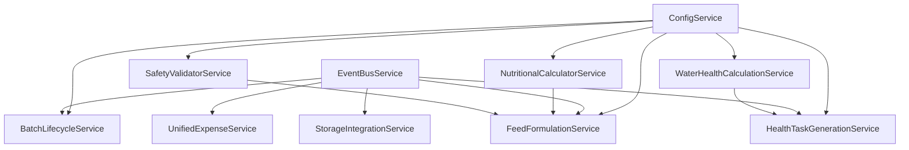

# Core Services & Event Bus (10 Services)

## Overview

Implement 10 Phase 1 services with Repository-Service pattern and Event Bus for cross-system integration. This establishes the business logic layer.

## Scope

**In Scope:**
- Implement BaseRepository with generic CRUD operations
- Implement 10 domain repositories (BatchRepository, ExpenseRepository, etc.)
- Implement 10 Phase 1 services:
  1. EventBusService (transaction isolation, retry/DLQ)
  2. ConfigService (enhance from Ticket 2)
  3. BatchLifecycleService (state machine integration)
  4. FeedFormulationService (LP optimization integration)
  5. HealthTaskGenerationService (protocol-driven)
  6. UnifiedExpenseService (automatic expense creation)
  7. NutritionalCalculatorService (requirement calculations)
  8. SafetyValidatorService (species safety rules)
  9. WaterHealthCalculationService (dosage calculations)
  10. StorageIntegrationService (stock allocation with FIFO + quality)
- Register event handlers globally at startup
- **Auth Enhancement:** Implement AuthService with JWT refresh token logic (access token 15 min, refresh token 7 days)
- **Auth Enhancement:** Token rotation on refresh (new refresh_token issued, old one revoked)
- **Auth Enhancement:** HttpOnly cookie option for XSS protection
- Implement retry logic (3x) + Dead Letter Queue

**Out of Scope:**
- API endpoints (Phase 2)
- Frontend integration (Phase 2)
- Phase 2 services (OrchestrationEngine, FeedWorkflowCoordinator, WeeklyAdvisor)

## Spec References

- spec:bceeaefd-5139-4801-8c12-de8a8b6faf8a/35142770-c1b0-4df2-85e2-5a839616334a (Backend Architecture - Service Architecture, Event Bus)
- spec:bceeaefd-5139-4801-8c12-de8a8b6faf8a/950515a2-7eeb-4375-9e58-6df156a25a3b (Tech Plan - Component Architecture)
- spec:bceeaefd-5139-4801-8c12-de8a8b6faf8a/f8459c0d-edda-4273-a388-05dc54be731b (Core Flows - Event-Driven Integration)

## Service Architecture



## Event Bus Implementation

**13 Event Types:**
- BATCH_CREATED, WEEK_ADVANCED, MORTALITY_RECORDED, BATCH_TERMINATED
- FEED_FORMULATION_CONFIRMED
- HEALTH_TASK_COMPLETED, VACCINATION_COMPLETED, WITHDRAWAL_PERIOD_ENDED
- STOCK_PURCHASE_RECORDED, STOCK_LOW, STOCK_DEPLETED
- EGG_PRODUCTION_RECORDED, EGG_SALE_RECORDED

**Transaction Isolation:**
```python
async def publish(self, event: BatchEvent):
    for handler in self._handlers[event.event_type]:
        async with self._session_maker() as session:
            try:
                await handler(event, session)
                await session.commit()
            except Exception as e:
                await session.rollback()
                # Retry 3x, then DLQ
```

## Acceptance Criteria

- [ ] All 10 services implemented in file:backend/app/services/
- [ ] BaseRepository and domain repositories working
- [ ] Event bus publishes and handles events correctly
- [ ] Transaction isolation per handler verified
- [ ] Retry logic (3x) + DLQ working
- [ ] All 13 event types defined in EventType enum
- [ ] Event handlers registered globally at startup
- [ ] Unit tests for all services (80%+ coverage)
- [ ] Services don't commit - caller controls transaction boundary

## Dependencies

- **Ticket 1:** Database models must exist
- **Ticket 2:** Configuration system must exist

## Estimated Effort

**7 days**
