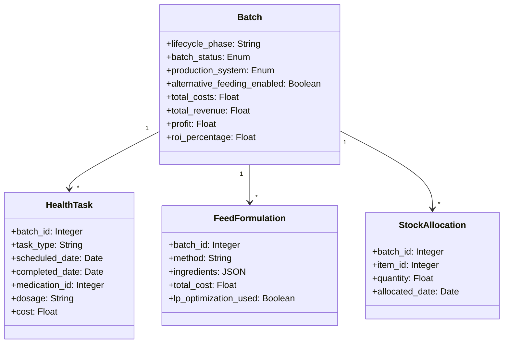

# Database Schema & Models Foundation (27 Models) - NON-BLOCKING

## Overview

Create complete database schema with all 27 SQLAlchemy models from specifications. This is the foundational ticket that blocks all other work.

## Scope

**In Scope:**
- Create 15 new models (HealthTask, FeedFormulation, EggProduction, StockAllocation, etc.)
- Enhance 5 existing models (Batch, Expense, InventoryItem, User, Farm)
- Add all missing fields to existing models
- Create Alembic migrations
- Add indexes and constraints
- Multi-database support (SQLite dev, PostgreSQL/MySQL prod)
- **Auth Enhancement:** Create `refresh_tokens` table for JWT token rotation (user_id, token_hash, expires_at, created_at, revoked_at)

**Out of Scope:**
- Service layer (Ticket 3)
- API endpoints (Phase 2)
- Frontend integration (Phase 2)

## Spec References

- spec:bceeaefd-5139-4801-8c12-de8a8b6faf8a/35142770-c1b0-4df2-85e2-5a839616334a (Backend Architecture - Data Model section)
- spec:bceeaefd-5139-4801-8c12-de8a8b6faf8a/950515a2-7eeb-4375-9e58-6df156a25a3b (Tech Plan - Data Model section)
- All 15 system specs (model definitions)

## Key Models to Create

**Critical Models (Complete SQLAlchemy Code in Specs):**
1. Enhanced Batch model (lifecycle_phase, batch_status, alternative_feeding_enabled, financial fields)
2. HealthTask model (scheduled tasks with dosages, withdrawal tracking)
3. FeedFormulation model (3 methods, LP optimization tracking)

**Important Models (Detailed Field Specs):**
4. House model
5. MortalityRecord model
6. StockAllocation model
7. BatchWeekSummary model
8. WithdrawalPeriod model
9. EggProductionRecord model
10. Revenue model
11. Configuration model

**Supporting Models:**
12-27. Medication, Ingredient, Supplier, Customer, SystemEvent, etc.

## Database Schema Changes

## Acceptance Criteria

- [ ] All 27 models created in file:backend/app/models/
- [ ] Alembic migration runs successfully on SQLite
- [ ] Alembic migration runs successfully on PostgreSQL
- [ ] All indexes and constraints applied
- [ ] All relationships (ForeignKey) working
- [ ] Batch model has all fields from specs (lifecycle_phase, batch_status, alternative_feeding_enabled, total_costs, total_revenue, profit, roi_percentage)
- [ ] InventoryItem model has quality_grade and expiry_date fields
- [ ] UserPreferences model unified (cost_privacy + water_health preferences)
- [ ] Database schema matches all spec models 100%

## Dependencies

**None** - This is the foundation ticket

## Estimated Effort

**5 days**
