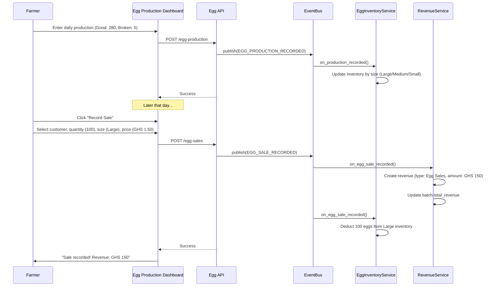

# Egg Production System (Layers & Ducks)

## Overview

Implement Egg Production system for layers and ducks with daily production tracking, inventory management by size/quality, sales recording, and automatic revenue creation.

## Scope

**In Scope:**
- Implement Egg Production API endpoints (8 endpoints)
- Build egg production dashboard (summary cards, production entry, trend chart, inventory)
- Build daily production recording modal
- Build egg sale recording modal (customer selection, automatic calculations)
- Implement automatic inventory updates (EGG_PRODUCTION_RECORDED event)
- Implement automatic revenue creation (EGG_SALE_RECORDED event)
- Implement customer management for repeat buyers
- Implement pricing by size/quality (Large, Medium, Small, Duck)
- Implement species-specific protocols (layers Week 17+, ducks Week 20+)

**Out of Scope:**
- Advanced analytics (Phase 3)
- Egg production forecasting (Phase 3)

## Spec References

- spec:bceeaefd-5139-4801-8c12-de8a8b6faf8a/1e41ba59-5044-4636-a0dd-57ec571b7901 (Egg Production System)
- spec:bceeaefd-5139-4801-8c12-de8a8b6faf8a/dfa10566-d896-41f4-805f-953f7b47d5f3 (Species-Specific - Egg Production Schedules)
- spec:bceeaefd-5139-4801-8c12-de8a8b6faf8a/f8459c0d-edda-4273-a388-05dc54be731b (Core Flows - Egg Production Journey)

## Egg Production Flow

## Acceptance Criteria

- [ ] Daily production recording working (good eggs, broken eggs)
- [ ] Egg inventory updates automatically by size (Large, Medium, Small, Duck)
- [ ] Egg sales create revenue automatically
- [ ] Egg sales deduct from inventory automatically
- [ ] Customer management working (repeat buyers)
- [ ] Pricing by size/quality applied
- [ ] Species-specific protocols enforced (layers Week 17+, ducks Week 20+)
- [ ] Production rate calculation (good eggs / population * 100)
- [ ] Broken rate calculation
- [ ] Cost privacy applied to revenue amounts

## Dependencies

- **Ticket 1:** EggProductionRecord, EggInventory, EggSale, Customer models
- **Ticket 3:** EventBusService
- **Ticket 5:** Batch must exist (layers/ducks only)
- **Ticket 8:** Revenue creation integration

## Estimated Effort

**4 days**