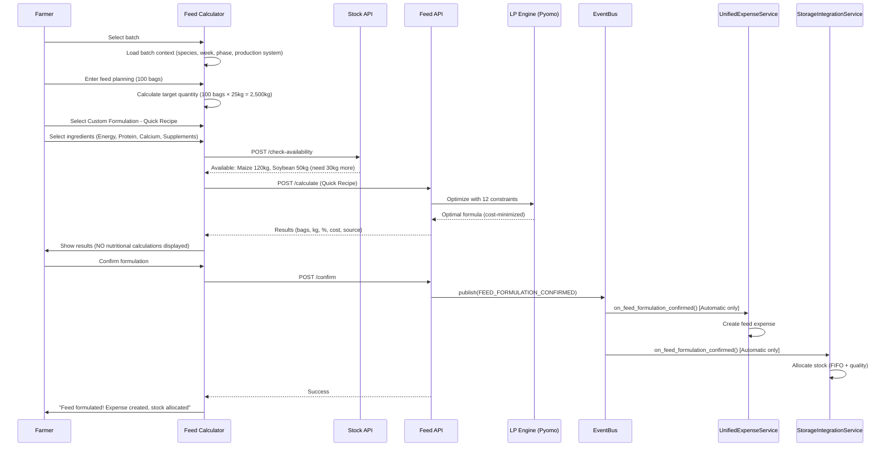

# Feed Calculator & LP Engine (3 Methods + 41 Ingredients)

## Overview

Implement complete Feed Calculator with 3 methods (Ready-Made, Custom Formulation with Pyomo LP, Concentrate Mix), ingredient database integration, and automatic expense/stock integration.

## Scope

**In Scope:**
- Implement Feed Calculator API endpoints (12 endpoints)
- Build feed planning UI (bags vs duration)
- Build ingredient selection popup (category-based: Energy, Protein, Calcium, Supplements)
- Implement 3 feed methods:
  1. Ready-Made Feed (commercial feed purchase)
  2. Custom Formulation - Quick Recipe (Pyomo LP optimization with 12 constraints)
  3. Concentrate Mix (concentrate + grains with ratio slider)
- Implement LP engine with Pyomo (GLPK solver)
- Implement 12 constraints (protein, energy, lysine, methionine, calcium, phosphorus, niacin, fiber, inclusion limits, calcium single selection, species safety, compulsory supplements)
- Implement infeasibility analysis (8 common scenarios with farmer-friendly errors)
- Integrate with stock availability checking (POST /api/v1/stock/check-availability)
- Implement automatic expense creation (FEED_FORMULATION_CONFIRMED event, Automatic pattern only)
- Implement automatic stock allocation (FIFO + quality preference, Automatic pattern only)
- Implement West African protocols (aflatoxin, niacin for ducks, cassava processing)

**Out of Scope:**
- Recipe management (Phase 3)
- Advanced metrics (Phase 3)
- Flexible pattern manual workflows (Ticket 14)

## Spec References

- spec:bceeaefd-5139-4801-8c12-de8a8b6faf8a/fb99cad1-d468-4a18-bd81-d987f1ae6f63 (Feed Calculator System)
- spec:bceeaefd-5139-4801-8c12-de8a8b6faf8a/0e508c4e-aa39-4570-a115-87953e6952e1 (LP Feed Formulation Engine - if exists)
- spec:bceeaefd-5139-4801-8c12-de8a8b6faf8a/f8459c0d-edda-4273-a388-05dc54be731b (Core Flows - Feed Formulation Journey)

## Feed Formulation Flow

## LP Optimization Constraints

1. Protein (min/max by phase)
2. Energy (min/max by phase)
3. Lysine (min by phase)
4. Methionine (min by phase)
5. Calcium (min/max by phase)
6. Phosphorus (min by phase)
7. Niacin (≥55mg/kg for ducks - MANDATORY)
8. Fiber (max by species)
9. Inclusion limits (11 ingredient-specific limits)
10. Calcium single selection (only ONE calcium source)
11. Species safety blocks (5 rules: Cotton Seed Cake for layers, Raw Cassava, Chicken Premix for ducks, High Calcium for broilers, Molasses >5%)
12. Compulsory supplements (toxin binder, lysine, methionine, premix)

## Acceptance Criteria

- [ ] All 3 feed methods working (Ready-Made, Custom, Concentrate)
- [ ] LP optimization produces cost-optimal formulas
- [ ] All 12 constraints enforced
- [ ] Infeasibility analysis provides helpful errors
- [ ] Stock availability checking works (shows Reserve/Purchase/Partial)
- [ ] Automatic expense creation (Automatic pattern only)
- [ ] Automatic stock allocation (FIFO + quality, Automatic pattern only)
- [ ] Dual feed patterns working (Automatic vs Flexible)
- [ ] Toxin binder MANDATORY in all West African feeds
- [ ] Duck niacin ≥55mg/kg enforced
- [ ] Cassava processing validation (HQCP only)
- [ ] Results display: bags, kg, %, cost, source (NO nutritional calculations shown)

## Dependencies

- **Ticket 1:** FeedFormulation, Ingredient models
- **Ticket 2:** ingredients.json configuration
- **Ticket 3:** FeedFormulationService, NutritionalCalculatorService, SafetyValidatorService, UnifiedExpenseService, StorageIntegrationService
- **Ticket 5:** Batch must exist to formulate for

## Estimated Effort

**7 days**