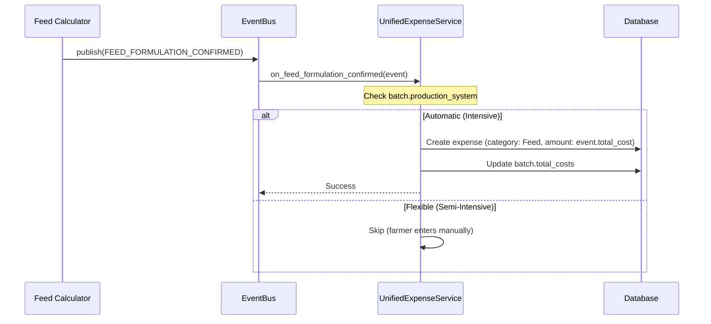

# Finance System (Expenses + Revenue + Cost Privacy)

## Overview

Implement complete Finance system with automatic expense creation from feed/health/stock, revenue tracking, cost privacy, and sales estimation for all 4 species.

## Scope

**In Scope:**
- Implement Finance API endpoints (12 endpoints)
- Build finance dashboard (3 tabs: Overview, Expenses, Revenue)
- Build manual expense entry modal (9 categories)
- Build revenue entry modal (5 types)
- Implement cost privacy toggle (Settings integration)
- Implement automatic expense creation from:
  - Feed formulation (FEED_FORMULATION_CONFIRMED event)
  - Health task completion (HEALTH_TASK_COMPLETED event)
  - Stock purchase (STOCK_PURCHASE_RECORDED event)
- Implement automatic revenue creation from:
  - Egg sales (EGG_SALE_RECORDED event)
  - Bird sales (manual entry)
- Implement batch financial tracking (total_costs, total_revenue, profit, ROI)
- Implement sales estimation (4 species formulas)
- Implement cost privacy (mask with ●●●●●, eye icon temporary reveal 30 seconds)

**Out of Scope:**
- Advanced analytics (Phase 3)
- Export functionality (Phase 3)

## Spec References

- spec:bceeaefd-5139-4801-8c12-de8a8b6faf8a/9024827f-8dea-465d-800c-cdf5749dc498 (Finance System)
- spec:bceeaefd-5139-4801-8c12-de8a8b6faf8a/f8459c0d-edda-4273-a388-05dc54be731b (Core Flows - Integration Patterns)

## Automatic Expense Creation

## Expense Categories (9)

1. Feed - From feed formulation (Automatic) or manual
2. Health - From health tasks (Automatic) or manual
3. Labor - Manual only
4. Utilities - Manual only
5. Equipment - From stock purchase or manual
6. Transport - Manual only
7. Facility - Manual only
8. Birds - From bird purchase or manual
9. Other - Manual only

## Revenue Types (5)

1. Egg Sales - From egg sales (automatic) or manual
2. Bird Sales - Manual only
3. Meat Sales - Manual only
4. Manure Sales - Manual only
5. Other - Manual only

## Cost Privacy

**Applied To:**
- Dashboard: Weekly expenses, monthly revenue
- Finance: All expenses, all revenue, profit, ROI
- Feed Calculator: Stock item costs
- Stock Management: Stock item costs
- Egg Production: Revenue amounts
- Records: Financial tab data

**NOT Applied To:**
- Batch count, population, mortality rates
- Production counts, inventory quantities

## Acceptance Criteria

- [ ] Finance dashboard displays all expenses and revenue (3 tabs)
- [ ] Manual expense/revenue entry working (9 categories, 5 types)
- [ ] Automatic expense creation from feed/health/stock (Automatic pattern only)
- [ ] Automatic revenue creation from egg sales
- [ ] Cost privacy masks financial data with ●●●●●
- [ ] Eye icon temporary reveal (30 seconds)
- [ ] Batch financials update automatically (total_costs, total_revenue, profit, ROI)
- [ ] Sales estimation working (4 species formulas)
- [ ] Category-based expense creation from stock (Feed Ingredients → Feed, Medications → Health, etc.)

## Dependencies

- **Ticket 1:** Expense, Revenue models
- **Ticket 3:** UnifiedExpenseService, EventBusService
- **Ticket 5:** Batch must exist
- **Ticket 6:** Feed formulation events
- **Ticket 7:** Health task events

## Estimated Effort

**5 days**