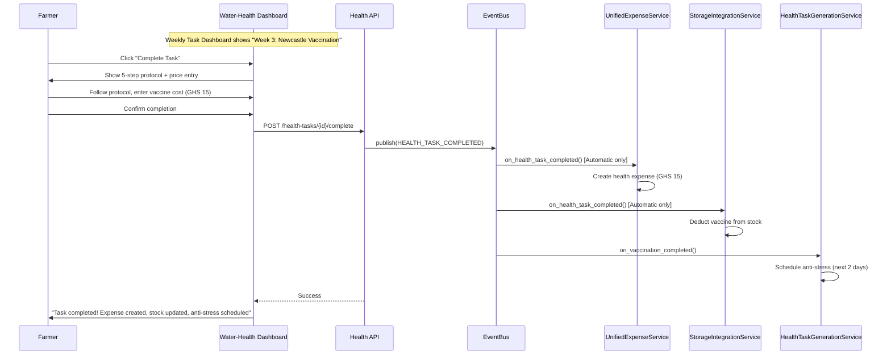

# Water-Health System (52 Medications + 36 Vaccination Protocols)

## Overview

Implement complete Water-Health system with container-based medication delivery, 36 vaccination protocols, medication conflict matrix, withdrawal period tracking, and automatic integration.

## Scope

**In Scope:**
- Implement Water-Health API endpoints (15 endpoints)
- Build weekly task dashboard (task cards grouped by week)
- Build vaccination completion modal (5-step protocol + price entry)
- Build medication administration modal (container-based dosing with 10 container types)
- Build day-old chick arrival protocol guide
- Implement medication conflict matrix validation (5 critical conflicts)
- Implement withdrawal period tracking (blocks batch termination)
- Implement automatic health task generation (BATCH_CREATED event)
- Implement automatic expense creation (HEALTH_TASK_COMPLETED event, Automatic pattern only)
- Implement automatic stock deduction (Automatic pattern only)
- Implement anti-stress auto-scheduling (VACCINATION_COMPLETED event)
- Implement traditional remedies (7 remedies for ducks/turkeys only)
- Implement emergency protocols (5 protocols: Coccidiosis, Respiratory, Heat Stress, Blackhead, Sudden Mortality)

**Out of Scope:**
- Advanced analytics (Phase 3)
- Medication setup during batch creation (can be added later)

## Spec References

- spec:bceeaefd-5139-4801-8c12-de8a8b6faf8a/2a098707-5645-4c66-ba4b-27e04df312ca (Water-Health System)
- spec:bceeaefd-5139-4801-8c12-de8a8b6faf8a/dfa10566-d896-41f4-805f-953f7b47d5f3 (Species-Specific - 36 Vaccination Protocols)
- spec:bceeaefd-5139-4801-8c12-de8a8b6faf8a/f8459c0d-edda-4273-a388-05dc54be731b (Core Flows - Health Management Journey)

## Vaccination Protocol Flow



## Container-Based Dosing

**10 Container Types:**
- Bell Drinker (5L, 10L, 15L)
- Local Drinker (3L, 5L)
- Jerry Can (20L, 25L)
- Drum (200L)
- Bucket (10L, 20L)
- Custom (farmer-defined)

**Calculation:**
```
Total Water = Population × Daily Water Consumption (from species.json)
Containers Needed = Total Water / Container Capacity
Medication Amount = Dosage per Liter × Total Water
```

## Acceptance Criteria

- [ ] Weekly task dashboard displays all tasks grouped by week
- [ ] Vaccination completion modal shows 5-step protocol
- [ ] Vaccination completion requires price entry
- [ ] Medication conflict validation prevents unsafe combinations
- [ ] Withdrawal period tracking blocks batch termination
- [ ] Auto-generated tasks appear on batch creation (36 protocols for 4 species)
- [ ] Anti-stress auto-scheduled after vaccination (next 2 days)
- [ ] Container-based dosing calculations correct (10 container types)
- [ ] Traditional remedies available for ducks/turkeys only (NOT broilers/layers)
- [ ] Emergency protocols accessible (5 protocols)
- [ ] Automatic expense creation (Automatic pattern only)
- [ ] Automatic stock deduction (Automatic pattern only)
- [ ] Day-old chick protocol guide displayed

## Dependencies

- **Ticket 1:** HealthTask, Medication, WithdrawalPeriod models
- **Ticket 2:** medications.json, species_protocols.json
- **Ticket 3:** HealthTaskGenerationService, WaterHealthCalculationService, UnifiedExpenseService, StorageIntegrationService
- **Ticket 5:** Batch must exist

## Estimated Effort

**6 days**